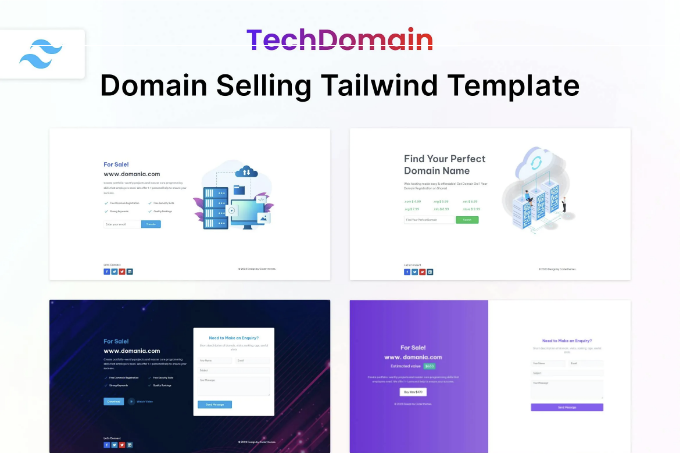
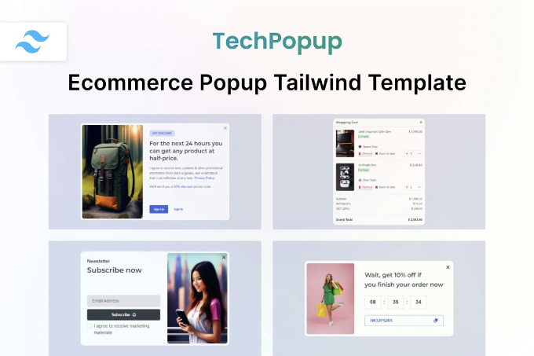
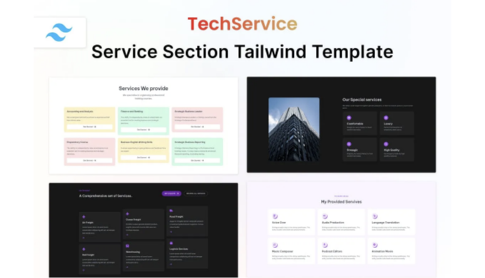
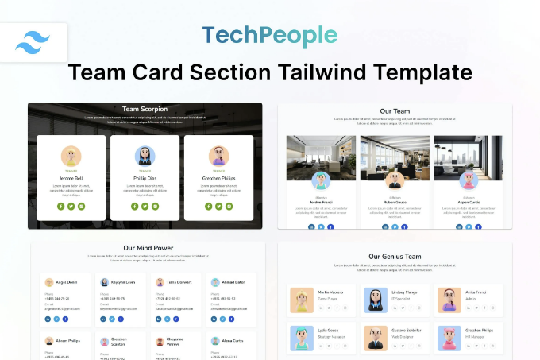
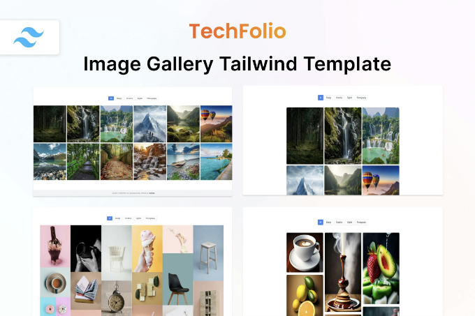
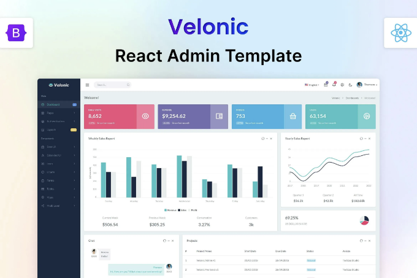
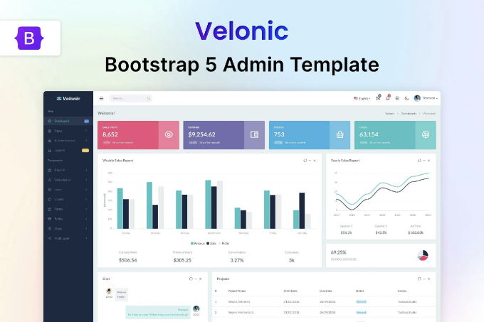
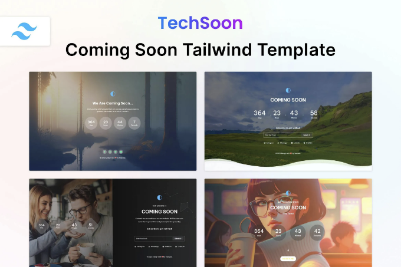
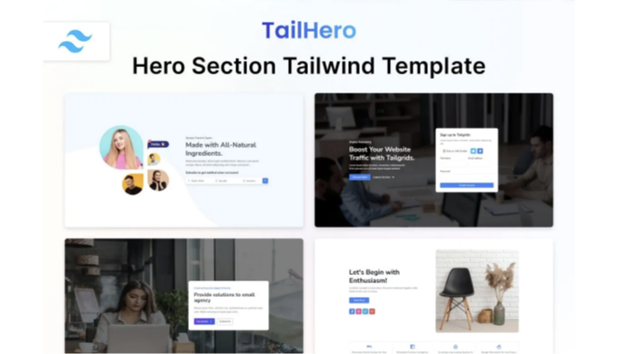

🔍 지금 TechDomain HTML CSS Domain Tailwind 템플릿을 확인해보세요! 이 📁랜딩 페이지 템플릿 웹 템플릿을 탐험하고 여기서 무료 다운로드를 받아보세요. 함께 만들어봅시다! 🚀

실시간 미리보기

TechDomain — 도메인 페이지 Tailwind CSS 3 HTML 템플릿은 도메인을 판매하고 구입하는 데 사용하는 새로운 현대적인 HTML 템플릿입니다. 이것은 한 페이지 도메인 템플릿입니다. 웹사이트, 모바일 앱 또는 기타 도메인 판매 서비스를 제공하는 개인 및 기업을 위해 만들어졌습니다. 도메인 목록, 도메인 판매, 도메인 주차, 판매용 도메인 등을 포함하는 비즈니스에 적합합니다. TechDomain — 도메인 페이지 Tailwind CSS 3 HTML 템플릿은 tailwind CSS 프레임워크로 제작되었습니다. 또한 암호화폐, 라라벨, 이메일 및 커밍순 & 라라벨 템플릿 또는 워드프레스 테마와 함께 사용할 수 있습니다.

<!-- ui-log 수평형 -->
<ins class="adsbygoogle"
  style="display:block"
  data-ad-client="ca-pub-4877378276818686"
  data-ad-slot="9743150776"
  data-ad-format="auto"
  data-full-width-responsive="true"></ins>
<component is="script">
(adsbygoogle = window.adsbygoogle || []).push({});
</component>

주요 특징:

- Tailwind CSS v3.3.2로 제작됨
- 6개 이상의 데모 변형
- 레티나 디스플레이 대응
- 모든 기기에서 반응형
- 창의적인 레이아웃
- 빠르고 가벼움 & 강력함
- Sass 포함
- W3 유효함
- 잘 설명된 코드
- 쉽게 사용자 정의 가능
- 상세한 문서
- 무료 업데이트
- 그리고 더 많은 기능…

기능

- 아무것도 설치할 필요 없어요. 클릭 한 번으로 실행하세요.
- 어드민과 함께 사용 가능
- Tailwind CSS 3와 함께 사용 가능
- 순수한 CSS, 자바스크립트, HTML이 포함되어 있습니다.
- 다음 서비스와 함께 사용 가능: 에이전시, 부동산, 교육, 포트폴리오, 블로그, 여행, 이벤트, 패션, 호텔, 사진, CRM, 의류, 물류, 영화
- 몇 가지 사용 사례: 디지털 마케팅, 뉴스, 의료, 이메일, NFT, 스파, 산업, 양식, 창의적, 스포츠, 그래픽, 앱, 암호화폐, 모바일, 게임, 이력서, 뉴스레터, 웹, 체육관, SEO, 에어비앤비, 비영리 단체, 테크, 쇼핑몰 테마, 쇼핑몰, 쇼핑몰 테마, 게임
- 다음 CSS 라이브러리와 함께 사용 가능: Bulma, 부트스트랩 5, 부트스트랩 4, Tailwind UI
- 다음 언어로 사용 가능: ASP, PHP, Python, Java, Node, React, Vue, WordPress, Angular, Remix, Svelte, CakePHP, Express, RedwoodJS
- 쉽게 다음 프레임워크와 함께 사용 가능: Next, Laravel, Nuxt, Svelte Kit, Qwik, Ruby on Rails, Meteor, Astro, Shopify, .NET, Vue.js, Django, Spring, Flask, CodeIgniter, Symfony, Native, React Native, Ionic, Framework 7
- 다음 번들러를 사용할 수도 있습니다: Vite, Parcel, Yarn, npm, Gulp

<!-- ui-log 수평형 -->
<ins class="adsbygoogle"
  style="display:block"
  data-ad-client="ca-pub-4877378276818686"
  data-ad-slot="9743150776"
  data-ad-format="auto"
  data-full-width-responsive="true"></ins>
<component is="script">
(adsbygoogle = window.adsbygoogle || []).push({});
</component>

## 항목 태그

#html #css #tailwind #페이지 #전자상거래 #tailwindcss #원페이지 #UI #대행사 #포트폴리오 #앱 #모바일 #도메인 #곧 #나옴

## 파일 유형

HTML, CSS, JS, SASS

<!-- ui-log 수평형 -->
<ins class="adsbygoogle"
  style="display:block"
  data-ad-client="ca-pub-4877378276818686"
  data-ad-slot="9743150776"
  data-ad-format="auto"
  data-full-width-responsive="true"></ins>
<component is="script">
(adsbygoogle = window.adsbygoogle || []).push({});
</component>

## 추가 내용

레티나 대응
반응형
문서 포함

## 상업용 라이선스

추가 정보

<!-- ui-log 수평형 -->
<ins class="adsbygoogle"
  style="display:block"
  data-ad-client="ca-pub-4877378276818686"
  data-ad-slot="9743150776"
  data-ad-format="auto"
  data-full-width-responsive="true"></ins>
<component is="script">
(adsbygoogle = window.adsbygoogle || []).push({});
</component>

## 비슷한 웹 템플릿

더 많은 정보를 보려면

TechPopup — Techzaa가 제작한 이커머스 팝업 HTML 템플릿

<!-- ui-log 수평형 -->
<ins class="adsbygoogle"
  style="display:block"
  data-ad-client="ca-pub-4877378276818686"
  data-ad-slot="9743150776"
  data-ad-format="auto"
  data-full-width-responsive="true"></ins>
<component is="script">
(adsbygoogle = window.adsbygoogle || []).push({});
</component>

TechPeople — Team Card Tailwind & HTML Template by Techzaa

<!-- ui-log 수평형 -->
<ins class="adsbygoogle"
  style="display:block"
  data-ad-client="ca-pub-4877378276818686"
  data-ad-slot="9743150776"
  data-ad-format="auto"
  data-full-width-responsive="true"></ins>
<component is="script">
(adsbygoogle = window.adsbygoogle || []).push({});
</component>

TechFolio — HTML & Tailwind CSS 포트폴리오 템플릿 by Techzaa

## Techzaa의 다른 제품

<!-- ui-log 수평형 -->
<ins class="adsbygoogle"
  style="display:block"
  data-ad-client="ca-pub-4877378276818686"
  data-ad-slot="9743150776"
  data-ad-format="auto"
  data-full-width-responsive="true"></ins>
<component is="script">
(adsbygoogle = window.adsbygoogle || []).push({});
</component>

Velonic — React 관리자 및 대시보드 템플릿 by Techzaa

부트 스트랩 관리자 및 대시보드 템플릿 by Techzaa

<!-- ui-log 수평형 -->
<ins class="adsbygoogle"
  style="display:block"
  data-ad-client="ca-pub-4877378276818686"
  data-ad-slot="9743150776"
  data-ad-format="auto"
  data-full-width-responsive="true"></ins>
<component is="script">
(adsbygoogle = window.adsbygoogle || []).push({});
</component>

빠르게 공개 예정인 HTML Tailwind 템플릿 — 테크순, 테크자 (Techsoon by Techzaa)

테일히어로 — 창의적인 히어로 섹션 템플릿, 테크자 (TailHero — Creative Hero Section Template by Techzaa)