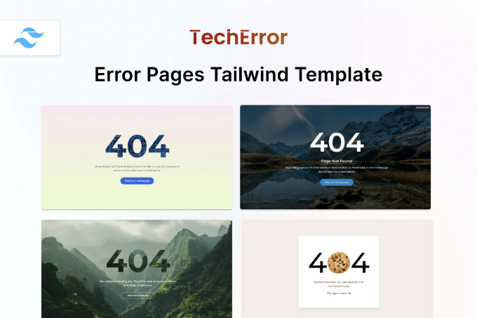
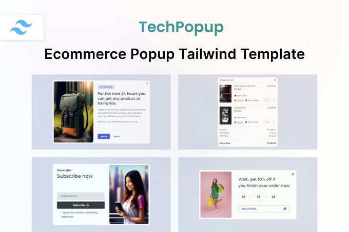
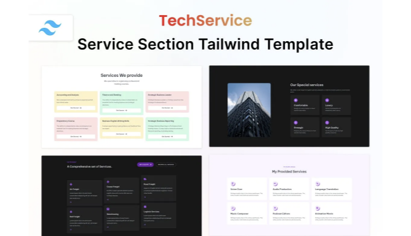
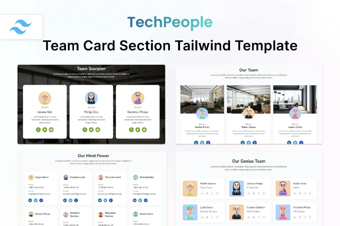
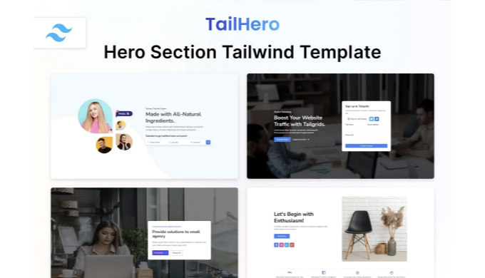
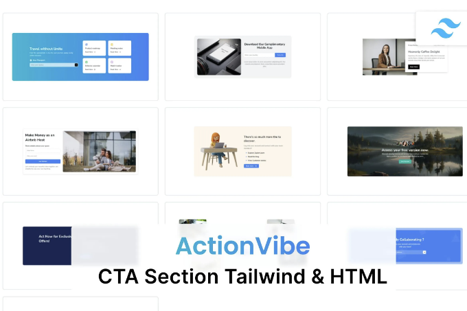
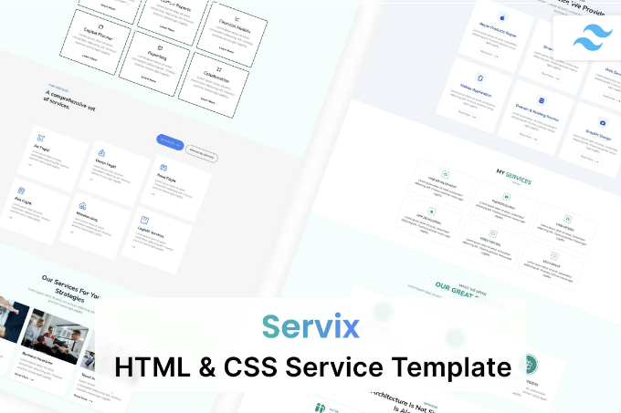

🔍 지금 TechError Error Page HTML Template을 확인해보세요! 이 📁 사이트 템플릿 웹 템플릿을 살펴보고 무료 다운로드를 받아보세요. 함께 제작을 시작해봅시다! 🚀

라이브 미리보기

TechError는 사용하기 쉬운 플러그인을 통해 홈페이지 또는 사용자 정의 페이지로의 404 에러 페이지 리디렉션을 간편화합니다. 활성화 후 설정 페이지에 쉽게 액세스하여 모든 404 에러를 자동으로 처리하기 위한 리디렉션 URL을 지정할 수 있습니다. 이 기능은 구글에서 과도한 404 에러로 사이트의 페이지 순위에 부정적인 영향을 줄 수 있기 때문에 중요합니다. TechError를 사용하여 사이트의 순위와 전반적인 성능을 향상시킬 수 있습니다. TechError의 템플릿은 최신 Tailwind CSS 버전(v3.3.3)을 사용하고 있으며 HTML5, SCSS 및 CSS3를 통합하여 완전히 응답형 디자인을 제공합니다. 간단한 구현과 사용자 정의 가능성으로 다양한 프로젝트에 이상적인 선택지로 TechError 템플릿을 손쉽게 조정하여 특정 요구 사항과 프로젝트 필요에 맞게 맞춤화하여 웹 사이트 사용자에게 아름답고 매혹적인 경험을 제공할 수 있습니다.

<!-- ui-log 수평형 -->
<ins class="adsbygoogle"
  style="display:block"
  data-ad-client="ca-pub-4877378276818686"
  data-ad-slot="9743150776"
  data-ad-format="auto"
  data-full-width-responsive="true"></ins>
<component is="script">
(adsbygoogle = window.adsbygoogle || []).push({});
</component>

주요 기능

- 쉬운 404 오류 페이지 리디렉션
- Tailwind CSS 통합
- 완벽한 반응형 디자인
- 깨끗한 HTML 및 CSS3 코드
- 사용자 정의 가능
- 성능 최적화
- SCSS 지원
- 완벽한 반응성
- 쉬운 사용자 정의
- 크로스 브라우저 최적화
- 깨끗한 코드
- 픽셀 완벽한 디자인
- 현대적이고 깨끗한 디자인
- Google 폰트로 제작
- 기타 다수의 기능…

기능

- 설치할 필요가 없습니다. 클릭하고 실행하기만 하면 됩니다.
- 관리자와 함께 사용할 수 있습니다.
- Tailwind CSS 3와 함께 사용할 수 있습니다.
- 순수한 CSS, 자바스크립트, HTML을 포함하고 있습니다.
- 다음 서비스와 함께 사용할 수 있습니다: 에이전시, 부동산, 교육, 포트폴리오, 블로그, 여행, 이벤트, 패션, 호텔, 사진 촬영
- 다음 사용 사례: 디지털 마케팅, 뉴스, 의료, 이메일, NFT, 스파, 산업, 양식, 크리에이티브, 스포츠, 그래픽, 앱, 암호화폐, 모바일, 게임, 이력서, 이력서, 뉴스레터, 웹, 체육관, SEO, 에어비앤비, 비영리 단체, 기술
- 아래 CSS 라이브러리와 함께 작동할 수 있습니다: Bulma, 부트스트랩 5, 부트스트랩 4, Tailwind UI
- 아래 언어와 함께 사용할 수 있습니다: ASP, PHP, Python, Java, Node, React, Vue, 워드프레스, Angular, Remix, Svelte, CakePHP, Express, RedwoodJS
- 아래 프레임워크와 쉽게 사용할 수 있습니다: Next, Laravel, Nuxt, Svelte Kit, Qwik, Ruby on Rails, Meteor, Astro, Shopify, .NET, Vue.js, Django, Spring, Flask, CodeIgniter, Symfony, 네이티브, ReactNative, Ionic, 프레임워크 7
- 아래 번들러를 사용할 수도 있습니다: Vite, Parcel, Yarn, npm, Gulp

<!-- ui-log 수평형 -->
<ins class="adsbygoogle"
  style="display:block"
  data-ad-client="ca-pub-4877378276818686"
  data-ad-slot="9743150776"
  data-ad-format="auto"
  data-full-width-responsive="true"></ins>
<component is="script">
(adsbygoogle = window.adsbygoogle || []).push({});
</component>

## 항목 태그

#html #css #tailwind #페이지 #전자상거래 #tailwindcss #원페이지 #UI #에이전시 #앱 #모바일 #404 #500 #에러 #400

## 파일 유형

HTML, CSS, JS

<!-- ui-log 수평형 -->
<ins class="adsbygoogle"
  style="display:block"
  data-ad-client="ca-pub-4877378276818686"
  data-ad-slot="9743150776"
  data-ad-format="auto"
  data-full-width-responsive="true"></ins>
<component is="script">
(adsbygoogle = window.adsbygoogle || []).push({});
</component>

## 추가 기능

Retina 화면 대응
반응형 디자인
문서 포함됨

## 상업용 라이센스

추가 정보

<!-- ui-log 수평형 -->
<ins class="adsbygoogle"
  style="display:block"
  data-ad-client="ca-pub-4877378276818686"
  data-ad-slot="9743150776"
  data-ad-format="auto"
  data-full-width-responsive="true"></ins>
<component is="script">
(adsbygoogle = window.adsbygoogle || []).push({});
</component>

## 비슷한 웹 템플릿

더 보기

TechPopup — Techzaa가 제작한 전자상거래 팝업 HTML 템플릿

<!-- ui-log 수평형 -->
<ins class="adsbygoogle"
  style="display:block"
  data-ad-client="ca-pub-4877378276818686"
  data-ad-slot="9743150776"
  data-ad-format="auto"
  data-full-width-responsive="true"></ins>
<component is="script">
(adsbygoogle = window.adsbygoogle || []).push({});
</component>

<!-- ui-log 수평형 -->
<ins class="adsbygoogle"
  style="display:block"
  data-ad-client="ca-pub-4877378276818686"
  data-ad-slot="9743150776"
  data-ad-format="auto"
  data-full-width-responsive="true"></ins>
<component is="script">
(adsbygoogle = window.adsbygoogle || []).push({});
</component>

TechDomain — HTML & CSS 도메인 Tailwind 템플릿 by Techzaa

## Techzaa의 더 많은 컨텐츠

더 보기

<!-- ui-log 수평형 -->
<ins class="adsbygoogle"
  style="display:block"
  data-ad-client="ca-pub-4877378276818686"
  data-ad-slot="9743150776"
  data-ad-format="auto"
  data-full-width-responsive="true"></ins>
<component is="script">
(adsbygoogle = window.adsbygoogle || []).push({});
</component>

TailHero — Techzaa가 제작한 창의적인 히어로 섹션 템플릿

ActionVibe — Techzaa가 제작한 Tailwind Call to Action HTML 템플릿

<!-- ui-log 수평형 -->
<ins class="adsbygoogle"
  style="display:block"
  data-ad-client="ca-pub-4877378276818686"
  data-ad-slot="9743150776"
  data-ad-format="auto"
  data-full-width-responsive="true"></ins>
<component is="script">
(adsbygoogle = window.adsbygoogle || []).push({});
</component>

Servix — HTML & CSS Service Template by Techzaa

Blogez — Blog Pages Tailwind CSS 3 HTML Template by Techzaa