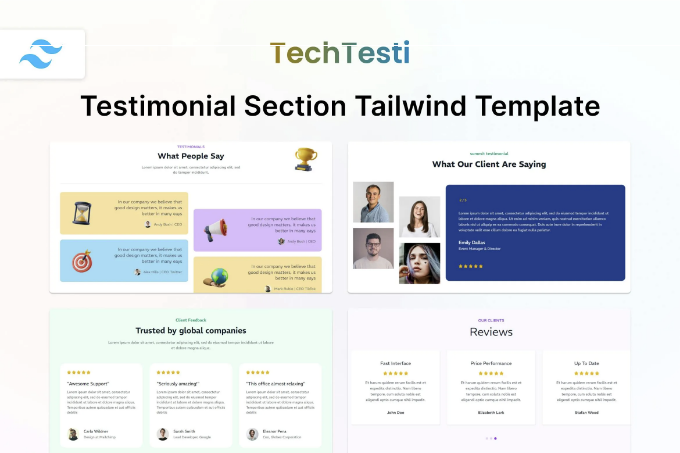
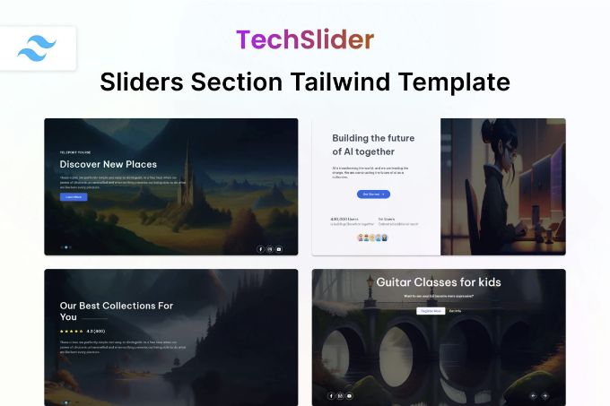
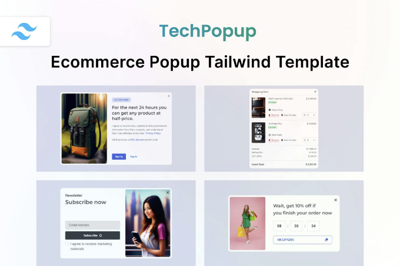
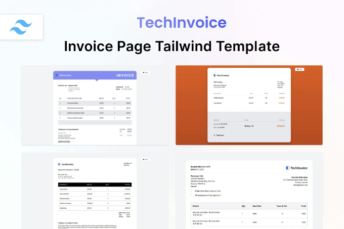
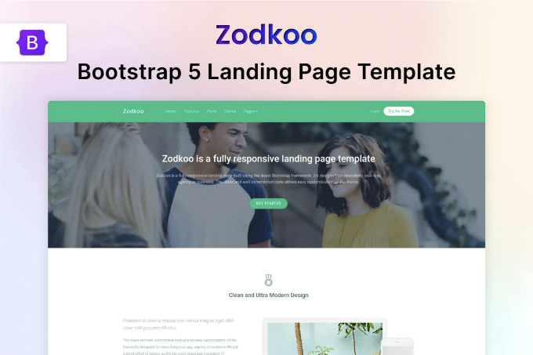
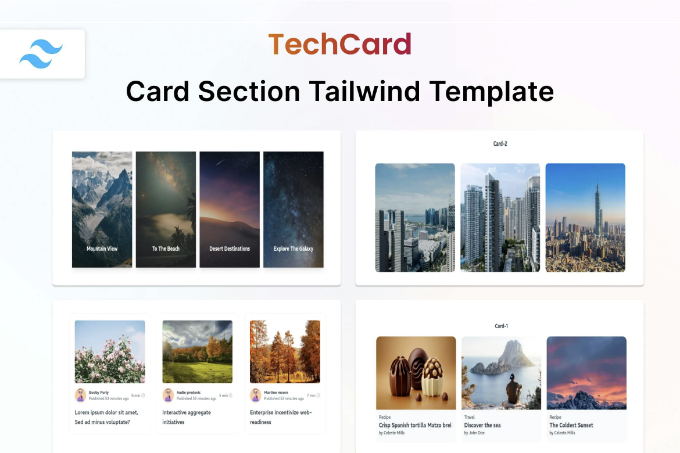
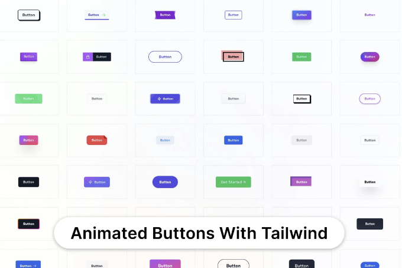

🔍 지금 TechTesti Testimonial Section Tailwind Template을 확인해보세요! 📁 사이트 템플릿 웹 템플릿을 살펴보고 🆓 무료 다운로드를 받으세요. 함께 제작을 시작해봅시다! 🚀

실시간 미리보기

TechTesti — Testimonial Section Tailwind CSS 3 HTML Template은 사용자가 JavaScript의 부담 없이 웹사이트에 멋진 후기 섹션을 만들 수 있도록 도와줍니다. 이 제품은 Tailwind CSS 프레임워크를 사용하여 만든 인상적인 애니메이션을 특징으로 합니다. TechTesti — Testimonial Section Tailwind CSS 3 HTML Template은 가벼우면서 빠른 로딩 애니메이션을 제공하여 전체적인 사용자 경험을 향상시킵니다. 이 HTML 템플릿은 쉽게 사용자 정의할 수 있습니다. 비즈니스 에이전시, 웹 에이전시, 프리랜서, 포트폴리오 에이전시, 웹 디자인 회사, 웹 디자이너, 디지털 마케팅 또는 모든 종류의 디자인 에이전시 웹사이트 및 비즈니스에 이 제품이 적합합니다. 우리가 모두 해결해드립니다. 이 제품은 컴포넌트 기반으로 제작되었으며, 사용하기 쉽고 개발자 친화적인 최신 순수 JavaScript로 만들어졌습니다. 현대적인 디자인과 더 빠른 로딩 HTML 템플릿이 제공됩니다. 이 애니메이션의 매력은 그 간결함과 사용 편의성에 있습니다. Tailwind CSS가 제공하는 유연성 덕분에 사용자는 손쉽게 특정 요구 사항에 맞게 사용자 정의할 수 있습니다. 사용자가 자신의 웹 프로젝트로 이 애니메이션을 통합하는 것은 간단합니다. 사용자는 HTML과 Tailwind CSS 파일을 모두 포함한 소스 파일에서 코드를 복사하여 그대로 코드에 붙여넣기만 하면 됩니다.

<!-- ui-log 수평형 -->
<ins class="adsbygoogle"
  style="display:block"
  data-ad-client="ca-pub-4877378276818686"
  data-ad-slot="9743150776"
  data-ad-format="auto"
  data-full-width-responsive="true"></ins>
<component is="script">
(adsbygoogle = window.adsbygoogle || []).push({});
</component>

메인 기능:

- 최신 Tailwind CSS v3.3.3로 제작됨
- 추천글 섹션
- 개발자 친화적인 코드
- 빠른 로딩 속도
- 크로스 브라우저 호환성
- 잘 정리되고 주석이 달린 깔끔한 코드
- 완벽히 반응형
- Google Fonts 지원
- 쉬운 설정

기능

- 아무 것도 설치할 필요가 없습니다. 클릭하고 실행하세요
- 관리자와 함께 사용할 수 있습니다.
- Tailwind CSS 3과 함께 사용할 수 있습니다.
- 순수한 CSS, 자바스크립트, HTML이 포함되어 있습니다.
- 다음 서비스와 함께 사용할 수 있습니다: 에이전시, 부동산, 교육, 포트폴리오, 블로그, 여행, 이벤트, 패션, 호텔, 사진촬영
- 몇 가지 사용 사례: 디지털 마케팅, 뉴스, 의료, 이메일, NFT, 스파, 산업, 양식, 창의적, 스포츠, 그래픽, 앱, 암호화폐, 모바일, 게임, CV, 이력서, 뉴스레터, 웹, 체육관, SEO, 에어비앤비, NPO, 기술
- 아무 CSS 라이브러리와 함께 작동할 수 있습니다: Bulma, Bootstrap 5, Bootstrap 4, Tailwind UI,
- 다음 언어와 함께 사용할 수 있습니다: ASP, PHP, Python, Java, Node, React, Vue, WordPress, Angular, Remix, Svelte, CakePHP, Express, RedwoodJS
- 다음 프레임워크와 쉽게 사용할 수 있습니다: Next, Laravel, Nuxt, Svelte Kit, Qwik, Ruby on Rails, Meteor, Astro, Shopify, .NET, Vue.js, Django, Spring, Flask, CodeIgniter, Symfony, 네이티브, React Native, Ionic, Framework 7,
- 다음 번들러도 사용할 수 있습니다: Vite, Parcel, Yarn, NPM, Gulp

<!-- ui-log 수평형 -->
<ins class="adsbygoogle"
  style="display:block"
  data-ad-client="ca-pub-4877378276818686"
  data-ad-slot="9743150776"
  data-ad-format="auto"
  data-full-width-responsive="true"></ins>
<component is="script">
(adsbygoogle = window.adsbygoogle || []).push({});
</component>

## 아이템 태그

#html #css #tailwind #page #ecommerce #tailwindcss #onepage #ui #agency #porfolio #app #mobile #testimonial #modern #business

## 파일 형식

HTML, CSS, JS

<!-- ui-log 수평형 -->
<ins class="adsbygoogle"
  style="display:block"
  data-ad-client="ca-pub-4877378276818686"
  data-ad-slot="9743150776"
  data-ad-format="auto"
  data-full-width-responsive="true"></ins>
<component is="script">
(adsbygoogle = window.adsbygoogle || []).push({});
</component>

## 추가 사항

레티나 디스플레이 대응
반응형
문서 포함

## 상업용 라이선스

추가 정보

<!-- ui-log 수평형 -->
<ins class="adsbygoogle"
  style="display:block"
  data-ad-client="ca-pub-4877378276818686"
  data-ad-slot="9743150776"
  data-ad-format="auto"
  data-full-width-responsive="true"></ins>
<component is="script">
(adsbygoogle = window.adsbygoogle || []).push({});
</component>

## 유사한 웹 템플릿

더보기

테크자(Techzaa)가 제작한 TechSlider — 히어로 슬라이더 섹션 Tailwind 템플릿

<!-- ui-log 수평형 -->
<ins class="adsbygoogle"
  style="display:block"
  data-ad-client="ca-pub-4877378276818686"
  data-ad-slot="9743150776"
  data-ad-format="auto"
  data-full-width-responsive="true"></ins>
<component is="script">
(adsbygoogle = window.adsbygoogle || []).push({});
</component>

TechPopup — Techzaa가 만든 전자 상거래 팝업 HTML 템플릿

TechInvoice — Techzaa가 만든 청구 페이지 Tailwind HTML 템플릿

<!-- ui-log 수평형 -->
<ins class="adsbygoogle"
  style="display:block"
  data-ad-client="ca-pub-4877378276818686"
  data-ad-slot="9743150776"
  data-ad-format="auto"
  data-full-width-responsive="true"></ins>
<component is="script">
(adsbygoogle = window.adsbygoogle || []).push({});
</component>

TechService - Techzaa에서 제작한 HTML 및 CSS 서비스 템플릿

## Techzaa의 더 많은 작품

더 많은 것을 보러 가기

<!-- ui-log 수평형 -->
<ins class="adsbygoogle"
  style="display:block"
  data-ad-client="ca-pub-4877378276818686"
  data-ad-slot="9743150776"
  data-ad-format="auto"
  data-full-width-responsive="true"></ins>
<component is="script">
(adsbygoogle = window.adsbygoogle || []).push({});
</component>

<!-- ui-log 수평형 -->
<ins class="adsbygoogle"
  style="display:block"
  data-ad-client="ca-pub-4877378276818686"
  data-ad-slot="9743150776"
  data-ad-format="auto"
  data-full-width-responsive="true"></ins>
<component is="script">
(adsbygoogle = window.adsbygoogle || []).push({});
</component>

TechCard — Tailwind CSS 3 Card HTML Template by Techzaa

TechButton — Tailwind CSS 3 Button HTML Template by Techzaa