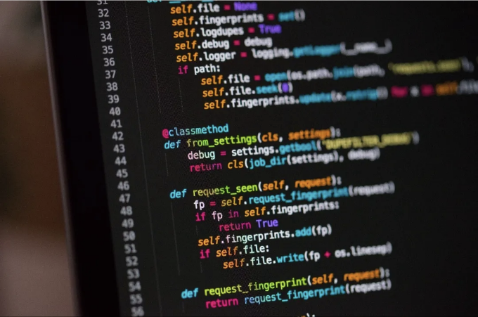

프로그래밍 세계로 진입하는 것은 흥미롭기도 하면서 겁나는 일일 수 있어요. 초보자들은 종종 수많은 질문에 휩싸이게 되죠. 여기에서는 프로그래밍 초보자들이 가장 많이 검색하는 다섯 가지 질문을 다루며, 당신의 코딩 여정을 위한 포괄적인 답변을 제공합니다.

# 1. 어떤 프로그래밍 언어를 배워야 할까요?

프로그래밍 언어의 선택은 당신이 달성하고자 하는 작업에 영향을 받습니다. 웹 개발에 관심이 있다면 HTML, CSS, 그리고 JavaScript는 필수입니다. 백엔드나 응용프로그램 개발을 위해서는 Python, Java, 또는 C#과 같은 언어가 인기가 있어요. Python은 데이터 과학과 기계 학습을 위해 널리 사용되고, Swift와 Kotlin은 iOS 및 Android 앱 개발을 위한 필수 언어입니다.

<!-- ui-log 수평형 -->
<ins class="adsbygoogle"
  style="display:block"
  data-ad-client="ca-pub-4877378276818686"
  data-ad-slot="9743150776"
  data-ad-format="auto"
  data-full-width-responsive="true"></ins>
<component is="script">
(adsbygoogle = window.adsbygoogle || []).push({});
</component>

# 2. 프로그래밍을 배우는 가장 좋은 방법은 무엇인가요?

프로그래밍을 배우는 가장 좋은 방법은 실습하는 것입니다. Codecademy, freeCodeCamp, 또는 Coursera와 같은 온라인 튜토리얼 및 코딩 연습을 시작해보세요. 작은 프로젝트를 만들면 이해를 강화할 수 있습니다. 페어 프로그래밍, 코딩 부트캠프, 그리고 오픈 소스 프로젝트에 기여하는 것도 학습 속도를 높일 수 있어요.

# 3. 프로그래밍을 잘 하려면 수학을 잘 알아야 하나요?

강력한 수학적 기초는 게임 개발, 알고리즘 및 데이터 과학과 같은 분야에서 특히 유용할 수 있지만, 모든 프로그래밍 작업에 엄격히 필요한 것은 아닙니다. 논리적 사고와 문제 해결 능력이 더 중요합니다. 진행하면서 필요한 수학적 개념을 배울 수 있습니다.

<!-- ui-log 수평형 -->
<ins class="adsbygoogle"
  style="display:block"
  data-ad-client="ca-pub-4877378276818686"
  data-ad-slot="9743150776"
  data-ad-format="auto"
  data-full-width-responsive="true"></ins>
<component is="script">
(adsbygoogle = window.adsbygoogle || []).push({});
</component>

# 4. 프로그래밍을 배우려면 학위가 필요할까요?

전혀 그렇지 않아요. 많은 성공한 프로그래머들은 온라인 강좌, 부트캠프, 실무 경험을 통해 스스로 가르쳤어요. 학위는 구조화된 학습 경로와 이론적 배경을 제공할 수 있지만, 프로그래밍을 배우는 유일한 방법은 아니에요.

# 5. 소프트웨어 개발자 직업을 얻으려면 학위가 필요할까요?

학위가 유리할 수는 있지만, 많은 고용주들은 형식적인 교육보다 실용적 기술과 실제 포트폴리오를 우선시해요. 프로젝트를 선보이고 오픈 소스에 기여하며 자격증을 취득하는 것이 잠재 고용주에게 여러분의 역량을 입증할 수 있어요.

<!-- ui-log 수평형 -->
<ins class="adsbygoogle"
  style="display:block"
  data-ad-client="ca-pub-4877378276818686"
  data-ad-slot="9743150776"
  data-ad-format="auto"
  data-full-width-responsive="true"></ins>
<component is="script">
(adsbygoogle = window.adsbygoogle || []).push({});
</component>

# 결론

프로그래밍은 헌신과 연습을 통해 능숙해질 수 있는 기술입니다. 공식 교육을 통해 배우든, 자율 학습을 선택하든, 중요한 것은 코딩을 시작하고 실험을 해보며 계속 배우는 것입니다. 기억해주세요, 모든 전문가는 한때 초심자였습니다. 즐거운 코딩하세요!

이 글은 프로그래밍 초보자들의 일반적인 질문에 대답하기 위해 작성되었습니다. 추가 질문이 있거나 어떤 부분에 대해 명확한 답변이 필요하다면 언제든지 연락해 주세요!