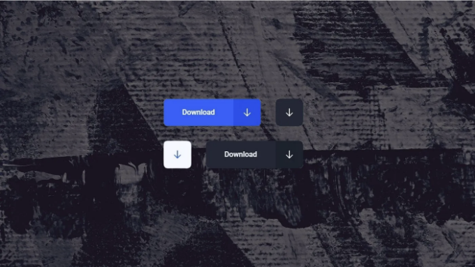
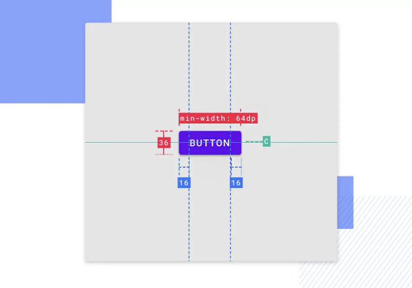
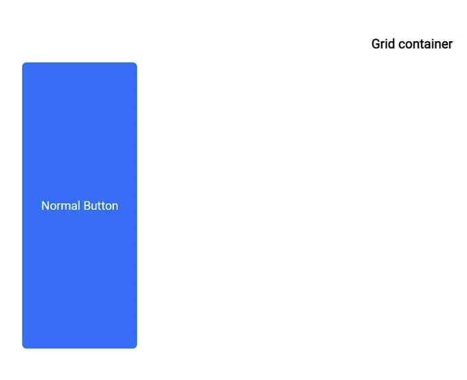
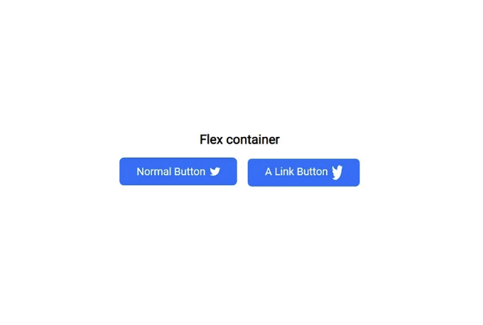
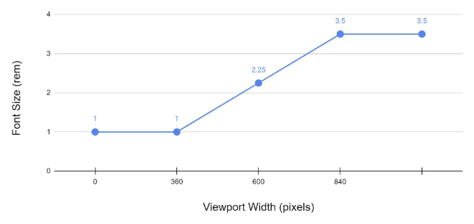
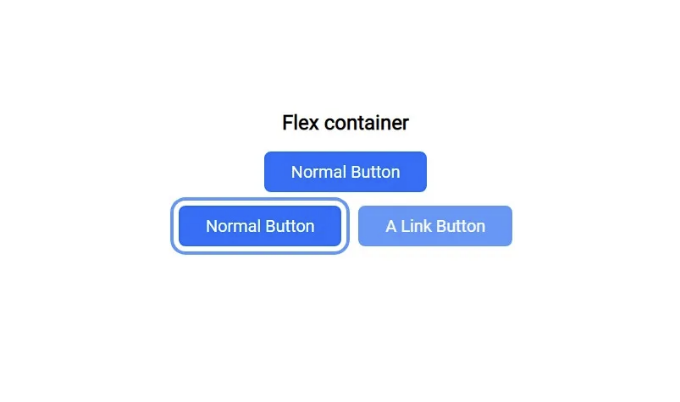

매직 버튼이 필요한 이유는 누가 원하지 않겠어요? 항상 작동하는 버튼!

예상대로 작동하고 원하는 위치에 두고 지정한 크기로 유지되는 버튼입니다. 이미 충분히 레이아웃과 반응성 문제가 있으니 나쁜 버튼 문제를 더할 필요는 없을 것 같아요. 버튼이라고 해서 왜 엔지니어링을 과도하게 해야 할까요?

<!-- ui-log 수평형 -->
<ins class="adsbygoogle"
  style="display:block"
  data-ad-client="ca-pub-4877378276818686"
  data-ad-slot="9743150776"
  data-ad-format="auto"
  data-full-width-responsive="true"></ins>
<component is="script">
(adsbygoogle = window.adsbygoogle || []).push({});
</component>

한 번의 코드 작성으로 끝나지만 믿지 않는다면, 다음에서 코드를 검토할 수 있어요:

- CodePen
- GitHub

그런데 마법의 버튼을 만든 방법을 이해하고 싶다면 계속 읽어주세요!

# HTML `<button></button>`, 정말 간단하지 않아요!

<!-- ui-log 수평형 -->
<ins class="adsbygoogle"
  style="display:block"
  data-ad-client="ca-pub-4877378276818686"
  data-ad-slot="9743150776"
  data-ad-format="auto"
  data-full-width-responsive="true"></ins>
<component is="script">
(adsbygoogle = window.adsbygoogle || []).push({});
</component>

버튼을 누르면 어떤 일이 발생한다면 `button``/button`를 사용하세요.

- 버튼 타입을 추가하십시오: 이 버튼이 어떻게 동작하는지 브라우저에 알리기 위해 또는 다른 버튼 타입.
- 버튼이 아이콘만 포함하고 "텍스트가 없는" 경우 aria-label="설명"을 추가하십시오.
- 버튼이 비활성화된 경우 disabled 및 aria-disabled="true"을 추가하십시오.

```js
<button type="button" class="Button">일반</button>
<button type="button" aria-label="별" class="Button">*</button>
<button type="button" disabled aria-disabled="true" class="Button">비활성화</button>
```

버튼을 누를 때 다른 페이지로 이동한다면 Anchor 요소를 사용하세요.

<!-- ui-log 수평형 -->
<ins class="adsbygoogle"
  style="display:block"
  data-ad-client="ca-pub-4877378276818686"
  data-ad-slot="9743150776"
  data-ad-format="auto"
  data-full-width-responsive="true"></ins>
<component is="script">
(adsbygoogle = window.adsbygoogle || []).push({});
</component>

- 이 링크의 역할을 브라우저에 지정하기 위해 role="button"을 추가하세요.

```js
<a href="#" role="button" class="Button">링크 버튼</a>
```

그러나 어떤 것을 사용해야할지 모르는 경우를 위해서 다음을 읽어보는 것을 추천합니다: Anchors vs Buttons

만약 버튼으로 사용할 다른 것을 생각하고 있다면, Mozilla의 현명한 사람들이 왜 이것이 바보 같은 아이디어인지에 대해 알려주는 메시지를 읽어보세요.

<!-- ui-log 수평형 -->
<ins class="adsbygoogle"
  style="display:block"
  data-ad-client="ca-pub-4877378276818686"
  data-ad-slot="9743150776"
  data-ad-format="auto"
  data-full-width-responsive="true"></ins>
<component is="script">
(adsbygoogle = window.adsbygoogle || []).push({});
</component>

# CSS로 정말 잘 작동하는 것!



내가 고백하고 싶은 게 있어; 나는 버튼에 집착하는 사람이야!

항상 완벽한 버튼을 만드는 데 흥미를 느꼈어요. 새로운 라이브러리를 시도할 때는 그들이 어떻게 버튼을 만들었는지 먼저 확인해요. 심지어 버튼에 특별히 관심을 가지고 라이브러리를 만들었어요. 그 라이브러리는 오직 중요한 요소만 높은 품질로 제공하고 있어요. 거기에는 더 많이 오버엔진이 된 버튼도 있을 거예요. 만약 이를 받고 싶거나 고품질 리액트 컴포넌트를 이용해 프론트엔드 세계를 개선하고 싶다면 Moon-RockUI를 방문해주세요.

<!-- ui-log 수평형 -->
<ins class="adsbygoogle"
  style="display:block"
  data-ad-client="ca-pub-4877378276818686"
  data-ad-slot="9743150776"
  data-ad-format="auto"
  data-full-width-responsive="true"></ins>
<component is="script">
(adsbygoogle = window.adsbygoogle || []).push({});
</component>

1.0.0 버전을 빠르게 출시할 수 있도록 도와주세요!

# 시작하기 전에 기본 사항:

- 나는 rem과 em을 자주 사용하고 다른 css 단위를 사용할 거에요. 더 알고 싶다면, 이 글을 읽어보시는 걸 추천해요: CSS 단위 설명
- 일반적으로 나는 CSS 사용자 지정 속성을 내 코드에 사용해. 그것은 제게 수퍼파워를 주지만, 이 글에서는 사용하지 않을 거에요

# 버튼 크기:

<!-- ui-log 수평형 -->
<ins class="adsbygoogle"
  style="display:block"
  data-ad-client="ca-pub-4877378276818686"
  data-ad-slot="9743150776"
  data-ad-format="auto"
  data-full-width-responsive="true"></ins>
<component is="script">
(adsbygoogle = window.adsbygoogle || []).push({});
</component>



여기서 중요한 점은 고정 크기를 지정하는 것이 아니라, 가장 큰 크기와 가장 작은 크기에 제한을 둘 것입니다. 버튼 크기는 주로 폰트 크기에 따라 달라질 것이기 때문에 크기를 결정하기 위해 기본적인 디자인 규칙을 따를 것입니다. 더 자세한 내용을 알고 싶다면 이 문서를 참고하는 것을 추천합니다: 버튼 디자인 - 웹사이트 및 모바일 앱용

```js
.Button {
    width: fit-content;
    max-width: min(100%, 100vw);
}
@supports not (width: fit-content) {
 .Button {
  width: auto;
 }
}
```

# width: fit-content;

<!-- ui-log 수평형 -->
<ins class="adsbygoogle"
  style="display:block"
  data-ad-client="ca-pub-4877378276818686"
  data-ad-slot="9743150776"
  data-ad-format="auto"
  data-full-width-responsive="true"></ins>
<component is="script">
(adsbygoogle = window.adsbygoogle || []).push({});
</component>

- fit-content를 사용하면 사용 가능한 공간을 사용하지만 max-content보다는 절대 넘지 않습니다.

# max-width: min(100%, 100vw);

- 요소가 달성할 수 있는 가장 큰 너비를 지정합니다. 
- min()을 사용하여 100%와 parent element의 크기에 연결된 최소값을 선택하고, parent element의 크기의 반일 수도 있는 화면 크기와 연결된 100vw입니다.
이렇게 함으로써 원하는 경우 요소가 부모 크기나 화면 크기로 확장되어 오버플로우 없이 표시할 수 있습니다.

<!-- ui-log 수평형 -->
<ins class="adsbygoogle"
  style="display:block"
  data-ad-client="ca-pub-4877378276818686"
  data-ad-slot="9743150776"
  data-ad-format="auto"
  data-full-width-responsive="true"></ins>
<component is="script">
(adsbygoogle = window.adsbygoogle || []).push({});
</component>

# 버튼 레이아웃, 디스플레이 및 정렬:

이전에는 display: block을 사용했고, 그 다음에는 display: inline을 사용했었어요. 그런데 React를 공부하다가 MUI를 발견했는데, 그들이 버튼을 어떻게 만들었는지 살펴보았더니 inline-flex를 사용했다는 걸 알게 되었어요!

```js
.Button {
  display: inline-flex;
 justify-content: center;
 align-items: center;
 vertical-align: middle;
 text-align: center;
}
```

Flex의 마법을 사용하여 이 버튼 안에 있는 모든 항목을 중앙에 위치시킬 거에요. 함께 사용해보세요:

<!-- ui-log 수평형 -->
<ins class="adsbygoogle"
  style="display:block"
  data-ad-client="ca-pub-4877378276818686"
  data-ad-slot="9743150776"
  data-ad-format="auto"
  data-full-width-responsive="true"></ins>
<component is="script">
(adsbygoogle = window.adsbygoogle || []).push({});
</component>

- justify-content
- align-items

일반적으로 텍스트 정렬 및 수직 정렬과 같은 속성을 사용하여:

- 추가 이미지나 이상한 텍스트가 항상 중앙에 있도록 함.
- 어떤 이유로 인해 플렉스가 작동하지 않을 때, 오래된 브라우저를 사용하는 사람을 위한 브라우저 지원을 위해.



<!-- ui-log 수평형 -->
<ins class="adsbygoogle"
  style="display:block"
  data-ad-client="ca-pub-4877378276818686"
  data-ad-slot="9743150776"
  data-ad-format="auto"
  data-full-width-responsive="true"></ins>
<component is="script">
(adsbygoogle = window.adsbygoogle || []).push({});
</component>

# 버튼 속성, 패딩 및 글꼴 크기:

이 곳에는이 버튼이 모든 경우와 모든 크기에서 작동하는 마법이 담겨 있습니다.

```js
.Button {
    padding: max(0.5em, 0.5rem) max(1.5em, 1.5rem);
    font-size: clamp(0.875rem, 0.7rem + 0.7vw, 1.375rem);
}
@supports not (font-size: clamp(0.875rem, 0.7rem + 0.7vw, 1.375rem)) {
 .Button {
  font-size: 1rem;
 }
}
```

이것은 max-width 트릭보다 더 과도해 보일 수 있지만, 이 코드를 한 번만 복사하면 모든 경우에 작동합니다.

<!-- ui-log 수평형 -->
<ins class="adsbygoogle"
  style="display:block"
  data-ad-client="ca-pub-4877378276818686"
  data-ad-slot="9743150776"
  data-ad-format="auto"
  data-full-width-responsive="true"></ins>
<component is="script">
(adsbygoogle = window.adsbygoogle || []).push({});
</component>

- padding: max(0.5em, 0.5rem) max(1.5em, 1.5rem); 여기서의 요령은 max() 함수를 사용하는 것입니다. 주목할 점은 한 번은 rem으로 한 번은 em으로 동일한 값을 사용한다는 것이지만 왜 그렇게 할까요?

max() 함수의 목적은 어떤 값이 더 큰지를 선택하는 것입니다. 보통 em이 더 큽니다. 만약 버튼의 글꼴 크기가 24px이라고 가정한다면요.

그렇다면 왜 이런 일을 하는 걸까요? 일반적으로 12px와 같이 작은 글꼴 크기를 사용할 때, em만 사용한다면 버튼의 크기가 너무 좁아질 수 있습니다. 글꼴 크기와 관련이 있기 때문입니다. 그러나 rem은 가장 크게 됩니다.

우리는 이 요령을 사용하여 버튼 안의 최소 공간을 정의하고 동시에 글꼴 크기에 따라 버튼이 커지도록 허용합니다.

<!-- ui-log 수평형 -->
<ins class="adsbygoogle"
  style="display:block"
  data-ad-client="ca-pub-4877378276818686"
  data-ad-slot="9743150776"
  data-ad-format="auto"
  data-full-width-responsive="true"></ins>
<component is="script">
(adsbygoogle = window.adsbygoogle || []).push({});
</component>



- font-size: clamp(0.875rem, 0.7rem + 0.7vw, 1.375rem); 솔직히, 여기에서 이러한 값을 선택하는 방법을 설명할 수 없습니다. 다른 기사가 필요할 것입니다.

간단히 말해서 clamp()를 사용하면 화면 크기에 반응하는 글꼴을 사용할 수 있습니다. 최소값은 0.875rem이고 최대값은 1.375rem입니다(예를 들어).

웹 개발 전반적으로 도움이 될 것이라고 생각되는 이 기사들을 꼭 읽으시기를 권장합니다:

<!-- ui-log 수평형 -->
<ins class="adsbygoogle"
  style="display:block"
  data-ad-client="ca-pub-4877378276818686"
  data-ad-slot="9743150776"
  data-ad-format="auto"
  data-full-width-responsive="true"></ins>
<component is="script">
(adsbygoogle = window.adsbygoogle || []).push({});
</component>

- CSS clamp()를 사용하여 글꼴 크기를 선형으로 조절하기
- CSS Clamp를 사용하여 유동적인 글꼴 크기 스케일 만들기
- CSS Clamp로 현대적인 유동적 타이포그래피 만들기

# 버튼 위의 체리:

```js
.Button {
    overflow: hidden;
    white-space: nowrap;
    cursor: pointer;
    user-select: none;
    appearance: button;
}
```

- overflow: hidden; 버튼 바깥으로 나오는 것을 방지합니다.
- white-space: nowrap; 텍스트가 한 줄을 초과하지 않도록합니다.
- cursor: pointer; 커서가 링크를 나타내는 포인터입니다. 일반적으로 손가락을 가리키는 이미지입니다.
- user-select: none; 요소 및 하위 요소의 텍스트를 선택할 수 없도록합니다.
- 'user-select'는 Safari, iOS의 Safari에서 지원되지 않습니다. 버튼에 중요한 텍스트가 포함되어 있으면 허용할 수 있습니다.
- appearance: button; CSS 속성을 사용하여 UI 컨트롤의 네이티브 모양을 제어합니다. 이는 운영 체제의 테마에 기반한 것입니다.
- 'appearance'는 iOS의 Safari에서 15.4버전에서 지원되지 않습니다.

<!-- ui-log 수평형 -->
<ins class="adsbygoogle"
  style="display:block"
  data-ad-client="ca-pub-4877378276818686"
  data-ad-slot="9743150776"
  data-ad-format="auto"
  data-full-width-responsive="true"></ins>
<component is="script">
(adsbygoogle = window.adsbygoogle || []).push({});
</component>

# 버튼 호버 및 포커스:



아무것도 특별한 것은 없어요. 다만 버튼이 다른 상황에서 어떻게 동작하는지 결정해 보았고, CSS의 왕으로부터 배운 멋진 포커스 링 트릭을 사용했어요.

```js
.Button {
    box-shadow: 0 0 0 -0.4em hsl(0, 0%, 100%),
        0 0 0 -0.6em rgba(13, 109, 253, 0.7);
    transition: box-shadow 400ms cubic-bezier(0.66, -0.2, 0.27, 1.15);
}
.Button:active,
.Button:hover {
    opacity: 0.7;
}
.Button:focus-visible {
    box-shadow: 0 0 0 0.3em hsl(0, 0%, 100%),
        0 0 0 0.5em rgba(13, 109, 253, 0.7);
}
.Button:focus {
    outline: none;
}
```

<!-- ui-log 수평형 -->
<ins class="adsbygoogle"
  style="display:block"
  data-ad-client="ca-pub-4877378276818686"
  data-ad-slot="9743150776"
  data-ad-format="auto"
  data-full-width-responsive="true"></ins>
<component is="script">
(adsbygoogle = window.adsbygoogle || []).push({});
</component>

# 결론 + 무료 선물!

약속을 지켰기를 바랍니다!

“한 번 쓰고 잊혀진 코드"를 이제 코드를 복사하러 가보세요. 내가 너에게 약속한 것을 이행하고 싶어요. 다음 프로젝트에서 좀 더 복잡한 버튼을 사용하고 싶다면 Moon-RockUI를 방문해주세요. 거기서 최고의 버튼을 만드는 데 도움을 줄 수 있어요.

버전 1.0.0 곧 출시됩니다!

<!-- ui-log 수평형 -->
<ins class="adsbygoogle"
  style="display:block"
  data-ad-client="ca-pub-4877378276818686"
  data-ad-slot="9743150776"
  data-ad-format="auto"
  data-full-width-responsive="true"></ins>
<component is="script">
(adsbygoogle = window.adsbygoogle || []).push({});
</component>

# 무료 선물:

언제나 완벽하게 만들려고 노력해요.

이 글을 완벽하게 만들기 위해 노력하는 것처럼, 제 웹사이트들도 가능한 최상의 품질로 만들기 위해 노력해요. 제 웹사이트가 항상 최상의 품질을 유지할 수 있도록 헌신하는 마음으로, 이 헌신을 여러분에게 전하고 싶어요 — 그래서 무료 선물을 즐기세요!

무료 웹사이트 속도 최적화 서비스 — 무료로 웹사이트 성능 향상하세요.

<!-- ui-log 수평형 -->
<ins class="adsbygoogle"
  style="display:block"
  data-ad-client="ca-pub-4877378276818686"
  data-ad-slot="9743150776"
  data-ad-format="auto"
  data-full-width-responsive="true"></ins>
<component is="script">
(adsbygoogle = window.adsbygoogle || []).push({});
</component>

이 통계는 당신을 깜짝 놀라게 하려는 것이 아니에요. 제 무료 서비스에 가입하라는 게 목적이 아니에요.

- 페이지 로드 시간이 1초 지연되면 이탈률이 32% 증가할 수 있어요.
- 성능 문제를 경험한 온라인 쇼핑자 중 79%가 웹사이트로 되돌아오지 않고, 그 중 44%가 나쁜 경험을 친구들에게 공유할 거에요.

하지만 당신을 탓하기보다는 워드프레스와 템플릿을 탓해야겠죠! — 무료 웹사이트 속도 최적화 서비스

# 전체 코드:

<!-- ui-log 수평형 -->
<ins class="adsbygoogle"
  style="display:block"
  data-ad-client="ca-pub-4877378276818686"
  data-ad-slot="9743150776"
  data-ad-format="auto"
  data-full-width-responsive="true"></ins>
<component is="script">
(adsbygoogle = window.adsbygoogle || []).push({});
</component>

```js
.Button {
    width: fit-content;
    max-width: min(100%, 100vw);
    display: inline-flex;
    justify-content: center;
    align-items: center;
    text-align: center;
    vertical-align: middle;
    overflow: hidden;
    appearance: button;
    user-select: none;
    text-transform: capitalize;
    white-space: nowrap;
    text-decoration: none;
    cursor: pointer;
    padding: max(0.5em, 0.5rem) max(1.5em, 1.5rem);
    font-size: clamp(0.875rem, 0.7220363289rem + 0.7648183556vw, 1.375rem);
    box-shadow: 0 0 0 -0.4em hsl(0, 0%, 100%),
        0 0 0 -0.6em rgba(13, 109, 253, 0.7);
    transition: box-shadow 400ms cubic-bezier(0.66, -0.2, 0.27, 1.15);
}
.Button:active,
.Button:hover {
    opacity: 0.7;
}
.Button:focus-visible {
    box-shadow: 0 0 0 0.3em hsl(0, 0%, 100%),
        0 0 0 0.5em rgba(13, 109, 253, 0.7);
}
.Button:focus {
    outline: none;
}
@supports not (font-size: clamp(0.875rem, 0.7rem + 0.7vw, 1.375rem)) {
 .Button {
  font-size: 1rem;
 }
}
@supports not (width: fit-content) {
 .Button {
  width: auto;
 }
}
```