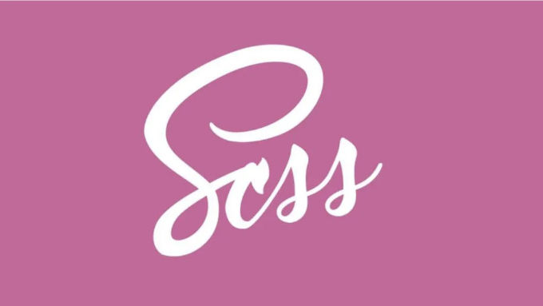

## 템플릿 SCSS 폴더 구조를 찾기 어려우신가요? 언제든 환영합니다...



리액트 프로젝트에서 SCSS(Sass)를 설정하면 변수, 믹스인, 중첩된 규칙 등 SCSS가 제공하는 강력한 기능과 문법을 활용할 수 있습니다. 이 기사는 React 애플리케이션에서 SCSS를 구성하는 포괄적인 가이드를 제공하며, 상세한 설명과 예제를 포함하고 있습니다.

## 1. 필요한 종속 항목 설치 및 구성:

<!-- ui-log 수평형 -->
<ins class="adsbygoogle"
  style="display:block"
  data-ad-client="ca-pub-4877378276818686"
  data-ad-slot="9743150776"
  data-ad-format="auto"
  data-full-width-responsive="true"></ins>
<component is="script">
(adsbygoogle = window.adsbygoogle || []).push({});
</component>

React에서 SCSS를 사용하려면 sass 패키지가 필요합니다. 아래 명령어를 사용하여 설치해보세요:

```js
npm install --save-dev sass sass-loader
```

rules 배열을 수정하여 Webpack 구성을 업데이트해주세요:

```js
{
  test: /\.scss$/,
  use: ['style-loader', 'css-loader', 'sass-loader'],
}
```

<!-- ui-log 수평형 -->
<ins class="adsbygoogle"
  style="display:block"
  data-ad-client="ca-pub-4877378276818686"
  data-ad-slot="9743150776"
  data-ad-format="auto"
  data-full-width-responsive="true"></ins>
<component is="script">
(adsbygoogle = window.adsbygoogle || []).push({});
</component>

다음으로 기존의 .css 파일을 .scss 파일로 이름을 바꾸고 해당 JavaScript 파일에서 import 문을 업데이트하세요.

```js
// index.js

import './styles/index.scss';
```

## 2. SCSS 파일 및 폴더 구조화:

SCSS 파일을 위한 전용 폴더를 생성하세요. 이 폴더는 일반적으로 src 폴더 내에 scss 또는 styles로 이름이 지어집니다. 이 폴더에는 전역 스타일, 변수 및 믹스인이 포함됩니다.

<!-- ui-log 수평형 -->
<ins class="adsbygoogle"
  style="display:block"
  data-ad-client="ca-pub-4877378276818686"
  data-ad-slot="9743150776"
  data-ad-format="auto"
  data-full-width-responsive="true"></ins>
<component is="script">
(adsbygoogle = window.adsbygoogle || []).push({});
</component>

다음은 권장되는 폴더 구조입니다:

```js
src/
  ├── styles/
  │   │
  │   ├── base/
  │   │   ├── colors.scss
  │   │   ├── global.scss
  │   │   ├── reset.scss
  │   │   └── typography.scss
  │   │
  │   ├── components/
  │   │   ├── buttons.scss
  │   │   └── forms.scss
  │   │
  │   ├── layout/
  │   │   ├── footer.scss
  │   │   └── header.scss
  │   │
  │   ├── utilities/
  │   │   ├── variables.scss
  │   │   ├── mixins.scss
  │   │   └── functions.scss
  │   └── index.scss
  │
  ├── App.js
  └── index.js
```

- base/: 이 폴더에는 프로젝트의 기본 스타일인 전역 스타일, 초기화 스타일, 타이포그래피 및 색상이 포함됩니다.
- components/: 이 폴더에는 버튼, 폼, 카드, 모달과 같은 개별 UI 컴포넌트에 대한 스타일이 포함됩니다.
- layout/: 이 폴더에는 프로젝트 전체 레이아웃과 관련된 스타일인 헤더, 푸터, 그리드 시스템, 내비게이션 등이 포함됩니다.
- utils/: 이 폴더에는 프로젝트 전체에서 사용되는 변수, 믹스인, 함수와 같은 Sass 유틸리티가 포함됩니다.
- index.scss: 이 파일은 모든 다른 SCSS 파일을 가져오는 주요 SCSS 파일입니다.

## 3. 각 SCSS 폴더에 대한 초기 설정:

<!-- ui-log 수평형 -->
<ins class="adsbygoogle"
  style="display:block"
  data-ad-client="ca-pub-4877378276818686"
  data-ad-slot="9743150776"
  data-ad-format="auto"
  data-full-width-responsive="true"></ins>
<component is="script">
(adsbygoogle = window.adsbygoogle || []).push({});
</component>

## 3.1 reset.scss:

이것은 브라우저별 기본 스타일을 제거하고 깨끗한 상태로 작업할 수 있도록 하여 일관된 크로스 브라우저 스타일링을 제공합니다. Eric Meyer의 CSS Reset: 모든 내장 브라우저 스타일을 제거하여 모든 요소에 대해 완전한 제어권을 제공합니다.

```js
html, body, div, span, applet, object, iframe,
h1, h2, h3, h4, h5, h6, p, blockquote, pre,
a, abbr, acronym, address, big, cite, code,
del, dfn, em, img, ins, kbd, q, s, samp,
small, strike, strong, sub, sup, tt, var,
b, u, i, center,
dl, dt, dd, ol, ul, li,
fieldset, form, label, legend,
table, caption, tbody, tfoot, thead, tr, th, td,
article, aside, canvas, details, embed, 
figure, figcaption, footer, header, hgroup, 
menu, nav, output, ruby, section, summary,
time, mark, audio, video {
 margin: 0;
 padding: 0;
 border: 0;
 font-size: 100%;
 font: inherit;
 vertical-align: baseline;
}
/* HTML5 display-role reset for older browsers */
article, aside, details, figcaption, figure, 
footer, header, hgroup, menu, nav, section {
 display: block;
}
body {
 line-height: 1;
}
ol, ul {
 list-style: none;
}
blockquote, q {
 quotes: none;
}
blockquote:before, blockquote:after,
q:before, q:after {
 content: '';
 content: none;
}
table {
 border-collapse: collapse;
 border-spacing: 0;
}
```

reset.css 대안으로 normalize.css가 있습니다. 내장된 브라우저 스타일을 일관되게 유지하면서 유용한 기본 스타일을 유지하려고 합니다.

<!-- ui-log 수평형 -->
<ins class="adsbygoogle"
  style="display:block"
  data-ad-client="ca-pub-4877378276818686"
  data-ad-slot="9743150776"
  data-ad-format="auto"
  data-full-width-responsive="true"></ins>
<component is="script">
(adsbygoogle = window.adsbygoogle || []).push({});
</component>

## 3.2 global.scss:

global.scss 파일은 전체 React 애플리케이션에 적용되는 전역 스타일을 저장하는 데 사용됩니다. 모든 요소의 box-sizing 속성을 border-box로 설정하여 요소 크기와 레이아웃을 쉽게 관리할 수 있습니다. box-sizing의 기본값은 content-box이며, 이는 패딩, 테두리 및 여백이 크기에 포함되지 않음을 의미합니다. 요소에 적용된 어떤 패딩, 테두리 또는 여백도 지정된 너비와 높이 외부에 추가되어 요소의 전체 렌더링 크기가 폭과 높이 속성으로 설정된 크기보다 큰 경우가 발생합니다.

```js
*,
*::before,
*::after {
  box-sizing: border-box;
}
```

## 3.3 colors.scss:

<!-- ui-log 수평형 -->
<ins class="adsbygoogle"
  style="display:block"
  data-ad-client="ca-pub-4877378276818686"
  data-ad-slot="9743150776"
  data-ad-format="auto"
  data-full-width-responsive="true"></ins>
<component is="script">
(adsbygoogle = window.adsbygoogle || []).push({});
</component>

애플리케이션 전체에서 일관된 사용을 위해 색상 변수 및 관련 색상 클래스를 정의하세요. 프로젝트 요구 사항에 따라 설정을 변경할 수 있습니다.

```js
$primary-color: #3498db;
$secondary-color: #2ecc71;

// 회색 스케일 색상
$gray-100: #f8f9fa;
$gray-200: #e9ecef;
$gray-300: #dee2e6;

$gray-500: #adb5bd;
$gray-600: #6c757d;
$gray-700: #495057;
$gray-800: #343a40;
$gray-900: #212529;

// 배경 및 텍스트 색상
$background-color: #ffffff;
$text-color: $gray-900;

// 시맨틱 색상
$success-color: #28a745;
$error-color: #dc3545;
$warning-color: #ffc107;
$info-color: #17a2b8;
```

## 3.4 typography.scss:

글꼴 패밀리, 글꼴 크기, 글꼴 두께 및 기타 텍스트 관련 스타일과 같은 타이포그래피 스타일을 정의하세요.

<!-- ui-log 수평형 -->
<ins class="adsbygoogle"
  style="display:block"
  data-ad-client="ca-pub-4877378276818686"
  data-ad-slot="9743150776"
  data-ad-format="auto"
  data-full-width-responsive="true"></ins>
<component is="script">
(adsbygoogle = window.adsbygoogle || []).push({});
</component>

## 3.5 index.scss:

모든 SCSS 파일을 구성한 후에는 SCSS 폴더의 진입 지점인 index.scss에서 모두 import하는지 확인해주세요.

```js
// Base
@import 'base/global';
@import 'base/reset';
@import 'base/typography';
@import 'base/colors';

// Layout
@import 'layout/header';
@import 'layout/footer';
@import 'layout/grid';
@import 'layout/navigation';

// Components
@import 'components/buttons';
@import 'components/forms';
@import 'components/cards';
@import 'components/modals';

// Utils
@import 'utils/variables';
@import 'utils/mixins';
@import 'utils/functions';
```

## 4. 프로덕션을 위한 SCSS 설정 최적화:

<!-- ui-log 수평형 -->
<ins class="adsbygoogle"
  style="display:block"
  data-ad-client="ca-pub-4877378276818686"
  data-ad-slot="9743150776"
  data-ad-format="auto"
  data-full-width-responsive="true"></ins>
<component is="script">
(adsbygoogle = window.adsbygoogle || []).push({});
</component>

프로덕션을 위해 SCSS를 최적화하려면, PurgeCSS와 같은 도구를 사용하여 최종 번들에서 사용되지 않는 CSS를 제거하는 것을 고려해보세요. 이를 통해 CSS 파일의 크기를 상당히 줄이고 로드 시간을 개선할 수 있습니다. PurgeCSS를 웹팩 플러그인으로 구성하거나 PostCSS 플러그인으로 사용할 수 있습니다.

또한 cssnano와 같은 도구를 사용하여 CSS 파일을 압축할 수도 있습니다. cssnano는 인기 있는 PostCSS 플러그인으로, CSS 파일에서 주석, 공백 및 다른 불필요한 문자를 제거하여 번들 크기를 줄일 수 있습니다.

- 먼저, 필요한 종속성을 설치하세요:

```js
npm install --save-dev @fullhuman/postcss-purgecss cssnano postcss postcss-cli postcss-loader
```

<!-- ui-log 수평형 -->
<ins class="adsbygoogle"
  style="display:block"
  data-ad-client="ca-pub-4877378276818686"
  data-ad-slot="9743150776"
  data-ad-format="auto"
  data-full-width-responsive="true"></ins>
<component is="script">
(adsbygoogle = window.adsbygoogle || []).push({});
</component>

2. 다음 내용을 포함하여 프로젝트 루트 폴더에 postcss.config.js 파일을 만드세요:

```js
const purgecss = require('@fullhuman/postcss-purgecss')({
  content: ['./src/**/*.js', './src/**/*.jsx'],

  defaultExtractor: (content) => content.match(/[\w-/:]+(?<!:)/g) || [],
});

const cssnano = require('cssnano')({
  preset: 'default',
});

module.exports = {
  plugins: [
    require('autoprefixer'),
    ...(process.env.NODE_ENV === 'production' ? [purgecss, cssnano] : []),
  ],
};
```

이 구성 파일에서는 PurgeCSS를 설정하여 src 폴더의 .js 및 .jsx 파일을 스캔하여 사용되지 않는 CSS를 제거합니다. 또한 최소화를 위해 `default` 프리셋을 사용하여 cssnano를 구성합니다.

3. webpack.config.js 파일을 업데이트하여 postcss-loader를 포함하세요.

<!-- ui-log 수평형 -->
<ins class="adsbygoogle"
  style="display:block"
  data-ad-client="ca-pub-4877378276818686"
  data-ad-slot="9743150776"
  data-ad-format="auto"
  data-full-width-responsive="true"></ins>
<component is="script">
(adsbygoogle = window.adsbygoogle || []).push({});
</component>

Create React App (CRA)을 사용 중이라면, 먼저 npm run eject 명령을 실행하여 응용 프로그램을 eject해야 합니다. 그런 다음 webpack.config.js 파일을 찾아 CSS 규칙 섹션을 찾으세요. .css 및 .scss 규칙 모두에 postcss-loader를 use 배열에 추가해주세요:

```js
{
  test: cssRegex,
  exclude: cssModuleRegex,
  use: getStyleLoaders(
    {
      importLoaders: 2, // importLoaders 카운트에 postcss-loader를 추가합니다
      sourceMap: isEnvProduction && shouldUseSourceMap,
    },
    'postcss-loader' // 여기에 postcss-loader를 추가합니다
  ),
},
{
  test: sassRegex,
  exclude: sassModuleRegex,
  use: getStyleLoaders(
    {
      importLoaders: 3, // importLoaders 카운트에 postcss-loader를 추가합니다
      sourceMap: isEnvProduction && shouldUseSourceMap,
    },
    'postcss-loader', // 여기에 postcss-loader를 추가합니다
    'sass-loader'
  ),
},
```

4. 이러한 최적화를 적용하려면 응용 프로그램을 빌드할 때 NODE_ENV 환경 변수를 `production`으로 설정하세요.

```js
NODE_ENV=production npm run build
```

<!-- ui-log 수평형 -->
<ins class="adsbygoogle"
  style="display:block"
  data-ad-client="ca-pub-4877378276818686"
  data-ad-slot="9743150776"
  data-ad-format="auto"
  data-full-width-responsive="true"></ins>
<component is="script">
(adsbygoogle = window.adsbygoogle || []).push({});
</component>

이 구성을 사용하면 PurgeCSS가 최종 번들에서 사용되지 않는 CSS를 제거하고, cssnano가 CSS를 최소화하여 제작용 번들을 더 작고 최적화된 상태로 만들어 줍니다.

요약하면, React 프로젝트에 대한 완벽한 SCSS 초기 설정을 수립하면 개발 경험을 크게 향상시킬 수 있으며, 스타일 시트를 관리, 유지 및 확장하기가 더 쉬워집니다. 이 글에서 논의된 지침과 폴더 구조를 따라 스타일에 견고한 기반을 마련하여, 스타일을 정리하는 데 적은 시간을 쓰고 애플리케이션에 놀라운 기능을 구축하는 데 더 많은 시간을 쏟을 수 있습니다. 잘 구조화된 SCSS 설정을 생성하는 지식을 갖추었으니, 이제 새로운 자신감과 효율성으로 React 프로젝트에 진입해 보세요.

즐거운 코딩되세요!