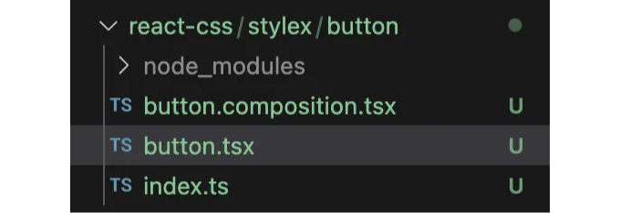
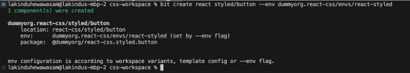
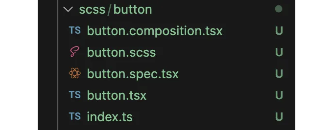
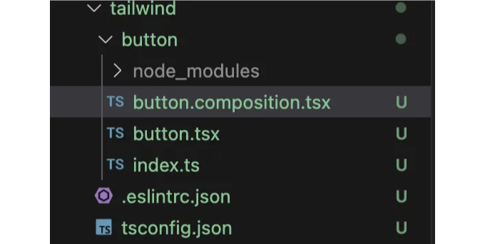
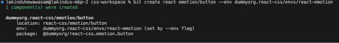

2024년에는 Stylex, Styled Components, Sass, Tailwind 또는 Emotion과 같은 라이브러리로 React 앱의 스타일을 지정하세요!

년도에 따라 React 컴포넌트에 스타일을 지정하는 것이 더 쉬워졌습니다. 이제는 스타일을 직접 작성할 필요가 없으며, 보통 소규모 프로젝트에는 충분한 보일러플레이트 스타일시트에서 작업할 수 있습니다.

그러나 2024년에 올바른 CSS 라이브러리를 선택하여 앱을 스타일링하는 것이 중요합니다. 적절한 프레임워크를 선택하면 처음부터 많은 시간을 절약할 수 있습니다.

그래서 2024년에 React 앱의 스타일을 지정하는 데 사용할 수 있는 상위 5개 라이브러리를 알아보겠습니다.

<!-- ui-log 수평형 -->
<ins class="adsbygoogle"
  style="display:block"
  data-ad-client="ca-pub-4877378276818686"
  data-ad-slot="9743150776"
  data-ad-format="auto"
  data-full-width-responsive="true"></ins>
<component is="script">
(adsbygoogle = window.adsbygoogle || []).push({});
</component>

간편하게 Bit 작업 공간을 초기화하려면 다음 명령을 실행하세요:

```js
bit new basic css-workspace --default-scope <<YOUR_BIT_USERNAME>>.<<SCOPE_NAME>> && cd css-workspace && bit start
```

# 접근 방식 01: StyleX

StyleX는 Meta 팀이 개발한 웹 앱의 스타일을 위한 JavaScript 구문 및 컴파일러입니다. 이는 표준 CSS-in-JS 솔루션의 이점을 소개하면서(그 이상도 가능합니다) 성능 부하 없이 웹 앱 스타일링을 할 수 있도록 합니다.

<!-- ui-log 수평형 -->
<ins class="adsbygoogle"
  style="display:block"
  data-ad-client="ca-pub-4877378276818686"
  data-ad-slot="9743150776"
  data-ad-format="auto"
  data-full-width-responsive="true"></ins>
<component is="script">
(adsbygoogle = window.adsbygoogle || []).push({});
</component>

StyleX를 사용하면 CSS의 전역 범위를 제거하고 더 많은 구성 요소별 CSS 설정을 만들어 디버깅, 확장 및 유지 관리를 쉽게 할 수 있습니다. 게다가 JavaScript에서 CSS를 안전하게 작성하여 빌드 시 정규 CSS로 변환되는 방식도 제공합니다.

StyleX를 React 컴포넌트에 Bit를 사용하여 통합하는 방법은 몇 단계로 간단합니다:

먼저 워크스페이스에서 StyleX 컴포넌트를 생성할 수 있는지 확인해야합니다.

다음 명령을 사용하여 스타일링에 StyleX를 사용하는 React 컴포넌트를 만들어보세요:

<!-- ui-log 수평형 -->
<ins class="adsbygoogle"
  style="display:block"
  data-ad-client="ca-pub-4877378276818686"
  data-ad-slot="9743150776"
  data-ad-format="auto"
  data-full-width-responsive="true"></ins>
<component is="script">
(adsbygoogle = window.adsbygoogle || []).push({});
</component>

```js
bit create stylex stlyex/button --env learnbit-react.stylex/envs/react-stylex
```

위 명령을 실행한 후에는 다음과 같은 출력이 표시됩니다:



다음으로, button.tsx 파일을 열어서 아래와 같이 StyleX를 사용할 수 있습니다:

<!-- ui-log 수평형 -->
<ins class="adsbygoogle"
  style="display:block"
  data-ad-client="ca-pub-4877378276818686"
  data-ad-slot="9743150776"
  data-ad-format="auto"
  data-full-width-responsive="true"></ins>
<component is="script">
(adsbygoogle = window.adsbygoogle || []).push({});
</component>

```js
import { type ReactNode, type HTMLAttributes } from 'react';
import * as stylex from '@stylexjs/stylex';
import type { StyleXStyles } from '@stylexjs/stylex';

const styles = stylex.create({
  base: {
    fontSize: 32,
    color: '#eeeaee',
    backgroundColor: {
      default: '#720b72',
      ':hover': '#a93da9',
    },
    padding: 12,
    borderRadius: 8,
    borderColor: 'unset',
  },
});

export type ButtonProps = {
  children?: ReactNode;
  style?: StyleXStyles;
} & Omit<HTMLAttributes<HTMLButtonElement>, 'style'>;

export function Button({ children, style }: ButtonProps) {
  return (
    <button type="button" {...stylex.props(styles.base, style)}>
      {children}
    </button>
  );
}
```

컴포넌트의 시각적 출력을 제공하고 버튼.composition.tsx를 업데이트하여 구성 요소를 업데이트할 수 있습니다.

```js
import React from 'react';
import { Button } from './button';

export const BasicButton = () => {
  return (
    <Button>Hello World!</Button>
  );
}

export const StyledButton = () => {
  return (
    <Button
      style={{
        color: 'blue' as any
      }}
    >Blue Text Button!</Button>
  );
}
```

여기서 다양한 변형이 제공됩니다.

<!-- ui-log 수평형 -->
<ins class="adsbygoogle"
  style="display:block"
  data-ad-client="ca-pub-4877378276818686"
  data-ad-slot="9743150776"
  data-ad-format="auto"
  data-full-width-responsive="true"></ins>
<component is="script">
(adsbygoogle = window.adsbygoogle || []).push({});
</component>

다음으로, Bit 서버를 열어서 아래의 StyleX 컴포넌트를 확인할 수 있습니다:

컴포넌트의 전체 구현을 찾고 싶다면, 제가 작성한 React + StyleX 컴포넌트를 확인해보세요.

# 접근 방법 02: Styled Components

Styled Components를 사용하면 React.js에서 사용자 정의 컴포넌트를 구축하면서 JS 내에서 CSS를 작성할 수 있습니다. 이를 통해 CSS 코드를 JavaScript 파일 안에서 유지하고 유지보수 가능한 CSS를 작성할 수 있습니다.

<!-- ui-log 수평형 -->
<ins class="adsbygoogle"
  style="display:block"
  data-ad-client="ca-pub-4877378276818686"
  data-ad-slot="9743150776"
  data-ad-format="auto"
  data-full-width-responsive="true"></ins>
<component is="script">
(adsbygoogle = window.adsbygoogle || []).push({});
</component>

Styled-Components를 사용하는 React 컴포넌트를 만들기 위해 사용할 수 있는 환경을 만들었습니다. 간단한 React 컴포넌트를 만들기 위해 아래 명령어를 실행해보세요:

```js
bit create react styled/button --env dummyorg.react-css/envs/react-styled
```

위 명령어를 실행하면 출력 결과를 확인할 수 있을 거에요:



<!-- ui-log 수평형 -->
<ins class="adsbygoogle"
  style="display:block"
  data-ad-client="ca-pub-4877378276818686"
  data-ad-slot="9743150776"
  data-ad-format="auto"
  data-full-width-responsive="true"></ins>
<component is="script">
(adsbygoogle = window.adsbygoogle || []).push({});
</component>

컴포넌트에 사용자 정의 CSS 스타일을 직접 추가하거나 Bit에서 테마 구성을 보관하는 유틸리티 컴포넌트를 더 생성할 수 있습니다. 이에 대한 자세한 설명은 여기를 참조해보세요:

그러나 시작을 도와줄 간단한 구현을 위해 styled 디렉토리의 button.tsx 파일을 열고 다음 코드를 추가해보세요:

```js
import React from 'react';
import type { ReactNode } from 'react';
import styled from 'styled-components';
import { css } from 'styled-components';

export type ButtonProps = {
  children?: ReactNode;
  isPrimary?: boolean
};

const StyledButton = styled.a<{ primary?: boolean; }>`
  --accent-color: blue;

  background: transparent;
  border-radius: 3px;
  border: 1px solid var(--accent-color);
  color: var(--accent-color);
  display: inline-block;
  margin: 1rem;
  padding: 1rem 0;
  transition: all 200ms ease-in-out;
  width: 11rem;

  &:hover {
    filter: brightness(0.85);
  }

  &:active {
    filter: brightness(1);
  }

  ${props => props.primary && css`
    background: var(--accent-color);
    color: white;
  `}
`

export function Button({ children, isPrimary = false }: ButtonProps) {
  return (
    <StyledButton
      primary={isPrimary}
    >
      {children}
    </StyledButton>
  );
}
```

여기서 보듯이, 우리는 Styled-Components를 활용하여 StyledButton을 만들고 그 구현을 사용자 정의 Button 컴포넌트로 덮었습니다.

<!-- ui-log 수평형 -->
<ins class="adsbygoogle"
  style="display:block"
  data-ad-client="ca-pub-4877378276818686"
  data-ad-slot="9743150776"
  data-ad-format="auto"
  data-full-width-responsive="true"></ins>
<component is="script">
(adsbygoogle = window.adsbygoogle || []).push({});
</component>

그런 다음, 다양한 변형을 보여주기 위해 구성 요소를 사용자 정의할 수 있어요 — 주요/보조:

```js
import React from 'react';
import { Button } from './button';

export const BasicButton = () => {
  return (
    <Button>기본 버튼</Button>
  );
}

export const PrimaryButton = () => {
  return (
    <Button
      isPrimary
    >
      주요 버튼
    </Button>
  );
}
```

이후에는 Styled-Component 버튼을 보기 위해 Bit 서버로 이동해주세요.

전체 구현을 확인하려면 내 데모 구성 요소를 확인해주세요.

<!-- ui-log 수평형 -->
<ins class="adsbygoogle"
  style="display:block"
  data-ad-client="ca-pub-4877378276818686"
  data-ad-slot="9743150776"
  data-ad-format="auto"
  data-full-width-responsive="true"></ins>
<component is="script">
(adsbygoogle = window.adsbygoogle || []).push({});
</component>

# 방법 03: Sass

Sass/SCSS는 제공하는 고급 기능으로 CSS를 대체해 왔습니다. SCSS를 사용하면 CSS를 중첩하고 변수를 도입하며 믹스인을 활용할 수 있습니다.

이러한 기능을 활용하여 노력을 최소화하면서도 강력한 CSS 코드를 작성할 수 있습니다.

일반적으로 .scss 파일을 읽을 수 있도록 컴파일러를 지원하는 방식으로 SCSS를 구성해야 합니다. 그러나 Bit를 사용하면 SCSS/Sass로 쉽게 빌드할 수 있으며 기본 제공됩니다.

<!-- ui-log 수평형 -->
<ins class="adsbygoogle"
  style="display:block"
  data-ad-client="ca-pub-4877378276818686"
  data-ad-slot="9743150776"
  data-ad-format="auto"
  data-full-width-responsive="true"></ins>
<component is="script">
(adsbygoogle = window.adsbygoogle || []).push({});
</component>

다음과 같이 간단한 React 컴포넌트를 Bit를 사용하여 만들어보세요:

```js
bit create react scss/button
```

아래와 같은 출력이 나올 것입니다:

그다음, scss/button 디렉토리를 확장하고 ``component-name``.scss 라는 파일을 수정하세요. 여기서는 button.scss일 것입니다. 그런 다음, 다음과 같은 결과를 볼 수 있을 거예요:

<!-- ui-log 수평형 -->
<ins class="adsbygoogle"
  style="display:block"
  data-ad-client="ca-pub-4877378276818686"
  data-ad-slot="9743150776"
  data-ad-format="auto"
  data-full-width-responsive="true"></ins>
<component is="script">
(adsbygoogle = window.adsbygoogle || []).push({});
</component>



다음으로, button.scss 파일을 열고 구성 요소별 SCSS 구성을 작업하세요:

```js
.button {
  padding: 10px;
  margin: 10px;
  font-size: 18px;
  border-color: unset;
}

.purple {
  background: #8d2ee6;
}
```

이후 button.tsx 파일을 열어 SCSS 파일을 사용하세요:

<!-- ui-log 수평형 -->
<ins class="adsbygoogle"
  style="display:block"
  data-ad-client="ca-pub-4877378276818686"
  data-ad-slot="9743150776"
  data-ad-format="auto"
  data-full-width-responsive="true"></ins>
<component is="script">
(adsbygoogle = window.adsbygoogle || []).push({});
</component>

```js
import React from 'react';
import type { ReactNode } from 'react';
import './button.scss';

export type ButtonProps = {
  children?: ReactNode;
};

export function Button({ children }: ButtonProps) {
  return (
    <div className='button purple'>
      {children}
    </div>
  );
}
```

다음으로 Bit 서버를 열어서 SCSS 스타일을 버튼에 적용된 것을 볼 수 있어요:

자세한 구현 내용을 보려면 이 [Button](링크)을 확인해보세요.

# 접근 방식 04: Tailwind

<!-- ui-log 수평형 -->
<ins class="adsbygoogle"
  style="display:block"
  data-ad-client="ca-pub-4877378276818686"
  data-ad-slot="9743150776"
  data-ad-format="auto"
  data-full-width-responsive="true"></ins>
<component is="script">
(adsbygoogle = window.adsbygoogle || []).push({});
</component>

테일윈드(Tailwind)는 순수 CSS로 구동되는 UI 라이브러리입니다. 부트스트랩과 비슷하지만 더 발전된 기능을 제공해요! 몇 가지 CSS 클래스로 테이블, 그리드, 카드, 아바타와 같은 복잡한 UI 구성 요소를 만들 수 있답니다.

하지만, 테일윈드를 설정하는 것은 쉽지 않아요. 테일윈드 컴파일러를 만들고 빌드 프로세스를 업데이트하여 테일윈드 CSS를 컴파일해야 해요. 다행히도, Bit 팀이 테일윈드 컴포넌트를 구축하는 데 활용할 수 있는 테일윈드 환경을 만들었어요.

이를 위해 아래 명령어를 실행해주세요:

```js
bit create react tailwind/button --env learnbit-react.tailwind/tailwind-env
```

<!-- ui-log 수평형 -->
<ins class="adsbygoogle"
  style="display:block"
  data-ad-client="ca-pub-4877378276818686"
  data-ad-slot="9743150776"
  data-ad-format="auto"
  data-full-width-responsive="true"></ins>
<component is="script">
(adsbygoogle = window.adsbygoogle || []).push({});
</component>

그런 다음 다음 출력을 확인해야 합니다:



그런 다음 button.tsx 파일을 열고 Tailwind를 작성해 봅시다:

```js
import type { ButtonHTMLAttributes, ReactNode } from 'react';
import { twMerge } from 'tailwind-merge';

export type ButtonProps = {
  children?: ReactNode;
} & ButtonHTMLAttributes<HTMLButtonElement>;

export function Button({ children, className, ...rest }: ButtonProps) {
  const classes = twMerge(
    'inline-flex items-center justify-center px-4 py-2 border border-transparent text-base font-medium rounded-md shadow-sm text-white bg-green-600 hover:bg-green-700 focus:outline-none focus:ring-2 focus:ring-offset-2 focus:ring-green-500',
    className
  );

  return (
    <button className={classes} type="button" {...rest}>
      {children}
    </button>
  );
}
```

<!-- ui-log 수평형 -->
<ins class="adsbygoogle"
  style="display:block"
  data-ad-client="ca-pub-4877378276818686"
  data-ad-slot="9743150776"
  data-ad-format="auto"
  data-full-width-responsive="true"></ins>
<component is="script">
(adsbygoogle = window.adsbygoogle || []).push({});
</component>

그 다음으로, 결과를 정의하는 구성을 추가해봅시다.

```js
import { Button } from './button';
import '@learnbit/styling.config.tailwind/globals.tailwind.css';

export const BasicButton = () => {
  return <Button type="button">Hello World</Button>;
};
```

이후에 Bit 개발 서버로 돌아가면 아래와 같은 결과를 볼 수 있을 거에요:

완전한 구현을 보려면 Bit Cloud에서 이 컴포넌트를 확인해보세요.

<!-- ui-log 수평형 -->
<ins class="adsbygoogle"
  style="display:block"
  data-ad-client="ca-pub-4877378276818686"
  data-ad-slot="9743150776"
  data-ad-format="auto"
  data-full-width-responsive="true"></ins>
<component is="script">
(adsbygoogle = window.adsbygoogle || []).push({});
</component>

# 방법 05: Emotion

마침내, Emotion을 얻었습니다. Emotion은 styled-components와 매우 유사합니다. 사용자 정의 CSS로 스타일이 지정된 구성 요소를 만들 수 있거나 제공하는 CSS 함수에 대해 자동으로 className을 생성할 수 있습니다. 이 내용은 그들의 문서에 명확하게 나와 있습니다:

Emotion을 사용하는 것은 정말 간단합니다. Emotion CSS를 직접 사용하여 작업을 시작할 수 있도록 dev 환경을 만들었습니다. 이를 위해 다음 명령어를 사용하여 React 컴포넌트를 만들어보세요:

```js
bit create react emotion/button --env dummyorg.react-css/envs/react-emotion
```

<!-- ui-log 수평형 -->
<ins class="adsbygoogle"
  style="display:block"
  data-ad-client="ca-pub-4877378276818686"
  data-ad-slot="9743150776"
  data-ad-format="auto"
  data-full-width-responsive="true"></ins>
<component is="script">
(adsbygoogle = window.adsbygoogle || []).push({});
</component>

위의 내용을 아래와 같이 Markdown 형식으로 변경하세요:



다음으로, 파일을 열고 React 컴포넌트를 Emotion을 사용하여 아래와 같이 구성해보세요:

```js
import React from 'react';
import type { ReactNode } from 'react';
import { css } from '@emotion/css'

const color = 'white'
export type ButtonProps = {
  children?: ReactNode;
};

export function Button({ children }: ButtonProps) {
  return (
    <div
      className={css`
      padding: 32px;
      background-color: hotpink;
      font-size: 24px;
      border-radius: 4px;
      &:hover {
        color: ${color};
      }
    ` as any}
    >
      {children}
    </div>
  );
}
```

<!-- ui-log 수평형 -->
<ins class="adsbygoogle"
  style="display:block"
  data-ad-client="ca-pub-4877378276818686"
  data-ad-slot="9743150776"
  data-ad-format="auto"
  data-full-width-responsive="true"></ins>
<component is="script">
(adsbygoogle = window.adsbygoogle || []).push({});
</component>

다음으로, 개발 서버로 돌아가서 버튼의 출력이 핫핑크로 나타나는 것을 확인할 수 있을 거예요.

자세한 구현 방법이 궁금하시다면 전체 컴포넌트를 확인해보세요.

# 마무리

그게 다예요! 이런 라이브러리들은 혼자 설정하기 꽤 어려울 수 있어요. 하지만 Bit와 같은 도구로 빌드하는 경우에는 작업 흐름에서 활용할 수 있는 많은 재사용 가능한 컴포넌트와 환경이 준비되어 있어서 쉽게 만들 수 있어요.

<!-- ui-log 수평형 -->
<ins class="adsbygoogle"
  style="display:block"
  data-ad-client="ca-pub-4877378276818686"
  data-ad-slot="9743150776"
  data-ad-format="auto"
  data-full-width-responsive="true"></ins>
<component is="script">
(adsbygoogle = window.adsbygoogle || []).push({});
</component>

이 라이브러리들을 이해하고 2024년 여러분의 다음 주요 React 프로젝트를 위해 올바른 라이브러리를 선택하는 데 도움이 되었으면 좋겠어요!

전체 코드를 살펴보려면 제 Bit Scope를 확인해주세요.

읽어주셔서 감사합니다.

# 더 알아보기