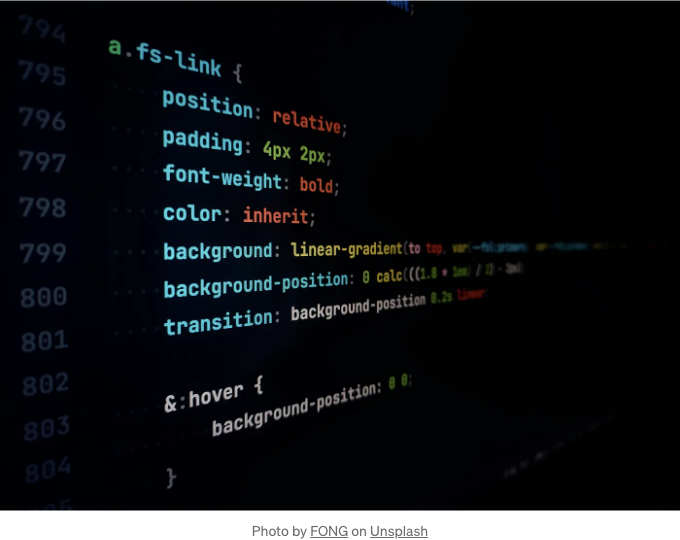

## 혼돈으로부터 질서로



여러 해 동안 CSS의 발전은 다양한 아키텍처와 방법론의 도입을 이끌어내어 코드 조직화, 유지보수 및 개발자 간의 협업을 향상시키는 데 도움이 되었습니다.

# 방법론 이전의 CSS

<!-- ui-log 수평형 -->
<ins class="adsbygoogle"
  style="display:block"
  data-ad-client="ca-pub-4877378276818686"
  data-ad-slot="9743150776"
  data-ad-format="auto"
  data-full-width-responsive="true"></ins>
<component is="script">
(adsbygoogle = window.adsbygoogle || []).push({});
</component>

웹 개발 초기에는 스타일링이 주로 HTML 파일 안에서 직접 처리되어 분산되고 유지하기 어렵게 되었습니다. 웹사이트가 더 복잡해지면서 체계적인 접근 방법에 대한 필요성이 대두되었습니다.

```js
<!DOCTYPE html>
<html lang="en">
<head>
    <meta charset="UTF-8">
    <meta name="viewport" content="width=device-width, initial-scale=1.0">
    <title>인라인 CSS 예제</title>
    
    <style>
        body {
            font-family: Arial, sans-serif;
            background-color: #f0f0f0;
            color: #333;
            margin: 0;
            padding: 20px;
        }

        h1 {
            color: #0066cc;
        }

        p {
            line-height: 1.6;
        }
    </style>
</head>
<body>

    <h1>안녕, 인라인 CSS!</h1>

    <p>이것은 HTML 파일 내에서 인라인 CSS를 사용한 예제입니다.</p>

</body>
</html>
```

# 혼돈에서 질서로

## SMACSS 소개

<!-- ui-log 수평형 -->
<ins class="adsbygoogle"
  style="display:block"
  data-ad-client="ca-pub-4877378276818686"
  data-ad-slot="9743150776"
  data-ad-format="auto"
  data-full-width-responsive="true"></ins>
<component is="script">
(adsbygoogle = window.adsbygoogle || []).push({});
</component>

SMACSS(Scalable and Modular Architecture for CSS)는 Jonathan Snook가 소개한 것으로, CSS 규칙을 base, layout, module, state 및 theme 카테고리로 분류하는 것을 강조합니다. 이 모듈식 접근 방식은 유지 보수성을 향상시키고 개발자 간의 협력을 더 원활하게 만들어줍니다.

```js
/* Base styles */
body {
 font-family: 'Arial', sans-serif;
 line-height: 1.6;
}
/* Layout styles */
.container {
 width: 80%;
 margin: 0 auto;
}
/* Module styles */
.button {
 background-color: #3498db;
 color: #fff;
 padding: 10px 15px;
}
```

## OOCSS (Object-Oriented CSS)

Nicole Sullivan이 개척한 OOCSS는 재사용 가능하고 독립적인 스타일 구성 요소를 만드는 것을 장려합니다. 이 방법론은 구조와 스킨을 분리하여 코드의 유지 보수성을 향상시킵니다.

<!-- ui-log 수평형 -->
<ins class="adsbygoogle"
  style="display:block"
  data-ad-client="ca-pub-4877378276818686"
  data-ad-slot="9743150776"
  data-ad-format="auto"
  data-full-width-responsive="true"></ins>
<component is="script">
(adsbygoogle = window.adsbygoogle || []).push({});
</component>

```js
/* Object styles */
.box {
  display: block;
  margin: 10px;
  padding: 10px;
}
/* Skin styles */
.box-primary {
  background-color: #3498db;
  color: #fff;
}
.box-secondary {
  background-color: #e74c3c;
  color: #fff;
}
```

## BEM (Block Element Modifier)

BEM은 Yandex에서 소개한 네이밍 규칙으로, 엄격한 네이밍 규칙을 통해 독립적이고 재사용 가능한 컴포넌트를 만드는 데 중점을 둡니다.

```js
/* Block component */
.header {
  background-color: #333;
  color: #fff;
}
/* Element within the block */
.header__logo {
  font-size: 1.5em;
}
/* Modifier to alter the block or element */
.header__logo-small {
  font-size: 1em;
}

/* Block component */
.btn {}

/* Element that depends upon the block */ 
.btn__price {}

/* Modifier that changes the style of the block */
.btn--orange {} 
.btn--big {}
```

<!-- ui-log 수평형 -->
<ins class="adsbygoogle"
  style="display:block"
  data-ad-client="ca-pub-4877378276818686"
  data-ad-slot="9743150776"
  data-ad-format="auto"
  data-full-width-responsive="true"></ins>
<component is="script">
(adsbygoogle = window.adsbygoogle || []).push({});
</component>

## 글로벌 변수와 함께 하는 CSS4

CSS4는 글로벌 변수를 소개하여 스타일 시트 간의 값들을 효율적으로 관리하고 재사용할 수 있는 방법을 제공합니다.

```js
:root {
   -primary-color: #3498db;
}
.button {
   background-color: var(-primary-color);
   color: #fff;
}
```

## 전처리기: 도움이 돼주는 도구

<!-- ui-log 수평형 -->
<ins class="adsbygoogle"
  style="display:block"
  data-ad-client="ca-pub-4877378276818686"
  data-ad-slot="9743150776"
  data-ad-format="auto"
  data-full-width-responsive="true"></ins>
<component is="script">
(adsbygoogle = window.adsbygoogle || []).push({});
</component>

Sass나 Less와 같은 전처리기는 변수, 믹스인, 중첩 구문과 같은 추가 기능을 제공하여 복잡한 스타일시트를 쉽게 작성할 수 있습니다.

Sass를 사용한 예시:

```js
$primary-color: #3498db;
$white: #fff
$border-radius-sm: 5px;

.button {
  background-color: $primary-color;
  color: $white;
  border-radius: $border-radius-sm;
}
```

## CSS in JS

<!-- ui-log 수평형 -->
<ins class="adsbygoogle"
  style="display:block"
  data-ad-client="ca-pub-4877378276818686"
  data-ad-slot="9743150776"
  data-ad-format="auto"
  data-full-width-responsive="true"></ins>
<component is="script">
(adsbygoogle = window.adsbygoogle || []).push({});
</component>

자바스크립트 프레임워크의 등장으로 CSS-in-JS 솔루션이 등장했고, 개발자들이 스타일을 자바스크립트 컴포넌트 안에 캡슐화할 수 있게 되었습니다.

React에서 styled-components를 사용한 예시:

```js
import styled from 'styled-components';

const Button = styled.button`
  background-color: #3498db;
  color: #fff;
  padding: 10px 15px;
`;
```

# 최상의 실천 방법과 고려 사항

<!-- ui-log 수평형 -->
<ins class="adsbygoogle"
  style="display:block"
  data-ad-client="ca-pub-4877378276818686"
  data-ad-slot="9743150776"
  data-ad-format="auto"
  data-full-width-responsive="true"></ins>
<component is="script">
(adsbygoogle = window.adsbygoogle || []).push({});
</component>

- 반응형 디자인: 다양한 기기에서 원활한 사용자 경험을 보장하기 위해 반응형 디자인을 우선시합니다.
- 최적화: CSS 파일을 최소화하고 효율적인 선택자를 사용하며 브라우저 캐싱을 활용하여 최상의 성능을 보장합니다.
- 접근성: 포용적인 웹 애플리케이션을 만들기 위해 접근성 표준을 준수합니다.
- 일관성: 향상된 협업을 위해 일관된 코딩 스타일, 네이밍 규칙 및 디렉터리 구조를 유지합니다.
- 문서화: 향후 개발자들을 지원하기 위해 코드를 문서화합니다, 특히 복잡한 아키텍처를 사용할 때.

# 결론

결론적으로, CSS의 세계는 크게 발전하였으며, 코드 조직화와 유지보수성을 향상시키는 다양한 방법론과 도구를 개발자들에게 제공합니다. 올바른 방법론을 선택하는 것은 프로젝트 요구사항과 팀의 선호도에 달려있습니다. 신뢰할 만한 표준과 최고의 실천 방법에 대해 계속해서 정보를 습득하는 것은 견고하고 확장 가능한 웹 애플리케이션을 만드는 데 중요합니다.

# 참고문헌

<!-- ui-log 수평형 -->
<ins class="adsbygoogle"
  style="display:block"
  data-ad-client="ca-pub-4877378276818686"
  data-ad-slot="9743150776"
  data-ad-format="auto"
  data-full-width-responsive="true"></ins>
<component is="script">
(adsbygoogle = window.adsbygoogle || []).push({});
</component>

- https://getbem.com/
- https://smacss.com/
- https://itcss.io/
- http://oocss.org/

의견이나 제안이 있으시면 언제든 댓글을 남겨주세요.
읽어주셔서 감사합니다.

X, Github 또는 LinkedIn에서 제 소식을 받아보실 수 있습니다.

다음에 봐요! 👋