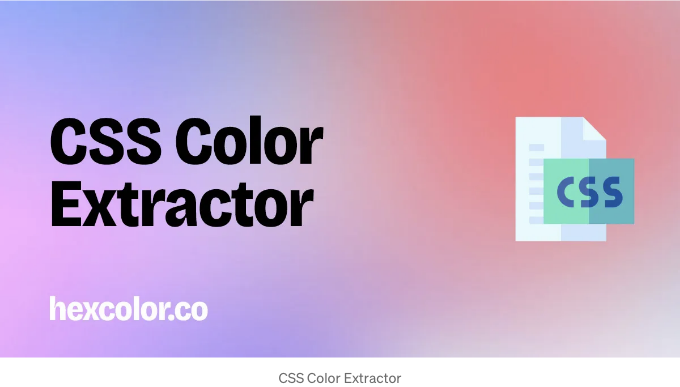

안녕하세요, 창의적인 여러분! 다음 웹 프로젝트를 위한 완벽한 색상 구성표를 찾고 계신가요? 더 이상 찾지 마세요! 오늘은 웹 디자인 세계에서 혁명을 일으키는 CSS Color Extractor 도구를 소개해 드리게 되어 정말 기쁩니다. 이 멋진 온라인 도구는 생명을 구해주는 뿐만 아니라 색상 팔레트를 꿈꾸게 만들어 줍니다!

## CSS Color Extractor의 마법을 발견해보세요

웹을 둘러보다가 마음에 드는 색상 구성표를 가진 웹사이트를 발견했다고 상상해보세요. "와, 이 색상들이 내 프로젝트에 딱 맞을 것 같아!" 하지만 정확히 그 색상들이 무엇인지 어떻게 알 수 있을까요? CSS Color Extractor가 해결책입니다.

<!-- ui-log 수평형 -->
<ins class="adsbygoogle"
  style="display:block"
  data-ad-client="ca-pub-4877378276818686"
  data-ad-slot="9743150776"
  data-ad-format="auto"
  data-full-width-responsive="true"></ins>
<component is="script">
(adsbygoogle = window.adsbygoogle || []).push({});
</component>

이 무료 온라인 도구는 디자이너와 프런트엔드 개발자에게 소중한 정보를 제공해줍니다. 이 도구는 당신이 웹사이트의 CSS 파일에서 직접 HEX, RGB, RGBA 색상 코드를 추출할 수 있도록 도와줍니다. 당신이 관심 있는 CSS 파일의 URL이 있으면, 그리고 영 차레 — 당신의 손끝에서 색상 팔레트가 나타난답니다!

## CSS 색상 추출기가 왜 바꾸는 게임체인저인가요

- 간결함과 효율성: CSS 파일을 수작업으로 건너뛰거나 컬러 피커 도구를 사용하는 시대는 지났습니다. CSS 색상 추출기를 사용하면 웹사이트에서 사용된 컬러의 포괄적인 목록을 몇 번의 클릭으로 얻을 수 있습니다.
- 브랜딩과 디자인에 완벽함: 프로젝트에 독특하고 보완적인 색상을 선택하는 것은 중요합니다. 이 도구는 반복을 피하고 디자인이 돋보이도록 도와줍니다.
- 여러 포맷: HEX, RGB 또는 RGBA를 선호하든지, CSS 색상 추출기가 다루어줄 거에요. 이 다양성은 다양한 플랫폼과 도구를 사용하는 디자이너에게는 큰 도움이 됩니다.
## 어떻게 작동하나요?

<!-- ui-log 수평형 -->
<ins class="adsbygoogle"
  style="display:block"
  data-ad-client="ca-pub-4877378276818686"
  data-ad-slot="9743150776"
  data-ad-format="auto"
  data-full-width-responsive="true"></ins>
<component is="script">
(adsbygoogle = window.adsbygoogle || []).push({});
</component>

CSS Color Extractor를 사용하는 것은 정말 쉬워요:

- https://hexcolor.co/css-color-extractor에 방문해주세요.
- 분석하고 싶은 CSS 파일의 URL을 붙여넣어주세요.
- "색상 추출" 버튼을 클릭하세요.
- 추출된 색상 팔레트를 탐색하고 디자인을 시작해보세요!

## 색상 추출 이상: 디자이너를 위한 허브

그치만, 더 많은 것이 있어요! 이 웹사이트는 단순히 색상 추출에 관한 것뿐만 아니라 디자이너와 개발자를 위한 허브입니다. 교육 자료에서의 색상 사용, 전자상거래 KPI, 홈페이지 디자인 모범 사례, 색상의 심리적인 영향에 대한 통찰을 제공합니다. 디자인 지식을 향상시킬 수 있는 종합적인 정보 제공 사이트입니다.

<!-- ui-log 수평형 -->
<ins class="adsbygoogle"
  style="display:block"
  data-ad-client="ca-pub-4877378276818686"
  data-ad-slot="9743150776"
  data-ad-format="auto"
  data-full-width-responsive="true"></ins>
<component is="script">
(adsbygoogle = window.adsbygoogle || []).push({});
</component>

## 주의사항

CSS 색상 추출기는 매우 유용하지만, 웹사이트 디자인의 저작권과 소유권을 존중해야 합니다. 이 도구를 영감을 얻거나 학습하거나 문제 해결에 사용하세요. 하지만 다른 사람의 디자인 자산을 사용할 때는 적절한 권한을 요청해야 합니다.

## 마무리하며

동적인 웹 디자인의 세계에서는 변화의 선두에 서 있는 것이 중요합니다. CSS 색상 추출기는 도구 이상의 존재입니다; 창의성을 위한 당신의 파트너입니다. 경험 많은 디자이너이든 막 시작한 이든, 이 도구를 사용하면 디자인 프로세스를 더 즐겁고 효율적으로 만들 수 있을 것입니다.

<!-- ui-log 수평형 -->
<ins class="adsbygoogle"
  style="display:block"
  data-ad-client="ca-pub-4877378276818686"
  data-ad-slot="9743150776"
  data-ad-format="auto"
  data-full-width-responsive="true"></ins>
<component is="script">
(adsbygoogle = window.adsbygoogle || []).push({});
</component>

그럼 무엇을 기다리고 있나요? CSS Color Extractor의 다채로운 세계로 빠져들어보세요. 여러분의 디자인 꿈을 이루어보세요!

✱ 당신은 우리의 무료 색상 도구를 좋아하고 사용하나요? hexcolor.co의 개발 및 호스팅 비용 지원을 도와주십시오!