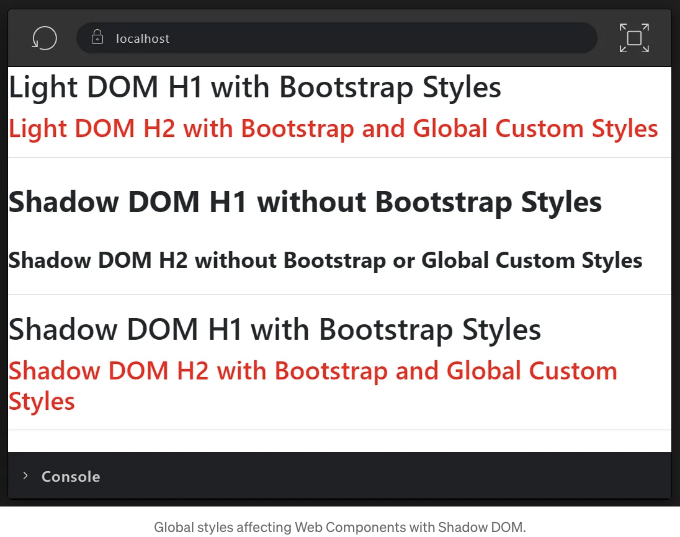
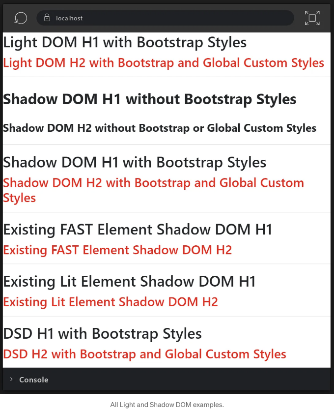

```


Web Components에 대한 가장 일반적인 오해 중 하나는 전역 CSS를 활용할 수 없다는 것입니다. 이는 사실이 아닙니다. 몇 줄의 JavaScript 만으로 전역 CSS에 반응할 수 있는 Web Component를 활성화할 수 있습니다. 이 기사에서는 이를 자체 컴포넌트에 빌드하는 방법과 기존의 FAST 및 Lit 컴포넌트를 수정하여 전역 스타일에 반응하게 하는 방법을 보여 드리겠습니다. 또한 이를 Declarative Shadow DOM (DSD)로 수행하는 방법도 살펴보겠습니다.

디자인 상 Shadow DOM은 스타일의 캡슐화를 제공합니다. 이는 셰도우 루트에 명시적으로 추가하는 스타일만이 그 표현에 영향을 미친다는 것을 의미합니다. 마찬가지로 명시적으로 노출시킨 스타일만이 외부 DOM에 영향을 줍니다. 몇 가지 표준 HTML 기능을 활용하여 글로벌 스타일을 셰도우 루트에 가져올 수 있습니다. 이 작동 방식을 알아보겠습니다...

# VanillaJS 웹 컴포넌트에서 전역 스타일 사용하기
```

<!-- ui-log 수평형 -->
<ins class="adsbygoogle"
  style="display:block"
  data-ad-client="ca-pub-4877378276818686"
  data-ad-slot="9743150776"
  data-ad-format="auto"
  data-full-width-responsive="true"></ins>
<component is="script">
(adsbygoogle = window.adsbygoogle || []).push({});
</component>

우선 글로벌 스타일과 두 개의 웹 컴포넌트를 포함하는 HTML을 살펴봅시다. 각 웹 컴포넌트에는 본문과 동일한 h1 및 h2 구조가 포함되어 있습니다.

```js
<!DOCTYPE html>
<html lang="en">
  <head>
    <meta charset="utf-8">
    <title>Global Styles in Shadow DOM</title>
    <link href="https://cdn.jsdelivr.net/npm/bootstrap@5.3.2/dist/css/bootstrap.min.css" rel="stylesheet" integrity="sha384-T3c6CoIi6uLrA9TneNEoa7RxnatzjcDSCmG1MXxSR1GAsXEV/Dwwykc2MPK8M2HN" crossorigin="anonymous">
    <style>
      h2 {
        color: red;
      }
    </style>  
  </head>
  <body>
    <h1>Light DOM H1 with Bootstrap Styles</h1>
    <h2>Light DOM H2 with Bootstrap and Global Custom Styles</h2>
    <hr>
    
    <not-using-global-styles></not-using-global-styles>
    <hr>
    
    <using-global-styles></using-global-styles>
    <hr>
  </body>
</html>
```

위의 HTML에서 Bootstrap에 대한 표준 CSS 링크와 함께 사용자 정의 스타일이 제공되어 있습니다. 페이지가 어떻게 렌더링되는지 확인해보세요.



<!-- ui-log 수평형 -->
<ins class="adsbygoogle"
  style="display:block"
  data-ad-client="ca-pub-4877378276818686"
  data-ad-slot="9743150776"
  data-ad-format="auto"
  data-full-width-responsive="true"></ins>
<component is="script">
(adsbygoogle = window.adsbygoogle || []).push({});
</component>

body에 직접 포함된 h1과 h2는 Bootstrap과 사용자 정의 스타일 둘 다 적용됩니다. 그런데 not-using-global-styles 사용자 정의 요소 내에 있는 h1과 h2는 전역 CSS를 적용받지 않습니다. 이 모든 경우가 예상대로 작동하고 있는 것입니다. 그러나 using-global-styles 내에 있는 h1과 h2는 Bootstrap과 사용자 정의 스타일 둘 다 적용받고 있습니다.

이를 어떻게 달성했을까요?

not-using-global-styles와 using-global-styles의 구현을 비교해 보면 중요한 차이점 하나를 발견할 수 있습니다.

not-using-global-styles.js

<!-- ui-log 수평형 -->
<ins class="adsbygoogle"
  style="display:block"
  data-ad-client="ca-pub-4877378276818686"
  data-ad-slot="9743150776"
  data-ad-format="auto"
  data-full-width-responsive="true"></ins>
<component is="script">
(adsbygoogle = window.adsbygoogle || []).push({});
</component>

```js
export class NotUsingGlobalStyles extends HTMLElement {
  constructor() {
    super();

    this.attachShadow({ mode: "open" }).innerHTML = `
      <h1>부트스트랩 스타일 없는 셰도우 돔 H1</h1>
      <h2>부트스트랩 또는 전역 사용자 정의 스타일 없는 셰도우 돔 H2</h2>
    `;
  }
}

customElements.define("not-using-global-styles", NotUsingGlobalStyles);
```

using-global-styles.js

```js
import { addGlobalStylesToShadowRoot } from "./global-styles.js";

export class UsingGlobalStyles extends HTMLElement {
  constructor() {
    super();

    this.attachShadow({ mode: "open" }).innerHTML = `
      <h1>부트스트랩 스타일이 있는 셰도우 돔 H1</h1>
      <h2>부트스트랩 및 전역 사용자 정의 스타일이 있는 셰도우 돔 H2</h2>
    `;

    addGlobalStylesToShadowRoot(this.shadowRoot); // 여기 주목!
  }
}

customElements.define("using-global-styles", UsingGlobalStyles);
```

이 모든 마법은 내가 작성한 단일 도우미 함수에 있습니다: addGlobalStylesToShadowRoot. 셰도우 돔에서 전역 CSS를 상속하려면 그 함수를 가져와서 셰도우 루트와 함께 호출하면 됩니다. 다음은 그 함수의 구현 방법입니다:```

<!-- ui-log 수평형 -->
<ins class="adsbygoogle"
  style="display:block"
  data-ad-client="ca-pub-4877378276818686"
  data-ad-slot="9743150776"
  data-ad-format="auto"
  data-full-width-responsive="true"></ins>
<component is="script">
(adsbygoogle = window.adsbygoogle || []).push({});
</component>

global-styles.js

```js
let globalSheets = null;

export function getGlobalStyleSheets() {
  if (globalSheets === null) {
    globalSheets = Array.from(document.styleSheets)
      .map(x => {
        const sheet = new CSSStyleSheet();
        const css = Array.from(x.cssRules).map(rule => rule.cssText).join(' ');
        sheet.replaceSync(css);
        return sheet;
      });
  }

  return globalSheets;
}

export function addGlobalStylesToShadowRoot(shadowRoot) {
  shadowRoot.adoptedStyleSheets.push(
    ...getGlobalStyleSheets()
  );
}
```

CSSStyleSheet 및 쉐도우 루트의 adoptedStyleSheets 배열을 활용하여 쉐도우 DOM에 원하는 스타일 시트를 추가할 수 있습니다. 위 코드에서는 document.styleSheets 컬렉션을 확인하고 표준 API를 사용하여 CSSStyleSheet 인스턴스를 생성하는 getGlobalStyleSheets() 함수를 작성했습니다. 이 함수는 시트를 게으르게 구성하고 캐시하여 필요할 때에만 작업이 수행되며, 모든 필요한 쉐도우 DOM에서 공유할 수 있도록 모든 시트 인스턴스를 캐시합니다.

사실, 그게 다에요. 표준 API를 사용하여 작성된 몇 줄의 자바스크립트 코드만 있으면 필요한 모든 웹 컴포넌트에서 전역 스타일을 사용할 수 있습니다.

<!-- ui-log 수평형 -->
<ins class="adsbygoogle"
  style="display:block"
  data-ad-client="ca-pub-4877378276818686"
  data-ad-slot="9743150776"
  data-ad-format="auto"
  data-full-width-responsive="true"></ins>
<component is="script">
(adsbygoogle = window.adsbygoogle || []).push({});
</component>

CSSStyleSheet, adoptedStyleSheets, Declarative Shadow DOM 및 이 블로그에서 논의된 그 밖의 Shadow DOM 및 스타일링 주제에 대해 더 알고 싶으신가요? 웹 컴포넌트 엔지니어링 과정을 확인해보세요. 팀용 그룹 요금과 PPP 가격 요청 시 사용 가능합니다.

# 제3자 웹 컴포넌트에 전역 스타일 추가하기

위의 코드는 웹 컴포넌트의 저자인 경우에는 괜찮아 보입니다. 그러나 FAST나 Lit와 같은 웹 컴포넌트 라이브러리를 사용한 다른 사람이 작성한 컴포넌트와 전역 스타일을 사용해야 하는 상황이라면 어떻게 해야 할까요? 각 인스턴스의 shadow root에 addGlobalStylesToShadowRoot() 헬퍼 함수를 사용할 수 있습니다 (전제로 shadow root가 열려 있다면). 그러나 이 방법은 매우 실용적이지 않습니다. 컴포넌트 유형의 모든 인스턴스에 대해 이를 제어하는 방법이 없을까요?

네. 각 라이브러리를 보면 그 방법을 확인할 수 있습니다.

<!-- ui-log 수평형 -->
<ins class="adsbygoogle"
  style="display:block"
  data-ad-client="ca-pub-4877378276818686"
  data-ad-slot="9743150776"
  data-ad-format="auto"
  data-full-width-responsive="true"></ins>
<component is="script">
(adsbygoogle = window.adsbygoogle || []).push({});
</component>

## 기존 FAST Element에 전역 스타일 추가하기

먼저, 전역 스타일을 사용하지 않는 FASTElement를 위한 매우 기본적인 코드를 살펴보겠습니다. 다른 팀이 작성했거나 사용 중인 오픈 소스 컴포넌트 라이브러리의 일부인 것으로 상상해보세요.

```js
import { FASTElement, FASTElementDefinition, html } from "@microsoft/fast-element";

export const template = html`
  <h1>기존 FAST Element Shadow DOM H1</h1>
  <h2>기존 FAST Element Shadow DOM H2</h2>
`;

export class ExistingFASTElement extends FASTElement {

}

export const definition = new FASTElementDefinition(ExistingFASTElement, {
  name: "existing-fast-element",
  template
});
```

FAST에서 모든 웹 컴포넌트는 구성 인스턴스 생성 시 사용되는 컴포넌트에 대한 메타데이터를 제공하는 FASTElementDefinition을 가지고 있습니다. FAST에서 구축된 타사 컴포넌트 라이브러리들은 주로 컴포넌트 등록과 분리된 이러한 정의들을 제공합니다. 따라서 정의 자체를 수정하는 약간의 코드를 사용하여 웹 컴포넌트 유형의 모든 인스턴스에 전역 스타일을 쉽게 추가할 수 있습니다. 이렇게 하면 됩니다:

<!-- ui-log 수평형 -->
<ins class="adsbygoogle"
  style="display:block"
  data-ad-client="ca-pub-4877378276818686"
  data-ad-slot="9743150776"
  data-ad-format="auto"
  data-full-width-responsive="true"></ins>
<component is="script">
(adsbygoogle = window.adsbygoogle || []).push({});
</component>

```js
import { ElementStyles } from "@microsoft/fast-element";
import { definition } from "./existing-fast-element.js";
import { getGlobalStyleSheets } from "./global-styles.js";

// FAST
definition.styles = ElementStyles.create(
  getGlobalStyleSheets(), 
  definition.styles
);

definition.define();
```

FAST는 스타일 시트를 다룰 수 있는 ElementStyles 헬퍼를 제공합니다. 우리는 앞서 정의한 global styles를 getGlobalStyleSheets()로 가져와서 컴포넌트에서 정의한 기존 스타일과 함께 전달할 수 있습니다. 그러면 그 정의와 연결된 새로운 스타일 세트가 반환되며, 이는 컴포넌트의 모든 인스턴스에서 사용될 것입니다.

## 기존 Lit Element에 글로벌 스타일 추가하기

마찬가지로, 글로벌 스타일을 사용하지 않는 LitElement에 대한 매우 기본적인 코드를 살펴볼 수 있습니다.

<!-- ui-log 수평형 -->
<ins class="adsbygoogle"
  style="display:block"
  data-ad-client="ca-pub-4877378276818686"
  data-ad-slot="9743150776"
  data-ad-format="auto"
  data-full-width-responsive="true"></ins>
<component is="script">
(adsbygoogle = window.adsbygoogle || []).push({});
</component>

```js
import { LitElement, html } from "lit";

export class ExistingLitElement extends LitElement {
  render() {
    return html`
      <h1>기존 Lit Element Shadow DOM H1</h1>
      <h2>기존 Lit Element Shadow DOM H2</h2>
    `;
  }
}
```

Lit은 클래스의 static styles 필드에서 스타일을 찾습니다. 그래서 전역 스타일을 추가하려면 그것을 변경하면 됩니다. 다음은 그 모습입니다:

```js
import { ExistingLitElement } from "./existing-lit-element.js";
import { getGlobalStyleSheets } from "./global-styles.js";

// Lit
ExistingLitElement.styles = [
  ...getGlobalStyleSheets(),
  ...(Array.isArray(ExistingLitElement.styles)
      ? ExistingLitElement.styles 
        : ExistingLitElement.styles ? [ExistingLitElement.styles] : [])
];

customElements.define("existing-lit-element", ExistingLitElement);
```

이것은 약간 더 복잡해 보입니다. 주로 3rd-party element의 기존 스타일을 처리하기 위해 더 많은 작업을 해야 하기 때문입니다. undefined, 단일 및 배열 가능성을 확인하는 조건부 논리만 필요합니다. 그러나 개념은 FAST와 동일합니다. 전역 스타일을 가져와 기존 스타일과 병합한 다음 이를 다시 styles static 필드에 할당합니다. 완료했습니다.```

<!-- ui-log 수평형 -->
<ins class="adsbygoogle"
  style="display:block"
  data-ad-client="ca-pub-4877378276818686"
  data-ad-slot="9743150776"
  data-ad-format="auto"
  data-full-width-responsive="true"></ins>
<component is="script">
(adsbygoogle = window.adsbygoogle || []).push({});
</component>

# 선언적 셰도우 DOM(DSD)에 전역 스타일 추가하기

만약 선언적 셰도우 DOM(DSD)에서 전역 스타일을 사용하고 싶다면 어떻게 해야 할까요? 이를 어떻게 달성할 수 있을까요?

그렇습니다, 동일한 도우미를 사용할 것이지만, DOM으로 스트리밍되는 동안 전역 스타일을 추가할 간단한 사용자 정의 요소로 감싸겠습니다. 작업을 수행하는 작은 요소는 다음과 같습니다:

adopt-global-styles.js

<!-- ui-log 수평형 -->
<ins class="adsbygoogle"
  style="display:block"
  data-ad-client="ca-pub-4877378276818686"
  data-ad-slot="9743150776"
  data-ad-format="auto"
  data-full-width-responsive="true"></ins>
<component is="script">
(adsbygoogle = window.adsbygoogle || []).push({});
</component>

아래는 DSD에서 이를 사용하는 방법입니다:

```js
<dsd-element>
  <template shadowrootmode="open">
    <adopt-global-styles></adopt-global-styles>
    <h1>DSD H1 with Bootstrap Styles</h1>
    <h2>DSD H2 with Bootstrap and Global Custom Styles</h2>
  </template>
</dsd-element>
```

adopt-global-styles 요소는 내부에 있는 shadow root를 얻기 위해 getRootNode()를 사용합니다. 이 경우 DSD에서 생성된 shadow root입니다. 그런 다음 전역 스타일을 해당 루트에 추가하고 작업이 완료되면 자신을 제거합니다.

<!-- ui-log 수평형 -->
<ins class="adsbygoogle"
  style="display:block"
  data-ad-client="ca-pub-4877378276818686"
  data-ad-slot="9743150776"
  data-ad-format="auto"
  data-full-width-responsive="true"></ins>
<component is="script">
(adsbygoogle = window.adsbygoogle || []).push({});
</component>



# 표준, 실험 및 도우미 라이브러리

Shadow DOM에서 글로벌 스타일을 사용하는 것이 가능하지만, 많은 사람들은 JavaScript가 필요하지 않은 내장 표준을 원합니다. 그래서 다양한 논의가 진행 중이며, 주요 시나리오와 API가 어떻게 보일지에 대해 논의하고 있습니다. 이러한 논의는 "오픈 스타일 가능한 Shadow Root"의 배너 아래에서 진행되고 있습니다. 이에 관심이 있다면, Brian Kardell의 블로그 글을 읽어보고 그의 half-light 라이브러리도 확인해보기를 적극 추천합니다.

Brian은 미래의 HTML/CSS 표준을 형성하는 데 도움이 되는 시나리오와 API에 대한 피드백을 열심히 찾고 있습니다. 여러분의 웹 컴포넌트에서 half-light를 시도하고 웹의 미래를 형성하는 데 도움을 주세요.

<!-- ui-log 수평형 -->
<ins class="adsbygoogle"
  style="display:block"
  data-ad-client="ca-pub-4877378276818686"
  data-ad-slot="9743150776"
  data-ad-format="auto"
  data-full-width-responsive="true"></ins>
<component is="script">
(adsbygoogle = window.adsbygoogle || []).push({});
</component>

# 마무리

이 기사가 그림자 DOM에서 전역 스타일을 사용할 수 없다는 믿음을 걷어내는 데 도움이 되기를 바랍니다. document.styleSheets와 adoptedStyleSheets와 상호 작용하는 매우 작은 양의 JavaScript가 종종 해결책이 될 것입니다. 간단한 도우미 기능 하나로 VanillaJS, FAST, lit, DSD에서 시나리오를 활성화할 수 있습니다. 더 고급이고 세밀하며 자동화된 기술을 위해 half-light 같은 작은 100 LOC 라이브러리를 사용할 수 있습니다. 이는 잠재적으로 새로운 HTML / CSS 표준을 위한 발판이 될 것입니다.

웹 표준에 대한 이 내용이 마음에 드셨다면, 여러분께 제 웹 구성 요소 엔지니어링 코스 구매를 고려해 보시기를 권해드립니다. 또한 이 블로그를 구독하시거나 제 YouTube 채널을 구독하시거나 트위터에서 제를 팔로우해 주시면 정말 감사하겠습니다. 여러분의 지원이 나에게 글쓰기를 계속하고 이러한 콘텐츠를 더 많은 사람들에게 전달하는 데 큰 도움이 됩니다. 감사합니다!