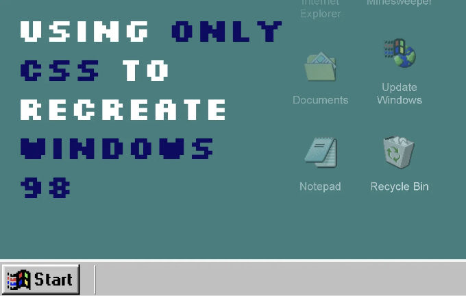
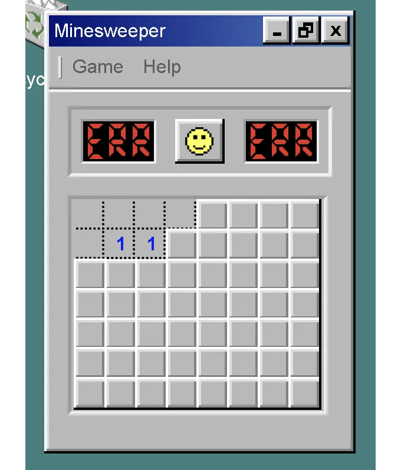

저는 CSS만 사용해서 얼마나 많은 것을 할 수 있는지 연속적으로 시도하는 일의 일환으로 (CSS만 사용한 Minecraft Chicken과 같은 다른 작업들을 참조하십시오), CSS와 HTML 이외의 다른 것을 사용하지 않고 Windows 98을 재현해 보기로 결정했습니다. 누군가 이것을 요청했나요? 정말 아니요. CSS만을 사용해서 무엇을 달성할 수 있는지 시도해 보는 것이 재미있나요? 네, 어느 정도는요. 시간이 많이 걸렸나요? 유감스럽게도 네.

여기 데모가 있습니다 — 그리고 간단한 참고 사항 — 이것은 데스크톱 Windows 재현이기 때문에 물론 데스크톱 화면에서 최적화되어 있습니다. 그러나 약간 아이러니하게도, Windows 98에서는 아마도 작동하지 않을 것이며, 이를 보려면 매우 오래된 버전의 인터넷 익스플로러를 사용해야 할 것입니다.

데모 링크는 여기에서 찾을 수 있습니다. 전체 화면 모드에서 더 잘 보입니다. 이 데모에서 멋지다고 생각한 것들 중 하나는:

<!-- ui-log 수평형 -->
<ins class="adsbygoogle"
  style="display:block"
  data-ad-client="ca-pub-4877378276818686"
  data-ad-slot="9743150776"
  data-ad-format="auto"
  data-full-width-responsive="true"></ins>
<component is="script">
(adsbygoogle = window.adsbygoogle || []).push({});
</component>

- CSS로만 구현된 맹글스위퍼 게임 — 하지만 점수 기록은 없어요.
- CSS 부모 선택자를 이용하여 로그인 및 로그아웃, 누가 로그인했는지 기억.
- 애니메이션 업데이트 과정.
- 창을 최소화, 최대화하고 닫을 수 있어요.

다만, CSS만으로 하기 어렵거나 불가능한 것들이 있습니다:

- 드래그 앤 드롭 — CSS로는 전혀 불가능합니다.
- 여러 가지 조건 — 예를 들어, 창을 동시에 최대화하고 위로 올리는 것이 어려워요.
- 아무 곳이나 클릭하여 닫기 — 닫기 버튼을 누르거나 열기 위해 시작 버튼을 클릭해야 합니다. 다른 곳을 클릭해서 닫을 수는 없어요.
- 일반적으로 여러 가지 조건 — CSS에는 AND 연산자가 딱히 없어요.

# CSS로 윈도우 98을 만드는 방법

<!-- ui-log 수평형 -->
<ins class="adsbygoogle"
  style="display:block"
  data-ad-client="ca-pub-4877378276818686"
  data-ad-slot="9743150776"
  data-ad-format="auto"
  data-full-width-responsive="true"></ins>
<component is="script">
(adsbygoogle = window.adsbygoogle || []).push({});
</component>

그래서, 이 Windows 98 버전에 대해 가장 중요하게 생각한 것은 모양과 느낌이었어요. 저는 꽤 멋진 Windows 98 아이콘들을 사용하고(다시 돌아와야 한다고 생각해요), 표준 Windows 98 컬러 스키마도 사용하고 있어요. 들여쓰기와 들여쓰지 않기 느낌을 얻기 위해 꽤 복잡한 박스 그림자를 사용했는데요, 여기서 보이는 것처럼 말이죠:

```js
.windows-box-shadow, .minesweeper .content > label {
    box-shadow: -2px -2px #e0dede, -2px 0 #e0dede, 0 -2px #e0dede, -4px -4px white, -4px 0 white, 0 -4px white, 2px 2px #818181, 0 2px #818181, 2px 0 #818181,  2px -2px #e0dede, -2px 2px #818181, -4px 2px white, -4px 4px black, 4px 4px black, 4px 0 black, 0 4px black, 2px -4px white, 4px -4px black;
}
.inverse-windows-box-shadow, .minesweeper .content > label:active {
    box-shadow: -2px -2px #818181, -2px 0 #818181, 0 -2px #818181, -4px -4px black, -4px 0 black, 0 -4px black, 2px 2px #e0dede, 0 2px #e0dede, 2px 0 #e0dede,  2px -2px #818181, -2px 2px #e0dede, -4px 2px black, -4px 4px white, 4px 4px white, 4px 0 white, 0 4px white, 2px -4px black, 4px -4px white;
}
```

나머지 부분은 모양과 느낌 측면에서는 비교적 직관적이었어요. 이 모든 것이 작동하는 열쇠는 확인란과 라디오 버튼이에요.

# CSS에서 정보 저장소로서 체크박스와 라디오 버튼 사용하기

<!-- ui-log 수평형 -->
<ins class="adsbygoogle"
  style="display:block"
  data-ad-client="ca-pub-4877378276818686"
  data-ad-slot="9743150776"
  data-ad-format="auto"
  data-full-width-responsive="true"></ins>
<component is="script">
(adsbygoogle = window.adsbygoogle || []).push({});
</component>

체크박스와 라디오 버튼은 CSS에서 정보를 저장하는 유일한 방법입니다. 이후 스타일 변경을 구현하는 데 사용할 수 있습니다. 체크박스는 선택될 때 하나의 기능을 활성화하거나 비활성화하는 데 사용될 수 있습니다 (예: 창 표시, 창 최대화 또는 지뢰 찾기 게임에서 사각형 클릭). 한 번에 하나의 옵션이 활성화될 수 있는 경우 (예: 어떤 창이 상단에 표시되어야 하는가) - 우리는 라디오 버튼을 사용할 수 있습니다. 두 가지 모두 CSS에서 동일한 구문을 따르며 :checked 선택기를 사용합니다:

```js
#windows-11:checked ~ .windows-11 .text {
    /* -- 여기에 CSS 작성 -- */
}
```

여기서 입력 #windows-11이 선택되면 해당 형제의 자식인 .text에 영향을 미치므로 사용자 정의 CSS를 적용할 수 있습니다. 중요한 점은 HTML 입력을 쉽게 스타일링할 수 없기 때문에 Windows 98의 다른 기능을 모델링하기 위해 라벨을 사용합니다. 예를 들어:

```js
<form id="windows">
    <!-- 로그인 및 종료 -->
    <input type="checkbox" id="login-screen-input" name="login-screen-input" />
    <!-- 나중에.. -->
    <label for="login-screen-input">로그오프</label>
</form>
```

<!-- ui-log 수평형 -->
<ins class="adsbygoogle"
  style="display:block"
  data-ad-client="ca-pub-4877378276818686"
  data-ad-slot="9743150776"
  data-ad-format="auto"
  data-full-width-responsive="true"></ins>
<component is="script">
(adsbygoogle = window.adsbygoogle || []).push({});
</component>

여기서 표시된 라벨은 체크박스 #login-screen-input과 연결되어 있습니다. 즉, 라벨을 클릭하면 체크박스가 선택됩니다. 이것은 사용자의 클릭을 추적하고, 체크박스의 :checked 상태를 사용하여 특정 창을 특정 형식에서 표시하는 것을 자유롭게 할 수 있는 기회를 제공합니다. 어려운 점은 하나의 입력란에 하나의 라벨만 연결할 수 있다는 것입니다.

이것은 버튼이 창을 열고 다른 모든 창 위에 배치해야 하는 시나리오에서, 창의 z-index와 열린 상태 여부를 추적해야 하기 때문에 Javascript를 사용해야 한다는 것을 의미합니다. 이는 복잡한 UI의 CSS 전용 버전을 구현하는 데 큰 장애물이 됩니다.

# Parent 선택자 사용하여 로그인 상태 추적하기

사용자가 로그인 해제할 때 디브 내에 로그인 화면이 있는 경우, 우리는 쉽게 누가 로그인했는지 추적하기 위해 형제 선택기를 사용할 수 없습니다. 여전히 :checked 상태를 사용하여 이를 추적할 수 있지만, 입력란들이 DOM에 깊숙히 있어서 그들의 부모의 형제 CSS에 영향을 미치지 못합니다. 다행히도, 이 작업에 딱 맞는 새 CSS 부모 선택자를 사용할 수 있습니다:

<!-- ui-log 수평형 -->
<ins class="adsbygoogle"
  style="display:block"
  data-ad-client="ca-pub-4877378276818686"
  data-ad-slot="9743150776"
  data-ad-format="auto"
  data-full-width-responsive="true"></ins>
<component is="script">
(adsbygoogle = window.adsbygoogle || []).push({});
</component>

```js
#login-screen요소 안에 #login-window의 .select-box 안에 #zark-muckerberg가 체크되었을 때 
#start-bar의 .zark-muckerberg에게 display: inline;과 padding-left: 0.5rem 속성을 부여합니다.
#login-screen요소 안에 #login-window의 .select-box 안에 #donald-trump가 체크되었을 때 
#start-bar의 .donald-trump에게 display: inline;과 padding-left: 0.5rem 속성을 부여합니다.
#login-screen요소 안에 #login-window의 .select-box 안에 #spiderman이 체크되었을 때 
#start-bar의 .spiderman에게 display: inline;과 padding-left: 0.5rem 속성을 부여합니다.
```
여기에서 #login-screen이 :checked div를 포함하고 있다면, 이를 사용하여 DOM 내에서 깊이 있는 체크박스에 상관없이 시작 표시줄에 사용자 이름을 표시할 수 있습니다. 이것은 정말 멋지고, CSS만 사용하여 Windows 운영 체제의 버전을 재현하려는 경우에 유용한 방법입니다.

# CSS AND Selector는 없습니다

매우 안타깝게도, 체크된 상자를 연결하여 CSS AND 선택자를 만들 방법이 없었습니다. 예를 들어, 체크된 상태를 기반으로 일부 CSS를 적용하는 상황을 고려해 보겠습니다.```

<!-- ui-log 수평형 -->
<ins class="adsbygoogle"
  style="display:block"
  data-ad-client="ca-pub-4877378276818686"
  data-ad-slot="9743150776"
  data-ad-format="auto"
  data-full-width-responsive="true"></ins>
<component is="script">
(adsbygoogle = window.adsbygoogle || []).push({});
</component>

```js
#minesweeper-box-1-1:checked ~ .content > .minesweeper-box-1-1 {
}
```

이것은 잘 작동하지만, 두 개의 연속적인 지뢰찾기 상자가 체크된 상태인지 확인한 후 CSS를 적용하려면 어떻게 해야 할까요? 논리적으로는 두 상자가 모두 체크된 경우에만 선택자가 계속되어야 한다고 생각했기 때문에 다음을 시도해 보았습니다:

```js
#minesweeper-box-1-1:checked + #minesweeper-box-2-1:checked ~ .content > .minesweeper-box-1-1 {
}
```

하지만, 불행히도 그것은 작동하지 않았습니다. 따라서 CSS에서 상태를 추적할 수 있는 방법이 있지만, 그를 기반으로 논리 명령문과 스타일을 생성하기 위해 다중 조건의 체크박스 상태를 추적하는 것은 다소 어렵습니다. 이는 실망스럽지만, Windows 98 구현에 크게 제한을 두지는 않습니다.
```

<!-- ui-log 수평형 -->
<ins class="adsbygoogle"
  style="display:block"
  data-ad-client="ca-pub-4877378276818686"
  data-ad-slot="9743150776"
  data-ad-format="auto"
  data-full-width-responsive="true"></ins>
<component is="script">
(adsbygoogle = window.adsbygoogle || []).push({});
</component>

# 윈도우 98 텍스트 달성하기

윈도우 98 텍스트에는 안티 앨리어싱이 적용되어 있지 않습니다. 안티 앨리어싱을 제거하고(최소한 일부 브라우저에서), 그 클래식하고 선명한 윈도우 98 마무리를 얻기 위해 다음 CSS를 사용했습니다:

```js
body {
    -webkit-font-smoothing: none;
    -moz-osx-font-smoothing: grayscale;
}
```

<!-- ui-log 수평형 -->
<ins class="adsbygoogle"
  style="display:block"
  data-ad-client="ca-pub-4877378276818686"
  data-ad-slot="9743150776"
  data-ad-format="auto"
  data-full-width-responsive="true"></ins>
<component is="script">
(adsbygoogle = window.adsbygoogle || []).push({});
</component>

그래서 이 프로젝트에서의 주요 작업 중 하나는 지뢰찾기를 다시 만드는 것이었습니다. 그리드를 비교적 작게 유지했는데(내 정신 건강을 유지하기 위해), 레이블로 만든 나만의 지뢰찾기 맵을 만들어야 했습니다. 각 레이블은 입력란에 매핑되어 있었는데, 이는 셀이 클릭되었는지 여부를 추적했습니다. 지뢰를 클릭하면 게임이 끝나고 보드와 상호작용할 수 없게 됩니다. 지뢰찾기 셀이 약 56개이기 때문에 약 56개의 지뢰찾기 입력이 필요했습니다. 모든 것을 CSS로 추적하는데에는 많은 CSS가 필요했지만, 전반적인 결과는 꽤 멋져 보입니다.

전체적으로, 이것은 이전에 언급한 체크박스와 라디오 트릭과 동일한 논리를 따릅니다. 개념적으로는 우리가 한 다른 것들보다 더 복잡하지 않습니다.



# 결론

<!-- ui-log 수평형 -->
<ins class="adsbygoogle"
  style="display:block"
  data-ad-client="ca-pub-4877378276818686"
  data-ad-slot="9743150776"
  data-ad-format="auto"
  data-full-width-responsive="true"></ins>
<component is="script">
(adsbygoogle = window.adsbygoogle || []).push({});
</component>

이 안내서를 즐겁게 보셨기를 바랍니다. 이 작업을 하며 웹 개발이 얼마나 어려웠는지, DOM 요소를 수동으로 많이 생성해야 했던 과거를 생각해보게 되었습니다. CSS로 무엇을 실현할 수 있는지 보는 것은 재미있는 일이에요 (단순 선택자 포함). 웹 애플리케이션을 만드는 현실적인 방법인가요? 속도 측면에서는 아직 그렇지 않고, 기능 측면에서도 아직 그렇진 않지만, CSS가 할 수 있는 것이 생각보다 더 많았고, 결과에 상당히 만족합니다.

이 내용이 마음에 드셨다면, 트위터에서 저를 팔로우해 주시기를 부탁드려요.

# 레벨 업 코딩

저희 커뮤니티의 일부가 되어 주셔서 감사합니다! 떠나시기 전에:

<!-- ui-log 수평형 -->
<ins class="adsbygoogle"
  style="display:block"
  data-ad-client="ca-pub-4877378276818686"
  data-ad-slot="9743150776"
  data-ad-format="auto"
  data-full-width-responsive="true"></ins>
<component is="script">
(adsbygoogle = window.adsbygoogle || []).push({});
</component>

- 👏 이야기에 박수를 보내고 작가를 팔로우하세요 👉
- 📰 레벨업 코딩 게시물에서 더 많은 콘텐츠를 확인하세요
- 🔔 팔로우하기: Twitter | LinkedIn | 뉴스레터

🚀👉 당신과 같은 개발자를 선도 스타트업 및 기술 회사에 배치합니다