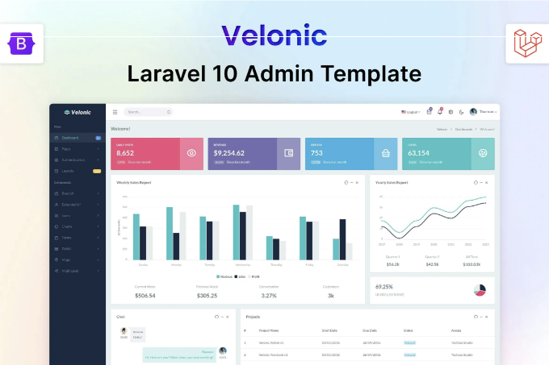
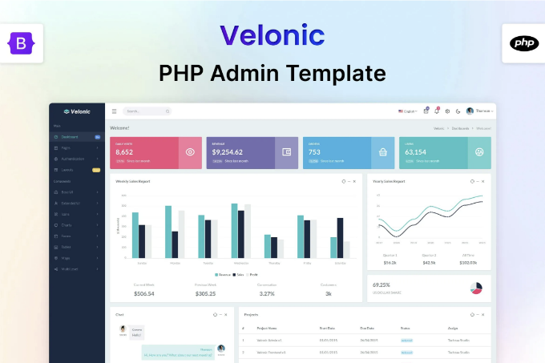
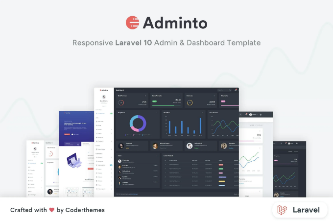
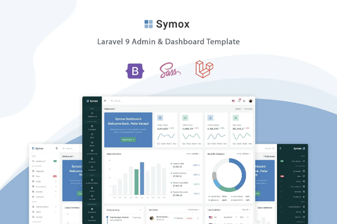
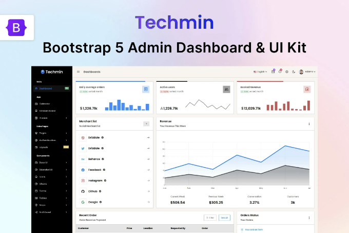
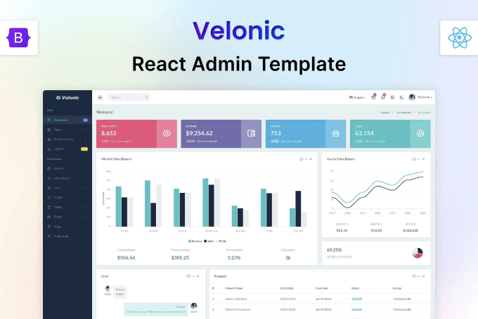
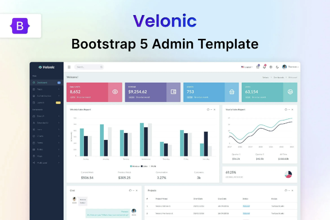

🔍 젤로닉 라라벨 관리자 대시보드 템플릿을 지금 바로 확인해보세요! 이 📁 관리자 템플릿 웹 템플릿을 탐험하고 무료 다운로드 혜택을 받아보세요. 함께 제작을 시작해봐요! 🚀

실시간 미리보기

Velonic — 라라벨 관리자 및 대시보드 템플릿은 멋진 부트스트랩 5.3.0, 현대적인 웹 기술 HTML5, SCSS 및 jQuery를 기반으로 구축된 완벽한 프리미엄 관리자 템플릿입니다. 다양한 사용 가능한 수작업 구성 요소가 많이 있습니다. 이 템플릿은 완전히 반응형이며 쉽게 사용자 정의할 수 있으며 코드도 이해하기 매우 쉽고 개발자에게 이 템플릿을 실제 웹 애플리케이션으로 전환할 수 있는 기능을 제공합니다. 또한 이 키트를 암호화폐, 라라벨, 이메일 및 곧 출시될 것과 함께 사용할 수도 있습니다.

<!-- ui-log 수평형 -->
<ins class="adsbygoogle"
  style="display:block"
  data-ad-client="ca-pub-4877378276818686"
  data-ad-slot="9743150776"
  data-ad-format="auto"
  data-full-width-responsive="true"></ins>
<component is="script">
(adsbygoogle = window.adsbygoogle || []).push({});
</component>

주요 기능:

- Bootstrap v5.3.0으로 제작
- Laravel 10 (PHP 및 Vite)와 함께 사용
- SCSS 변수를 적극 활용하여 쉬운 사용자 정의 가능
- 깔끔하고 현대적인 디자인
- 라이트 및 다크 버전 (CSS 기반)
- 모든 현대/지원 브라우저와 장치에서 완전히 반응하며 작동
- Gulp 워크플로우를 통한 쉬운 개발 및 도구 사용
- 완벽히 문서화됨
- 풍부한 양식, 유효성 검사 및 위자드
- 80개 이상의 페이지
- 400개 이상의 UI 구성 요소
- 차트 라이브러리
- RT(오른쪽에서 왼쪽), LT(왼쪽에서 오른쪽) 지원
- 오류 페이지 포함
- 세련된 가격 페이지
- 5000개 이상의 폰트 아이콘

레이아웃 기능:

- 수직, 수평
- 라이트 및 다크 모드
- 유동 및 고정 너비
- 고정 및 스크롤 가능한 위치
- 라이트 및 다크 상단바
- 기본, 콤팩트, 작은 아이콘
- 라이트 및 다크 사이드바
- LTR(왼쪽에서 오른쪽) 및 RTL(오른쪽에서 왼쪽) 지원

<!-- ui-log 수평형 -->
<ins class="adsbygoogle"
  style="display:block"
  data-ad-client="ca-pub-4877378276818686"
  data-ad-slot="9743150776"
  data-ad-format="auto"
  data-full-width-responsive="true"></ins>
<component is="script">
(adsbygoogle = window.adsbygoogle || []).push({});
</component>

페이지:

- 대시보드
- 타이포그래피
- 버튼
- 아이콘 페이지
- 패널
- 탭 및 아코디언
- 모달
- 부트스트랩-UI
- 알림
- Sweet-alert
- 그리드
- 포틀릿
- 일반 요소 양식
- 양식 유효성 검사
- 고급 양식
- 폼 위저드
- WYSIWYG 편집기
- 코드 편집기
- 다중 파일 업로드
- 이미지 잘라내기
- 기본 테이블
- 데이터 테이블
- Chartjs 차트
- Google 지도
- 벡터 맵
- 프로필
- 타임라인
- 송장
- 연락처 목록
- 로그인
- 등록
- 비밀번호 복구
- 잠금 화면
- 빈 페이지
- 404 오류
- 404 대체
- 500 오류

## 항목 태그

#html #css #부트스트랩 #php #라라벨 #전자상거래 #포트폴리오 #앱 #모바일 #관리자 #리액트 #대시보드 #뷰 #대행사 #페이지

<!-- ui-log 수평형 -->
<ins class="adsbygoogle"
  style="display:block"
  data-ad-client="ca-pub-4877378276818686"
  data-ad-slot="9743150776"
  data-ad-format="auto"
  data-full-width-responsive="true"></ins>
<component is="script">
(adsbygoogle = window.adsbygoogle || []).push({});
</component>

## 파일 유형

HTML, CSS, SASS, JS

## 상업 라이선스

추가 정보

<!-- ui-log 수평형 -->
<ins class="adsbygoogle"
  style="display:block"
  data-ad-client="ca-pub-4877378276818686"
  data-ad-slot="9743150776"
  data-ad-format="auto"
  data-full-width-responsive="true"></ins>
<component is="script">
(adsbygoogle = window.adsbygoogle || []).push({});
</component>

## 비슷한 웹 템플릿

더보기



Velonic — PHP Admin & Dashboard Template by Techzaa

<!-- ui-log 수평형 -->
<ins class="adsbygoogle"
  style="display:block"
  data-ad-client="ca-pub-4877378276818686"
  data-ad-slot="9743150776"
  data-ad-format="auto"
  data-full-width-responsive="true"></ins>
<component is="script">
(adsbygoogle = window.adsbygoogle || []).push({});
</component>




<!-- ui-log 수평형 -->
<ins class="adsbygoogle"
  style="display:block"
  data-ad-client="ca-pub-4877378276818686"
  data-ad-slot="9743150776"
  data-ad-format="auto"
  data-full-width-responsive="true"></ins>
<component is="script">
(adsbygoogle = window.adsbygoogle || []).push({});
</component>

```


Symox - Laravel 9 관리자 및 대시보드 템플릿 by themesdesign

## Techzaa의 더 많은 정보

더 보기
```

<!-- ui-log 수평형 -->
<ins class="adsbygoogle"
  style="display:block"
  data-ad-client="ca-pub-4877378276818686"
  data-ad-slot="9743150776"
  data-ad-format="auto"
  data-full-width-responsive="true"></ins>
<component is="script">
(adsbygoogle = window.adsbygoogle || []).push({});
</component>



Bootstrap 5 UI Kit & Admin Dashboard — Techmin by Techzaa



Velonic — React Admin & Dashboard Template by Techzaa

<!-- ui-log 수평형 -->
<ins class="adsbygoogle"
  style="display:block"
  data-ad-client="ca-pub-4877378276818686"
  data-ad-slot="9743150776"
  data-ad-format="auto"
  data-full-width-responsive="true"></ins>
<component is="script">
(adsbygoogle = window.adsbygoogle || []).push({});
</component>




테크자의 부트스트랩 관리자 및 대시보드 템플릿


곧 출시될 HTML Tailwind 템플릿 - 테크순 by 테크자