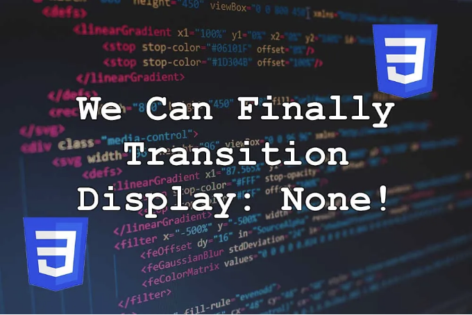

팬페어가 어디에 있었나요!? 🤯🤯

저는 w3cplus의 매우 긴, 그러나 매우 흥미로운 2023/2024 CSS에 관한 기사를 읽고 transition-behavior를 발견했습니다. CanIUse에서는 이를 65%만 지원하지만, 지지 않는 곳은 Safari와 FireFox와 같은 보편적인 가담자들입니다. 그러나 이것은 대체 수단을 구축하기가 꽤 쉬우므로 저는 점진적 향상을 위해 이를 사용하는 것에 만족합니다.

다음 CSS를 고려해 주세요:

<!-- ui-log 수평형 -->
<ins class="adsbygoogle"
  style="display:block"
  data-ad-client="ca-pub-4877378276818686"
  data-ad-slot="9743150776"
  data-ad-format="auto"
  data-full-width-responsive="true"></ins>
<component is="script">
(adsbygoogle = window.adsbygoogle || []).push({});
</component>

```css
.box {
  width: 20%;
  height: auto;
  aspect-ratio: 1/1;
  display: block;
  position: relative;
  transition: all 0.25s;
  transition-behavior: allow-discrete;
  opacity: 1;
  scale: 1;
}

.box.closed {
  display: none;
  opacity: 0;
  scale: 0;
  width: 0;
}
```

한번 .box에 .closed 클래스가 추가되면 일반적으로 순간적으로 사라집니다. 만약 transition과 함께 display: none을 사용하려 하면, 즉시 변경되어 사용자에게 다른 전환효과가 보이지 않을 것입니다.

그러나 transition-behavior: allow-discrete;를 추가함으로써, display: none은 opacity, scale, width의 전환 끝까지 지연됩니다.

스스로 확인해보세요:

<!-- ui-log 수평형 -->
<ins class="adsbygoogle"
  style="display:block"
  data-ad-client="ca-pub-4877378276818686"
  data-ad-slot="9743150776"
  data-ad-format="auto"
  data-full-width-responsive="true"></ins>
<component is="script">
(adsbygoogle = window.adsbygoogle || []).push({});
</component>

가시성: 숨김에서도 작동해요. 하지만 거의 사용하지 않아요.

요소를 숨기기 위해 JavaScript 전환 이벤트 리스너를 더 이상 사용할 필요가 없다니 정말 기쁘네요. 이것은 브라우저 지원만큼이나 엄청난 변화입니다.

w3cplus에 감사의 인사를 전합니다. 그들의 멋진 기사를 확인해보세요!