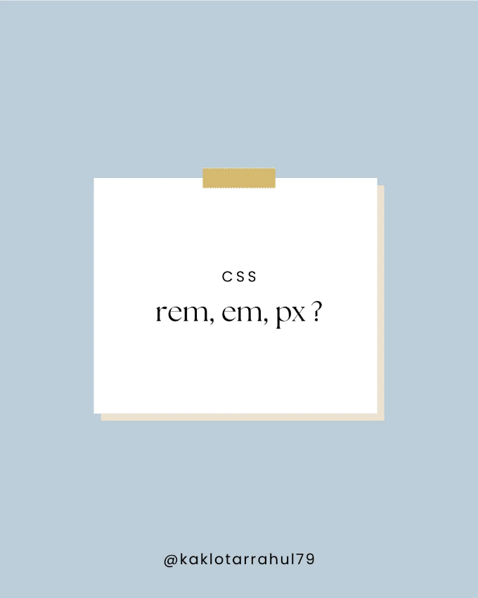

CSS에서는 크기를 조절하는 데 사용되는 세 가지 일반적인 단위가 있습니다: rem, em 및 px. 각 단위에 대한 간단한 설명을 함께 예시로 살펴보겠습니다:

- Rem (Root em): 이 단위는 루트 요소(보통 `html` 태그)에 대해 상대적이며 반응형 디자인을 만드는 데 유용합니다. 한 rem은 루트 요소의 글ꔷ씪과 동일합니다. 따라서 루트 요소의 글ꔷ씪이 16px로 설정된 경우, 1rem은 16px과 동일합니다. 예를 들어:

```js
html {
  font-size: 16px;
}

h1 {
  font-size: 2rem; /* 2 * 16px = 32px */
}
```

<!-- ui-log 수평형 -->
<ins class="adsbygoogle"
  style="display:block"
  data-ad-client="ca-pub-4877378276818686"
  data-ad-slot="9743150776"
  data-ad-format="auto"
  data-full-width-responsive="true"></ins>
<component is="script">
(adsbygoogle = window.adsbygoogle || []).push({});
</component>

2. Em: 이 단위는 부모 요소의 글꼴 크기와 관련이 있고 확장 가능한 디자인을 만드는 데 유용할 수 있습니다. 예를 들어:

```js
.parent {
  font-size: 16px;
}

.child {
  font-size: 0.8em; /* 0.8 * 16px = 12.8px */
}
```

이 예제에서 자식 요소의 글꼴 크기는 부모 요소의 글꼴 크기의 0.8배입니다.

3. Px (픽셀): 이 단위는 다른 것과 관련이 없는 절대적인 측정 단위이며 고정 크기 요소나 정확한 측정이 필요한 요소에 일반적으로 사용됩니다. 예를 들어:

<!-- ui-log 수평형 -->
<ins class="adsbygoogle"
  style="display:block"
  data-ad-client="ca-pub-4877378276818686"
  data-ad-slot="9743150776"
  data-ad-format="auto"
  data-full-width-responsive="true"></ins>
<component is="script">
(adsbygoogle = window.adsbygoogle || []).push({});
</component>

```js
.element {
  font-size: 14px;
  margin-top: 20px;
}
```

이 예시에서 요소의 글꼴 크기는 14픽셀로 설정되고 위쪽 여백은 20픽셀로 설정됩니다.

마무리로, 단위 선택은 프로젝트의 특정 요구에 따라 다릅니다. Rem은 확장 가능한 디자인을 만들 때 유용하며, em은 반응형 디자인을 만들 때 유용하며, px는 고정 크기 요소를 만들 때 유용합니다.

이 유형의 주제에 대해 더 알고 싶으시다면 저를 팔로우해주세요.