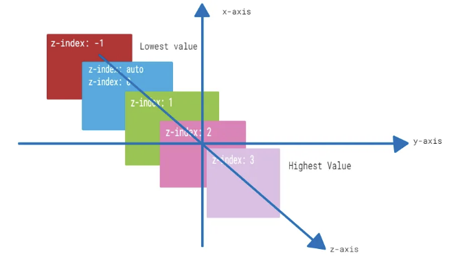

# z-index의 수수께끼 해독: 개발자를 위한 안내서



# 소개

당신도 가끔 CSS z-index가 제대로 작동하지 않는 상황에 처해본 적이 있으신가요? 만약 그렇다면, 외로운 건 아닙니다. z-index는 통제하기 어려운 속성으로, 종종 당혹과 혼란을 초래합니다. 이 안내서에서는 z-index가 예상대로 작동하지 않는 일반적인 이유를 살펴보고, 이를 해결하기 위한 실용적인 해결책을 제공할 것입니다.

<!-- ui-log 수평형 -->
<ins class="adsbygoogle"
  style="display:block"
  data-ad-client="ca-pub-4877378276818686"
  data-ad-slot="9743150776"
  data-ad-format="auto"
  data-full-width-responsive="true"></ins>
<component is="script">
(adsbygoogle = window.adsbygoogle || []).push({});
</component>

# z-index 이해하기

z-index가 작동하지 않는 이유에 대해 들어가기 전에, 먼저 z-index가 무엇인지 알고 그 작동 방식을 확실히 이해해봅시다.

z-index는 웹 페이지의 요소들의 쌓임 순서를 제어하는 CSS 속성입니다. z-index 값이 높은 요소는 z-index 값이 낮은 요소들의 앞에 표시됩니다. 기본적으로 모든 요소는 z-index 값이 auto인데, 이는 HTML 문서에 나열된 순서대로 쌓이는 것을 의미합니다.

# z-index 작동하지 않는 일반적인 이유

<!-- ui-log 수평형 -->
<ins class="adsbygoogle"
  style="display:block"
  data-ad-client="ca-pub-4877378276818686"
  data-ad-slot="9743150776"
  data-ad-format="auto"
  data-full-width-responsive="true"></ins>
<component is="script">
(adsbygoogle = window.adsbygoogle || []).push({});
</component>

## 1. 위치 지정 부족

z-index가 예상대로 작동하지 않는 일반적인 이유 중 하나는 쌓으려는 요소에 위치 지정이 없는 경우입니다. z-index가 효과를 가지려면 요소가 명시적으로(위치: relative, 위치: absolute 또는 위치: fixed) 또는 암시적으로(기본 위치 지정) 위치 지정되어 있어야 합니다.

```css
.element {
    position: relative; /* 또는 position: absolute; 또는 position: fixed; */
    z-index: 1;
}
```

## 2. 상위 스택 콘텍스트(coantext)

<!-- ui-log 수평형 -->
<ins class="adsbygoogle"
  style="display:block"
  data-ad-client="ca-pub-4877378276818686"
  data-ad-slot="9743150776"
  data-ad-format="auto"
  data-full-width-responsive="true"></ins>
<component is="script">
(adsbygoogle = window.adsbygoogle || []).push({});
</component>

다루는 또 다른 잠재적 문제는 쌓임 맥락에 대한 처리 시 발생할 수 있습니다. 문서의 각 요소는 쌓임 순서를 결정하는 쌓임 맥락에 속합니다. 요소의 부모가 낮은 z-index 값을 가지거나 위치 지정이 되어 있지 않은 경우, 각 요소의 개별적인 z-index 값과는 관계없이 해당 요소의 쌓임 순서에 영향을 줄 수 있습니다.

```js
<div class="parent">
    <div class="child"></div>
</div>

<style>
    .parent {
        z-index: 0; /* 낮은 z-index */
    }
    .child {
        position: relative;
        z-index: 1;
    }
</style>
```

이 예시에서 `.child` 요소가 더 높은 z-index를 가지고 있더라도, 이 요소의 쌓임 순서는 여전히 `.parent` 요소에 의해 영향을 받게 됩니다.

## 3. z-index 및 Flexbox/Grid

<!-- ui-log 수평형 -->
<ins class="adsbygoogle"
  style="display:block"
  data-ad-client="ca-pub-4877378276818686"
  data-ad-slot="9743150776"
  data-ad-format="auto"
  data-full-width-responsive="true"></ins>
<component is="script">
(adsbygoogle = window.adsbygoogle || []).push({});
</component>

Flexbox 또는 CSS 그리드를 사용할 때 z-index 속성이 예상대로 작동하지 않을 수 있습니다. 이는 그들이 생성하는 다른 쌓임 맥락 때문입니다. 플렉스 컨테이너나 그리드 컨테이너 내의 요소들은 그 밖의 요소들과 다르게 쌓일 수 있습니다.

```js
<div class="container">
    <div class="item item1"></div>
    <div class="item item2"></div>
</div>

<style>
    .container {
        display: flex;
    }
    .item {
        position: relative;
    }
    .item1 {
        z-index: 1;
    }
    .item2 {
        z-index: 2;
    }
</style>
```

이 예시에서 .item2가 .item1 위에 정확하게 표시되지 않을 수 있습니다. 이는 플렉스 컨테이너의 쌓임 맥락 때문입니다.

# z-index 문제 해결 방법

<!-- ui-log 수평형 -->
<ins class="adsbygoogle"
  style="display:block"
  data-ad-client="ca-pub-4877378276818686"
  data-ad-slot="9743150776"
  data-ad-format="auto"
  data-full-width-responsive="true"></ins>
<component is="script">
(adsbygoogle = window.adsbygoogle || []).push({});
</component>

## 1. 올바른 위치 지정 확인하기

z-index를 사용하여 쌓을 요소들이 적절하게 위치 지정되어 있는지 확인하세요. 명시적으로든 묵시적으로든 올바르게 배치되어야 합니다.

## 2. 쌓임 맥락 확인하기

쌓임 순서에 영향을 미칠 수 있는 부모 요소들의 쌓임 맥락을 확인하세요. 필요에 따라 z-index 값이나 위치를 조정하여 대상 요소의 쌓임 순서를 조절하세요.

<!-- ui-log 수평형 -->
<ins class="adsbygoogle"
  style="display:block"
  data-ad-client="ca-pub-4877378276818686"
  data-ad-slot="9743150776"
  data-ad-format="auto"
  data-full-width-responsive="true"></ins>
<component is="script">
(adsbygoogle = window.adsbygoogle || []).push({});
</component>

## 3. 대안 방법 고려하기

만약 z-index가 계속해서 문제를 일으킨다면 CSS Grid나 Flexbox와 같은 대안적인 레이아웃 기술을 고려해보세요. 이들은 더 예측 가능한 쌓임 행동을 제공할 수 있습니다.

# FAQ

## Q: z-index에 음수 값을 사용할 수 있나요?

<!-- ui-log 수평형 -->
<ins class="adsbygoogle"
  style="display:block"
  data-ad-client="ca-pub-4877378276818686"
  data-ad-slot="9743150776"
  data-ad-format="auto"
  data-full-width-responsive="true"></ins>
<component is="script">
(adsbygoogle = window.adsbygoogle || []).push({});
</component>

A: 네, z-index에 음수 값을 사용할 수 있어요. 음수 z-index 값을 가진 요소는 양수 값을 가진 요소 뒤에 표시돼요.

## Q: 만약 두 요소가 동일한 z-index 값을 가지면 어떻게 될까요?

A: 동일한 z-index 값의 경우, 스택 순서는 HTML 문서에서 요소의 위치에 의해 결정돼요. 문서에서 뒤에 나오는 요소가 위에 표시돼요.

## Q: 인라인 요소에도 z-index를 적용할 수 있나요?

<!-- ui-log 수평형 -->
<ins class="adsbygoogle"
  style="display:block"
  data-ad-client="ca-pub-4877378276818686"
  data-ad-slot="9743150776"
  data-ad-format="auto"
  data-full-width-responsive="true"></ins>
<component is="script">
(adsbygoogle = window.adsbygoogle || []).push({});
</component>

A: 네, 인라인 요소에 z-index를 적용할 수 있지만 요소가 위치 지정되어 있어야 효과가 있습니다.

# 결론

z-index를 이해하고 정복하는 것은 웹 페이지의 요소들의 시각적 계층 구조를 제어하는 데 중요합니다. 적절한 위치 지정을 보장하고 쌓임 맥락을 관리하며 대안적 레이아웃 기술을 고려함으로써 CSS 코드에서 z-index 문제를 효과적으로 해결할 수 있습니다. 다른 브라우저와 장치에서 철저히 테스트하여 일관된 동작을 보장하세요. 이러한 팁과 기술을 활용하여 z-index에 대한 도전에 대처하고 시각적으로 매력적인 웹 경험을 만들 수 있게 될 것입니다.