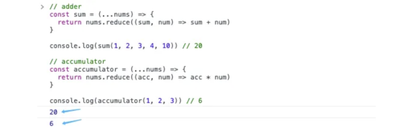
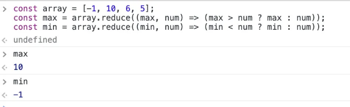
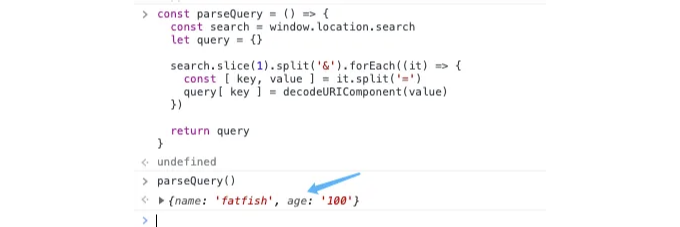
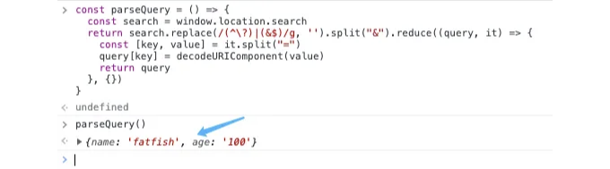
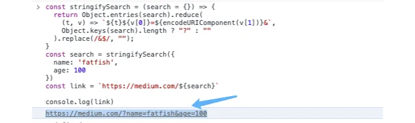
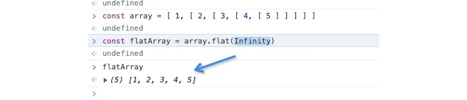
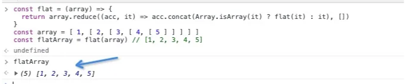
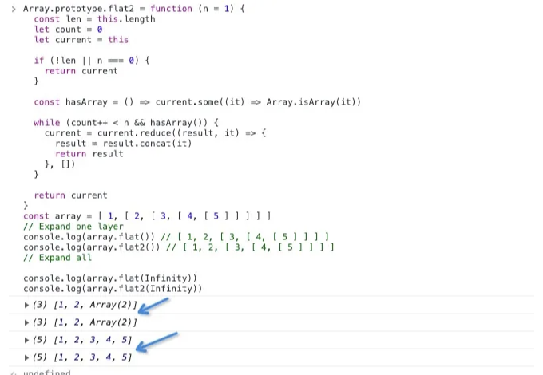
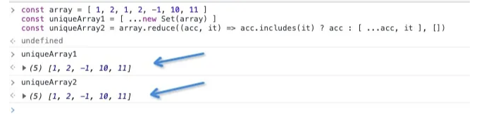
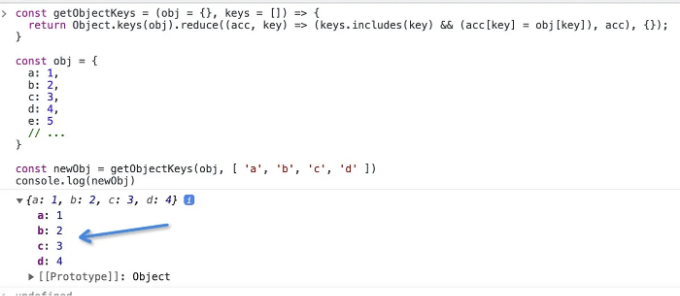

안녕 친구야! 프론트엔드 개발자로서, reduce 함수를 자주 사용하게 될 거야. 이것은 강력하고 유용한 배열 API야. 그런데 오늘은 그것에 관한 10가지 고급 팁과 트릭을 공유하고 싶어! 함께 보러 가자!

# 1. 더하기와 누산기로서의 활용

"reduce"를 사용하면 여러 숫자를 더하거나 누적하는 기능을 쉽게 구현할 수 있어.

<!-- ui-log 수평형 -->
<ins class="adsbygoogle"
  style="display:block"
  data-ad-client="ca-pub-4877378276818686"
  data-ad-slot="9743150776"
  data-ad-format="auto"
  data-full-width-responsive="true"></ins>
<component is="script">
(adsbygoogle = window.adsbygoogle || []).push({});
</component>

# 2. 배열의 최대값과 최소값 계산하기

배열에서 최대값 또는 최소값을 가져오는 방법이 몇 가지나 있을까요?

1: Math.max와 Math.min을 사용하기

<!-- ui-log 수평형 -->
<ins class="adsbygoogle"
  style="display:block"
  data-ad-client="ca-pub-4877378276818686"
  data-ad-slot="9743150776"
  data-ad-format="auto"
  data-full-width-responsive="true"></ins>
<component is="script">
(adsbygoogle = window.adsbygoogle || []).push({});
</component>

우리는 Math의 API를 사용하는 것이 가장 쉬운 방법이라고 인정해야 합니다.

2. reduce 사용

네, 단 한 줄의 코드로 Math의 API와 동일한 효과를 얻을 수 있습니다.

<!-- ui-log 수평형 -->
<ins class="adsbygoogle"
  style="display:block"
  data-ad-client="ca-pub-4877378276818686"
  data-ad-slot="9743150776"
  data-ad-format="auto"
  data-full-width-responsive="true"></ins>
<component is="script">
(adsbygoogle = window.adsbygoogle || []).push({});
</component>

# 3. 검색 매개변수 형식 지정

링크에서 검색 매개변수를 가져오는 것은 자주 다뤄야 하는 문제입니다. 어떻게 구문 분석합니까?

예를 들어

<!-- ui-log 수평형 -->
<ins class="adsbygoogle"
  style="display:block"
  data-ad-client="ca-pub-4877378276818686"
  data-ad-slot="9743150776"
  data-ad-format="auto"
  data-full-width-responsive="true"></ins>
<component is="script">
(adsbygoogle = window.adsbygoogle || []).push({});
</component>

1. 일반 방법

이것은 대부분의 사람들이 사용하는 방법입니다.

2. reduce 사용

<!-- ui-log 수평형 -->
<ins class="adsbygoogle"
  style="display:block"
  data-ad-client="ca-pub-4877378276818686"
  data-ad-slot="9743150776"
  data-ad-format="auto"
  data-full-width-responsive="true"></ins>
<component is="script">
(adsbygoogle = window.adsbygoogle || []).push({});
</component>

'Markdown' 포맷으로 변경하면 됩니다.

어떻게 작동합니까?

## 4. 검색 매개변수의 역직렬화

<!-- ui-log 수평형 -->
<ins class="adsbygoogle"
  style="display:block"
  data-ad-client="ca-pub-4877378276818686"
  data-ad-slot="9743150776"
  data-ad-format="auto"
  data-full-width-responsive="true"></ins>
<component is="script">
(adsbygoogle = window.adsbygoogle || []).push({});
</component>

링크로 이동하고 일부 검색 매개변수를 추가하려면 수동 연결 방식은 매우 불편합니다.

많은 매개변수를 연결해야 하는 경우 문제가 될 수 있습니다.

다행히도 "reduce"를 사용하면 이 문제를 쉽게 해결할 수 있습니다.

<!-- ui-log 수평형 -->
<ins class="adsbygoogle"
  style="display:block"
  data-ad-client="ca-pub-4877378276818686"
  data-ad-slot="9743150776"
  data-ad-format="auto"
  data-full-width-responsive="true"></ins>
<component is="script">
(adsbygoogle = window.adsbygoogle || []).push({});
</component>

# 5. 다중 레벨 중첩 배열을 평탄화하세요

다중 레벨 중첩 배열을 평탄화하는 방법을 알고 계신가요?

“flat”은 매우 강력한 API입니다. 자세한 내용을 보시려면 여기를 클릭해주세요.

<!-- ui-log 수평형 -->
<ins class="adsbygoogle"
  style="display:block"
  data-ad-client="ca-pub-4877378276818686"
  data-ad-slot="9743150776"
  data-ad-format="auto"
  data-full-width-responsive="true"></ins>
<component is="script">
(adsbygoogle = window.adsbygoogle || []).push({});
</component>

reduce 를 사용하여 flat 기능을 구현할 수 있어요.

## 6. flat 기능 시뮬레이션하기

깊게 중첩된 배열을 평탄화하는 함수를 구현했다면, flat 함수의 기능을 완전히 구현하는 방법은 무엇일까요?

<!-- ui-log 수평형 -->
<ins class="adsbygoogle"
  style="display:block"
  data-ad-client="ca-pub-4877378276818686"
  data-ad-slot="9743150776"
  data-ad-format="auto"
  data-full-width-responsive="true"></ins>
<component is="script">
(adsbygoogle = window.adsbygoogle || []).push({});
</component>

좋아요, 잘 했어요.

## 7. 배열 유니크 유지하기

reduce를 사용해 배열을 유니크하게 유지하는 것도 간단합니다.

<!-- ui-log 수평형 -->
<ins class="adsbygoogle"
  style="display:block"
  data-ad-client="ca-pub-4877378276818686"
  data-ad-slot="9743150776"
  data-ad-format="auto"
  data-full-width-responsive="true"></ins>
<component is="script">
(adsbygoogle = window.adsbygoogle || []).push({});
</component>

# 8. 배열 멤버의 개수 세기

배열의 각 멤버 개수를 어떻게 계산하나요?

왜 객체 대신에 Map을 사용해야 하나요?

<!-- ui-log 수평형 -->
<ins class="adsbygoogle"
  style="display:block"
  data-ad-client="ca-pub-4877378276818686"
  data-ad-slot="9743150776"
  data-ad-format="auto"
  data-full-width-responsive="true"></ins>
<component is="script">
(adsbygoogle = window.adsbygoogle || []).push({});
</component>

안녕 친구들! 

작업 중 만날 수 있는 시나리오에 대해 함께 알아보겠습니다.

reduce를 활용하여 이 문제를 해결해 보세요.

<!-- ui-log 수평형 -->
<ins class="adsbygoogle"
  style="display:block"
  data-ad-client="ca-pub-4877378276818686"
  data-ad-slot="9743150776"
  data-ad-format="auto"
  data-full-width-responsive="true"></ins>
<component is="script">
(adsbygoogle = window.adsbygoogle || []).push({});
</component>

# 10. 문자열 뒤집기

# 마지막으로

읽어 주셔서 감사합니다. 제 팔로우와 더 많은 고품질 기사 읽기를 기대하고 있어요.

<!-- ui-log 수평형 -->
<ins class="adsbygoogle"
  style="display:block"
  data-ad-client="ca-pub-4877378276818686"
  data-ad-slot="9743150776"
  data-ad-format="auto"
  data-full-width-responsive="true"></ins>
<component is="script">
(adsbygoogle = window.adsbygoogle || []).push({});
</component>

# 쉽고 이해하기 쉽게 🚀

In Plain English 커뮤니티의 일원이 되어 주셔서 감사합니다! 떠나시기 전에:

- 꼭 박수를 치고 작가를 팔로우해 주세요 👏
- 저희를 팔로우해 주세요: X | LinkedIn | YouTube | Discord | Newsletter
- 다른 플랫폼에서도 만나보세요: Stackademic | CoFeed | Venture | Cubed
- PlainEnglish.io에서 더 많은 콘텐츠를 즐기세요