몇 분 안에 JS 지식을 높이세요.

## 1. 랜덤 문자열 생성

Math.random을 사용하여 랜덤 문자열을 생성할 수 있습니다. 고유한 ID가 필요할 때 매우 편리합니다.

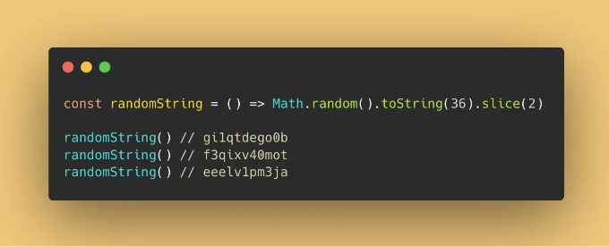

<!-- ui-log 수평형 -->
<ins class="adsbygoogle"
  style="display:block"
  data-ad-client="ca-pub-4877378276818686"
  data-ad-slot="9743150776"
  data-ad-format="auto"
  data-full-width-responsive="true"></ins>
<component is="script">
(adsbygoogle = window.adsbygoogle || []).push({});
</component>

```js
const randomString = () => Math.random().toString(36).slice(2)
```

```js
randomString() // gi1qtdego0b
randomString() // f3qixv40mot
randomString() // eeelv1pm3ja
```

# 2. HTML 특수 문자 escape하기

XSS에 대해 알고 있다면, HTML 문자열을 escape할 수 있는 해결책 중 하나입니다.

<!-- ui-log 수평형 -->
<ins class="adsbygoogle"
  style="display:block"
  data-ad-client="ca-pub-4877378276818686"
  data-ad-slot="9743150776"
  data-ad-format="auto"
  data-full-width-responsive="true"></ins>
<component is="script">
(adsbygoogle = window.adsbygoogle || []).push({});
</component>


```javascript
const escape = (str) => str.replace(/[&<>"']/g, (m) => ({ '&': '&amp;', '<': '&lt;', '>': '&gt;', '"': '&quot;', "'": '&#39;' }[m]))
```

```javascript
escape('<div class="medium">Hi Medium.</div>') 
// &lt;div class=&quot;medium&quot;&gt;Hi Medium.&lt;/div&gt
```

## 문자열 내 각 단어의 첫 글자를 대문자로 만들기

<!-- ui-log 수평형 -->
<ins class="adsbygoogle"
  style="display:block"
  data-ad-client="ca-pub-4877378276818686"
  data-ad-slot="9743150776"
  data-ad-format="auto"
  data-full-width-responsive="true"></ins>
<component is="script">
(adsbygoogle = window.adsbygoogle || []).push({});
</component>

이 방법은 문자열 내 각 단어의 첫 글자를 대문자로 변경하는 데 사용됩니다.

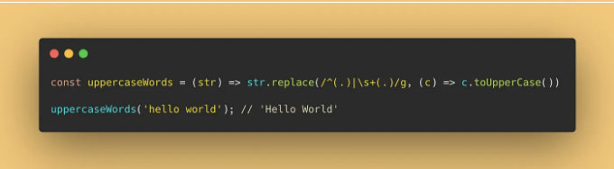

```js
const uppercaseWords = (str) => str.replace(/^(.)|\s+(.)/g, (c) => c.toUpperCase())
```

```js
uppercaseWords('hello world'); // 'Hello World'
```

<!-- ui-log 수평형 -->
<ins class="adsbygoogle"
  style="display:block"
  data-ad-client="ca-pub-4877378276818686"
  data-ad-slot="9743150776"
  data-ad-format="auto"
  data-full-width-responsive="true"></ins>
<component is="script">
(adsbygoogle = window.adsbygoogle || []).push({});
</component>

감사합니다, Christopher Strolia-Davis님. 이것이 그가 제공하는 더 쉬운 방법입니다.

```js
const uppercaseWords = (str) => str.replace(/^(.)|\s+(.)/g, (c) => c.toUpperCase())
```

### 4. 문자열을 camelCase로 변환하기

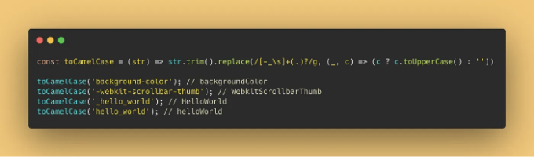

<!-- ui-log 수평형 -->
<ins class="adsbygoogle"
  style="display:block"
  data-ad-client="ca-pub-4877378276818686"
  data-ad-slot="9743150776"
  data-ad-format="auto"
  data-full-width-responsive="true"></ins>
<component is="script">
(adsbygoogle = window.adsbygoogle || []).push({});
</component>

```js
const toCamelCase = (str) => str.trim().replace(/[-_\s]+(.)?/g, (_, c) => (c ? c.toUpperCase() : ''));
```

```js
toCamelCase('background-color'); // backgroundColor
toCamelCase('-webkit-scrollbar-thumb'); // WebkitScrollbarThumb
toCamelCase('_hello_world'); // HelloWorld
toCamelCase('hello_world'); // helloWorld
```

## 5. 배열에서 중복 값을 제거하기

배열에서 중복 값을 제거하는 것은 매우 중요합니다. "Set"을 사용하면 매우 간단해집니다.

<!-- ui-log 수평형 -->
<ins class="adsbygoogle"
  style="display:block"
  data-ad-client="ca-pub-4877378276818686"
  data-ad-slot="9743150776"
  data-ad-format="auto"
  data-full-width-responsive="true"></ins>
<component is="script">
(adsbygoogle = window.adsbygoogle || []).push({});
</component>

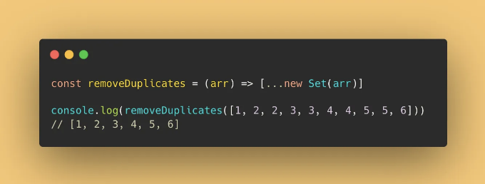

```js
const removeDuplicates = (arr) => [...new Set(arr)]
```

```js
console.log(removeDuplicates([1, 2, 2, 3, 3, 4, 4, 5, 5, 6])) 
// [1, 2, 3, 4, 5, 6]
```

# 6. 배열 평탄화하기

<!-- ui-log 수평형 -->
<ins class="adsbygoogle"
  style="display:block"
  data-ad-client="ca-pub-4877378276818686"
  data-ad-slot="9743150776"
  data-ad-format="auto"
  data-full-width-responsive="true"></ins>
<component is="script">
(adsbygoogle = window.adsbygoogle || []).push({});
</component>

인터뷰에서 자주 테스트되는 JavaScript 짧은 코드가 있습니다. 

```js
const flat = (arr) =>
    [].concat.apply(
        [],
        arr.map((a) => (Array.isArray(a) ? flat(a) : a))
    )
```

또는

```js
const flat = (arr) => arr.reduce((a, b) => (Array.isArray(b) ? [...a, ...flat(b)] : [...a, b]), [])
```

위 코드를 통해서 전문가처럼 보일 수 있습니다.

<!-- ui-log 수평형 -->
<ins class="adsbygoogle"
  style="display:block"
  data-ad-client="ca-pub-4877378276818686"
  data-ad-slot="9743150776"
  data-ad-format="auto"
  data-full-width-responsive="true"></ins>
<component is="script">
(adsbygoogle = window.adsbygoogle || []).push({});
</component>

```js
flat(['cat', ['lion', 'tiger']]) // ['cat', 'lion', 'tiger']
```

# 7. 배열에서 거짓 값 제거하기

이 방법을 사용하면 배열에서 모든 거짓 값들을 필터링할 수 있습니다.

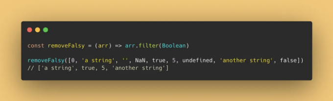

<!-- ui-log 수평형 -->
<ins class="adsbygoogle"
  style="display:block"
  data-ad-client="ca-pub-4877378276818686"
  data-ad-slot="9743150776"
  data-ad-format="auto"
  data-full-width-responsive="true"></ins>
<component is="script">
(adsbygoogle = window.adsbygoogle || []).push({});
</component>

```js
const removeFalsy = (arr) => arr.filter(Boolean)
```

```js
removeFalsy([0, 'a string', '', NaN, true, 5, undefined, 'another string', false])
// ['a string', true, 5, 'another string']
```

# 8. 숫자가 짝수인지 홀수인지 확인하기

모듈로 연산자(%)를 사용하여 간단하게 해결할 수 있는 문제입니다.

<!-- ui-log 수평형 -->
<ins class="adsbygoogle"
  style="display:block"
  data-ad-client="ca-pub-4877378276818686"
  data-ad-slot="9743150776"
  data-ad-format="auto"
  data-full-width-responsive="true"></ins>
<component is="script">
(adsbygoogle = window.adsbygoogle || []).push({});
</component>

```md
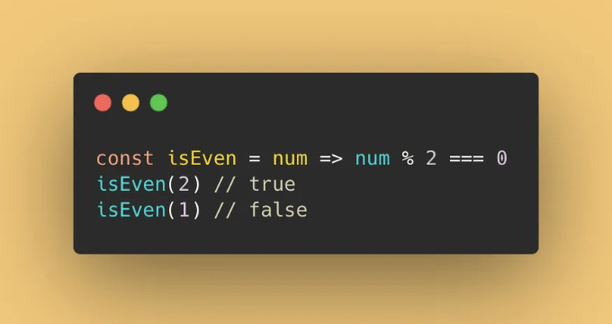

```js
const isEven = num => num % 2 === 0
```

```js
isEven(2) // true
isEven(1) // false
```

# 9. 두 숫자 사이의 랜덤 정수를 가져오기

<!-- ui-log 수평형 -->
<ins class="adsbygoogle"
  style="display:block"
  data-ad-client="ca-pub-4877378276818686"
  data-ad-slot="9743150776"
  data-ad-format="auto"
  data-full-width-responsive="true"></ins>
<component is="script">
(adsbygoogle = window.adsbygoogle || []).push({});
</component>

이 방법은 두 숫자 사이의 임의의 정수를 얻는 데 사용됩니다.

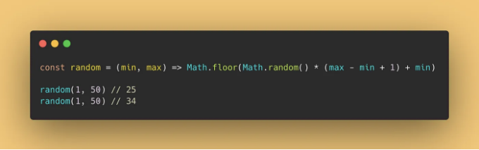

```js
const random = (min, max) => Math.floor(Math.random() * (max - min + 1) + min)
```

```js
random(1, 50) // 25
random(1, 50) // 34
```

<!-- ui-log 수평형 -->
<ins class="adsbygoogle"
  style="display:block"
  data-ad-client="ca-pub-4877378276818686"
  data-ad-slot="9743150776"
  data-ad-format="auto"
  data-full-width-responsive="true"></ins>
<component is="script">
(adsbygoogle = window.adsbygoogle || []).push({});
</component>

# 10#. 전달된 인수의 평균값을 구하기

이 함수에서 제공하는 인수의 평균값을 얻기 위해 reduce 메서드를 사용할 수 있습니다.

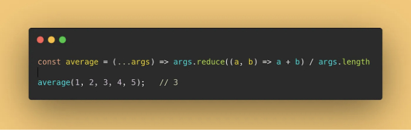

```js
const average = (...args) => args.reduce((a, b) => a + b) / args.length;
```

<!-- ui-log 수평형 -->
<ins class="adsbygoogle"
  style="display:block"
  data-ad-client="ca-pub-4877378276818686"
  data-ad-slot="9743150776"
  data-ad-format="auto"
  data-full-width-responsive="true"></ins>
<component is="script">
(adsbygoogle = window.adsbygoogle || []).push({});
</component>

```js
average(1, 2, 3, 4, 5);   // 3
```

# 11. 숫자를 고정 소수점으로 잘라내기

Math.pow() 메서드를 사용하여 함수에 제공한 특정 소수점까지 숫자를 잘라낼 수 있습니다.

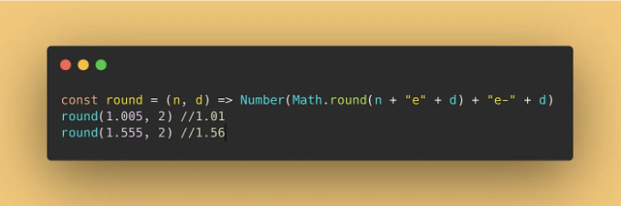

<!-- ui-log 수평형 -->
<ins class="adsbygoogle"
  style="display:block"
  data-ad-client="ca-pub-4877378276818686"
  data-ad-slot="9743150776"
  data-ad-format="auto"
  data-full-width-responsive="true"></ins>
<component is="script">
(adsbygoogle = window.adsbygoogle || []).push({});
</component>

```js
const round = (n, d) => Number(Math.round(n + "e" + d) + "e-" + d)
```

```js
round(1.005, 2) //1.01
round(1.555, 2) //1.56
```

# 12. 두 날짜 사이의 차이 일 수 계산하기

가끔은 두 날짜 사이의 일 수를 계산해야 할 때가 있습니다. 한 줄의 코드로 수행할 수 있습니다.

<!-- ui-log 수평형 -->
<ins class="adsbygoogle"
  style="display:block"
  data-ad-client="ca-pub-4877378276818686"
  data-ad-slot="9743150776"
  data-ad-format="auto"
  data-full-width-responsive="true"></ins>
<component is="script">
(adsbygoogle = window.adsbygoogle || []).push({});
</component>

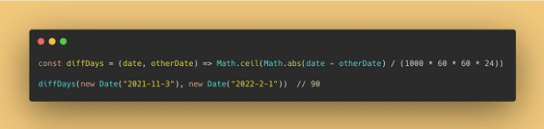

```js
const diffDays = (date, otherDate) => Math.ceil(Math.abs(date - otherDate) / (1000 * 60 * 60 * 24));
```

```js
diffDays(new Date("2021-11-3"), new Date("2022-2-1"))  // 90
```

# 13. 날짜로부터 연중의 날 수 구하기

<!-- ui-log 수평형 -->
<ins class="adsbygoogle"
  style="display:block"
  data-ad-client="ca-pub-4877378276818686"
  data-ad-slot="9743150776"
  data-ad-format="auto"
  data-full-width-responsive="true"></ins>
<component is="script">
(adsbygoogle = window.adsbygoogle || []).push({});
</component>

특정 날짜가 몇 번째 해인지 궁금하세요?

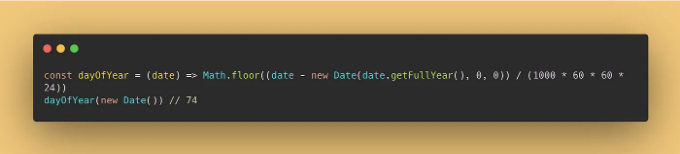

```js
const dayOfYear = (date) => Math.floor((date - new Date(date.getFullYear(), 0, 0)) / (1000 * 60 * 60 * 24))
```

```js
dayOfYear(new Date()) // 74
```

<!-- ui-log 수평형 -->
<ins class="adsbygoogle"
  style="display:block"
  data-ad-client="ca-pub-4877378276818686"
  data-ad-slot="9743150776"
  data-ad-format="auto"
  data-full-width-responsive="true"></ins>
<component is="script">
(adsbygoogle = window.adsbygoogle || []).push({});
</component>

# 14. 무작위 16진수 색상 생성하기

필요한 경우 무작위 색상 값을 생성할 수 있는 이 함수를 사용해보세요.

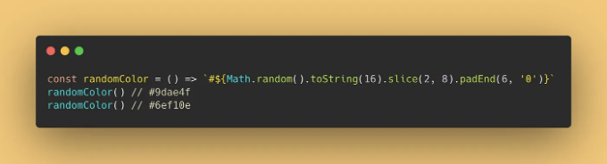

```js
const randomColor = () => `#${Math.random().toString(16).slice(2, 8).padEnd(6, '0')}`
```

<!-- ui-log 수평형 -->
<ins class="adsbygoogle"
  style="display:block"
  data-ad-client="ca-pub-4877378276818686"
  data-ad-slot="9743150776"
  data-ad-format="auto"
  data-full-width-responsive="true"></ins>
<component is="script">
(adsbygoogle = window.adsbygoogle || []).push({});
</component>

```js
randomColor() // #9dae4f
randomColor() // #6ef10e
```

# 15. RGB 색상을 16진수로 변환하기

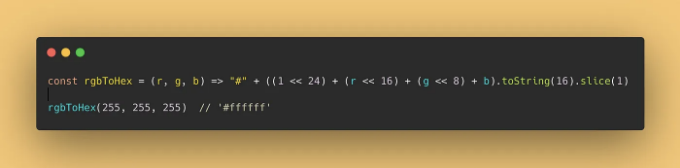

```js
const rgbToHex = (r, g, b) => "#" + ((1 << 24) + (r << 16) + (g << 8) + b).toString(16).slice(1)
```

<!-- ui-log 수평형 -->
<ins class="adsbygoogle"
  style="display:block"
  data-ad-client="ca-pub-4877378276818686"
  data-ad-slot="9743150776"
  data-ad-format="auto"
  data-full-width-responsive="true"></ins>
<component is="script">
(adsbygoogle = window.adsbygoogle || []).push({});
</component>

```js
rgbToHex(255, 255, 255)  // '#ffffff'
```

# 16. 모든 쿠키 제거하기

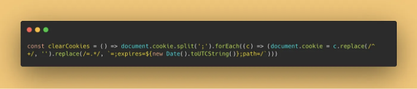

```js
const clearCookies = () => document.cookie.split(';').forEach((c) => (document.cookie = c.replace(/^ +/, '').replace(/=.*/, `=;expires=${new Date().toUTCString()};path=/`)))
```

<!-- ui-log 수평형 -->
<ins class="adsbygoogle"
  style="display:block"
  data-ad-client="ca-pub-4877378276818686"
  data-ad-slot="9743150776"
  data-ad-format="auto"
  data-full-width-responsive="true"></ins>
<component is="script">
(adsbygoogle = window.adsbygoogle || []).push({});
</component>

# 17. 다크 모드 감지

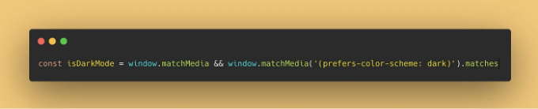

```js
const isDarkMode = window.matchMedia && window.matchMedia('(prefers-color-scheme: dark)').matches
```

# 18. 두 변수 교환

<!-- ui-log 수평형 -->
<ins class="adsbygoogle"
  style="display:block"
  data-ad-client="ca-pub-4877378276818686"
  data-ad-slot="9743150776"
  data-ad-format="auto"
  data-full-width-responsive="true"></ins>
<component is="script">
(adsbygoogle = window.adsbygoogle || []).push({});
</component>

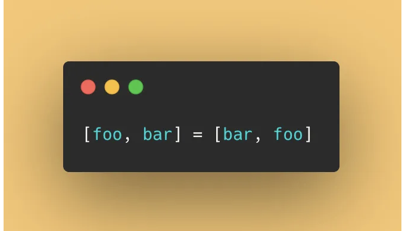

```js
[foo, bar] = [bar, foo]
```

# 19. 잠깐 멈추세요

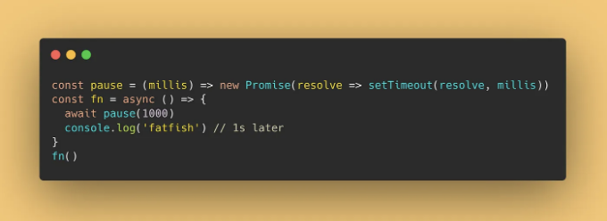

<!-- ui-log 수평형 -->
<ins class="adsbygoogle"
  style="display:block"
  data-ad-client="ca-pub-4877378276818686"
  data-ad-slot="9743150776"
  data-ad-format="auto"
  data-full-width-responsive="true"></ins>
<component is="script">
(adsbygoogle = window.adsbygoogle || []).push({});
</component>

```js
const pause = (millis) => new Promise(resolve => setTimeout(resolve, millis))
```

```js
const fn = async () => {
  await pause(1000)
```

```js
console.log('fatfish') // 1초 후
}
fn()
```

# 마지막으로

<!-- ui-log 수평형 -->
<ins class="adsbygoogle"
  style="display:block"
  data-ad-client="ca-pub-4877378276818686"
  data-ad-slot="9743150776"
  data-ad-format="auto"
  data-full-width-responsive="true"></ins>
<component is="script">
(adsbygoogle = window.adsbygoogle || []).push({});
</component>

여기 오늘 공유할 수 있는 모든 한 줄 코드 요령이 있어요. 읽어주셔서 감사합니다.

# 평문으로 🚀

In Plain English 커뮤니티의 일원이 되어 주셔서 감사합니다! 떠나기 전에:

- 글쓴이를 박수로 응원해주세요 👏
- 팔로우해주세요: X | LinkedIn | YouTube | Discord | 뉴스레터
- 다른 플랫폼 방문하기: Stackademic | CoFeed | Venture
- PlainEnglish.io에서 더 많은 콘텐츠를 만나보세요