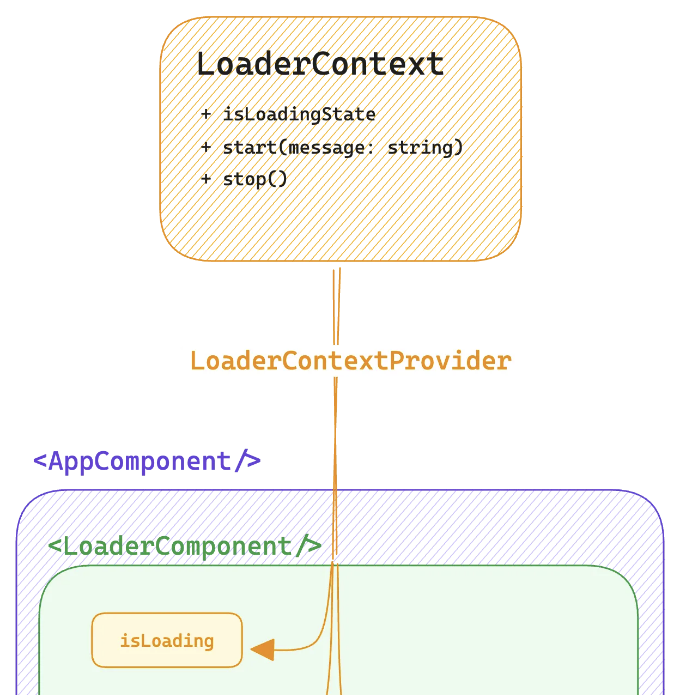
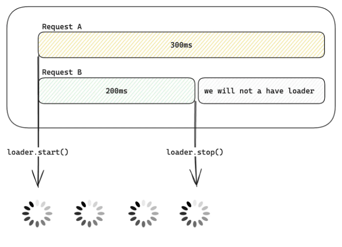
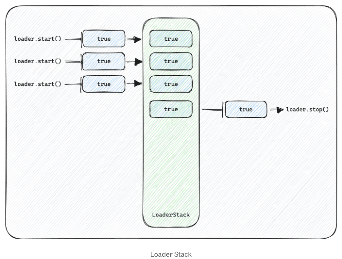

# 개요 👀

만약 당신이 전문가이고 구현에만 관심이 있다면, 이 Github 저장소에서 코드를 찾을 수 있습니다.

일단 '개발자/'로서의 자신을 잊으세요. 대신 애플리케이션의 종단 사용자 👩‍💻 이라 가정하고 UI에서 버튼을 클릭했을 때 잠시 동안 아무 일도 일어나지 않고 갑자기 화면에 새로운 요소가 팝업됐다고 생각해보세요.

<!-- ui-log 수평형 -->
<ins class="adsbygoogle"
  style="display:block"
  data-ad-client="ca-pub-4877378276818686"
  data-ad-slot="9743150776"
  data-ad-format="auto"
  data-full-width-responsive="true"></ins>
<component is="script">
(adsbygoogle = window.adsbygoogle || []).push({});
</component>

몇 초 동안 머리를 조금 굴려볼 필요가 있을 거에요 🧠 어떤 일이 일어났는지 알아내기 위해서! 아래 이미지를 보세요👇


## 여기에는 새로운 것이 없네요 🤗

<!-- ui-log 수평형 -->
<ins class="adsbygoogle"
  style="display:block"
  data-ad-client="ca-pub-4877378276818686"
  data-ad-slot="9743150776"
  data-ad-format="auto"
  data-full-width-responsive="true"></ins>
<component is="script">
(adsbygoogle = window.adsbygoogle || []).push({});
</component>

# React에서는 컴포넌트에서 여러 개의 대기 상태 UI를 구현할 때, 일반적으로 이👇 (useState)의 혼란스러운 뭉치가 있습니다

```js
import { useState } from 'react'

export const SomeComponent = () => {
  const [isCarsLoading, setIsCarsLoading] = useState(false)
  const [isEngineLoading, setIsEngineLoading] = useState(false)
  
  const fetchCars = () => {
    try {
      setIsCarsLoading(true)
      ...
    } catch (error) {
      ...
    } finally {
      setIsCarsLoading(false)      
    }
  }
  
  const fetchEngineByCarModel = (carModel: string) => {
    try {
      setIsEngineLoading(true)
      ...
    } catch (error) {
      ...
    } finally {
      setIsEngineLoading(false)      
    }
  }
```

## 컴포넌트 트리의 어디에서나 Loader를 시작/중지하는 기능이 있으면 멋질 것 같아요 ✨ 그리고 일반적인 로더가 표시됩니다.

그래서 우리의 일반적인 글로벌 로더 아키텍처 구현은 이렇게 보일 거에요👇

<!-- ui-log 수평형 -->
<ins class="adsbygoogle"
  style="display:block"
  data-ad-client="ca-pub-4877378276818686"
  data-ad-slot="9743150776"
  data-ad-format="auto"
  data-full-width-responsive="true"></ins>
<component is="script">
(adsbygoogle = window.adsbygoogle || []).push({});
</component>



# 이걸 코드로 만들어봅시다 </>

```js
//LoaderProvider.ts

export type LoaderContextProps = {
  isLoading: boolean
  start: () => void
  stop: () => void
}

export const LoaderContext = createContext<LoaderContextProps>({} as LoaderContextProps)
```

```js
//LoaderProvider.ts

export const LoaderProvider = ({ children }: { children: ReactNode }) => {
  const [isLoading, setIsLoading] = useState(false)
  const [loaderText, setLoaderText] = useState('')

  const start = (loaderText = 'Loader...') => {
    setLoaderText(loaderText)
    setIsLoading(true)
  }

  const stop = () => setIsLoading(false)

  return (
    <LoaderContext.Provider
      value={{
        isLoading,
        start,
        stop,
        loaderText
      }}
    >
      {children}
    </LoaderContext.Provider>
  )
}
``` 

<!-- ui-log 수평형 -->
<ins class="adsbygoogle"
  style="display:block"
  data-ad-client="ca-pub-4877378276818686"
  data-ad-slot="9743150776"
  data-ad-format="auto"
  data-full-width-responsive="true"></ins>
<component is="script">
(adsbygoogle = window.adsbygoogle || []).push({});
</component>

이 문맥에서 제공된 정보는 다음과 같습니다:

- isLoading → (로딩 상태를 트리거하는 상태입니다)
- start → (로더 텍스트를 선택적으로 사용하는 함수이며 setIsLoading을 true로 설정합니다)
- stop → (setIsLoading을 true로 설정하는 함수입니다)
- loaderText → (로더 텍스트를 저장하는 상태입니다)

```js
//LoaderProvider.ts

export const useLoader = () => {
  const loaderContext = useContext(LoaderContext)

  if (!loaderContext) {
    throw new Error('LoaderProvider의 컨텍스트 내에서 useLoader를 사용해주세요')
  }

  return {
    start: loaderContext.start,
    stop: loaderContext.stop
  }
}
```

```js
//Loader.tsx

import { useContext } from 'react'
import { LoaderContext } from '@/stores/LoaderProvider.tsx'
export const Loader = () => {
  const { isLoading, loaderText } = useContext(LoaderContext)
  return (
    <>
      {isLoading ? (
        <div className="h-full w-full fixed top-0 left-0 bg-black/20 z-[99999]">
          <div className="fixed top-1/2 -translate-x-1/2 left-1/2 -translate-y-1/2 flex flex-col items-center gap-4">
            <span className="loading loading-spinner loading-lg text-primary" />
            <span className="text">{loaderText}</span>
          </div>
        </div>
      ) : null}
    </>
  )
}
```

<!-- ui-log 수평형 -->
<ins class="adsbygoogle"
  style="display:block"
  data-ad-client="ca-pub-4877378276818686"
  data-ad-slot="9743150776"
  data-ad-format="auto"
  data-full-width-responsive="true"></ins>
<component is="script">
(adsbygoogle = window.adsbygoogle || []).push({});
</component>

```js
// Employees.tsx

import { useLoader } from '@/stores/LoaderProvider.tsx'
import { useEffect, useState } from 'react'
import { Employee } from '@/constants/employees.ts'
import { fetchEmployees } from '@/apis/employees.ts'

export const EmployeesList = () => {
  const [employees, setEmployees] = useState<Array<Employee>>([])
  const loader = useLoader()
  const getEmployees = async () => {
    try {
      loader.start()
      const employees = await fetchEmployees()
      setEmployees(employees)
    } catch (e) {
      alert('직원 목록을 불러올 수 없습니다!')
    } finally {
      loader.stop()
    }
  }
  useEffect(() => {
    void getEmployees()
  }, [])
  if (!employees?.length) {
    return <></>
  }
  return (
    <>
      <h1 className="text-3xl font-bold mb-4">Employees</h1>
      <button className="btn btn-primary btn-sm" onClick={getEmployees}>
        다시 불러오기
      </button>
      <div className="overflow-x-auto mt-8">
        <table className="table w-full">
          <thead>
            <tr>
              <th></th>
              <th>이름</th>
              <th>이메일</th>
              <th>전화번호</th>
            </tr>
          </thead>
          <tbody>
            {employees.map((employee, index) => (
              <tr key={employee.id}>
                <th>{index + 1}</th>
                <td>{employee.name}</td>
                <td>{employee.email}</td>
                <td>{employee.phone}</td>
              </tr>
            ))}
          </tbody>
        </table>
      </div>
    </>
  )
}
```

## 와-라 🌟, 이제 어디에서든 로더 상태를 가지고 와서 컴포넌트에 추가로 로딩 상태를 필요로 하지 않아도 됩니다


## 하지만 이 구현에 문제가 있습니다 😢```

<!-- ui-log 수평형 -->
<ins class="adsbygoogle"
  style="display:block"
  data-ad-client="ca-pub-4877378276818686"
  data-ad-slot="9743150776"
  data-ad-format="auto"
  data-full-width-responsive="true"></ins>
<component is="script">
(adsbygoogle = window.adsbygoogle || []).push({});
</component>

컨텍스트에는 단일 로딩 상태가 있습니다. 여러 컴포넌트가 이 로더 텍스트를 토글할 것입니다.

requestA라는 요청은 실행에 300ms가 소요되고,
동시에 requestB라는 다른 요청은 실행에 200ms가 소요됩니다.

두 요청이 모두 실행을 시작할 때 loader.start()를 호출하면 로더는 동시에 시작되지만,
requestB의 실행이 끝나는 시점에 로더도 중지됩니다. 이때 requestA는 아직 실행 중인 상태입니다.

따라서 requestA의 실행 시간 동안 스피너가 계속 표시되지 않을 것입니다.

<!-- ui-log 수평형 -->
<ins class="adsbygoogle"
  style="display:block"
  data-ad-client="ca-pub-4877378276818686"
  data-ad-slot="9743150776"
  data-ad-format="auto"
  data-full-width-responsive="true"></ins>
<component is="script">
(adsbygoogle = window.adsbygoogle || []).push({});
</component>



## 솔루션 🌟

로더 스택을 소개할 거에요. loader.start()는 스택에 값을 삽입하고, loader.stop()은 스택에서 값을 삭제할 거에요.

- 따라서 스택이 비어있지 않다면 isLoading의 값은 true가 될 거에요.
- 그리고 스택이 비어있다면 isLoading의 값은 false가 될 거에요.

<!-- ui-log 수평형 -->
<ins class="adsbygoogle"
  style="display:block"
  data-ad-client="ca-pub-4877378276818686"
  data-ad-slot="9743150776"
  data-ad-format="auto"
  data-full-width-responsive="true"></ins>
<component is="script">
(adsbygoogle = window.adsbygoogle || []).push({});
</component>



이제 ContextProvider에서 구현을 변경해 봅시다.

```js
// LoaderProvider.ts

import { createContext, ReactNode, useContext, useEffect, useState } from 'react'

export type LoaderContextProps = {
  isLoading: boolean
  loaderText: string
  start: (loaderText?: string) => void
  stop: () => void
}

export const LoaderContext = createContext<LoaderContextProps>({} as LoaderContextProps)

export const LoaderProvider = ({ children }: { children: ReactNode }) => {
  const [isLoading, setIsLoading] = useState(false)
  const [loaderText, setLoaderText] = useState('')
  const [loaderStack, setLoaderStack] = useState<Array<boolean>>([])

  const start = (loaderText = 'Loader...') => {
    setLoaderText(loaderText)
    setLoaderStack([...loaderStack, true])
  }

  const stop = () => setLoaderStack([...loaderStack.slice(1)])

  useEffect(() => {
    if (!loaderStack.length) {
      setIsLoading(false)
      return
    }
    setIsLoading(true)
  }, [loaderStack, start, stop])

  return (
    <LoaderContext.Provider
      value={{
        isLoading,
        start,
        stop,
        loaderText
      }}
    >
      {children}
    </LoaderContext.Provider>
  )
}

export const useLoader = () => {
  const loaderContext = useContext(LoaderContext)

  if (!loaderContext) {
    throw new Error('LoaderProvider 컨텍스트 내에서 useLoader를 사용해주세요.')
  }

  return {
    start: loaderContext.start,
    stop: loaderContext.stop
  }
}
```

# 마무리

<!-- ui-log 수평형 -->
<ins class="adsbygoogle"
  style="display:block"
  data-ad-client="ca-pub-4877378276818686"
  data-ad-slot="9743150776"
  data-ad-format="auto"
  data-full-width-responsive="true"></ins>
<component is="script">
(adsbygoogle = window.adsbygoogle || []).push({});
</component>

웹 개발자들의 꿈은 확장 가능하고 사용하기 쉬운 컴포넌트를 만드는 것입니다. 여러분의 프로젝트에서 자유롭게 사용하고 조정해보세요. 행복한 코딩을 기억해주세요, React 개발자 여러분! 😎✨

# 피드백 ✉️

만약 이에 대한 제안이 있으시다면 알려주세요. 이 저장소에서 포크하여 자유롭게 변경하셔도 됩니다.