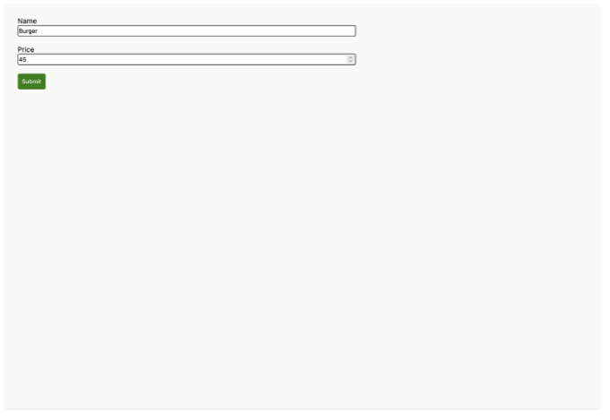

안녕하세요! Django와 Nextjs는 백엔드와 프론트엔드 개발을 위한 가장 많이 사용되는 웹 프레임워크 중 하나입니다. Django는 강력한 기능, 보안, 그리고 유연성을 갖추고 있어 어떤 개발자든 간단하면서도 복잡한 애플리케이션을 빠르게 구축할 수 있습니다. 반면에 Nextjs는 React를 사용하여 반응형 프론트엔드를 개발할 때 선호되는 프레임워크입니다.

Python 기반의 Django는 "배터리 포함" 접근법으로 유명합니다. 이를 통해 백엔드 개발을 간소화하여 개발자들이 휠을 재창조할 필요 없이 애플리케이션 작성에 더 많은 초점을 맞출 수 있습니다. 한편, Next.js는 빠른 로드 시간과 SEO를 위한 서버사이드 렌더링과 같은 기능을 제공하여 React 기반 프론트엔드를 향상시킵니다. 두 프레임워크는 풀스택 개발을 위한 강력한 이중체를 형성합니다.

이 기사에서는 Django를 백엔드로 사용하여 REST API를 구축하고, 그 데이터를 사용하여 Nextjs를 통해 멋지고 간단한 프론트엔드를 만드는 방법을 배우겠습니다.

<!-- ui-log 수평형 -->
<ins class="adsbygoogle"
  style="display:block"
  data-ad-client="ca-pub-4877378276818686"
  data-ad-slot="9743150776"
  data-ad-format="auto"
  data-full-width-responsive="true"></ins>
<component is="script">
(adsbygoogle = window.adsbygoogle || []).push({});
</component>

이 어플리케이션은 레스토랑 메뉴를 관리하는 간단한 CRUD 앱입니다. 프론트엔드에서 사용자는 다음을 할 수 있어야 합니다:

- 모든 메뉴 나열
- 메뉴 조회
- 메뉴 생성
- 메뉴 업데이트
- 메뉴 삭제

이 글의 끝에, 장고 애플리케이션과 Nextjs로 구축된 프론트엔드 애플리케이션을 연결하는 방법을 이해하게 될 것입니다.

## 설정

<!-- ui-log 수평형 -->
<ins class="adsbygoogle"
  style="display:block"
  data-ad-client="ca-pub-4877378276818686"
  data-ad-slot="9743150776"
  data-ad-format="auto"
  data-full-width-responsive="true"></ins>
<component is="script">
(adsbygoogle = window.adsbygoogle || []).push({});
</component>

시작하기 전에 필요한 도구와 기술로 프로젝트를 설정해 봅시다. 백엔드에서는 Python 3.11과 Django 4.2를 사용할 예정입니다. 최신 버전을 사용함으로써 백엔드가 원할하게 운영되고 안전하게 유지될 수 있습니다.

프론트엔드에서는 Next.js 13과 Node 19를 사용할 것입니다.

스타일링에는 Tailwind CSS를 사용할 것입니다.

## Django API 구축하기

<!-- ui-log 수평형 -->
<ins class="adsbygoogle"
  style="display:block"
  data-ad-client="ca-pub-4877378276818686"
  data-ad-slot="9743150776"
  data-ad-format="auto"
  data-full-width-responsive="true"></ins>
<component is="script">
(adsbygoogle = window.adsbygoogle || []).push({});
</component>

장고만을 사용해서 안정적인 API를 만드는 것은 상당히 어렵습니다. 애플리케이션의 뷰 함수나 클래스에서 JSON 데이터를 반환할 수는 있지만 권한, 인증, 파싱, 쓰로틀링, 데이터 직렬화 등을 어떻게 처리해야 할지는 고민이 됩니다.

이때 Django REST framework가 나타납니다. Django의 아키텍처를 기반으로 개발된 이 프레임워크는 개발자들이 강력하고 안정적인 REST API를 구축하는 데 도움을 줍니다.

망설이지 말고, Django 애플리케이션을 만들어 봅시다.

## 애플리케이션 만들기

<!-- ui-log 수평형 -->
<ins class="adsbygoogle"
  style="display:block"
  data-ad-client="ca-pub-4877378276818686"
  data-ad-slot="9743150776"
  data-ad-format="auto"
  data-full-width-responsive="true"></ins>
<component is="script">
(adsbygoogle = window.adsbygoogle || []).push({});
</component>

Python 3.11이 설치되어 있는지 확인해주세요. 기계의 터미널에서 다음 명령어를 실행하여 작업 디렉토리, 가상 환경, 그리고 프로젝트를 생성해보세요.

```js
mkdir menu-api && cd menu-api
python3.11 -m venv venv

source venv/bin/activate

pip install django djangorestframework

django-admin startproject RestaurantCore .
```

위 코드를 통해 새로운 Django 프로젝트인 RestaurantCore가 생성되었습니다. 현재 작업 디렉토리에 새 디렉토리와 파일이 생긴 것을 확인할 수 있을 거에요.

RestaurantCore에는 다음과 같은 파일이 포함되어 있습니다:

<!-- ui-log 수평형 -->
<ins class="adsbygoogle"
  style="display:block"
  data-ad-client="ca-pub-4877378276818686"
  data-ad-slot="9743150776"
  data-ad-format="auto"
  data-full-width-responsive="true"></ins>
<component is="script">
(adsbygoogle = window.adsbygoogle || []).push({});
</component>

- Django 프로젝트의 모든 설정을 포함하는 settings.py입니다. 여기에는 Django rest-framework 패키지 및 기타 패키지에 대한 구성을 추가할 것입니다.
- 프로젝트의 모든 URL을 포함하는 urls.py입니다.
- Django 애플리케이션을 개발 모드로 실행하고 배포하는 데 유용한 wsgi입니다.

관리자가 메뉴 객체에서 CRUD 작업을 수행할 수 있도록 하려면, 요청을 처리하고 데이터를 직렬화 또는 역직렬화하며 마지막으로 데이터베이스에 저장하기 위한 필요한 로직이 모두 포함된 애플리케이션을 추가해야 합니다.

우리는 MVT 아키텍처(모델 - 뷰 - 템플릿)를 재사용하고 있지만, 뷰 및 템플릿 레이어를 시리얼라이저 및 뷰셋으로 대체하고 있습니다.

그러니 애플리케이션 추가부터 시작해봅시다.

<!-- ui-log 수평형 -->
<ins class="adsbygoogle"
  style="display:block"
  data-ad-client="ca-pub-4877378276818686"
  data-ad-slot="9743150776"
  data-ad-format="auto"
  data-full-width-responsive="true"></ins>
<component is="script">
(adsbygoogle = window.adsbygoogle || []).push({});
</component>

## 메뉴 애플리케이션 추가하기

현재 작업 디렉토리에서 다음 명령어를 입력하여 새 Django 애플리케이션을 만듭니다.

```js
django-admin startapp menu
```

이 명령어를 실행한 후에 다음 이미지와 같은 디렉토리 구조를 가지고 있는지 확인하세요 :

<!-- ui-log 수평형 -->
<ins class="adsbygoogle"
  style="display:block"
  data-ad-client="ca-pub-4877378276818686"
  data-ad-slot="9743150776"
  data-ad-format="auto"
  data-full-width-responsive="true"></ins>
<component is="script">
(adsbygoogle = window.adsbygoogle || []).push({});
</component>


Django 애플리케이션을 생성한 후, Django 프로젝트의 settings.py 파일에서 INSTALLED_APPS에 새로 생성된 애플리케이션을 등록해야 합니다. 또한 rest-framework 패키지에서 실제로 작동하도록 rest_framework 애플리케이션을 등록해야 합니다.

```js
# RestaurantCore/settings.py
...
INSTALLED_APPS = [
    "django.contrib.admin",
    "django.contrib.auth",
    "django.contrib.contenttypes",
    "django.contrib.sessions",
    "django.contrib.messages",
    "django.contrib.staticfiles",

    #third apps
    "rest_framework",

    # installed apps

    "menu"
]
```

INSTALLED_APPS 목록에 애플리케이션이 추가되었으므로 이제 menu Django 애플리케이션 로직 작성을 시작할 수 있습니다.

<!-- ui-log 수평형 -->
<ins class="adsbygoogle"
  style="display:block"
  data-ad-client="ca-pub-4877378276818686"
  data-ad-slot="9743150776"
  data-ad-format="auto"
  data-full-width-responsive="true"></ins>
<component is="script">
(adsbygoogle = window.adsbygoogle || []).push({});
</component>

models.py 파일부터 시작해보겠습니다. 대부분의 경우, 이 파일에는 데이터베이스 테이블을 나타내는 모델이 포함되어 있습니다. Django ORM을 사용하면 SQL을 한 줄도 작성할 필요가 없이 테이블을 생성하고 필드를 추가할 수 있습니다.

```python
# menu/models.py

from django.db import models

class Menu(models.Model):
    name = models.CharField(max_length=255)
    price = models.FloatField()
    created = models.DateTimeField(auto_now_add=True)
    updated = models.DateTimeField(auto_now=True)
```

Menu 모델은 다음과 같은 필드를 가지고 있습니다:

- 메뉴 이름을 나타내는 name
- 가격을 나타내는 price
- 객체 생성 날짜를 나타내는 created. auto_now_add가 True로 설정되어 있으면 데이터가 자동으로 추가됩니다.
- 마지막으로 객체의 수정 또는 업데이트 날짜를 나타내는 updated. 객체를 저장할 때마다 auto_now를 사용하면 날짜가 업데이트됩니다.

<!-- ui-log 수평형 -->
<ins class="adsbygoogle"
  style="display:block"
  data-ad-client="ca-pub-4877378276818686"
  data-ad-slot="9743150776"
  data-ad-format="auto"
  data-full-width-responsive="true"></ins>
<component is="script">
(adsbygoogle = window.adsbygoogle || []).push({});
</component>

다음 단계는 직렬화기(serializer)를 추가하는 것입니다. 이 것은 Django가 JSON 데이터를 Python 네이티브 객체로 매끄럽게 변환하여 더 쉽게 처리할 수 있도록 도와줍니다.

메뉴 애플리케이션의 serializers.py 파일에 다음 내용을 추가하세요.

```js
from rest_framework import serializers

from menu.models import Menu


class MenuSerializer(serializers.ModelSerializer):

    class Meta:
        model = Menu
        fields = ['name', 'price', 'created', 'updated', 'id']
        read_only_fields = ['created', 'updated', 'id']
```

위 줄들에서 우리는 ModelSerializer 클래스를 사용하여 직렬화기를 만드는 중입니다. ModelSerializer 클래스는 쿼리셋과 필드 유효성 검사를 다루기 위해 모델에 대한 직렬화기를 추가하는 바로 가기 역할을 합니다. 따라서 우리의 유효성 검증 로직과 오류 처리를 추가할 필요가 없습니다.

<!-- ui-log 수평형 -->
<ins class="adsbygoogle"
  style="display:block"
  data-ad-client="ca-pub-4877378276818686"
  data-ad-slot="9743150776"
  data-ad-format="auto"
  data-full-width-responsive="true"></ins>
<component is="script">
(adsbygoogle = window.adsbygoogle || []).push({});
</component>

이 시리얼라이저에서는 Meta 클래스를 정의하고 모델과 필드, 읽기 전용 필드를 설정합니다. 이러한 필드는 변경 요청을 통해 수정되지 않아야 합니다.

좋아요! 이제 모델 시리얼라이저가 있는데, 그럼 뷰셋을 추가해 인터페이스(컨트롤러)를 정의하겠습니다. 메뉴 응용 프로그램 폴더에 viewsets라는 파일을 만들고 다음을 추가하세요.

```js
from rest_framework import viewsets
from rest_framework.permissions import AllowAny
from menu.models import Menu

from menu.serializers import MenuSerializer

class MenuViewSet(viewsets.ModelViewSet):
    queryset = Menu.objects.all()
    serializer_class = MenuSerializer
    permission_classes = [AllowAny]
```

위의 코드에서 ModelViewSet 클래스를 사용하여 새 뷰셋 클래스를 만듭니다. 왜 뷰셋을 사용하고 API 뷰를 사용하지 않는 걸까요? 뷰셋은 이미 목록, 검색, 업데이트, 생성, 삭제와 같은 모든 CRUD 작업에 필요한 논리가 포함되어 있습니다. 이를 통해 개발 프로세스를 더 빠르고 깔끔하게 만들 수 있습니다.

<!-- ui-log 수평형 -->
<ins class="adsbygoogle"
  style="display:block"
  data-ad-client="ca-pub-4877378276818686"
  data-ad-slot="9743150776"
  data-ad-format="auto"
  data-full-width-responsive="true"></ins>
<component is="script">
(adsbygoogle = window.adsbygoogle || []).push({});
</component>

이 엔드포인트에 대해 우리는 모든 사용자가 이러한 CRUD 작업을 수행할 수 있도록 허용하고자 합니다. (인증 및 권한에 대해 다음 기사에서 다룰 예정입니다 😁)

CRUD 작업을 돕는 viewset을 갖고 있으며, 이를 등록하고 메뉴를 관리하는 API 엔드포인트를 노출해야 합니다.

## 메뉴 엔드포인트 추가하기

Django 프로젝트의 루트 디렉토리에 routers.py라는 파일을 생성하세요. 이 파일에는 모든 API의 엔드포인트가 포함될 것이며, 이 경우 /menu/ 엔드포인트가 포함됩니다. 그런 다음 Django 애플리케이션의 urls.py 파일에 이러한 엔드포인트를 등록합니다.

<!-- ui-log 수평형 -->
<ins class="adsbygoogle"
  style="display:block"
  data-ad-client="ca-pub-4877378276818686"
  data-ad-slot="9743150776"
  data-ad-format="auto"
  data-full-width-responsive="true"></ins>
<component is="script">
(adsbygoogle = window.adsbygoogle || []).push({});
</component>

우선 routers.py 파일에 코드를 작성해 봅시다.

```js
# ./routers.py

from rest_framework import routers

from menu.viewsets import MenuViewSet

router = routers.SimpleRouter()

router.register(r'menu', MenuViewSet, basename="menu")

urlpatterns = router.urls
```

위의 코드에서 다음이 일어나고 있습니다:

- routers.SimpleRouter()는 DRF ViewSet을 위한 URL을 자동으로 생성하는 간단한 기본 라우터를 생성하는 데 사용됩니다.
- menu.viewsets의 MenuViewSet가 라우터에 등록됩니다.
- router.register의 basename 매개변수는 "menu"로 설정됩니다. 이 basename은 MenuViewSet의 URL 이름을 구성하는 데 사용됩니다.
- 마지막으로 urlpatterns = router.urls는 이 애플리케이션 부분의 urlpatterns를 MenuViewSet에 대해 라우터가 생성한 것으로 설정합니다.

<!-- ui-log 수평형 -->
<ins class="adsbygoogle"
  style="display:block"
  data-ad-client="ca-pub-4877378276818686"
  data-ad-slot="9743150776"
  data-ad-format="auto"
  data-full-width-responsive="true"></ins>
<component is="script">
(adsbygoogle = window.adsbygoogle || []).push({});
</component>

다음은 Django 프로젝트의 urls.py 파일에 정의된 라우터 URL을 등록할 수 있습니다.

```python
# RestaurantCore/urls.py

from django.contrib import admin
from django.urls import path, include

from routers import router

urlpatterns = [
    path("admin/", admin.site.urls),

    path('api/', include((router.urls, 'core_api'), namespace='core_api')),
]
```

위의 코드에서는 Django 애플리케이션에 새로운 URL을 등록하고 있습니다. `path('api/', include((router.urls, 'core_api'), namespace='core_api'))`라는 줄은 `api/`로 시작하는 모든 URL을 포함하는 경로를 정의하고 있습니다. 이는 `core_api`라는 네임스페이스 내에 중첩되어 있습니다.

URL과 엔드포인트를 정의했으니, 프런트엔드를 생성하고 API에서 데이터를 소비하기 시작할 수 있어야 할 것입니다 😍. 하지만 기다려봐요, 설정해야 할 것이 아직 있는데요, 바로 웹 개발자의 큰 고민인 CORS에요.

<!-- ui-log 수평형 -->
<ins class="adsbygoogle"
  style="display:block"
  data-ad-client="ca-pub-4877378276818686"
  data-ad-slot="9743150776"
  data-ad-format="auto"
  data-full-width-responsive="true"></ins>
<component is="script">
(adsbygoogle = window.adsbygoogle || []).push({});
</component>

## 중요한 구성: CORS

API를 프런트엔드 POV에서 사용할 수 있도록 하려면 CORS를 구성해야 합니다. 그런데 CORS가 무엇일까요? Cross-Origin Resource Sharing (CORS)은 웹 브라우저에 구현된 보안 기능으로, 한 도메인의 웹 페이지가 다른 도메인에서 리소스를 요청하는 방식을 제어합니다. 다른 원산지 간에 리소스를 공유하는 방법을 제한함으로써, CORS는 악의적인 공격인 교차 사이트 스크립팅 (XSS) 및 데이터 도난과 같은 공격을 예방하는 데 중요한 역할을 합니다.

우리의 경우, 브라우저에서 API URL로 요청을 보내면 프런트엔드 오류가 발생할 수 있습니다. 이는 매우 추해보이고 때로는 짜증을 유발할 수 있습니다.


<!-- ui-log 수평형 -->
<ins class="adsbygoogle"
  style="display:block"
  data-ad-client="ca-pub-4877378276818686"
  data-ad-slot="9743150776"
  data-ad-format="auto"
  data-full-width-responsive="true"></ins>
<component is="script">
(adsbygoogle = window.adsbygoogle || []).push({});
</component>

API에서 CORS를 구성하여이 오류를 해결해 보겠습니다. 먼저 생성 된 API에 CORS를 구성하려면 django-cors-headers 패키지를 설치해야 합니다.

```js
python -m pip install django-cors-headers
```

설치가 완료되면 settings.py 파일을 열고 다음 구성을 추가해야 합니다.

```js
INSTALLED_APPS = [
    ...,
    "corsheaders",
    ...,
]

MIDDLEWARE = [
    ...,
    "corsheaders.middleware.CorsMiddleware",
    "django.middleware.common.CommonMiddleware",
    ...,
]

CORS_ALLOWED_ORIGINS = [
    "http://localhost:3000",
    "http://127.0.0.1:3000",
]
```

<!-- ui-log 수평형 -->
<ins class="adsbygoogle"
  style="display:block"
  data-ad-client="ca-pub-4877378276818686"
  data-ad-slot="9743150776"
  data-ad-format="auto"
  data-full-width-responsive="true"></ins>
<component is="script">
(adsbygoogle = window.adsbygoogle || []).push({});
</component>

위의 코드에서 CORS_ALLOWED_ORIGINS는 Django에게 수락할 도메인 원본을 알려주는 데 도움이 됩니다. 우리는 프론트엔드에 Next.js를 사용할 계획이므로, 이러한 앱들은 기본적으로 3000 포트에서 실행됩니다. Django가 허용할 수 있는 두 개의 주소를 추가하여 Django가 수락할 수 있는 요청을 나타냅니다.

좋아요! 우리는 성공적으로 데이터를 제공할 준비가 된 Django REST API를 구축했습니다. api/menu 엔드포인트를 사용하여 메뉴를 나열할 수 있고, 메뉴를 생성할 수 있습니다. 또한 detail 엔드포인트인 api/menu/`menu_id`를 사용하면 메뉴를 업데이트하거나 삭제할 수 있습니다.

다음 섹션에서는 만든 Django 백엔드로부터 데이터를 소비할 App 라우터 아키텍처를 사용하는 Next.js 프론트엔드를 구축할 것입니다.

## Next.js를 사용하여 프론트엔드 구축하기

<!-- ui-log 수평형 -->
<ins class="adsbygoogle"
  style="display:block"
  data-ad-client="ca-pub-4877378276818686"
  data-ad-slot="9743150776"
  data-ad-format="auto"
  data-full-width-responsive="true"></ins>
<component is="script">
(adsbygoogle = window.adsbygoogle || []).push({});
</component>

이전 섹션에서 이 기사의 프리설트에서는 Django를 사용하여 풀스택 응용 프로그램의 백엔드를 구축했습니다. 이번 섹션에서는 React 애플리케이션의 개발 및 배포가 라이브러리를 직접 사용하는 것보다 훨씬 쉬운 React 프레임워크 인 Next.js를 사용하여 프론트 엔드를 구축할 것입니다.

우리는 CSS만을 사용하여 프론트 엔드 응용 프로그램의 UI를 구축할 것입니다. 우리는 목록 작성을 위한 페이지 및 기사 편집을 위한 페이지로 시작할 것입니다. 더 이상 기다릴 필요 없이 Next.js 프로젝트를 만들기 시작합시다.

## Next.js 프로젝트 설정

Next.js 팀은 Next.js 프로젝트를 만드는 것을 매우 쉽게 만들었습니다. 새 프로젝트를 만들려면 다음 명령을 실행하십시오.

<!-- ui-log 수평형 -->
<ins class="adsbygoogle"
  style="display:block"
  data-ad-client="ca-pub-4877378276818686"
  data-ad-slot="9743150776"
  data-ad-format="auto"
  data-full-width-responsive="true"></ins>
<component is="script">
(adsbygoogle = window.adsbygoogle || []).push({});
</component>

```js
npx create-next-app@latest
```

프로젝트 구성을 선택할 수 있는 옵션이 표시됩니다. 이 기사를 따라 프로젝트를 구성하려면 다음 옵션을 따라주십시오.

```js
프로젝트 이름은 무엇인가요? next-js-front
TypeScript를 사용하시겠습니까? No
ESLint를 사용하시겠습니까? Yes
Tailwind CSS를 사용하시겠습니까? No
`src/` 디렉토리를 사용하시겠습니까? Yes
App Router를 사용하시겠습니까? (권장) Yes
기본 import alias를 사용자 정의하시겠습니까? (@/*) No
```

제가 가장 흥미로운 옵션이라고 생각하는 것은 선택의  

<!-- ui-log 수평형 -->
<ins class="adsbygoogle"
  style="display:block"
  data-ad-client="ca-pub-4877378276818686"
  data-ad-slot="9743150776"
  data-ad-format="auto"
  data-full-width-responsive="true"></ins>
<component is="script">
(adsbygoogle = window.adsbygoogle || []).push({});
</component>

프로젝트를 생성하는 옵션을 선택한 후에는, 개발, 시작 및 Next.js 프로젝트 빌드에 필요한 모든 리소스가 포함 된 새로운 디렉토리 인 next-js-front이 만들어집니다. 

```js
cd next-js-front && npm run dev
```

이렇게 하면 프로젝트가 http://localhost:3000에서 시작됩니다.


<!-- ui-log 수평형 -->
<ins class="adsbygoogle"
  style="display:block"
  data-ad-client="ca-pub-4877378276818686"
  data-ad-slot="9743150776"
  data-ad-format="auto"
  data-full-width-responsive="true"></ins>
<component is="script">
(adsbygoogle = window.adsbygoogle || []).push({});
</component>

프로젝트를 설치했으니, 이제 애플리케이션의 첫 번째 블록을 구축할 차례입니다.

## 기사 목록 페이지 만들기

이 섹션에서는 기사 목록 페이지를 만들 것입니다. 페이지에서 사용자는 기사 목록을 볼 수 있어야 하며, 새 메뉴를 추가하는 버튼도 있어야 합니다. 목록에 표시되는 각 항목(메뉴)마다 편집 및 삭제 작업을 할 수 있어야 합니다.

기사의 끝 부분은 아래 이미지와 같아야 합니다.👇

<!-- ui-log 수평형 -->
<ins class="adsbygoogle"
  style="display:block"
  data-ad-client="ca-pub-4877378276818686"
  data-ad-slot="9743150776"
  data-ad-format="auto"
  data-full-width-responsive="true"></ins>
<component is="script">
(adsbygoogle = window.adsbygoogle || []).push({});
</component>


이제 인터페이스가 어떻게 보일지에 대한 감이 생겼으니 코딩을 시작해봅시다.

Next.js 프로젝트에서는Next.js 프로젝트의 src/app 내용을 찾을 수 있습니다. app 폴더에는 page.js, layout.js 및 style.css와 같은 파일이 포함되어 있어야 합니다. 각 파일 및 목표에 대한 간단한 설명은 다음과 같습니다.

- page.js: Next.js 버전 13에서 AppRouter 아키텍처 패턴을 소개하여 이전 버전의 파일 구조화 방법에서 페이지 디렉토리에 파일을 구성하는 접근 방식을 변경했습니다. 이 새로운 패턴은 파일 및 디렉토리 구성에 따라 프론트엔드 페이지 렌더링의 구조를 결정함으로써 라우팅 가시성과 간결성을 향상시킵니다.
- AppRouter는 주목할 만한 개선 사항을 제공합니다. 더 빨라뿐만 아니라 서버 쪽 렌더링을 기본으로 제공하여 서버 구성 요소의 사용을 용이하게합니다. 또한 layout.js와 같은 기능을 확장하며 이에 대해 나중에 설명할 것입니다. 또한 오류 처리를위한 error.js 및 기본 로딩 동작을 위한 loading.js와 같은 특정 파일을 포함합니다.
- 이 프레임워크에서 Next.js 애플리케이션의 클라이언트 측에 메뉴/supplements와 같은 경로를 만드는 경우 해당 메뉴/supplements 디렉토리에 page.js 파일을 배치하면 됩니다. 이러한 page.js 파일에 중점을 둠으로써 다른 파일들이 라우팅에 관여하지 않게 되어 구조를 간단화시킵니다. 이러한 접근 방식은 개발자들에게 응용 프로그램 아키텍처를 더 유연하게 구성하고 페이지 선언 옆에 특정 페이지에서 사용되는 구성 요소를 배치할 수 있도록 허용함으로써 더 많은 유연성을 제공합니다.
- layout.js: 특히 AppRouter가 포함된 Next.js에서 layout.js 파일은 응용 프로그램의 전반적인 레이아웃 및 스타일을 정의하는 데 중요합니다. 이 파일을 사용하여 요소를 설정하고 해더, 풋터 및 내비게이션 바와 같은 요소를 포함하는 응용 프로그램 전체적인 구조를 구축할 수 있습니다. layout.js는 계층 구조적인 레이아웃을 지원하여 응용 프로그램의 다른 섹션에는 각각의 layout.js 파일이 있어 고유한 레이아웃을 가질 수 있습니다. 또한 다른 페이지나 응용 프로그램 상태에 맞게 동적 레이아웃을 가질 수도 있습니다.
- 이 파일은 전역 상태 관리 및 테마 제공자와 같은 구성 요소를 통합하여 모든 페이지에서 일관된 환경을 보장합니다. 또한 layout.js는 메타데이터 관리를 중앙 집중화하고 공통 요소의 재렌더링 필요성을 줄여 SEO 및 성능 최적화에 유리합니다.
- style.css: 프로젝트의 CSS 코드를 포함하고 있습니다. 이것은 layout.js 파일에 삽입할 것입니다.

<!-- ui-log 수평형 -->
<ins class="adsbygoogle"
  style="display:block"
  data-ad-client="ca-pub-4877378276818686"
  data-ad-slot="9743150776"
  data-ad-format="auto"
  data-full-width-responsive="true"></ins>
<component is="script">
(adsbygoogle = window.adsbygoogle || []).push({});
</component>

지금부터 코딩을 시작해봅시다. 먼저 필요한 CSS 클래스 정의를 추가하여 Next.js 코드에 집중해보겠습니다.

```js
// src/app/style.css

.menu-container {
    max-width: 70%;
    height: 90vh;
    margin: 0 auto;
    padding: 20px;
    background: #f9f9f9;
    border-radius: 8px;
    box-shadow: 0 2px 4px rgba(0, 0, 0, 0.1);
}

.menu-item {
    border: 1px solid #ddd;
    padding: 10px;
    margin: 10px;
    border-radius: 4px;
    box-shadow: 0 2px 4px rgba(0, 0, 0, 0.1);
    display: flex;
    justify-content: space-between;
    align-items: center;
    background-color: #fff;
}

.menu-item-info {
    display: flex;
    flex-direction: column;
}

.menu-item-name {
    font-size: 1.2rem;
    font-weight: 600;
}

.menu-item-price {
    color: #555;
}

.menu-item-actions {
    display: flex;
    gap: 10px;
}

button {
    padding: 5px 10px;
    border: none;
    border-radius: 4px;
    cursor: pointer;
}

.edit-button {
    background-color: #ffca28;
    color: #333;
}

.add-button {
    background-color: #008000;
    color: #fff;
    padding: 10px;
    margin: 10px;
}

.delete-button {
    background-color: #f44336;
    color: #fff;
}

form {
    width: 60%;
}

.form-item {
    padding: 10px;
    display: flex;
    flex-direction: column;
}

input {
    height: 22px;
    border-radius: 4px;
    border: solid black 0.5px;
}

.success-message {
    color: #008000;
}

.error-message {
    color: #f44336;
}
```

다음으로 src/app/layout.js 파일에 CSS 코드를 가져오고 컨테이너 className을 menu-container로 수정합시다.

```js
// src/app/layout.js

import { Inter } from "next/font/google";

import "./style.css";

const inter = Inter({ subsets: ["latin"] });

export const metadata = {
  title: "음식점 메뉴",
  description: "메뉴를 관리하기 위한 간단한 UI",
};

export default function RootLayout({ children }) {
  return (
    <html lang="en">
      <body className={inter.className}>
        <main className="menu-container">{children}</main>
      </body>
    </html>
  );
}
```

<!-- ui-log 수평형 -->
<ins class="adsbygoogle"
  style="display:block"
  data-ad-client="ca-pub-4877378276818686"
  data-ad-slot="9743150776"
  data-ad-format="auto"
  data-full-width-responsive="true"></ins>
<component is="script">
(adsbygoogle = window.adsbygoogle || []).push({});
</component>

위의 코드에서는 주로 자산인 글꼴 및 CSS 파일을 가져오고 있습니다. 타이틀과 설명이 포함된 메타데이터 객체를 선언한 다음 menu-container className으로 RootLayout 컴포넌트를 정의하고 몸체 태그에 우리의 글꼴을 가져오고 있습니다.

이제 complete layout.js 파일이 있다고 말할 수 있으며, 페이지.js 코드를 작성하는 단계로 넘어갈 수 있습니다. 이 코드에는 메뉴 목록을 나열하는 코드가 포함될 것입니다. 따라서 /를 탐색하면 모든 메뉴의 목록으로 이동합니다.

## 목록 페이지 구축

이전 섹션에서 CSS에 대한 필요한 코드와 layout.js 파일을 정의했음을 보장했습니다. 이제 목록 페이지의 인터페이스를 구축할 수 있습니다.

<!-- ui-log 수평형 -->
<ins class="adsbygoogle"
  style="display:block"
  data-ad-client="ca-pub-4877378276818686"
  data-ad-slot="9743150776"
  data-ad-format="auto"
  data-full-width-responsive="true"></ins>
<component is="script">
(adsbygoogle = window.adsbygoogle || []).push({});
</component>

/src/app/page.js에서 파일을 시작하기 위해 다음 import가 있는지 확인하세요.

```js
// src/app/page.js

"use client";

import { useEffect, useState } from "react";
import { useRouter, useSearchParams } from "next/navigation";
```

use client 지시문을 사용했음을 알 수 있을 것입니다. 이는 Next.js에게 이 페이지를 클라이언트 측에서 렌더링하도록 지시하는 것이므로, 우리가 구축 중인 페이지에는 클라이언트 측 코드가 포함되어야 합니다.

이 페이지에 서버 측 코드를 사용하려면 use server 대신에 사용하세요.

<!-- ui-log 수평형 -->
<ins class="adsbygoogle"
  style="display:block"
  data-ad-client="ca-pub-4877378276818686"
  data-ad-slot="9743150776"
  data-ad-format="auto"
  data-full-width-responsive="true"></ins>
<component is="script">
(adsbygoogle = window.adsbygoogle || []).push({});
</component>

그 외에도, useState와 useEffect 훅을 사용하여 애플리케이션 내에서 상태와 효과를 관리합니다. useRouter와 useSearchParams를 사용하여 편집 페이지로 이동하거나 추가 페이지로 이동하는 버튼이 있을 때 유용합니다.

다음으로, API에서 메뉴 목록을 가져오는 함수와 메뉴를 삭제하는 함수를 선언할 것입니다.

```js
// src/app/page.js

...
/**
 * ID로 메뉴 항목을 가져옵니다.
 * @param {number} id 가져올 메뉴 항목의 ID
 */
async function deleteMenu(id) {
  const res = await fetch(`http://127.0.0.1:8000/api/menu/${id}/`, {
    method: "DELETE",
  });
  if (!res.ok) {
    throw new Error("메뉴를 가져오지 못했습니다");
  }
  return Promise.resolve();
}

/**
 * 서버에서 메뉴 데이터를 가져옵니다.
 */
async function getData() {
  const res = await fetch("http://127.0.0.1:8000/api/menu/");
  if (!res.ok) {
    throw new Error("데이터를 불러오지 못했습니다");
  }
  return res.json();
}
```

위 코드에서는 두 함수를 선언하고 있습니다.

<!-- ui-log 수평형 -->
<ins class="adsbygoogle"
  style="display:block"
  data-ad-client="ca-pub-4877378276818686"
  data-ad-slot="9743150776"
  data-ad-format="auto"
  data-full-width-responsive="true"></ins>
<component is="script">
(adsbygoogle = window.adsbygoogle || []).push({});
</component>

- deleteMenu: 하나의 매개변수, 즉 기사의 id를 가져와 삭제 요청을 보내는 함수입니다. 요청을 보내기 위해 fetch API를 사용합니다.
- getData: API에서 모든 메뉴를 검색하기 위해 요청을 보내는 함수입니다. 응답의 json을 반환합니다.

이제 기사 목록에 사용할 메서드들이 준비되었습니다. 이제 메뉴 목록에서 메뉴 정보를 표시하는 데 사용될 항목 컴포넌트를 작성해야 합니다.

동일한 page.js 파일에 다음 MenuItem 컴포넌트를 추가하세요.

```js
...
/**
 * 단일 메뉴 항목을 나타냅니다.
 */
const MenuItem = ({ id, name, price, onEdit, onDelete }) => {
  return (
    <div className="menu-item" data-id={id}>
      <div className="menu-item-info">
        <div className="menu-item-name">{name}</div>
        <div className="menu-item-price">${price.toFixed(2)}</div>
      </div>
      <div className="menu-item-actions">
        <button className="edit-button" onClick={onEdit}>
          편집
        </button>
        <button
          className="delete-button"
          onClick={() => {
            deleteMenu(id).then(() => onDelete(id));
          }
        >
          삭제
        </button>
      </div>
    </div>
  );
};
```

<!-- ui-log 수평형 -->
<ins class="adsbygoogle"
  style="display:block"
  data-ad-client="ca-pub-4877378276818686"
  data-ad-slot="9743150776"
  data-ad-format="auto"
  data-full-width-responsive="true"></ins>
<component is="script">
(adsbygoogle = window.adsbygoogle || []).push({});
</component>

위의 코드에서는 메뉴 항목 컴포넌트를 정의하며, 메뉴의 id, 이름, 가격, 편집 버튼을 클릭했을 때의 동작 방법 및 삭제 버튼이 만들어졌을 때 트리거되는 onDelete 메소드와 같은 프롭을 전달합니다. 이제 페이지의 코드를 작성하고 MenuItem 컴포넌트를 사용할 수 있습니다.

```js
...
/**
 * 메인 페이지 컴포넌트.
 */
export default function Page() {
  const [menuItems, setMenuItems] = useState(null);
  const router = useRouter();
  const params = useSearchParams();

  // 성공 메시지를 표시하는 상태
  const [displaySuccessMessage, setDisplaySuccessMessage] = useState({
    show: false,
    type: "", // 'add' 또는 'update'
  });

  // 컴포넌트 마운트시 메뉴 항목 가져오기
  useEffect(() => {
    const fetchData = async () => {
      const data = await getData();
      setMenuItems(data);
    };
    fetchData().catch(console.error);
  }, []);

  // URL 매개변수의 변경 사항 감지하여 성공 메시지 처리
  useEffect(() => {
    if (!!params.get("action")) {
      setDisplaySuccessMessage({
        type: params.get("action"),
        show: true,
      });
      router.replace("/");
    }
  }, [params, router]);

  // 3초 후 자동으로 성공 메시지 숨기기
  useEffect(() => {
    const timer = setTimeout(() => {
      if (displaySuccessMessage.show) {
        setDisplaySuccessMessage({ show: false, type: "" });
      }
    }, 3000);
    return () => clearTimeout(timer);
  }, [displaySuccessMessage.show]);

  // 메뉴 항목 삭제 처리
  const handleDelete = (id) => {
    setMenuItems((items) => items.filter((item) => item.id !== id));
  };

  return (
    <div>
      <button className="add-button" onClick={() => router.push("/add")}>
        추가
      </button>
      {displaySuccessMessage.show && (
        <p className="success-message">
          {displaySuccessMessage.type === "add" ? "추가됨" : "수정됨"} 메뉴 항목.
        </p>
      )}
      {menuItems ? (
        menuItems.map((item) => (
          <MenuItem
            key={item.id}
            id={item.id}
            name={item.name}
            price={item.price}
            onEdit={() => router.push(`/update/${item.id}`)}
            onDelete={handleDelete}
          />
        ))
      ) : (
        <p>로딩 중...</p>
      )}
    </div>
  );
}
```

위의 코드 블록은 다소 길지만, 빠르게 무슨 일이 일어나고 있는지 설명해보겠습니다.

- Page는 컴포넌트의 이름입니다. Next.js는 이 컴포넌트에서 가져온 코드를 브라우저에 표시합니다.
- 다음으로, getData로부터 받는 응답을 저장할 menuItems 및 생성/삭제가 성공했음을 알리는 데 사용될 displaySuccessMessage와 같은 중요한 상태를 정의합니다. 또한 라우터와 params와 같은 객체를 가져옵니다. 삭제 로직을 구현하거나 메뉴를 만들거나 편집하기 위한 라우팅에 유용할 것입니다.
- 다음 줄에서는 getData 메소드를 호출하여 API에서 데이터를 가져오는 데 도움이 되는 세 useEffect 훅을 정의하고 있습니다. 두 번째 useEffect는 만들기 또는 업데이트가 성공한 경우 메시지를 표시하고 세 번째 useEffect는 메시지 표시 시간을 관리하는 데 사용됩니다. setTimeout 메소드를 사용하여 메시지를 3초 동안만 표시합니다.
- 마지막으로, JSX 코드를 작성하고 추가 버튼을 추가했습니다. 또한 페이지.js 파일에서 선언된 MenuItem 컴포넌트를 사용하여 메뉴 정보를 표시합니다.

<!-- ui-log 수평형 -->
<ins class="adsbygoogle"
  style="display:block"
  data-ad-client="ca-pub-4877378276818686"
  data-ad-slot="9743150776"
  data-ad-format="auto"
  data-full-width-responsive="true"></ins>
<component is="script">
(adsbygoogle = window.adsbygoogle || []).push({});
</component>

GitHub 리포지토리에서 전체 파일의 코드를 찾을 수 있어요.

이제 작동하는 목록 페이지가 있어요. 우리는 또한 게시물을 삭제할 수 있어요. 이제 만들기 페이지를 작성해보겠어요.

## 메뉴 생성 페이지 만들기

지난 섹션에서 모든 메뉴를 나열하는 페이지를 만들었어요. 이번 섹션에서는 메뉴를 만드는 페이지를 만들어보겠어요.

<!-- ui-log 수평형 -->
<ins class="adsbygoogle"
  style="display:block"
  data-ad-client="ca-pub-4877378276818686"
  data-ad-slot="9743150776"
  data-ad-format="auto"
  data-full-width-responsive="true"></ins>
<component is="script">
(adsbygoogle = window.adsbygoogle || []).push({});
</component>

이것은 이름과 가격 필드가 있는 양식일 뿐입니다. 시작해 봅시다.

src/app 디렉토리에서 add라는 새 디렉토리를 생성하세요. 이 새로 생성된 디렉토리 내부에 page.js라는 파일을 만드세요. 이 파일을 사용하면 /add 경로로 이동할 때 src/app/add/page.js에 있는 코드가 표시됩니다.

이제 코드 작성을 시작해 봅시다.

```js
// src/app/add/page.js

"use client";

import { useEffect, useState } from "react";
import { useRouter } from "next/navigation";

/**
 * Sends a POST request to create a new menu item.
 * @param {Object} data The menu item data to be sent.
 */
async function createMenu(data) {
  const res = await fetch("http://127.0.0.1:8000/api/menu/", {
    method: "POST",
    headers: {
      "Content-Type": "application/json",
    },
    body: JSON.stringify(data),
  });

  if (!res.ok) {
    throw new Error("Failed to create data");
  }

  return res.json();
}
```

<!-- ui-log 수평형 -->
<ins class="adsbygoogle"
  style="display:block"
  data-ad-client="ca-pub-4877378276818686"
  data-ad-slot="9743150776"
  data-ad-format="auto"
  data-full-width-responsive="true"></ins>
<component is="script">
(adsbygoogle = window.adsbygoogle || []).push({});
</component>

위의 코드에서는 부수 효과, 상태 및 라우팅을 관리하기 위해 필요한 후크를 가져옵니다. 다음 코드 블록이 더 흥미로운데, 메뉴를 생성하기 위한 POST 요청을 보내는 createMenu 메서드를 작성하고 있습니다. 이 메서드는 메뉴 객체를 생성하기 위해 필요한 데이터가 포함된 JSON 객체인 data를 매개변수로 받습니다.

이제 이 페이지를 위한 Page 컴포넌트 로직 작성으로 넘어갈 수 있습니다.

```js
// src/app/add/page.js
...
const Page = () => {
  const router = useRouter();
  const [formData, setFormData] = useState({ name: "", price: "" });
  const [isLoading, setIsLoading] = useState(false);
  const [error, setError] = useState(null);

  /**
   * 폼 제출을 처리합니다.
   * @param {Event} event 폼 제출 이벤트
   */
  const onFinish = (event) => {
    event.preventDefault();
    setIsLoading(true);
    createMenu(formData)
      .then(() => {
        // 성공을 나타내는 쿼리 매개변수와 함께 메인 페이지로 이동
        router.replace("/?action=add");
      })
      .catch(() => {
        setError("오류가 발생했습니다.");
        setIsLoading(false);
      });
  };

  // 로딩 상태를 재설정하는 정리 효과
  useEffect(() => {
    return () => setIsLoading(false);
  }, []);

  return (
    <form onSubmit={onFinish}>
      <div className="form-item">
        <label htmlFor="name">이름</label>
        <input
          required
          name="name"
          value={formData.name}
          onChange={(event) =>
            setFormData({ ...formData, name: event.target.value })
          }
        />
      </div>
      <div className="form-item">
        <label htmlFor="price">가격</label>
        <input
          required
          type="number"
          name="price"
          value={formData.price}
          onChange={(event) =>
            setFormData({ ...formData, price: event.target.value })
          }
        />
      </div>
      {error && <p className="error-message">{error}</p>}
      <div>
        <button disabled={isLoading} className="add-button" type="submit">
          제출
        </button>
      </div>
    </form>
  );
};

export default Page;
```

위의 코드도 꽤 길지만, 거기에서 무엇이 이루어지는지 알아보겠습니다.

<!-- ui-log 수평형 -->
<ins class="adsbygoogle"
  style="display:block"
  data-ad-client="ca-pub-4877378276818686"
  data-ad-slot="9743150776"
  data-ad-format="auto"
  data-full-width-responsive="true"></ins>
<component is="script">
(adsbygoogle = window.adsbygoogle || []).push({});
</component>

- 우리는 폼 데이터 formData를 관리하는 세 가지 상태를 정의합니다. 요청이 보류 중인 경우 로딩, 백엔드에서 받은 오류를 저장하고 프론트엔드에 표시하는 상태도 있습니다 error.
- 다음으로 사용자가 폼을 제출할 때 실행되는 onFinish 메서드가 있습니다. 이 메서드는 먼저 event.preventDefault();를 호출하여 사용자가 폼의 제출 버튼을 클릭할 때 브라우저의 기본 동작을 방지합니다. 기본 동작은 페이지를 다시로드합니다.
- 그 후에 생성 요청을 시작하므로 로딩 상태를 true로 설정합니다. 비동기 요청이기 때문에 요청이 성공하는 경우 사용자를 URL 매개변수 action=add로 리다이렉트하여 성공 메시지를 표시합니다. 오류인 경우 프론트엔드에 표시될 오류 메시지를 설정합니다.
- 그 다음으로 페이지를 떠날 때 효과를 정리하거나 컴포넌트가 언마운트될 때 효과를 해소하는 데 사용되는 useEffect가 있습니다.
- 마지막으로 JSX 코드가 있습니다. 여기서는 전통적인 HTML 태그를 사용하여 폼을 만들고 입력에 필요한 props 값을 전달하고 오류 메시지를 표시합니다.



생성 페이지를 작성한 후 편집 페이지를 만들어 볼 수 있습니다. 생성 페이지에서 많이 변경될 것은 없지만 다음과 같은 사항을 고려해야 합니다:

- 편집 페이지에서 id로 메뉴를 검색하여 기존 값을 사용하여 폼을 채우어 사용자가 수정할 수 있도록 합니다.
- 대부분 이게 전부입니다.

<!-- ui-log 수평형 -->
<ins class="adsbygoogle"
  style="display:block"
  data-ad-client="ca-pub-4877378276818686"
  data-ad-slot="9743150776"
  data-ad-format="auto"
  data-full-width-responsive="true"></ins>
<component is="script">
(adsbygoogle = window.adsbygoogle || []).push({});
</component>

에디션 페이지를 만들어 봅시다.

## 에디션 페이지 만들기

이전 섹션에서는 Next.js를 사용하여 간단한 양식을 만드는 방법과 fetch API를 사용하여 API에 요청을 보내는 방법을 배웠습니다. 이제 새로운 메뉴를 추가하는 작업 생성 페이지가 작동 중입니다.

이 섹션에서는 메뉴의 이름과 가격을 수정하기 위한 에디션 페이지를 만들겠습니다. 생성 페이지와 달라진 점은 경로 및 수정하려는 메뉴에 대한 정보가 필요하다는 점 뿐입니다.

<!-- ui-log 수평형 -->
<ins class="adsbygoogle"
  style="display:block"
  data-ad-client="ca-pub-4877378276818686"
  data-ad-slot="9743150776"
  data-ad-format="auto"
  data-full-width-responsive="true"></ins>
<component is="script">
(adsbygoogle = window.adsbygoogle || []).push({});
</component>

src/app/ 디렉토리 안에 update 라는 디렉토리를 생성하세요. 이 디렉토리 안에 [menuId]라는 새 디렉토리를 만들어주세요. 이렇게 하면 Next.js에게 menuId가 선택된 아이템에 따라 변경될 수 있다는 것을 나타냅니다.

예를 들어, 사용자는 menuId가 1 또는 2일 때 /update/1 또는 /update/2로 리디렉션될 수 있습니다. URL에서 menuId를 검색하여 백엔드에서 메뉴에 대한 데이터를 요청하고, 우리는 폼을 가격과 이름에 대한 값으로 채울 수 있습니다.

src/app/update/[menuId]/ 디렉토리 안에 page.js 파일을 생성하세요.

```js
// src/app/update/[menuId]/page.js

"use client" 

import { useEffect, useState } from "react";
import { useRouter } from "next/navigation";

/**
 * ID로 메뉴 항목을 가져옵니다.
 * @param {number} id 가져올 메뉴 항목의 ID입니다.
 */
async function getMenu(id) {
  const res = await fetch(`http://127.0.0.1:8000/api/menu/${id}/`);
  if (!res.ok) {
    throw new Error("메뉴를 가져오는 데 실패했습니다");
  }
  return res.json();
}

/**
 * ID로 메뉴 항목을 업데이트합니다.
 * @param {number} id 업데이트할 메뉴 항목의 ID입니다.
 * @param {Object} data 메뉴 항목을 위한 업데이트된 데이터입니다.
 */
async function updateMenu(id, data) {
  const res = await fetch(`http://127.0.0.1:8000/api/menu/${id}/`, {
    method: "PUT",
    headers: {
      "Content-Type": "application/json",
    },
    body: JSON.stringify(data),
  });

  if (!res.ok) {
    throw new Error("메뉴 업데이트에 실패했습니다");
  }
  return res.json();
}
```

<!-- ui-log 수평형 -->
<ins class="adsbygoogle"
  style="display:block"
  data-ad-client="ca-pub-4877378276818686"
  data-ad-slot="9743150776"
  data-ad-format="auto"
  data-full-width-responsive="true"></ins>
<component is="script">
(adsbygoogle = window.adsbygoogle || []).push({});
</component>

위의 코드에서는 부수 효과, 상태 및 라우팅을 관리하기 위해 필요한 후크를 가져오고 있습니다. 다음 코드 블록에서는 두 가지 메서드를 정의하고 있습니다 :

- detail API 엔드포인트를 사용하여 API에서 특정 메뉴를 검색하는 getMenu.
- 특정 메뉴에 대한 정보를 업데이트하기 위해 PUT 요청을 보내는 updateMenu.

이제 Page 컴포넌트의 코드로 넘어가 봅시다.

```js
// src/app/update/[menuId]/page.js

... 

const Page = ({ params }) => {
  const router = useRouter();
  const [formData, setFormData] = useState({ name: "", price: "" });
  const [isLoading, setIsLoading] = useState(false);
  const [error, setError] = useState(null);

  /**
   * 폼 제출을 처리합니다.
   * @param {Event} event 폼 제출 이벤트.
   */
  const onFinish = (event) => {
    event.preventDefault();
    setIsLoading(true);
    updateMenu(params.menuId, formData)
      .then(() => {
        router.replace("/?action=update");
      })
      .catch(() => {
        setError("오류가 발생했습니다");
        setIsLoading(false);
      });
  };

  // 로딩 상태를 재설정하기 위한 정리 효과
  useEffect(() => {
    return () => setIsLoading(false);
  }, []);

  // 컴포넌트가 마운트될 때 메뉴 항목 데이터를 가져옵니다.
  useEffect(() => {
    const fetchData = async () => {
      try {
        const data = await getMenu(params.menuId);
        setFormData({ name: data.name, price: data.price });
      } catch (error) {
        setError(error.message);
      }
    };
    fetchData();
  }, [params.menuId]);

  return (
    <form onSubmit={onFinish}>
      <div className="form-item">
        <label htmlFor="name">이름</label>
        <input
          required
          name="name"
          value={formData.name}
          onChange={(e) => setFormData({ ...formData, name: e.target.value })}
        />
      </div>
      <div className="form-item">
        <label htmlFor="price">가격</label>
        <input
          required
          type="number"
          name="price"
          value={formData.price}
          onChange={(e) => setFormData({ ...formData, price: e.target.value })}
        />
      </div>
      {error && <p className="error-message">{error}</p>}
      <div>
        <button disabled={isLoading} className="add-button" type="submit">
          제출
        </button>
      </div>
    </form>
  );
};

export default Page;
```

<!-- ui-log 수평형 -->
<ins class="adsbygoogle"
  style="display:block"
  data-ad-client="ca-pub-4877378276818686"
  data-ad-slot="9743150776"
  data-ad-format="auto"
  data-full-width-responsive="true"></ins>
<component is="script">
(adsbygoogle = window.adsbygoogle || []).push({});
</component>

위의 코드는 메뉴를 생성하기 위한 양식과 거의 동일하지만, Page 컴포넌트에 전달되는 prop이 다릅니다.

Next.js 13에서 params 객체는 동적 세그먼트 값을 포함하는 prop입니다 (우리의 경우 menuId). menuId의 값으로 getMenu 메서드를 쉽게 트리거하고 params.menuId 값을 전달하여 메뉴를 업데이트하는 메서드도 params.menuId 값과 양식에서 검색한 데이터를 전달하여 업데이트 요청을 보낼 수 있습니다.

대단해요! Django와 통합된 완벽하게 작동하는 Next.js 13 애플리케이션이 생성되었습니다. 이 애플리케이션은 메뉴를 나열하고 메뉴 정보를 생성하고 편집하는 페이지를 표시할 수 있을 뿐만 아니라 삭제도 처리할 수 있습니다. 아래는 이 애플리케이션의 기능이 어떻게 보이는지 도식화한 데모입니다.


<!-- ui-log 수평형 -->
<ins class="adsbygoogle"
  style="display:block"
  data-ad-client="ca-pub-4877378276818686"
  data-ad-slot="9743150776"
  data-ad-format="auto"
  data-full-width-responsive="true"></ins>
<component is="script">
(adsbygoogle = window.adsbygoogle || []).push({});
</component>

## 결론

여기에 있습니다 — Django와 Next.js를 사용하여 풀 스택 애플리케이션을 구축하는 단계별 안내서입니다. 이 조합은 Django의 안전하고 효율적인 백엔드 능력과 Next.js의 반응형이면서 현대적인 프론트엔드 능력을 결합하여 웹 개발에 견고하고 확장 가능한 솔루션을 제공합니다.

이 가이드를 따라가면 Django REST API를 설정하고 Next.js에서 프론트엔드 애플리케이션을 생성하는 방법을 배웠습니다. 레스토랑 메뉴를 관리하기 위한 CRUD 애플리케이션은 이 두 기술이 매끄럽게 통합될 수 있는 실용적인 예입니다.

기억하세요, 여기서 여정이 끝나는 것은 아닙니다. Django와 Next.js는 다양한 기능과 가능성으로 가득 차 있습니다. 더 심층적으로 파고들고, 더 고급 기능을 실험하고, 풀 스택 개발자로서 기술을 계속 연마하길 권장합니다.

<!-- ui-log 수평형 -->
<ins class="adsbygoogle"
  style="display:block"
  data-ad-client="ca-pub-4877378276818686"
  data-ad-slot="9743150776"
  data-ad-format="auto"
  data-full-width-responsive="true"></ins>
<component is="script">
(adsbygoogle = window.adsbygoogle || []).push({});
</component>

여기는이 기사에서 구축 된 애플리케이션의 코드베이스 링크입니다.

# Stackademic

끝까지 읽어 주셔서 감사합니다. 떠나시기 전에:

- 치얼 소리내고 작가를 팔로우 해주세요! 👏
- 저희의 다른 플랫폼 방문: In Plain English | CoFeed | Venture
- 우리를 팔로우하세요 X | LinkedIn | YouTube | Discord