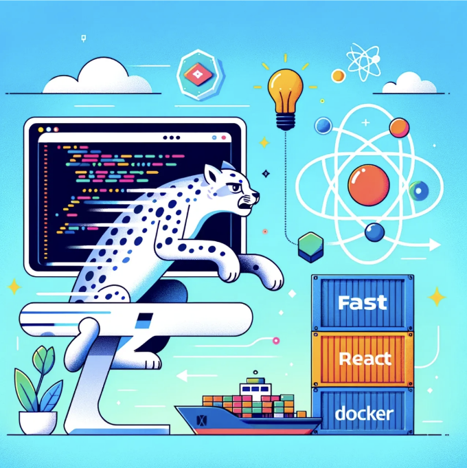

웹 개발의 빠르게 변화하는 환경에서, 견고한 백엔드 프레임워크와 동적인 프론트엔드 라이브러리를 결합하는 것이 효율적인 프로젝트 설정의 핵심입니다. GitHub의 plain-fastapi-react-docker 레포지토리는 FastAPI, React 및 Docker를 통합하여 간단한 웹 애플리케이션을 위한 심플한 개발 환경을 만드는 포괄적인 예제를 제공합니다. 이 글에서는 이 프로젝트를 사용하고 수정하며 설정하는 방법을 탐구하여 개발자들이 Docker화된 환경을 활용하여 풀 스택 애플리케이션을 개발하는 데 도움을 줍니다.

# 프로젝트 구조 개요

plain-fastapi-react-docker 프로젝트는 백엔드 API가 FastAPI를 사용하여 구축되는 미니멀한 설정을 갖추고 있습니다. FastAPI는 표준 Python 타입 힌트를 바탕으로 하는 Python 3.7+용 현대적이고 빠른(고성능) 웹 프레임워크입니다. 프론트엔드는 React를 활용하며, 이는 사용자 인터페이스를 구축하기 위한 JavaScript 라이브러리로, 특히 싱글 페이지 애플리케이션을 구축하는 데 적합합니다.

<!-- ui-log 수평형 -->
<ins class="adsbygoogle"
  style="display:block"
  data-ad-client="ca-pub-4877378276818686"
  data-ad-slot="9743150776"
  data-ad-format="auto"
  data-full-width-responsive="true"></ins>
<component is="script">
(adsbygoogle = window.adsbygoogle || []).push({});
</component>

프로젝트 디렉토리에 대한 간단한 개요입니다:
- backend/는 Docker 컨테이너 설정을 위한 Dockerfile과 requirements.txt에 나열된 Python 종속성을 포함한 모든 FastAPI 애플리케이션 파일을 포함합니다.
- frontend/는 React 애플리케이션과 이를 컨테이너화하기 위한 Dockerfile, npm 종속성을 관리하기 위한 package.json을 포함합니다.

두 구성 요소는 Docker Compose를 사용하여 함께 작동하도록 조정되어 있으며, 이를 통해 멀티 컨테이너 Docker 애플리케이션의 설정이 간소화됩니다.

# 시작하기

이 프로젝트를 시작하려면 시스템에 Docker 및 Docker Compose가 설치되어 있어야 합니다. 이 도구들은 애플리케이션 구성 요소용 컨테이너를 만들고 관리하는 데 도움이 됩니다.

<!-- ui-log 수평형 -->
<ins class="adsbygoogle"
  style="display:block"
  data-ad-client="ca-pub-4877378276818686"
  data-ad-slot="9743150776"
  data-ad-format="auto"
  data-full-width-responsive="true"></ins>
<component is="script">
(adsbygoogle = window.adsbygoogle || []).push({});
</component>

레포지토리를 복제하세요:
로컬 머신에 레포지토리를 복제하는 것으로 시작합니다:

```js
git clone https://github.com/chigwell/plain-fastapi-react-docker.git
cd plain-fastapi-react-docker
```

도커 컴포즈로 빌드 및 실행:
도커 컴포즈를 사용하여 이미지를 빌드하고 컨테이너를 실행하세요:

```js
docker-compose up --build
```

<!-- ui-log 수평형 -->
<ins class="adsbygoogle"
  style="display:block"
  data-ad-client="ca-pub-4877378276818686"
  data-ad-slot="9743150776"
  data-ad-format="auto"
  data-full-width-responsive="true"></ins>
<component is="script">
(adsbygoogle = window.adsbygoogle || []).push({});
</component>

이 명령은 docker-compose.yml에 정의된 컨테이너를 시작하고 Docker 이미지를 컴파일합니다. 실행 중에는 FastAPI 백엔드를 http://localhost:80/에서, React 프론트엔드를 http://localhost:3000/에서 사용할 수 있습니다.

# API 탐색 및 수정

FastAPI 애플리케이션에는 JSON 응답을 반환하는 간단한 엔드포인트가 포함되어 있습니다. backend/app/main.py 파일을 수정하여이 API를 변경할 수 있습니다. 예를 들어, 새로운 엔드포인트를 추가하는 것은 다음과 같이 보일 수 있습니다:

```js
@app.get("/api/greet/{name}")
async def greet(name: str):
    return {"message": f"Hello, {name}!"}
```

<!-- ui-log 수평형 -->
<ins class="adsbygoogle"
  style="display:block"
  data-ad-client="ca-pub-4877378276818686"
  data-ad-slot="9743150776"
  data-ad-format="auto"
  data-full-width-responsive="true"></ins>
<component is="script">
(adsbygoogle = window.adsbygoogle || []).push({});
</component>

이 함수는 사용자의 이름으로 인사하는 새 경로를 생성합니다. 이 새 엔드포인트는 http://localhost:80/api/greet/yourname에서 액세스할 수 있습니다.

# 프론트엔드 개선하기

frontend/src/App.js에 있는 React 설정은 FastAPI 백엔드에서 데이터를 가져와 표시합니다. 이를 확장하기 위해 추가적인 UI 구성 요소를 구현하거나 정의한 다른 API 엔드포인트에 연결할 수 있습니다. 예를 들어, 위에 추가된 새 엔드포인트와 상호 작용하려면:

```js
useEffect(() => {
  fetch('http://0.0.0.0:80/api/greet/World')
    .then(response => response.json())
    .then(data => setMessage(data.message));
}, []);
```

<!-- ui-log 수평형 -->
<ins class="adsbygoogle"
  style="display:block"
  data-ad-client="ca-pub-4877378276818686"
  data-ad-slot="9743150776"
  data-ad-format="auto"
  data-full-width-responsive="true"></ins>
<component is="script">
(adsbygoogle = window.adsbygoogle || []).push({});
</component>

# 결론

plain-fastapi-react-docker 프로젝트는 Docker를 사용하여 full-stack 애플리케이션을 만드는 간단한 방법을 보여줍니다. 프론트엔드와 백엔드를 별도의 컨테이너로 분리함으로써, 개발자는 종속성과 환경을 더 효율적으로 관리할 수 있어서 "내 컴퓨터에서는 작동하는데" 문제를 줄일 수 있습니다. 경험 많은 개발자든 초보든, 이 저장소는 오늘 제공되는 가장 강력한 도구들을 사용하여 웹 애플리케이션을 구축하고 확장하는 데 견고한 기반을 제공합니다.