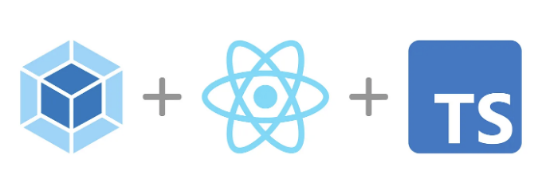

이 글은 간단한 React + Webpack 프로젝트에 Typescript 지원을 추가하는 방법을 안내합니다.

# 단계 1: Typescript 및 타입 정의 설치하기

첫 번째 단계는 간단히 Typescript를 설치하는 것입니다:

<!-- ui-log 수평형 -->
<ins class="adsbygoogle"
  style="display:block"
  data-ad-client="ca-pub-4877378276818686"
  data-ad-slot="9743150776"
  data-ad-format="auto"
  data-full-width-responsive="true"></ins>
<component is="script">
(adsbygoogle = window.adsbygoogle || []).push({});
</component>

```js
npm install typescript --save-dev
```

그런 다음, 이미 사용 중인 모든 라이브러리에 대한 유형 정의를 설치해야 합니다. 일반적으로 다음과 같습니다:

```js
npm install @types/node @types/react @types/react-dom @types/jest --save-dev
```

# 단계 2: 웹팩 구성하기

<!-- ui-log 수평형 -->
<ins class="adsbygoogle"
  style="display:block"
  data-ad-client="ca-pub-4877378276818686"
  data-ad-slot="9743150776"
  data-ad-format="auto"
  data-full-width-responsive="true"></ins>
<component is="script">
(adsbygoogle = window.adsbygoogle || []).push({});
</component>

다양한 옵션이 있지만 저희는 설정에 ts-loader를 사용할 것입니다:

```js
npm install ts-loader --save-dev
```

그 다음으로 웹팩에 TS 파일을 처리하도록 지시해야 합니다. 이를 위해 webpack.config.js 파일을 업데이트하여 ts 및 tsx 확장자도 지원하도록 설정할 수 있습니다:

```js
// webpack.config.js

{
  // ...,
  module: {
    rules: [
      // `js` 및 `jsx` 파일은 `babel-loader`를 사용하여 구문 분석됩니다
      {
        test: /\.(js|jsx)$/,
        exclude: /node_modules/,
        use: ["babel-loader"],
      },
      // `ts` 및 `tsx` 파일은 `ts-loader`를 사용하여 구문 분석됩니다
      {
        test: /\.(ts|tsx)$/,
        exclude: /node_modules/,
        use: ["ts-loader"],
      }
    ],
  },
  resolve: {
    extensions: ["*", ".js", ".jsx", ".ts", ".tsx"],
  },
}
```

<!-- ui-log 수평형 -->
<ins class="adsbygoogle"
  style="display:block"
  data-ad-client="ca-pub-4877378276818686"
  data-ad-slot="9743150776"
  data-ad-format="auto"
  data-full-width-responsive="true"></ins>
<component is="script">
(adsbygoogle = window.adsbygoogle || []).push({});
</component>

# 단계 3: TypeScript 구성하기

이 프로젝트를 위한 TypeScript 설정 파일을 생성해 봅시다:

```js
// tsconfig.json
{
  "compilerOptions": {
    "jsx": "react",
    "noImplicitAny": true,
    "module": "ES6",
    "target": "ES5",
    "outDir": "./build/",
    "preserveConstEnums": true,
    "removeComments": true,
    "sourceMap": true
  }
}
```

이 튜토리얼을 위해 React + TS + Webpack 통합에 필요한 최소한의 설정만 추가했지만, 모든 옵션에 대해 자세히 알아보고 싶다면 공식 문서에서 확인할 수 있습니다.

<!-- ui-log 수평형 -->
<ins class="adsbygoogle"
  style="display:block"
  data-ad-client="ca-pub-4877378276818686"
  data-ad-slot="9743150776"
  data-ad-format="auto"
  data-full-width-responsive="true"></ins>
<component is="script">
(adsbygoogle = window.adsbygoogle || []).push({});
</component>

# 단계 4: Typescript 사용 시작하기

이미 프로젝트에 일부 JS 파일이 있다면, 지금이 바로 그 확장자를 js에서 ts로, jsx에서 tsx로 변경하는 좋은 시기입니다!

그런 다음, 앱을 다시 시작하면 모든 것이 여전히 작동하는 것을 보게 될 거에요 ✨

# 여기까지입니다!