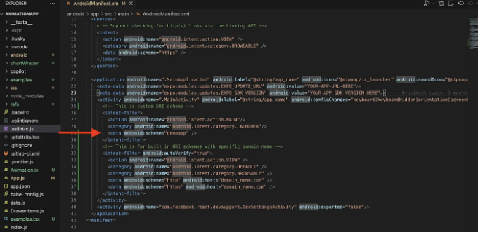
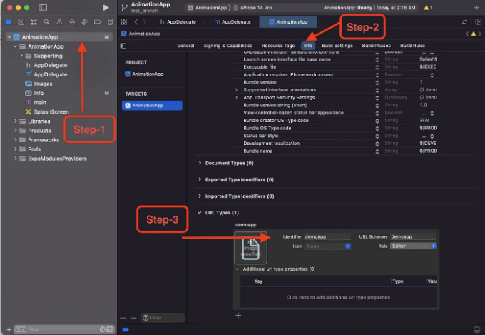
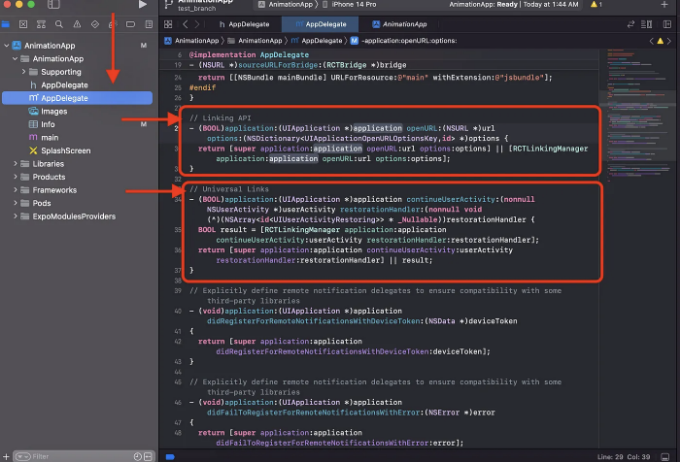

이 블로그에서는 React Native 앱에서 안드로이드 및 iOS 플랫폼 모두에 대한 딥 링킹 설정하는 방법에 대해 논의할 예정입니다. 이것은 모바일 앱에서 제품 개발 관점에서 종종 요구되는 사항입니다.


# 딥 링크 요구 사항:

웹페이지에서 모바일 앱의 특정 화면을 열고 싶다는 특정 요구 사항이 있을 때, 딥 링킹을 통해 구성해야 합니다. 이렇게 하면 사용자에게 더 나은 사용자 인터페이스를 제공할 뿐만 아니라 사용자 참여도도 증가할 수 있습니다.

<!-- ui-log 수평형 -->
<ins class="adsbygoogle"
  style="display:block"
  data-ad-client="ca-pub-4877378276818686"
  data-ad-slot="9743150776"
  data-ad-format="auto"
  data-full-width-responsive="true"></ins>
<component is="script">
(adsbygoogle = window.adsbygoogle || []).push({});
</component>

Deep linking은 모바일 애플리케이션 내에서 특정 화면으로 사용자를 리디렉션하는 간단한 URI입니다. 모바일 애플리케이션의 기본적인 딥 링크 형태는 사용자 지정 URI scheme과 유사합니다. 사용자 지정 URI scheme은 앱 내에서 정의되며 아래 예시처럼 내장 URI scheme도 제공됩니다.

```js
//사용자 지정 URI scheme 예시
<data android:scheme="fb" />
<data android:scheme="slack"/>
<data android:scheme="twitter"/>
//내장 URI scheme 예시
<data android:scheme="http" android:host="domain_name.com" />
<data android:scheme="https" android:host="domain_name.com" />
```

이제 React Native 애플리케이션에서 딥 링크 설정하는 기본적인 단계를 살펴봅시다.

# 딥링크 설정:

<!-- ui-log 수평형 -->
<ins class="adsbygoogle"
  style="display:block"
  data-ad-client="ca-pub-4877378276818686"
  data-ad-slot="9743150776"
  data-ad-format="auto"
  data-full-width-responsive="true"></ins>
<component is="script">
(adsbygoogle = window.adsbygoogle || []).push({});
</component>

단계 1:
Android 플랫폼:
안드로이드에서 딥 링킹을 설정하려면 android/app/src/main/AndroidManifest.xml 파일을 수정해야 합니다. 저의 경우 이곳에 아래 스크린샷에 제공된대로 인텐트 필터 태그 안에 데모앱 커스텀 스킴을 추가했습니다.



iOS 플랫폼:
iOS에서 사용자 정의 URI 스킴을 설정하려면 Xcode를 열고 아래 경로를 따라 스킴을 설정해야 합니다.



<!-- ui-log 수평형 -->
<ins class="adsbygoogle"
  style="display:block"
  data-ad-client="ca-pub-4877378276818686"
  data-ad-slot="9743150776"
  data-ad-format="auto"
  data-full-width-responsive="true"></ins>
<component is="script">
(adsbygoogle = window.adsbygoogle || []).push({});
</component>

단계 2:
Xcode에서 AppDelegate 파일을 열고 아래 스크린샷에 나와 있는 것처럼 iOS 기기에서 딥 링킹을 처리하기 위해 필요한 다음 코드가 있는지 확인해주세요.



단계 3:
이미 언급된 변경 사항을 적용한 후 프로젝트를 다시 빌드하고 시뮬레이터에서 앱을 다시 실행하세요. 이제 내부의 모바일 앱에서 열리는 URL을 추적해야 하는데, React Native가 제공하는 Linking API를 통해 해결할 수 있습니다.

React Native는 Linking을 통해 수신 링크를 통지할 수 있습니다. 이제 Linking API를 사용하고 앱에서 링크와 함께 제공된 매개변수나 데이터에 따라 내비게이션을 처리할 것입니다.

<!-- ui-log 수평형 -->
<ins class="adsbygoogle"
  style="display:block"
  data-ad-client="ca-pub-4877378276818686"
  data-ad-slot="9743150776"
  data-ad-format="auto"
  data-full-width-responsive="true"></ins>
<component is="script">
(adsbygoogle = window.adsbygoogle || []).push({});
</component>

4단계:
위의 예시에서 우리가 다루어야 하는 깊은 링크 처리에 대한 두 가지 시나리오가 있습니다. 함께 살펴보겠습니다.

1. 앱이 닫힌 상태일 때는 Linking getInitialURL() 함수를 사용하여 처리해야 합니다. 아래와 같이 사용할 수 있어요.

```js
 const fetchDeepLinkingUrl = async () => {
    // 앱이 닫힌 상태일 때 호출됩니다.
    const url = await Linking?.getInitialURL();
    console.log('앱이 닫힌 상태---',url);
  };
 
  useEffect(() => {
    fetchDeepLinkingUrl();
  }, []);
```

2. 앱이 열린 상태일 때는 Linking addEventListener() 이벤트 리스너를 사용하여 처리해야 합니다.

<!-- ui-log 수평형 -->
<ins class="adsbygoogle"
  style="display:block"
  data-ad-client="ca-pub-4877378276818686"
  data-ad-slot="9743150776"
  data-ad-format="auto"
  data-full-width-responsive="true"></ins>
<component is="script">
(adsbygoogle = window.adsbygoogle || []).push({});
</component>

```js
 useEffect(() => {
    // 앱이 열린 상태에서 호출됩니다.
    const linking = Linking?.addEventListener('url', ({url}) => {
      console.log('앱이 열린 상태---',url);
    });
    return () => {
      linking?.remove();
    };
  }, []);
```

단계 5: 위 설정을 마친 후 이제 아래 명령어를 사용하여 위에서 언급한 시나리오 두 가지를 모두 시도해 보겠습니다. 딥 링크가 작동하는지 확인할 수 있습니다.

```js
// iOS용
npx uri-scheme open "demoapp://domain/sub_domain" --ios

// Android용
npx uri-scheme open "demoapp://domain/sub_domain" --android
```

아래는 앱의 닫힘 및 열린 상태에 대한 딥 링크 처리 최종 코드이며 결과는 다음과 같습니다.```

<!-- ui-log 수평형 -->
<ins class="adsbygoogle"
  style="display:block"
  data-ad-client="ca-pub-4877378276818686"
  data-ad-slot="9743150776"
  data-ad-format="auto"
  data-full-width-responsive="true"></ins>
<component is="script">
(adsbygoogle = window.adsbygoogle || []).push({});
</component>

```js
import React, { useEffect, useState } from 'react';
import "react-native-gesture-handler";
import {Linking, Text, View} from "react-native";


const App = () => {

  const [currentState, setCurrentState] = useState('');

  const resolveDeeplink = async (url, state) => {
    console.log('resolve deep link', url);
    setCurrentState(`앱이 ${state} 상태로 열렸습니다.\n\n데이터: ${url}`)
  };

  const fetchDeepLinkingUrl = async () => {
    // 앱이 닫힌 상태일 때 호출됩니다.
    const url = await Linking?.getInitialURL();
    console.log('앱이 닫힌 상태일 때---', url);
    if (url) {
      resolveDeeplink(url, '닫힌');
    }
  };
 
  useEffect(() => {
    fetchDeepLinkingUrl();
    // 앱이 열린 상태일 때 호출됩니다.
    const linking = Linking?.addEventListener('url', ({url}) => {
      console.log('앱이 열린 상태일 때---', url);
      if (url) {
        resolveDeeplink(url, '열린');
      }
    });
    return () => {
      linking?.remove();
    };
  }, []);

  
  return (
    <View 
      style={{
        height: '100%',
        justifyContent: 'center',
        alignItems: 'center',
        backgroundColor: 'white'
      }}>
      <Text style={{fontSize: 24, color: 'black'}}>이중 링킹 테스트</Text>
      <Text style={{fontSize: 24, color: 'black', marginHorizontal: 40, marginTop: 20, textAlign: 'center'}}>{currentState}</Text>
    </View>
  );
}


export default App;
```


사용자가 앱을 설치하지 않은 경우 사용자 정의 scheme은 어떤 대체 방법도 처리하지 않습니다. 간단히 작동하지 않습니다. 이러한 상황을 피하려면 iOS의 Universal Links와 Android의 App Links를 사용하여 딥 링크를 더 효과적으로 처리할 수 있습니다.

먼저, 링크가 리디렉션되는 도메인을 소유해야 하므로 더 안전합니다. 또한 사용자가 앱을 설치하지 않은 경우 프로세스를 처리합니다. 그냥 웹 사이트를 브라우저에서 엽니다.

<!-- ui-log 수평형 -->
<ins class="adsbygoogle"
  style="display:block"
  data-ad-client="ca-pub-4877378276818686"
  data-ad-slot="9743150776"
  data-ad-format="auto"
  data-full-width-responsive="true"></ins>
<component is="script">
(adsbygoogle = window.adsbygoogle || []).push({});
</component>

요약

이제 모바일 앱을 위한 사용자 정의 scheme 딥 링킹 설정하는 방법과 앱이 닫혀있는 상태 또는 열려있는 상태일 때 딥 링크를 처리하는 방법에 대해 배웠습니다.

이 글이 유용하셨으면 다른 개발자와 공유하는 걸 잊지 마세요.

즐거운 학습 되세요! 👨🏼‍💻👨🏼‍💻

<!-- ui-log 수평형 -->
<ins class="adsbygoogle"
  style="display:block"
  data-ad-client="ca-pub-4877378276818686"
  data-ad-slot="9743150776"
  data-ad-format="auto"
  data-full-width-responsive="true"></ins>
<component is="script">
(adsbygoogle = window.adsbygoogle || []).push({});
</component>

# Stackademic

끝까지 읽어 주셔서 감사합니다. 떠나시기 전에:

- 작가를 칭찬하고 팔로우해 주시면 감사하겠습니다! 👏
- 저희 X 팔로우하기 | LinkedIn | YouTube | Discord
- 다른 플랫폼에서도 만나보세요: In Plain English | CoFeed | Venture