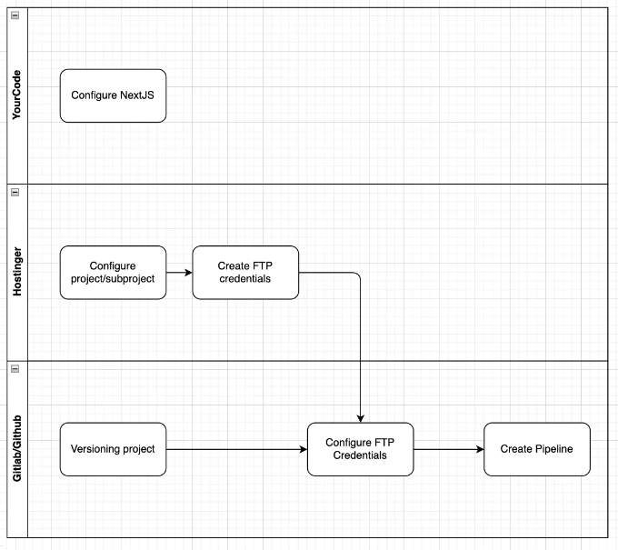
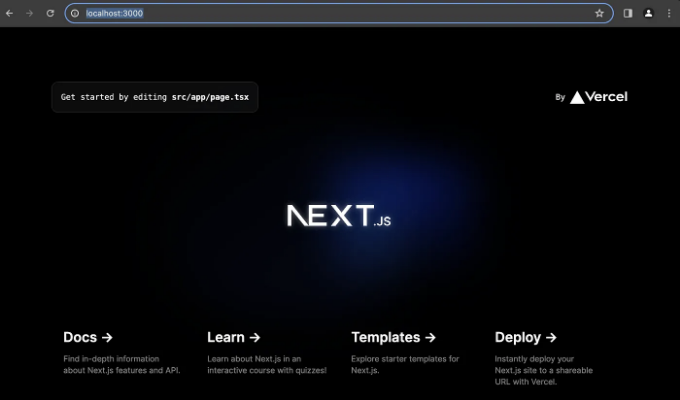
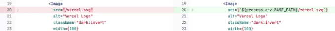
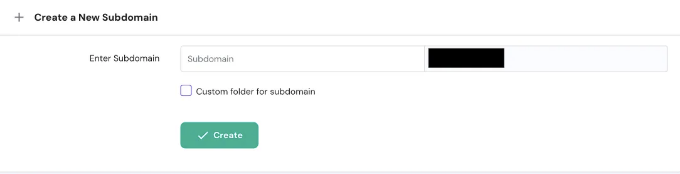
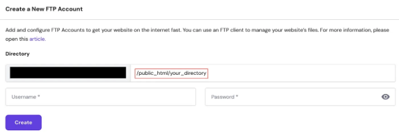
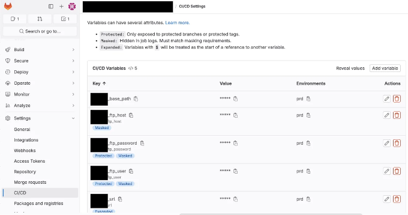
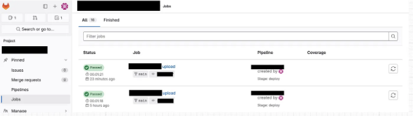
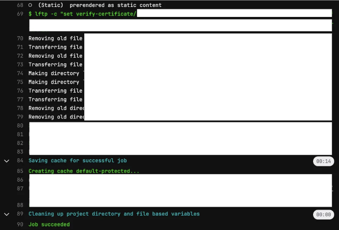
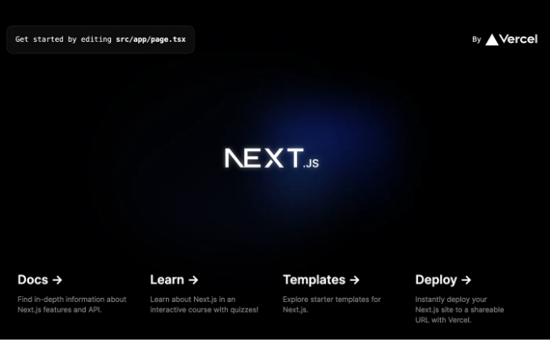

가끔은 프런트엔드 애플리케이션이나 마케팅 페이지와 같은 개념 증명(POC)을 소비하지 않고 배포해야 할 때가 있을 수 있습니다. 이런 경우 개인 호스트를 사용하는 것이 실용적인 해결책이 될 수 있습니다. 이 기사에서는 프런트엔드를 Hostinger 하위 도메인이나 하위 페이지로 자동으로 배포하는 방법에 대해 알아보겠습니다.

다음 단계를 따르세요:



# 요구 사항

<!-- ui-log 수평형 -->
<ins class="adsbygoogle"
  style="display:block"
  data-ad-client="ca-pub-4877378276818686"
  data-ad-slot="9743150776"
  data-ad-format="auto"
  data-full-width-responsive="true"></ins>
<component is="script">
(adsbygoogle = window.adsbygoogle || []).push({});
</component>

- Hostinger 호스팅 서비스
- Git
- 파이프라인 생성 및 시크릿 추가 기능을 갖춘 Gitlab/Github 또는 다른 도구

# 간단한 애플리케이션 (선택 사항)

테스트용 새 프론트엔드 애플리케이션을 만들거나 기존 애플리케이션을 사용할 수 있습니다. 이 기사에서는 NextJS 애플리케이션을 만들어 보겠습니다.

```js
npx create-next-app@latest
```

<!-- ui-log 수평형 -->
<ins class="adsbygoogle"
  style="display:block"
  data-ad-client="ca-pub-4877378276818686"
  data-ad-slot="9743150776"
  data-ad-format="auto"
  data-full-width-responsive="true"></ins>
<component is="script">
(adsbygoogle = window.adsbygoogle || []).push({});
</component>

이것이 우리의 기본 애플리케이션입니다:



# "next.config.mjs" 구성하기

정적 파일을 폴더로 출력하려면 "next.config.mjs"를 수정하여 output, basePath 및 assetPrefix를 추가하십시오:

<!-- ui-log 수평형 -->
<ins class="adsbygoogle"
  style="display:block"
  data-ad-client="ca-pub-4877378276818686"
  data-ad-slot="9743150776"
  data-ad-format="auto"
  data-full-width-responsive="true"></ins>
<component is="script">
(adsbygoogle = window.adsbygoogle || []).push({});
</component>

```js
/** @type {import('next').NextConfig} */
const nextConfig = {
  output: "export",
  basePath: process.env.BASE_PATH ? process.env.BASE_PATH : "",
  assetPrefix: process.env.URL ? process.env.URL : undefined,
};

export default nextConfig;
```

설정을 마치면 npx next build를 실행하면 모든 링크와 CSS 파일이 있는 "out" 디렉토리가 정상적으로 생성됩니다.


next/image로 관리되는 이미지의 경우, 필요에 따라 이미지 경로를 업데이트하세요.  

<!-- ui-log 수평형 -->
<ins class="adsbygoogle"
  style="display:block"
  data-ad-client="ca-pub-4877378276818686"
  data-ad-slot="9743150776"
  data-ad-format="auto"
  data-full-width-responsive="true"></ins>
<component is="script">
(adsbygoogle = window.adsbygoogle || []).push({});
</component>



# Hostinger 단계

Hostinger 계정에서 서브도메인이나 특정 폴더를 생성합니다.



<!-- ui-log 수평형 -->
<ins class="adsbygoogle"
  style="display:block"
  data-ad-client="ca-pub-4877378276818686"
  data-ad-slot="9743150776"
  data-ad-format="auto"
  data-full-width-responsive="true"></ins>
<component is="script">
(adsbygoogle = window.adsbygoogle || []).push({});
</component>

새 FTP 계정을 설정하여 해당 디렉토리에 제한을 두어 최소 권한 원칙 (POLP)을 준수하는 것을 고려해보세요.



# Gitlab 단계

다른 배포 솔루션도 사용 가능하지만, 이 튜토리얼은 Gitlab을 사용하는 데 초점을 맞춥니다. 먼저, 프로젝트가 Gitlab에 있는지 확인하고 CI/CD 설정에 Hostinger FTP 클라이언트 비밀을 추가하세요.

<!-- ui-log 수평형 -->
<ins class="adsbygoogle"
  style="display:block"
  data-ad-client="ca-pub-4877378276818686"
  data-ad-slot="9743150776"
  data-ad-format="auto"
  data-full-width-responsive="true"></ins>
<component is="script">
(adsbygoogle = window.adsbygoogle || []).push({});
</component>

https://gitlab.com/[GROUP_OR_NAMESPACE]/[PROJECT]/-/settings/ci_cd



- [project]_base_path: 링크 기본 경로를 대체합니다. 그러나 이미지 파일에서 수동으로 업데이트해야 합니다.
- [project]_ftp_host: 예: ftp.1234.com
- [project]_ftp_password
- [project]_ftp_user
- [project]_url: 여러분의 자원 URL(https://...)입니다. 여러분의 사이트 주소 또는 CDN 주소일 수 있습니다.

'prd'로 환경을 정의하세요. 필요에 따라 다양한 환경 변수를 생성할 수 있습니다.

<!-- ui-log 수평형 -->
<ins class="adsbygoogle"
  style="display:block"
  data-ad-client="ca-pub-4877378276818686"
  data-ad-slot="9743150776"
  data-ad-format="auto"
  data-full-width-responsive="true"></ins>
<component is="script">
(adsbygoogle = window.adsbygoogle || []).push({});
</component>

```js
image: node:21.4.0-alpine

cache:
  paths:
    - node_modules/

before_script:
  - apk add lftp
  - npm install

upload:
  environment: prd
  stage: deploy
  script:
    - echo "Preparing FTP... $[project]_ftp_host $[project]_ftp_user $[project]_ftp_password"
    - URL=$[project]_url BASE_PATH=$[project]_base_path npx next build
    - lftp -c "set verify-certificate/$[project]_ftp_host no; set ftp:ssl-allow on; open -u $[project]_ftp_user,$[project]_ftp_password ftp://$[project]_ftp_host; mirror -Rev out/ ./ --ignore-time --parallel=10"

  only:
    - master
    - main
```

알파인 이미지에 대해입니다. 제 보안 문서: 

# 결론

<!-- ui-log 수평형 -->
<ins class="adsbygoogle"
  style="display:block"
  data-ad-client="ca-pub-4877378276818686"
  data-ad-slot="9743150776"
  data-ad-format="auto"
  data-full-width-responsive="true"></ins>
<component is="script">
(adsbygoogle = window.adsbygoogle || []).push({});
</component>

올바르게 설정하면, 주 브랜치의 갱신마다 새 작업이 실행되어 각 작업 로그에서 진행 상황이 표시됩니다.







<!-- ui-log 수평형 -->
<ins class="adsbygoogle"
  style="display:block"
  data-ad-client="ca-pub-4877378276818686"
  data-ad-slot="9743150776"
  data-ad-format="auto"
  data-full-width-responsive="true"></ins>
<component is="script">
(adsbygoogle = window.adsbygoogle || []).push({});
</component>

이 정보가 유용하다면 좋겠어요. 읽어 주셔서 감사합니다. :D

LinkedIn: [앤더슨 마갈레스 링크드인](https://www.linkedin.com/in/andersonbmagalhaes/)

# 추가 가능성

- 공개 파일을 콘텐츠 전송 네트워크 (CDN)로 분리하기
- 여러 환경 생성하기 (예: 개발, 테스트, 프로덕션)
- 대체 CI/CD 접근 방법으로 GitHub Actions 사용하기

<!-- ui-log 수평형 -->
<ins class="adsbygoogle"
  style="display:block"
  data-ad-client="ca-pub-4877378276818686"
  data-ad-slot="9743150776"
  data-ad-format="auto"
  data-full-width-responsive="true"></ins>
<component is="script">
(adsbygoogle = window.adsbygoogle || []).push({});
</component>

# 혜택

- 제품에 대한 변경 사항을 효율적으로 전달할 수 있습니다.
- 배포 전에 파이프라인에서 코드를 테스트할 수 있습니다.
- 마케팅 계획이나 POC와 같은 공개 프로젝트에 적합한 저렴한 솔루션입니다.

# 광고

# 참고 문헌