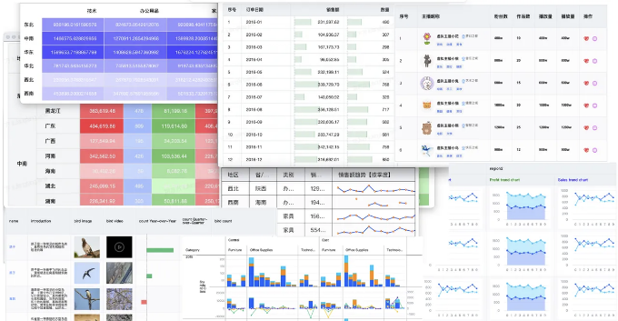
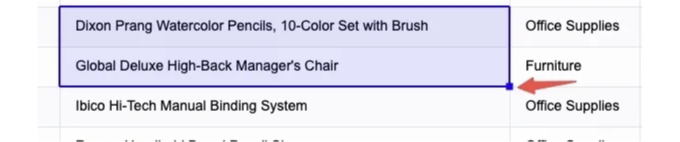
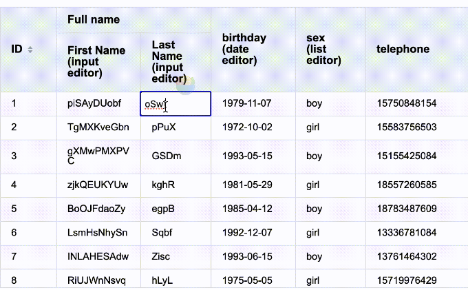
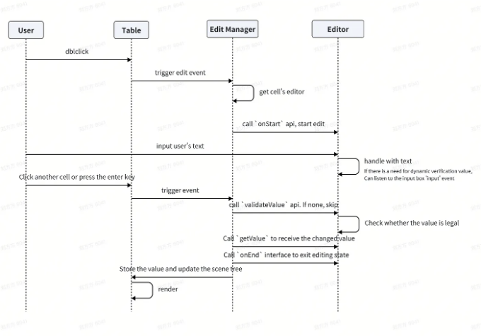
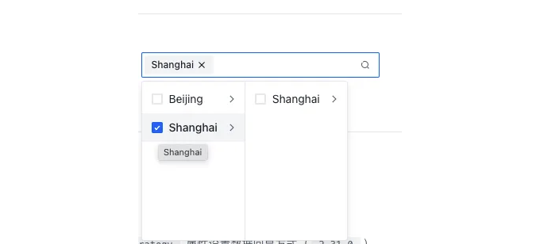
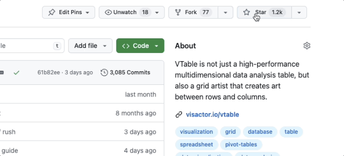

이 기사의 내용은 @VisActor/VTable 사용자 인터뷰를 기반으로 합니다.

# 비즈니스 시나리오 소개

전통적인 평가 시스템에서 여러 리뷰어들은 주로 Feishu 양식에서 동일한 데이터 세트에 주석을 달기 위해 협업해야 합니다. 이 프로세스에는 여러 사용자가 동일한 문서를 편집하고 주석이 달린 데이터를 평가 플랫폼에 업로드하는 것이 포함됩니다. 그러나 이 방식에는 특정한 단점이 있습니다. 먼저, 원본 데이터가 효과적으로 플랫폼에 축적되지 않아 데이터 세트 작성을 위한 완전한 폐쇄 루프 형성이 불가능하며, 둘째로 사용자들은 주석이 달린 데이터를 수동으로 업로드해야 하는데, 이는 효율성을 줄이고 부적절한 사용자 경험으로 이어집니다.

이 문제를 해결하고 사용자 주석 효율성을 향상시키고 오프라인 Feishu 양식에 대한 의존성을 줄이기 위해 우리 플랫폼은 VTable 비주얼 편집 솔루션을 채택했습니다. 이 솔루션을 통해 사용자들은 우리 시스템의 테이블 양식에서 데이터를 직접 편집할 수 있어서 직접적인 데이터 저장, 역사적 기록 저장 및 기타 기능이 가능해졌습니다.

<!-- ui-log 수평형 -->
<ins class="adsbygoogle"
  style="display:block"
  data-ad-client="ca-pub-4877378276818686"
  data-ad-slot="9743150776"
  data-ad-format="auto"
  data-full-width-responsive="true"></ins>
<component is="script">
(adsbygoogle = window.adsbygoogle || []).push({});
</component>

VTable 편집기 인터페이스와 관련 이벤트 리스너를 통해 HTML 또는 React/Vue 구성 요소를 통합하여 편집 기능을 확장하는 것이 쉽습니다. 이 문서는 예제를 통해 범용적인 솔루션을 보여줍니다.

# VTable 소개

VTable은 ByteDance에 의해 출시된 VisActor 오픈 소스 시각화 솔루션의 주요 구성 요소이며 고성능 테이블 컴포넌트입니다. 뛰어난 성능과 풍부한 시각화 기능으로 유명합니다. 자세한 내용은 아래 링크를 참조해 주세요:

1. 공식 웹사이트: https://www.visactor.io/vtable

<!-- ui-log 수평형 -->
<ins class="adsbygoogle"
  style="display:block"
  data-ad-client="ca-pub-4877378276818686"
  data-ad-slot="9743150776"
  data-ad-format="auto"
  data-full-width-responsive="true"></ins>
<component is="script">
(adsbygoogle = window.adsbygoogle || []).push({});
</component>

- 2. Github: https://github.com/VisActor/VTable



# VTable의 편집 기능

VTable은 현재 두 가지 주요 편집 기능을 제공합니다.

<!-- ui-log 수평형 -->
<ins class="adsbygoogle"
  style="display:block"
  data-ad-client="ca-pub-4877378276818686"
  data-ad-slot="9743150776"
  data-ad-format="auto"
  data-full-width-responsive="true"></ins>
<component is="script">
(adsbygoogle = window.adsbygoogle || []).push({});
</component>

- 셀 편집
- 데이터 채우기

데이터 채우기는 fill handle 구성 요소를 사용합니다.



셀 편집은 @visactor/vtable-editors 구성 요소를 기반으로 합니다. 이 글은 주로 @visactor/vtable-editors 구성 요소를 기반으로 한 사용자 정의 테이블 편집 기능을 소개합니다.

<!-- ui-log 수평형 -->
<ins class="adsbygoogle"
  style="display:block"
  data-ad-client="ca-pub-4877378276818686"
  data-ad-slot="9743150776"
  data-ad-format="auto"
  data-full-width-responsive="true"></ins>
<component is="script">
(adsbygoogle = window.adsbygoogle || []).push({});
</component>

# @visactor/vtable-editors

이 컴포넌트에는 사용자가 직접 사용하거나 확장하고 사용자 정의할 수 있는 텍스트 입력 상자, 날짜 선택기, 드롭다운 목록 등이 내장되어 있습니다.

먼저, VTable 라이브러리 @visactor/vtable과 관련된 편집기 패키지 @visactor/vtable-editors가 올바르게 설치되었는지 확인하세요. 다음 명령어를 사용하여 설치할 수 있습니다:

VTable을 설치하려면:

<!-- ui-log 수평형 -->
<ins class="adsbygoogle"
  style="display:block"
  data-ad-client="ca-pub-4877378276818686"
  data-ad-slot="9743150776"
  data-ad-format="auto"
  data-full-width-responsive="true"></ins>
<component is="script">
(adsbygoogle = window.adsbygoogle || []).push({});
</component>

```js
// npm을 사용하여 설치
npm install @visactor/vtable
// yarn을 사용하여 설치
yarn add @visactor/vtable
```

@visactor/vtable-editors를 설치하세요:

```js
// npm을 사용하여 설치
npm install @visactor/vtable-editors
// yarn을 사용하여 설치
yarn add @visactor/vtable-editors
```

코드에서 필요한 유형의 편집기 모듈을 가져와서 사용하세요(구현을 사용자 정의하거나 vtable-editors 패키지의 편집기 클래스를 참조할 수 있습니다):```

<!-- ui-log 수평형 -->
<ins class="adsbygoogle"
  style="display:block"
  data-ad-client="ca-pub-4877378276818686"
  data-ad-slot="9743150776"
  data-ad-format="auto"
  data-full-width-responsive="true"></ins>
<component is="script">
(adsbygoogle = window.adsbygoogle || []).push({});
</component>

```js
// vtable-editors에서 제공하는 에디터 클래스 가져오기
import { DateInputEditor, InputEditor, ListEditor } from '@visactor/vtable-editors';
```

다음으로 사용해야 할 에디터 인스턴스를 만들어 보세요:

```js
const inputEditor = new InputEditor();
const dateInputEditor = new DateInputEditor();
const listEditor = new ListEditor({ values: ['女', '男'] });
```

위 예제에서는 텍스트 입력 상자 에디터(InputEditor), 날짜 선택기 에디터(DateInputEditor), 그리고 드롭다운 목록 에디터(ListEditor)를 생성했습니다. 실제 필요에 따라 적절한 에디터 유형을 선택할 수 있습니다.```

<!-- ui-log 수평형 -->
<ins class="adsbygoogle"
  style="display:block"
  data-ad-client="ca-pub-4877378276818686"
  data-ad-slot="9743150776"
  data-ad-format="auto"
  data-full-width-responsive="true"></ins>
<component is="script">
(adsbygoogle = window.adsbygoogle || []).push({});
</component>

만든 편집기 인스턴스를 사용하려면 VTable에 등록해야 합니다.

```js
// 편집기를 VTable에 등록
VTable.register.editor('name-editor', inputEditor);
VTable.register.editor('name-editor2', inputEditor2);
VTable.register.editor('number-editor', numberEditor);
VTable.register.editor('date-editor', dateInputEditor);
VTable.register.editor('list-editor', listEditor);
```

그런 다음, 열 구성에 사용할 편집기를 지정해야 합니다 (피벗 테이블인 경우 지표에서 편집기를 구성):

```js
columns: [
  { title: '이름', field: 'name', editor(args)=>{
    if(args.row%2==0)
      return 'name-editor';
    else
      return 'name-editor2';
  } },
  { title: '나이', field: 'age', editor: 'number-editor' },
  { title: '성별', field: 'gender', editor: 'list-editor' },
  { title: '생년월일', field: 'birthDate', editor: 'date-editor' },
]
```

<!-- ui-log 수평형 -->
<ins class="adsbygoogle"
  style="display:block"
  data-ad-client="ca-pub-4877378276818686"
  data-ad-slot="9743150776"
  data-ad-format="auto"
  data-full-width-responsive="true"></ins>
<component is="script">
(adsbygoogle = window.adsbygoogle || []).push({});
</component>

이제 사용자들은 셀을 더블 클릭하여 편집을 시작하고, 그 후 편집기를 선택하여 입력할 수 있습니다.



# 에디터 사용자 지정

VTable-editors 라이브러리에서 제공하는 몇 가지 에디터가 필요에 부합하지 않는 경우, 에디터를 사용자 지정할 수 있습니다. 이를 위해 클래스를 만들고, 에디터 인터페이스(IEditor)의 요구 사항을 구현하고 필요한 메서드와 로직을 제공해야 합니다.

<!-- ui-log 수평형 -->
<ins class="adsbygoogle"
  style="display:block"
  data-ad-client="ca-pub-4877378276818686"
  data-ad-slot="9743150776"
  data-ad-format="auto"
  data-full-width-responsive="true"></ins>
<component is="script">
(adsbygoogle = window.adsbygoogle || []).push({});
</component>

편집기와 VTable 간의 관계를 이해하려면 다음 플로차트를 결합해 보세요:



여기 @visactor/vtable-editors에서 IEditor 인터페이스를 상속하는 비교적 복잡한 캐스케이딩 목록 선택기인 사용자 정의 편집기의 예시 코드가 있습니다. IEditor에서 구현해야 하는 인터페이스는 onStart, onEnd, getValue입니다.

IEditor 인터페이스는 다음과 같이 정의됩니다:

<!-- ui-log 수평형 -->
<ins class="adsbygoogle"
  style="display:block"
  data-ad-client="ca-pub-4877378276818686"
  data-ad-slot="9743150776"
  data-ad-format="auto"
  data-full-width-responsive="true"></ins>
<component is="script">
(adsbygoogle = window.adsbygoogle || []).push({});
</component>

```js
export interface IEditor<V = any> {
  /** * 셀이 편집 모드로 전환될 때 호출됩니다. */
  onStart: (context: EditContext<V>) => void;
  /** * 셀이 편집 모드에서 나올 때 호출됩니다. */
  onEnd: () => void;
  /**
만약 이 함수가 제공된다면, VTable은 사용자가 다른 곳을 클릭했을 때 이 함수를 호출합니다.
만약 이 함수가 false 값을 반환하면, VTable은 onEnd를 호출하여 편집 모드를 종료합니다.
만약 이 함수가 정의되지 않았거나 이 함수가 true 값을 반환하면, VTable은 아무것도 하지 않습니다.
즉, 편집 모드를 종료하려면 onStart에서 제공된 endEdit를 수동으로 호출해야 합니다.
   */
  isEditorElement?: (target: HTMLElement) => boolean;
  /** 편집기의 현재 값 가져오기. onEnd 호출 이후 호출됩니다.*/
  getValue: () => V;
  /**
새 입력 값이 유효한지 확인합니다.
   */
  validateValue?: () => boolean;
}
export interface EditContext<V = any> {
  /**  VTable 인스턴스가 위치한 컨테이너 요소 */
  container: HTMLElement;
  /** 편집 중인 셀의 위치 정보 */
  referencePosition: ReferencePosition;
  /** 편집 모드로 진입 중인 셀의 현재 값 */
  value: V;
  /**
편집 모드를 종료하는 데 사용되는 콜백함수.
   *
대부분의 경우, Enter 키를 눌러 편집 모드를 종료하는 VTable의 동작이 이미 제공되므로
 마우스로 다른 곳을 클릭하여 편집 모드를 종료하는 행동 또한 isEditorElement 함수를 통해 얻을 수 있습니다.
   *
그러나 "완료" 버튼을 편집기 내부에 제공하고 싶거나
 툴팁과 같은 외부 요소를 얻을 수 없는 경우와 같이 특수 요구 사항이 있는 경우,
이 콜백을 저장하고 필요할 때 편집 모드를 수동으로 종료할 수 있습니다.
   */
  endEdit: () => void;
  col: number;
  row: number;
}
```

# 에디터의 실용적인 사용자 정의

## 함수 정의

우리의 목표는 React 캐스케이딩 컴포넌트 Cascader를 정의하여, 이 컴포넌트를 통해 편집 상호작용을 수행하고 결과를 VTable에 업데이트하는 것입니다.

<!-- ui-log 수평형 -->
<ins class="adsbygoogle"
  style="display:block"
  data-ad-client="ca-pub-4877378276818686"
  data-ad-slot="9743150776"
  data-ad-format="auto"
  data-full-width-responsive="true"></ins>
<component is="script">
(adsbygoogle = window.adsbygoogle || []).push({});
</component>

편의를 위해 arco-design의 Cascader 구성 요소를 직접 사용합니다. 다른 React 구성 요소의 통합 방법도 비슷합니다.



## 코드 구현

먼저 필요한 구성 요소와 관련 정의를 가져와서, @visactor/vtable-editors에서 IEditor 인터페이스 정의를 가져옵니다.

<!-- ui-log 수평형 -->
<ins class="adsbygoogle"
  style="display:block"
  data-ad-client="ca-pub-4877378276818686"
  data-ad-slot="9743150776"
  data-ad-format="auto"
  data-full-width-responsive="true"></ins>
<component is="script">
(adsbygoogle = window.adsbygoogle || []).push({});
</component>

```js
import { Cascader } from '@arco-design/web-react';
import React from 'react';
import type { Root } from 'react-dom/client';
import { createRoot } from 'react-dom/client';
import type { IEditor } from '@visactor/vtable-editors';
```

다음으로, CascaderEditor 클래스를 구현하겠습니다. 전체적인 정의는 다음과 같습니다:

```js
export class CascaderEditor extends IEditor{
  editorType: string;
  cascaderOptions: null | []; // 모든 열 정보
  field: null | string; // 선택된 셀의 필드
  inputRef: React.RefObject<HTMLInputElement>;
  root: null | Root; // reactDOM을 마운트하기 위한 것
  container: null | HTMLElement;
  element: null | HTMLElement;
  constructor(editorConfig: any) {
    this.editorType = 'Cascader';
    this.cascaderOptions = null;
    this.field = null;
    this.root = null;
    this.element = null;
    this.container = null;
    this.init(editorConfig);
    this.inputRef = React.createRef();
  }
  
  init(editorConfig: any) {
    const { options, value } = editorConfig;
    const filed = value.field;
    this.cascaderOptions = options;
    this.field = filed;
  }
  
  onStart(editorContext:{container: HTMLElement | null, referencePosition: any, value: string}) {....}
  
  createElement(selectMode: string, Options: [], defaultValue: (string | string[])[]) {....}
  
  adjustPosition(rect: { top: string; left: string; width: string; height: string }) {...}
  
  onEnd() {
    console.log('endEditing cascader');
  }
  
  exit() {
    this.container.removeChild(this.element);
  }
  
  getValue() {...  }
  
  setValue(value: (string | string[])[]) {....}
  
  isEditorElement(target: Node | null) {....}
  
  bindSuccessCallback(successCallback: any) {
    this.successCallback = successCallback;
  }
  
  changeValue(value: []) {....}
  
  getCascaderOptions(value: string, field: null | string, cascaderOptions: null | []) {.....}
  
  findValuesAndParents(options: [], searchTexts: string) {.....}
  
  isClickPopUp(target: { classList: { contains: (arg0: string) => any }; parentNode: any }) {....}
}
```

사용자가 상호 작용을 통해 편집 상태를 트리거하면, VTable은 onStart 메서드를 호출합니다. onStart 메서드에서 React 컴포넌트를 초기화하고 editorContext를 사용하여 셀의 위치를 가져와 컴포넌트를 위치시킵니다. onStart 메서드는 다음과 같습니다:```

<!-- ui-log 수평형 -->
<ins class="adsbygoogle"
  style="display:block"
  data-ad-client="ca-pub-4877378276818686"
  data-ad-slot="9743150776"
  data-ad-format="auto"
  data-full-width-responsive="true"></ins>
<component is="script">
(adsbygoogle = window.adsbygoogle || []).push({});
</component>

```js
/**
   * @description: 에디터의 내장 메서드를 덮어쓰기
   * @param {HTMLElement} container
   * @param {any} referencePosition
   * @param {string} value
   * @return {*}
   */
  onStart(editorContext:{container: HTMLElement | null, referencePosition: any, value: string}) {
    const {container,referencePosition} = editorContext;
    this.container = container;
    const { selectMode, options } = this.getCascaderOptions(value, this.field, this.cascaderOptions);
    const defaultOptions = this.findValuesAndParents(options, value);
    this.createElement(selectMode, options, defaultOptions);
    setTimeout(() => {
      value && this.setValue(value);
      (null == referencePosition ? void 0 : referencePosition.rect) && this.adjustPosition(referencePosition.rect);
      this.element?.focus();
    }, 0);
  }
```

onStart 메서드는 먼저 getCascaderOptions 메서드를 호출하여 구성 요소의 옵션 및 selectMode를 반환합니다. 이 메서드의 구현은 다음과 같습니다:

```js
/**
   * @description: 필드를 기준으로 전체 cascaderOptions에서 해당 옵션을 필터링합니다.
   * @param {*} Value - 편집 상태에 진입할 때 입력 상자의 텍스트도 레코드의 값입니다.
   * @param {*} field
   * @param {*} cascaderOptions 전체 옵션
   * @return {*}
   */
  getCascaderOptions(value: string, field: null | string, cascaderOptions: null | []) {
    const advancedConfig = cascaderOptions.filter((option) => option.name === field);
    const selectMode = advancedConfig[0]?.advancedConfig?.selectMode;
    const options = advancedConfig[0]?.advancedConfig?.Cascader;
    return { selectMode, options };
  }
```

그런 다음 findValuesAndParents 메서드를 호출하여 사용자가 구성 요소에서 선택한 값을 반환합니다. findValuesAndParents 메서드의 구현은 다음과 같습니다:```

<!-- ui-log 수평형 -->
<ins class="adsbygoogle"
  style="display:block"
  data-ad-client="ca-pub-4877378276818686"
  data-ad-slot="9743150776"
  data-ad-format="auto"
  data-full-width-responsive="true"></ins>
<component is="script">
(adsbygoogle = window.adsbygoogle || []).push({});
</component>

```js
/**
   * @설명: 텍스트를 기반으로 해당 값 반환
   * @매개변수 {*} options
   * @매개변수 {*} searchTexts
   * @return {*}
   */
  findValuesAndParents(options: [], searchTexts: string) {
    const searchLabels = searchTexts?.split(', ').map((text) => text.trim());
    const results: any[][] = [];
```

```js
    function search(options, parents: any[]) {
      for (const option of options) {
        // 현재 노드의 값을 및 부모 ID 기록
        const currentParents = [...parents, option.value];
        // 일치하는 레이블이 발견되면 그 값 및 부모 ID를 결과에 추가
        if (searchLabels?.includes(option.label)) {
          results.push(currentParents);
        }
        // 하위 노드가 있는 경우 재귀적으로 검색
        if (option?.children && option.children.length > 0) {
          search(option.children, currentParents);
        }
      }
    }
    search(options, []);
    return results;
  }
```

다음으로, createElement 메서드를 호출하여 컴포넌트를 로드합니다.

```js
/**
   * @설명: 에디터의 기본 메서드 덮어쓰기,
   * @매개변수 {string} 선택모드
   * @매개변수 {*} 옵션
   * @매개변수 {*} 기본값
   * @return {*}
   */
  createElement(selectMode: string, Options: [], defaultValue: (string | string[])[]) {
    const div = document.createElement('div');
    div.style.position = 'absolute';
    div.style.width = '100%';
    div.style.padding = '4px';
    div.style.boxSizing = 'border-box';
    div.style.backgroundColor = '#232324';
    this.container?.appendChild(div);
    this.root = createRoot(div);
    this.root.render(
      <Cascader
        ref={this.inputRef}
        options={Options}
        expandTrigger="hover"
        onChange={this.changeValue.bind(this)}
        mode={selectMode}
        defaultValue={defaultValue}
        maxTagCount={1}
        style={ border: 'none' }
        bordered={false}
      />
    );
    this.element = div;
  }
```

<!-- ui-log 수평형 -->
<ins class="adsbygoogle"
  style="display:block"
  data-ad-client="ca-pub-4877378276818686"
  data-ad-slot="9743150776"
  data-ad-format="auto"
  data-full-width-responsive="true"></ins>
<component is="script">
(adsbygoogle = window.adsbygoogle || []).push({});
</component>

이 시점에서 리액트 컴포넌트가 표시되었으며 setValue 메서드를 통해 VTable의 값을 업데이트합니다. setValue의 구현은 다음과 같습니다:

```js
/**
   * @description:에디터의 기본 메서드를 덮어쓰기
   * @param {object} rect
   * @return {*}
   */
  setValue(value: (string | string[])[]) {
    if (this.inputRef.current) {
      this.inputRef.current.value = value;
    }
  }
```

adjustPosition 메서드를 호출하여 구성 요소의 위치를 조정합니다. adjustPosition 메서드의 구현은 다음과 같습니다:

```js
/**
   * @description:에디터의 기본 메서드를 덮어쓰기
   * @param {object} rect
   * @return {*}
   */
  adjustPosition(rect: { top: string; left: string; width: string; height: string }) {
    if (this.element) {
      (this.element.style.top = rect.top + 'px'),
        (this.element.style.left = rect.left + 'px'),
        (this.element.style.width = rect.width + 'px'),
        (this.element.style.height = rect.height + 'px');
    }
  }
```

<!-- ui-log 수평형 -->
<ins class="adsbygoogle"
  style="display:block"
  data-ad-client="ca-pub-4877378276818686"
  data-ad-slot="9743150776"
  data-ad-format="auto"
  data-full-width-responsive="true"></ins>
<component is="script">
(adsbygoogle = window.adsbygoogle || []).push({});
</component>

VTable이 자동으로 편집 모드를 종료하려면 구성 요소 내부에서 마우스 클릭이 발생했는지를 결정하는 isEditorElement 메서드를 제공해야 합니다. 구현은 다음과 같습니다:

```js
/**
   * @description: 클릭할 때마다 실행되며, 현재 클릭한 영역이 편집기 범위 내에 있는지 판단하는 목적
   * @param {Node} target 클릭한 요소
   * @return {Boolean}
   */
  isEditorElement(target: Node | null) {
    // 캐스케이더가 생성될 때 캔버스 다음에 DOM이 추가되고, 팝업이 본문의 끝에 추가됩니다. 팝업인지 DOM인지 여부에 상관없이 이를 편집 영역으로 클릭으로 간주해야 합니다.
    return this.element?.contains(target) || this.isClickPopUp(target);
  }
```

셀 값을 업데이트해야 할 때 VTable은 getValue 메서드를 호출합니다. 이 예시에서는 해당 메서드의 구현이 다음과 같습니다:

```js
/**
   * @description: 편집기의 내장 메서드를 덮어씁니다,
   * @param {object} rect
   * @return {*}
   */
  getValue() {
    return this.inputRef?.current?.value;
  }
```

<!-- ui-log 수평형 -->
<ins class="adsbygoogle"
  style="display:block"
  data-ad-client="ca-pub-4877378276818686"
  data-ad-slot="9743150776"
  data-ad-format="auto"
  data-full-width-responsive="true"></ins>
<component is="script">
(adsbygoogle = window.adsbygoogle || []).push({});
</component>

## 에디터 등록 및 사용하기

먼저 사용자 정의 에디터 정의를 참조하세요.

```js
// 사용자 정의 에디터 클래스
import { CascaderEditor, InputNumberEditor, SelectEditor, TextAreaEditor } from '@/client/components/TableEditor';
```

에디터를 사용하기 전에 VTable에 에디터 인스턴스를 등록해야 합니다.

<!-- ui-log 수평형 -->
<ins class="adsbygoogle"
  style="display:block"
  data-ad-client="ca-pub-4877378276818686"
  data-ad-slot="9743150776"
  data-ad-format="auto"
  data-full-width-responsive="true"></ins>
<component is="script">
(adsbygoogle = window.adsbygoogle || []).push({});
</component>

위 예제에서는 dataTable?.datasetQueryDataList?.columns를 인터페이스에 따라 반환하고 현재 사용자가 클릭한 셀 데이터인 clickedCellValue를 설정하여 사용자 정의 CascaderEditor의 매개변수를 설정한 다음, 에디터를 초기화한 후 등록하고 사용했습니다. 위의 VTable?.register?.editor('cascader-editor', cascaderEditor)입니다.

다음으로, 열 구성에서 사용할 에디터를 지정해야 합니다 (피벗 테이블인 경우 지표에서 에디터를 구성):

```js
const buildTableColumns = useCallback(
    (columns: DatasetColumnSchema[], isView: boolean) => {
      const temp = columns.map((colItem) => {
        const dataType = colItem?.dataType;
        if (dataType === DatasetColumnDataType.Category) {
          return {
            field: colItem.name,
            title: colItem.displayName,
            editor: 'cascader-editor',
            icon: 'edit',
          };
        } else if (dataType === DatasetColumnDataType.Int) {
          return {
            field: colItem.name,
            title: colItem.displayName,
            editor: 'input-number-editor',
            icon: 'edit',
          };
        } else if (dataType === DatasetColumnDataType.Boolean) {
          return {
            field: colItem.name,
            title: colItem.displayName,
            editor: 'list-editor',
            icon: 'edit',
          };
        } else {
          return {
            field: colItem.name,
            title: colItem.displayName,
            editor: 'text-editor',
            icon: 'edit',
          };
        }
      });
!isView &&
        temp.unshift({
          field: 'isCheck',
          title: '',
          width: 30,
          headerType: 'checkbox',
          cellType: 'checkbox',
        });
      return temp;
    },
    [dataTable?.datasetQueryDataList]
  );
```

<!-- ui-log 수평형 -->
<ins class="adsbygoogle"
  style="display:block"
  data-ad-client="ca-pub-4877378276818686"
  data-ad-slot="9743150776"
  data-ad-format="auto"
  data-full-width-responsive="true"></ins>
<component is="script">
(adsbygoogle = window.adsbygoogle || []).push({});
</component>

# 수정 이벤트 듣기

VTable은 수정 이벤트를 듣는 기능을 제공합니다. 수정 데이터 이벤트를 듣고 해당 로직을 실행할 수 있습니다.

아래는 수정 이벤트를 듣는 예제 코드입니다:

```js
const tableInstance = new VTable.ListTable(option);
tableInstance.on('change_cell_value', () => {
  // 셀 데이터 수정
});
```

<!-- ui-log 수평형 -->
<ins class="adsbygoogle"
  style="display:block"
  data-ad-client="ca-pub-4877378276818686"
  data-ad-slot="9743150776"
  data-ad-format="auto"
  data-full-width-responsive="true"></ins>
<component is="script">
(adsbygoogle = window.adsbygoogle || []).push({});
</component>

## 수정 후 데이터 획득

사용자가 편집을 완료하고 데이터를 제출한 후, 편집된 데이터를 가져와서 후속 처리에 사용할 수 있습니다. 레코드의 값을 직접 가져올 수 있습니다.

```js
// 현재 테이블의 전체 데이터 가져오기
tableInstance.records;
```

## 전체 코드

<!-- ui-log 수평형 -->
<ins class="adsbygoogle"
  style="display:block"
  data-ad-client="ca-pub-4877378276818686"
  data-ad-slot="9743150776"
  data-ad-format="auto"
  data-full-width-responsive="true"></ins>
<component is="script">
(adsbygoogle = window.adsbygoogle || []).push({});
</component>

전체 코드:

https://visactor.io/vtable/demo-react/functional-components/arco-select-editor

# 구현 효과

셀을 두 번 클릭하여 편집 모드로 진입합니다. 아래와 같이 표시됩니다:

<!-- ui-log 수평형 -->
<ins class="adsbygoogle"
  style="display:block"
  data-ad-client="ca-pub-4877378276818686"
  data-ad-slot="9743150776"
  data-ad-format="auto"
  data-full-width-responsive="true"></ins>
<component is="script">
(adsbygoogle = window.adsbygoogle || []).push({});
</component>


# 일부 기대사항

VTable은 React-VTable 컴포넌트도 제공합니다. 팝업 형태의 React 컴포넌트를 통합하는 전체 솔루션은 React-VTable에서 더욱 개선될 것이며, React 컴포넌트와 VTable의 조합이 더 사용자 친화적이고 강력해질 것입니다.

# 테이블 요구사항과 실제 시나리오 모음

<!-- ui-log 수평형 -->
<ins class="adsbygoogle"
  style="display:block"
  data-ad-client="ca-pub-4877378276818686"
  data-ad-slot="9743150776"
  data-ad-format="auto"
  data-full-width-responsive="true"></ins>
<component is="script">
(adsbygoogle = window.adsbygoogle || []).push({});
</component>

이 실용적 시나리오의 비즈니스 파티가 VisActor로부터 아름다운 선물을 받았어요.


테이블에 관련된 전형적인 비즈니스 시나리오와 케이스를 계속 수집하고 있으며, 요구 사항을 포함하고 있습니다. 누구든지 연락할 수 있도록 환영합니다.

디스코드: https://discord.gg/3wPyxVyH6m

<!-- ui-log 수평형 -->
<ins class="adsbygoogle"
  style="display:block"
  data-ad-client="ca-pub-4877378276818686"
  data-ad-slot="9743150776"
  data-ad-format="auto"
  data-full-width-responsive="true"></ins>
<component is="script">
(adsbygoogle = window.adsbygoogle || []).push({});
</component>

트위터: https://twitter.com/xuanhun1

VisActor 공식 웹사이트: www.visactor.io/

어두운 밤, 나는 당신이 별빛을 밝혀주는 것을 기대합니다. 우리에게 별을 선물해줘서 감사합니다.：

깃허브: https://github.com/VisActor/VTable

<!-- ui-log 수평형 -->
<ins class="adsbygoogle"
  style="display:block"
  data-ad-client="ca-pub-4877378276818686"
  data-ad-slot="9743150776"
  data-ad-format="auto"
  data-full-width-responsive="true"></ins>
<component is="script">
(adsbygoogle = window.adsbygoogle || []).push({});
</component>



더 많은 참고 자료:

- VTable - 고성능 데이터 분석 테이블이 아닌
- VisActor - 스토리 중심의 지능적 시각화 솔루션
- Volcano Engine에서 DataWind 제품의 시각화 능력 공개
- 더 많은 데모