안녕하세요! React Native에서 멋진 것이 있어요. Core Components라고 해요. 이 것들은 앱을 만들 때 사용하는 레고 조각 같은 존재죠. 처음 시작했을 때 이 기본을 이해하는 것이 정말 중요했어요. 이 없이는 어디서부터 시작해야 할지도 모르겠더라고 말이에요!

주방에 모든 재료가 깔끔하게 준비되어 있는 상황을 상상해보세요. React Native에서 Core Components는 바로 그런 느낌이죠. 당장 사용할 준비가 되어 있어요. 다만 마치 요리할 때처럼, 각 재료가 무엇을 하는지 이해하는 것이 아주 중요해요.

요컨대, 여러분은 Basic Components를 가지고 있어요. 이것들은 마치 밀가루나 설탕처럼 어떤 레시피에도 꼭 필요한 요소랍니다. 그리고 User Interface Components가 있어요. 이것들은 그릇과 주걱처럼 모든 것을 잘 정리하는 데 필요한 도구들이죠. 아, 그리고 List Views를 잊지 마세요. 이것들은 레시피 책처럼 여러분의 아이디어를 조직하는 데 도움을 줄 거예요.

<!-- ui-log 수평형 -->
<ins class="adsbygoogle"
  style="display:block"
  data-ad-client="ca-pub-4877378276818686"
  data-ad-slot="9743150776"
  data-ad-format="auto"
  data-full-width-responsive="true"></ins>
<component is="script">
(adsbygoogle = window.adsbygoogle || []).push({});
</component>

하지만, 여기에는 한가지 특별한 점이 있어요! React Native에는 안드로이드와 iOS 기기 전용의 특별한 재료도 있답니다. 마치 서로 다른 맛을 위한 다양한 플레이버가 있는 것처럼요!

자, 여기가 비밀 소스입니다: React Native은 많은 것을 시작으로 제공하지만, 그게 전부가 아니에요. 놀라운 애드온을 만들어내는 커뮤니티가 전 세계에 있어요. 그래서, 무언가 추가로 특별한 것이 필요하다면 언제든지 여기 https://reactnative.directory/에서 필요에 맞는 라이브러리를 찾을 수 있을 거에요.

저를 믿어봐요, 이 기본 사항을 잘 익히면 나머지는 자연스럽게 따라옵니다. 자전거를 배우는 것과 비슷해요 — 처음에는 무서울 수 있지만, 곧 꿈의 앱을 만들며 쉽게 다가갈 거예요!

## React Native 핵심 컴포넌트와 API들

<!-- ui-log 수평형 -->
<ins class="adsbygoogle"
  style="display:block"
  data-ad-client="ca-pub-4877378276818686"
  data-ad-slot="9743150776"
  data-ad-format="auto"
  data-full-width-responsive="true"></ins>
<component is="script">
(adsbygoogle = window.adsbygoogle || []).push({});
</component>

- 기본 구성 요소: 이러한 요소는 버튼이나 텍스트 입력과 같이 간단한 요소들입니다.
- 사용자 인터페이스: 이러한 구성 요소들은 컨테이너나 헤더와 같은 사용자 인터페이스를 만드는 데 도움이 됩니다.
- 목록 보기: 스크롤 가능한 목록이나 그리드와 같은 항목 목록을 표시하는 데 사용됩니다.
- Android 특정: 안드로이드 장치에 특별히 설계된 구성 요소입니다.
- iOS 특정: iOS 장치에 특별히 설계된 구성 요소입니다.
- 기타: 다른 범주에 속하지 않는 추가 구성 요소들입니다.

# React Native Core Components — 기본 세트

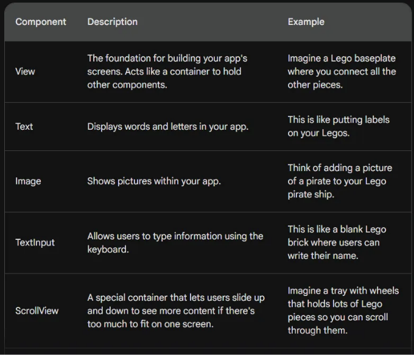

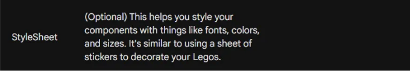

<!-- ui-log 수평형 -->
<ins class="adsbygoogle"
  style="display:block"
  data-ad-client="ca-pub-4877378276818686"
  data-ad-slot="9743150776"
  data-ad-format="auto"
  data-full-width-responsive="true"></ins>
<component is="script">
(adsbygoogle = window.adsbygoogle || []).push({});
</component>

# React Native Core Components — 사용자 인터페이스

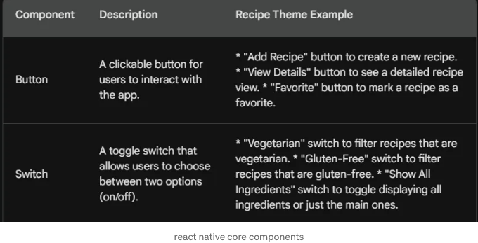

# React Native Core Components — 리스트 뷰

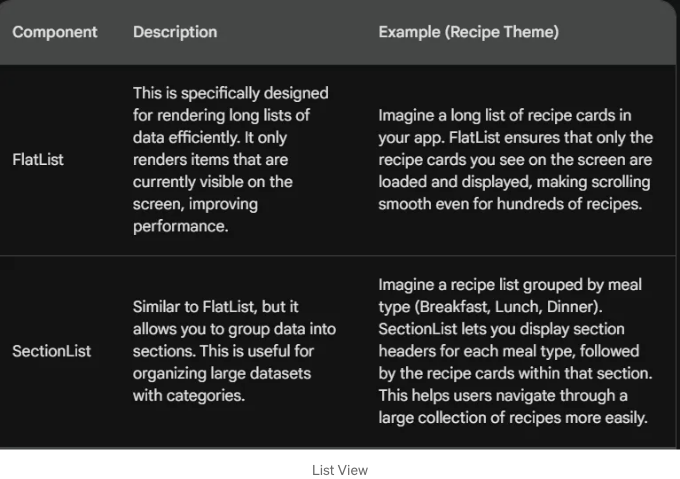

<!-- ui-log 수평형 -->
<ins class="adsbygoogle"
  style="display:block"
  data-ad-client="ca-pub-4877378276818686"
  data-ad-slot="9743150776"
  data-ad-format="auto"
  data-full-width-responsive="true"></ins>
<component is="script">
(adsbygoogle = window.adsbygoogle || []).push({});
</component>

# React Native 안드로이드 전용 컴포넌트 및 API

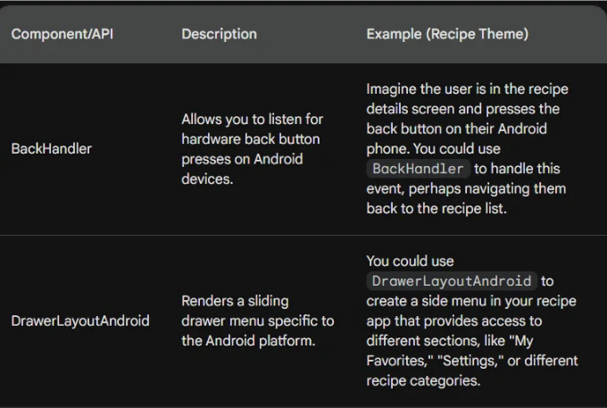

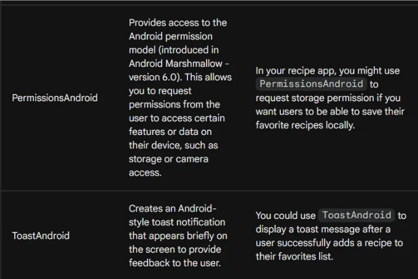

# React Native 다른 컴포넌트 및 API

<!-- ui-log 수평형 -->
<ins class="adsbygoogle"
  style="display:block"
  data-ad-client="ca-pub-4877378276818686"
  data-ad-slot="9743150776"
  data-ad-format="auto"
  data-full-width-responsive="true"></ins>
<component is="script">
(adsbygoogle = window.adsbygoogle || []).push({});
</component>

마크다운 형식으로 변경하면 다음과 같습니다.

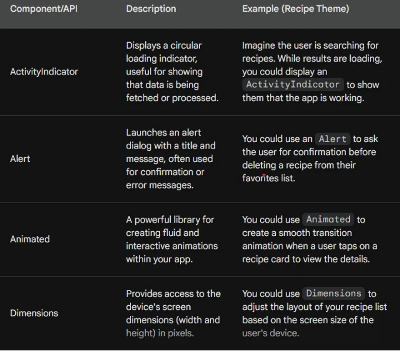

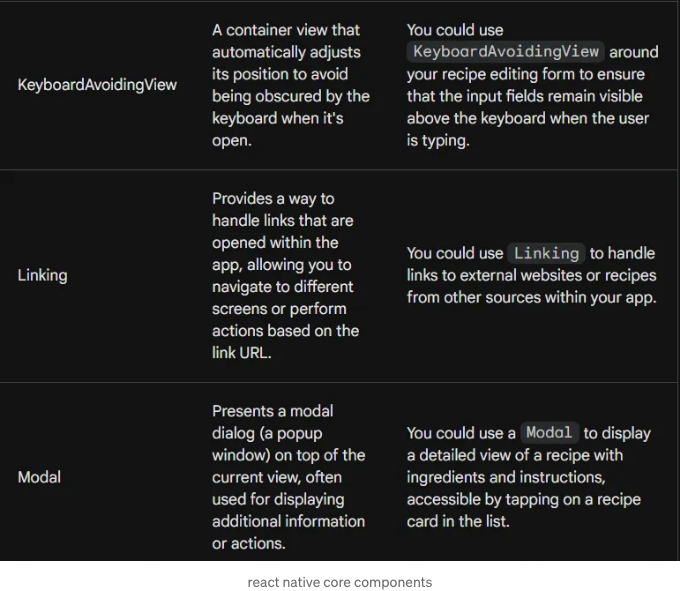

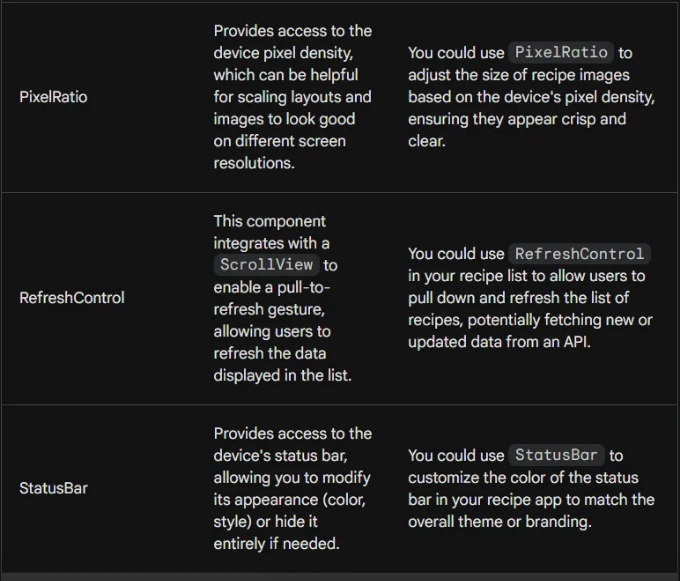

간단한 레시피 모바일 애플리케이션을 개발하면서 배운 것을 적용해봅시다!

<!-- ui-log 수평형 -->
<ins class="adsbygoogle"
  style="display:block"
  data-ad-client="ca-pub-4877378276818686"
  data-ad-slot="9743150776"
  data-ad-format="auto"
  data-full-width-responsive="true"></ins>
<component is="script">
(adsbygoogle = window.adsbygoogle || []).push({});
</component>

Ready to get started? Let's create a simple recipe app step by step!

Recipe.jsx

```js
import React from 'react';
import {View, Text, Image, TouchableOpacity} from 'react-native';
import styles from '../styles/RecipeStyles';

const Recipe = ({recipe, onViewDetails}) => {
  const handlePress = () => onViewDetails(recipe);

  return (
    <View style={styles.recipeContainer}>
      <Image
       
        source={recipe.image}
        style={styles.recipeImage}
        accessibilityLabel={`Image of ${recipe.name}`}
      />
      <Text style={styles.recipeTitle} accessibilityRole="header">
        {recipe.name}
      </Text>
      <Text style={styles.recipeDescription}>{recipe.description}</Text>
      <TouchableOpacity
        style={styles.button}
        onPress={handlePress}
        accessibilityLabel="View details">
        <Text style={styles.buttonText}>View Details</Text>
      </TouchableOpacity>
    </View>
  );
};

export default Recipe;
```

RecipeDetails.jsx

<!-- ui-log 수평형 -->
<ins class="adsbygoogle"
  style="display:block"
  data-ad-client="ca-pub-4877378276818686"
  data-ad-slot="9743150776"
  data-ad-format="auto"
  data-full-width-responsive="true"></ins>
<component is="script">
(adsbygoogle = window.adsbygoogle || []).push({});
</component>

```js
import React, {useState, useEffect} from 'react';
import {View, Text, Image, Button, Alert, StyleSheet, ScrollView} from 'react-native';
import AsyncStorage from '@react-native-async-storage/async-storage';
import ModalComponent from './ModalComponent';
import styles from '../styles/RecipeStyles'; // Ensure this is the correct path
import {globalStyles, colors} from '../styles/globalStyles';

const RecipeDetails = ({route}) => {
  const {recipe} = route.params || {};
  const [modalVisible, setModalVisible] = useState(false);
  const [note, setNote] = useState('');
  const [editingNote, setEditingNote] = useState(false); // 노트를 추가하는지 편집하는지 추적하기 위한 상태

  useEffect(() => {
    if (recipe && recipe.id) {
      loadNote();
    }
  }, [recipe?.id]);

  const loadNote = async () => {
    try {
      const storedNote = await AsyncStorage.getItem(`note_${recipe.id}`);
      if (storedNote !== null) {
        setNote(storedNote);
      }
    } catch (error) {
      Alert.alert('에러', '노트 로드에 실패했습니다.');
    }
  };

  const handleSaveNote = async newNote => {
    try {
      await AsyncStorage.setItem(`note_${recipe.id}`, newNote);
      setNote(newNote);
      Alert.alert('성공', '노트가 성공적으로 저장되었습니다!');
      setModalVisible(false); // 저장 후 모달 닫기
    } catch (error) {
      Alert.alert('에러', '노트 저장에 실패했습니다.');
    }
  };

  const handleEditNote = () => {
    setEditingNote(true);
    setModalVisible(true); // 편집을 위해 모달 열기
  };

  const handleDeleteNote = async () => {
    try {
      await AsyncStorage.removeItem(`note_${recipe.id}`);
      setNote('');
      Alert.alert('성공', '노트가 성공적으로 삭제되었습니다!');
    } catch (error) {
      Alert.alert('에러', '노트 삭제에 실패했습니다.');
    }
  };

 
  if (!recipe) {
    return (
      <View style={globalStyles.container}>
        <Text style={styles.titleText}>
          죄송합니다! 레시피 데이터를 찾을 수 없어요. 😊 레시피 세부 정보를 보기 위해 뒤로 가서 클릭해주세요.
        </Text>
      </View>
    );
  }

  return (
    <View style={styles.container}>
      <Image
        resizeMode="contain"
        source={recipe.image}
        style={styles.recipeImage}
      />
      <Text style={styles.recipeTitle}>{recipe.name}</Text>
      <Text style={styles.recipeDescription}>{recipe.description}</Text>
      {note ? (
        <>
          <Text style={styles.note}>노트: {note}</Text>
          <Button title="노트 편집" onPress={handleEditNote} />
          <Button title="노트 삭제" onPress={handleDeleteNote} />
        </>
      ) : (
        <Button title="노트 추가" onPress={() => setModalVisible(true)} />
      )}
      <ModalComponent
        isVisible={modalVisible}
        onClose={() => setModalVisible(false)}
        onSubmit={handleSaveNote}
        initialValue={editingNote ? note : ''}
        editing={editingNote}
      />
    </View>
  );
};

export default RecipeDetails;
```

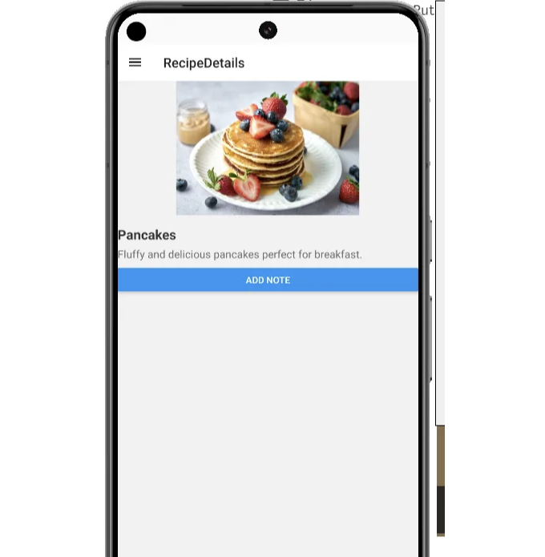

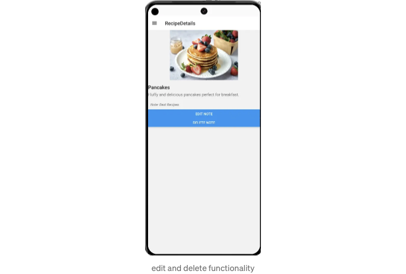

RecipeCarousel.jsx

<!-- ui-log 수평형 -->
<ins class="adsbygoogle"
  style="display:block"
  data-ad-client="ca-pub-4877378276818686"
  data-ad-slot="9743150776"
  data-ad-format="auto"
  data-full-width-responsive="true"></ins>
<component is="script">
(adsbygoogle = window.adsbygoogle || []).push({});
</component>

```js
import React from 'react';
import {Dimensions} from 'react-native';
import Carousel from 'react-native-snap-carousel';
import CarouselItem from './CarouselItem';

const screenWidth = Dimensions.get('window').width;

const RecipeCarousel = ({data}) => {
  const renderItem = ({item}) => <CarouselItem item={item} />;

  // Carousel에 데이터를 전달하기 전에 데이터가 배열인지 확인합니다.
  if (!Array.isArray(data) || data.length === 0) {
    return null;
  }

  return (
    <Carousel
      data={data}
      renderItem={renderItem}
      sliderWidth={screenWidth}
      itemWidth={300}
      loop={true}
    />
  );
};

export default RecipeCarousel;
```

RecipeChart.jsx

```js
import React from 'react';
import {LineChart} from 'react-native-chart-kit';
import {Dimensions} from 'react-native';

const screenWidth = Dimensions.get('window').width;

const RecipeLineChart = ({data}) => {
  return (
    <LineChart
      data={data}
      width={screenWidth - 40}
      height={220}
      chartConfig={{
        backgroundColor: '#e26a00',
        backgroundGradientFrom: '#fb8c00',
        backgroundGradientTo: '#ffa726',
        decimalPlaces: 2,
        color: (opacity = 1) => `rgba(255, 255, 255, ${opacity})`,
        labelColor: (opacity = 1) => `rgba(255, 255, 255, ${opacity})`,
        style: {borderRadius: 16},
        propsForDots: {r: '6', strokeWidth: '2', stroke: '#ffa726'},
      }}
      bezier
      style={{marginVertical: 8, borderRadius: 16}}
    />
  );
};

export default RecipeLineChart;
```

CarouselItem.jsx

<!-- ui-log 수평형 -->
<ins class="adsbygoogle"
  style="display:block"
  data-ad-client="ca-pub-4877378276818686"
  data-ad-slot="9743150776"
  data-ad-format="auto"
  data-full-width-responsive="true"></ins>
<component is="script">
(adsbygoogle = window.adsbygoogle || []).push({});
</component>

```js
import React from 'react';
import {View, Text, Image, Alert} from 'react-native';
import {globalStyles} from '../styles/globalStyles';

const CarouselItem = ({item}) => {
  const showDetails = () => {
    Alert.alert(
      item.name,
      `영양 정보:\n칼로리: ${item.nutritionFacts.calories}\n지방: ${item.nutritionFacts.fat}\n탄수화물: ${item.nutritionFacts.carbs}\n단백질: ${item.nutritionFacts.protein}\n\n총량: ${item.servingSize}`,
      [{text: '확인'}],
    );
  };

  return (
    <View style={globalStyles.carouselItem}>
      <Image
        source={item.image}
        style={{width: 300, height: 200, borderRadius: 10}}
        resizeMode="cover"
      />
      <Text style={globalStyles.titleText}>{item.name}</Text>
      <Text onPress={showDetails} style={globalStyles.subtitleText}>
        세부 정보를 확인하려면 탭하세요!
      </Text>
    </View>
  );
};

export default CarouselItem;
```

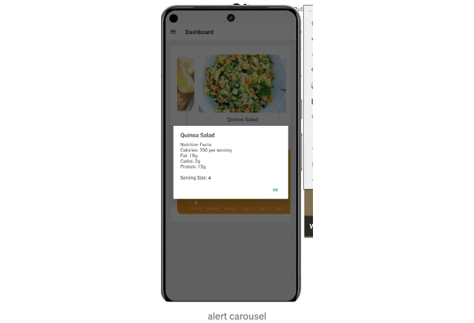

```js
import React, {useState} from 'react';
import {Modal, View, Text, Button, TextInput} from 'react-native';
import {globalStyles, colors} from '../styles/globalStyles'; // 전역 스타일 가져오기

const ModalComponent = ({isVisible, onClose, onSubmit, recipeName}) => {
  const [note, setNote] = useState('');

  const handleSave = () => {
    onSubmit(note);
    onClose(); // 저장 후 모달 닫기
    setNote(''); // 닫은 후 노트 입력 초기화
  };

  return (
    <Modal
      animationType="slide"
      transparent={true}
      visible={isVisible}
      onRequestClose={onClose}>
      <View style={globalStyles.centeredView}>
        <View style={globalStyles.modalView}>
          <Text style={globalStyles.modalText}>
            {recipeName}에 노트 추가:
          </Text>
          <TextInput
            style={globalStyles.input}
            onChangeText={setNote}
            value={note}
            placeholder="노트를 입력하세요"
            multiline
            numberOfLines={4}
          />
          <Button
            title="노트 저장"
            onPress={handleSave}
            color={colors.button}
          />
          <Button title="취소" onPress={onClose} color="red" />
        </View>
      </View>
    </Modal>
  );
};

export default ModalComponent;
```

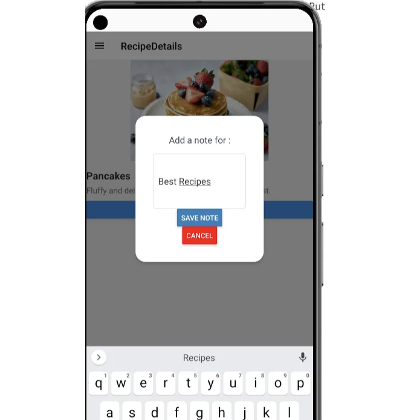

<!-- ui-log 수평형 -->
<ins class="adsbygoogle"
  style="display:block"
  data-ad-client="ca-pub-4877378276818686"
  data-ad-slot="9743150776"
  data-ad-format="auto"
  data-full-width-responsive="true"></ins>
<component is="script">
(adsbygoogle = window.adsbygoogle || []).push({});
</component>

MostPopularRecipe.jsx

```js
// MostPopularRecipe.js
import React from 'react';
import {Text} from 'react-native';
import {globalStyles} from '../styles/globalStyles';

const MostPopularRecipe = ({data}) => {
  const mostPopular = data.reduce(
    (prev, current) => (prev.views > current.views ? prev : current),
    data[0],
  );

  return (
    <Text style={globalStyles.paragraph}>
      Most Popular Recipe: {mostPopular.name}
    </Text>
  );
};

export default MostPopularRecipe;
```

Dashboard.jsx

```js
// Dashboard.jsx
import React, { useState, useEffect } from 'react';
import { ScrollView, View, RefreshControl } from 'react-native';
import { globalStyles } from '../styles/globalStyles';
import recipeData from '../data/recipeData'; // Ensure this is the correct path
import RecipeCarousel from './RecipeCarousel';
import RecipeLineChart from './RecipeLineChart';
import MostPopularRecipe from './MostPopularRecipe';

const Dashboard = () => {
    const [refreshing, setRefreshing] = useState(false);
    const data = {
        labels: ['January', 'February', 'March', 'April', 'May', 'June'],
        datasets: [{ data: [0, 20, 45, 28, 80, 99, 43], strokeWidth: 2 }]
    };

    const onRefresh = () => {
        setRefreshing(true);
        // Simulate a refresh of data
        setTimeout(() => {
            // Here you might fetch new data and set it
            setRefreshing(false);
        }, 1000);
    };

    return (
        <ScrollView
            style={globalStyles.container}
            refreshControl={<RefreshControl refreshing={refreshing} onRefresh={onRefresh} />}
        >
            <View style={globalStyles.modalContent}>
               <RecipeCarousel data={recipeData} />
                <MostPopularRecipe data={recipeData} />
                <RecipeLineChart data={data} />
            </View>
        </ScrollView>
    );
};

export default Dashboard;
```

<!-- ui-log 수평형 -->
<ins class="adsbygoogle"
  style="display:block"
  data-ad-client="ca-pub-4877378276818686"
  data-ad-slot="9743150776"
  data-ad-format="auto"
  data-full-width-responsive="true"></ins>
<component is="script">
(adsbygoogle = window.adsbygoogle || []).push({});
</component>

표 태그를 Markdown 형식으로 변경하십시오.

<!-- ui-log 수평형 -->
<ins class="adsbygoogle"
  style="display:block"
  data-ad-client="ca-pub-4877378276818686"
  data-ad-slot="9743150776"
  data-ad-format="auto"
  data-full-width-responsive="true"></ins>
<component is="script">
(adsbygoogle = window.adsbygoogle || []).push({});
</component>

```js
/**
 * 검색 텍스트와 식이요법 기호에 기반한 레시피 필터링 기능입니다.
 *
 * @param {Array} recipes - 레시피 객체의 배열입니다.
 * @param {string} searchText - 레시피의 이름 또는 설명을 기준으로 필터링할 텍스트입니다.
 * @param {boolean} isVegetarian - 채식주의자 레시피만 필터링할지 여부입니다.
 * @param {boolean} isGlutenFree - 글루텐 프리 레시피만 필터링할지 여부입니다.
 * @returns {Array} - 필터링된 레시피의 배열입니다.
 */
const FilterRecipes = (recipes, searchText, isVegetarian, isGlutenFree) => {
  let filteredRecipes = recipes;

  // 검색 텍스트로 필터링
  if (searchText) {
    filteredRecipes = filteredRecipes.filter(
      recipe =>
        recipe.name.toLowerCase().includes(searchText.toLowerCase()) ||
        recipe.description.toLowerCase().includes(searchText.toLowerCase()),
    );
  }

  // 채식주의자 기호로 필터링
  if (isVegetarian) {
    filteredRecipes = filteredRecipes.filter(recipe =>
      recipe.dietaryTags.includes('vegetarian'),
    );
  }

  // 글루텐 프리 기호로 필터링
  if (isGlutenFree) {
    filteredRecipes = filteredRecipes.filter(recipe =>
      recipe.dietaryTags.includes('gluten-free'),
    );
  }

  return filteredRecipes;
};

export default FilterRecipes;
```

Homescreen.jsx

```js
import React, { useState, useEffect, useCallback } from 'react';
import { View, FlatList, Text, TextInput, Switch, StyleSheet } from 'react-native';
import Recipe from '../components/Recipe';
import recipesData from '../data/recipeData';
import { globalStyles, colors } from '../styles/globalStyles';
import FilterRecipes from '../utils/FilterRecipes';

// 추가로 사용되는 로컬 스타일
const styles = StyleSheet.create({
  searchContainer: {
    padding: 1,
    backgroundColor: colors.background,
  },
  input: {
    ...globalStyles.input,
    marginVertical: 10,
  },
  toggleContainer: {
    flexDirection: 'row',
    alignItems: 'center',
    justifyContent: 'space-between',
    padding: 10,
    backgroundColor: colors.background,
  },
  label: {
    ...globalStyles.paragraph,
  },
});

const HomeScreen = ({ navigation }) => {
 
    const [searchText, setSearchText] = useState('');
    const [recipes, setRecipes] = useState([]);
    const [filteredRecipes, setFilteredRecipes] = useState([]);
    const [isVegetarian, setIsVegetarian] = useState(false);
    const [isGlutenFree, setIsGlutenFree] = useState(false);

    useEffect(() => {
      // 피치 호출 지연 시뮬레이션
      setTimeout(() => {
        setRecipes(recipesData);
        setFilteredRecipes(recipesData);
      }, 1000);
    }, []);

    // 컴포넌트 내에서:
    const handleSearchChange = useCallback(
      text => {
        setSearchText(text);
        const filtered = FilterRecipes(
          recipes,
          text,
          isVegetarian,
          isGlutenFree,
        );
        setFilteredRecipes(filtered);
      },
      [recipes, isVegetarian, isGlutenFree],
    );

    const toggleVegetarian = () => {
      setIsVegetarian(!isVegetarian);
      const filtered = FilterRecipes(
        recipes,
        searchText,
        !isVegetarian,
        isGlutenFree,
      );
      setFilteredRecipes(filtered);
    };

    const toggleGlutenFree = () => {
      setIsGlutenFree(!isGlutenFree);
      const filtered = FilterRecipes(
        recipes,
        searchText,
        isVegetarian,
        !isGlutenFree,
      );
      setFilteredRecipes(filtered);
    };

    return (
    <View style={globalStyles.container}>
      <View style={styles.searchContainer}>
        <TextInput
          style={styles.input}
          placeholder="레시피 검색..."
          onChangeText={handleSearchChange}
          value={searchText}
        />
      </View>
      <View style={styles.toggleContainer}>
        <Text style={styles.label}>채식주의자</Text>
        <Switch
          trackColor={{ false: '#767577', true: colors.accent }}
          thumbColor={isVegetarian ? colors.primary : '#f4f3f4'}
          onValueChange={toggleVegetarian}
          value={isVegetarian}
        />
      </View>
      <View style={styles.toggleContainer}>
        <Text style={styles.label}>글루텐프리</Text>
        <Switch
          trackColor={{ false: '#767577', true: colors.accent }}
          thumbColor={isGlutenFree ? colors.primary : '#f4f3f4'}
          onValueChange={toggleGlutenFree}
          value={isGlutenFree}
        />
      </View>
      <FlatList
        data={filteredRecipes}
        renderItem={({ item }) => (
          <Recipe
            recipe={item}
            onViewDetails={() =>
              navigation.navigate('RecipeDetails', { recipe: item })
            }
          />
        )}
        keyExtractor={item => item.id.toString()}
      />
    </View>
  );
};

export default HomeScreen;
```

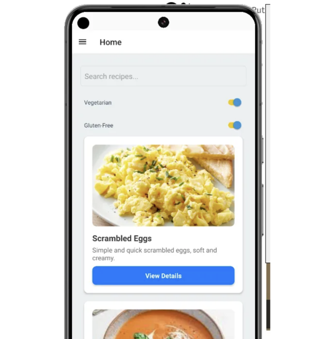```

<!-- ui-log 수평형 -->
<ins class="adsbygoogle"
  style="display:block"
  data-ad-client="ca-pub-4877378276818686"
  data-ad-slot="9743150776"
  data-ad-format="auto"
  data-full-width-responsive="true"></ins>
<component is="script">
(adsbygoogle = window.adsbygoogle || []).push({});
</component>

AppNavigator.jsx

```js
import React from 'react';
import {NavigationContainer} from '@react-navigation/native';
import {createDrawerNavigator} from '@react-navigation/drawer';
import HomeScreen from '../screens/HomeScreen';
import RecipeDetails from '../components/RecipeDetails';
import Dashboard from '../components/Dashboard'; // 대시보드 가져오기

const Drawer = createDrawerNavigator();

const AppNavigator = () => (
  <NavigationContainer>
    <Drawer.Navigator initialRouteName="Home">
      <Drawer.Screen name="Home" component={HomeScreen} />
      <Drawer.Screen name="RecipeDetails" component={RecipeDetails} />
      <Drawer.Screen name="Dashboard" component={Dashboard} />
    </Drawer.Navigator>
  </NavigationContainer>
);

export default AppNavigator;
```

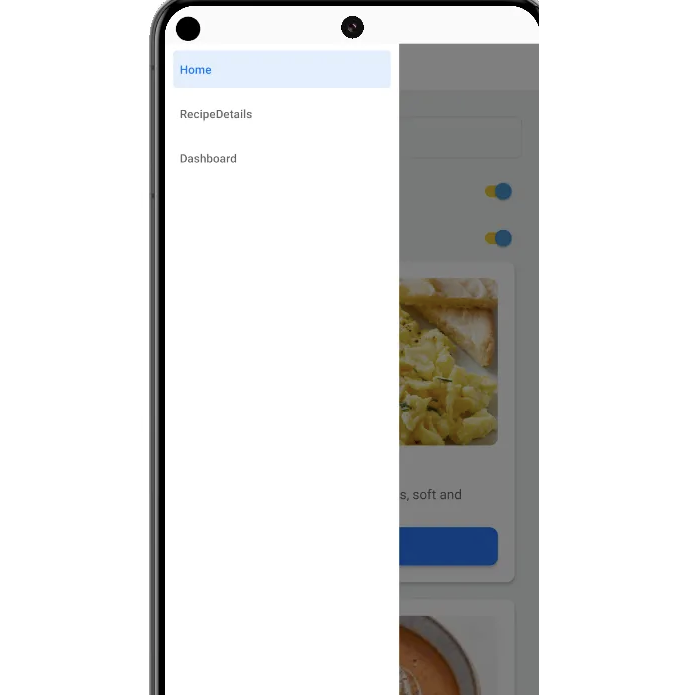 

App.js

<!-- ui-log 수평형 -->
<ins class="adsbygoogle"
  style="display:block"
  data-ad-client="ca-pub-4877378276818686"
  data-ad-slot="9743150776"
  data-ad-format="auto"
  data-full-width-responsive="true"></ins>
<component is="script">
(adsbygoogle = window.adsbygoogle || []).push({});
</component>

```js
import React from 'react';
import {KeyboardAvoidingView, StatusBar} from 'react-native';
import {SafeAreaProvider, SafeAreaView} from 'react-native-safe-area-context';
import AppNavigator from './src/navigation/AppNavigator';


const App = () => {
  return (

      <SafeAreaProvider>
        <SafeAreaView style={flex: 1}>
          <KeyboardAvoidingView behavior="padding" style={flex: 1}>
            <StatusBar barStyle="dark-content" />
            <AppNavigator />
          </KeyboardAvoidingView>
        </SafeAreaView>
      </SafeAreaProvider>
   
  );
};

export default App;
```

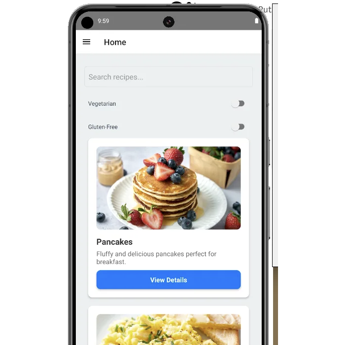

리액트 네이티브 모험에 함께 해 주셔서 감사합니다! 새로운 것을 배우고 멋진 앱을 만들 준비가 되셨기를 바랍니다 🚀. 즐거운 코딩 되세요! 😄

더 많은 학습을 원하시면 공식 문서를 방문해 주세요: https://reactnative.dev/docs/components-and-apis

<!-- ui-log 수평형 -->
<ins class="adsbygoogle"
  style="display:block"
  data-ad-client="ca-pub-4877378276818686"
  data-ad-slot="9743150776"
  data-ad-format="auto"
  data-full-width-responsive="true"></ins>
<component is="script">
(adsbygoogle = window.adsbygoogle || []).push({});
</component>

# 스택델믹 🎓

끝까지 읽어 주셔서 감사합니다. 떠나시기 전에:

- 작가를 클랩하고 팔로우해주시면 감사하겠습니다! 👏
- 팔로우하기: X | LinkedIn | YouTube | Discord
- 다른 플랫폼 방문하기: In Plain English | CoFeed | Venture | Cubed
- 스택델믹닷컴에서 더 많은 콘텐츠를 확인해보세요