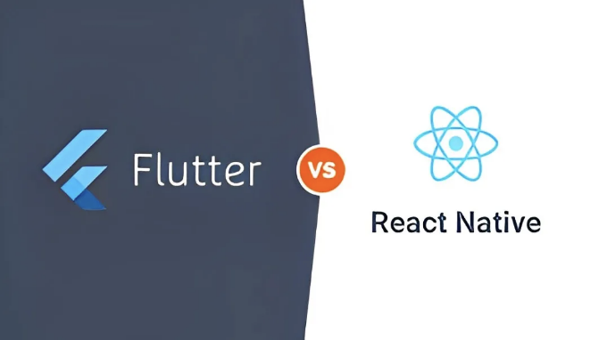

안녕하세요 여러분! 오늘은 모바일 앱을 만들기 위한 두 가지 인기 있는 도구인 Flutter와 React Native에 대해 이야기하려고 해요. 새로운 앱 프로젝트를 시작할 계획이 있다면, 이 비교가 사용할 도구를 결정하는 데 도움이 될지도 몰라요.

## Flutter와 React Native란?

- Flutter는 구글에서 만든 도구로, 단일 코드베이스에서 모바일, 웹 및 데스크톱용으로 매우 부드럽고 빠른 앱을 만들 수 있도록 도와줘요.
- React Native는 페이스북에서 나온 것으로, JavaScript를 사용하여 모바일 앱을 만들 수 있게 해줘요. Android와 iOS 양쪽에 동일한 코드를 사용해서 작업이 쉬워져요.

<!-- ui-log 수평형 -->
<ins class="adsbygoogle"
  style="display:block"
  data-ad-client="ca-pub-4877378276818686"
  data-ad-slot="9743150776"
  data-ad-format="auto"
  data-full-width-responsive="true"></ins>
<component is="script">
(adsbygoogle = window.adsbygoogle || []).push({});
</component>

# 무엇을 비교해야 할까요?

플러터(Flutter)와 리액트 네이티브(React Native) 중에서 선택하는 것은 어려울 수 있습니다. 두 가지 모두 멋진 기능을 제공하지만 프로젝트에 영향을 미칠 수 있는 몇 가지 차이점이 있습니다.

# 속도와 성능

- Flutter: 빠르다는 것으로 유명합니다. 자체 위젯을 갖고 있기 때문에 실행 플랫폼에 의존하지 않아 앱이 더 부드럽고 빠르게 실행될 수 있습니다.
- React Native: 이 역시 빠른 편이지만, 플랫폼의 네이티브 구성 요소에 더 의존하기 때문에 때로는 플러터만큼 부드럽지 않을 수도 있습니다.

<!-- ui-log 수평형 -->
<ins class="adsbygoogle"
  style="display:block"
  data-ad-client="ca-pub-4877378276818686"
  data-ad-slot="9743150776"
  data-ad-format="auto"
  data-full-width-responsive="true"></ins>
<component is="script">
(adsbygoogle = window.adsbygoogle || []).push({});
</component>

# 사용 편의성

- Flutter: 처음 사용할 때는 Dart라는 프로그래밍 언어에 익숙하지 않다면 Flutter가 조금 어려울 수 있습니다. 하지만 익숙해지면 얼마나 강력한지 알 수 있을 겁니다.
- React Native: JavaScript를 이미 알고 있다면 React Native가 시작하기 쉬울 것입니다.

# 커뮤니티와 지원

- Flutter와 React Native은 모두 강력한 커뮤니티를 갖고 있습니다. 질문을 할 수 있는 많은 자습서와 포럼을 찾을 수 있습니다. 그러나 최근 Flutter가 많은 주목을 받고 있으며 커뮤니티가 빠르게 성장하고 있습니다.

<!-- ui-log 수평형 -->
<ins class="adsbygoogle"
  style="display:block"
  data-ad-client="ca-pub-4877378276818686"
  data-ad-slot="9743150776"
  data-ad-format="auto"
  data-full-width-responsive="true"></ins>
<component is="script">
(adsbygoogle = window.adsbygoogle || []).push({});
</component>

# 결론

플러터(Flutter)와 리액트 네이티브(React Native)는 모바일 앱을 개발하기 위한 훌륭한 선택지입니다. 성능이 최우선 사항이라면 플러터를 선호할지도 모릅니다. 빠르게 시작하고 JavaScript 기술을 활용하고 싶다면 리액트 네이티브가 좋은 선택일 수 있습니다.

여러분은 어떻게 생각하시나요? 플러터나 리액트 네이티브로 앱을 개발해보신 적이 있나요? 여러분의 경험을 댓글로 공유해주세요!