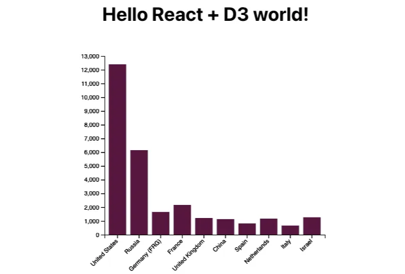
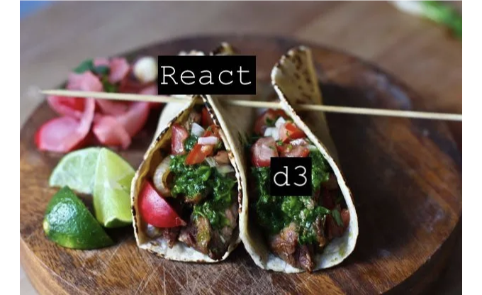

타코에 대한 내가 좋아하는 두 가지 재미있는 사실은 그것들을 아무 것이나 (정말로!) 채울 수 있고, 그리고 그들을 축하하는 날이 있다는 것입니다 (미국에서는 10월 4일)!

(여기서 잠깐 주목해야 할 사항이 있습니다. Exploding Kittens 카드 게임의 창조자들과 나의 타코에 대한 사랑이 서로 공유된다는 것인데, 그들이 TACOCAT 카드, TACOCAT 플러시, 그리고 TACOCAT Spelled Backwards 보드게임과 같은 모든 종류의 타코 고양이 유물을 만들 때, 나는 보드 게임 중독자가 아닙니다 *윙크 윙크*.)


사이드바가 끝나면, 왜 나는 타코에 대해 언급하고 있는 걸까요? 음, 여기서의 비유가 조금 억지스러울 수 있지만, React와 D3.js를 결합하는 것은 타코를 만드는 과정과 비슷하다고 믿습니다. React는 맛있는 타코 껍데기를 이루는 흰 옥수수 토르티야처럼, D3는 타코 안의 충전물처럼 작용합니다. React가 시각을 담당하며, D3는 React 구성 요소를 맛있는 시각화로 채웁니다.

<!-- ui-log 수평형 -->
<ins class="adsbygoogle"
  style="display:block"
  data-ad-client="ca-pub-4877378276818686"
  data-ad-slot="9743150776"
  data-ad-format="auto"
  data-full-width-responsive="true"></ins>
<component is="script">
(adsbygoogle = window.adsbygoogle || []).push({});
</component>

저는 연구소 동료들의 업무 흐름과 업계의 표준 관행을 기반으로 이 두 도구를 배우기로 결정했습니다. 이미 존재하는 React와 D3 코드를 결합하여 작동시키는 실용적인 예시를 온라인으로 찾을 수 없어서, React와 D3 학습 과정을 공유하기 위해 짧은 글을 작성하기로 결심했습니다. 이 글이 이 두 라이브러리를 함께(조화롭게, 오류 없이) 작동하도록 하려는 다른 사람들에게 도움이 되길 바랍니다.

# 준비물

이 자습서를 따라가려면 React와 D3에 대한 초보자 수준의 이해가 필요합니다. 나중에는 React와 D3를 학습할 때 항상 자주 돌아오는 가치 있는 자료들의 목록을 만들어 공유하겠습니다. 이 자습서의 끝에 브라우저에서 볼 수 있는 시각화는 아래와 같습니다:



<!-- ui-log 수평형 -->
<ins class="adsbygoogle"
  style="display:block"
  data-ad-client="ca-pub-4877378276818686"
  data-ad-slot="9743150776"
  data-ad-format="auto"
  data-full-width-responsive="true"></ins>
<component is="script">
(adsbygoogle = window.adsbygoogle || []).push({});
</component>

자, 그럼 요리 시작해볼까요!

# 재료

이 간단한 레시피는 세 가지 재료만 필요해요:

- React.js 또는 단순히 터미널에서 create-react-app을 사용할 수 있는 능력. 이를 위해 Node.js와 npm을 설치해야 해요 (이는 Node.js 설치와 함께 제공됩니다). macOS 사용자는 이 지침을 따라 스텝 4까지 진행하시거나 윈도우 사용자는 다른 웹사이트의 필수 사항 단계를 따르시면 돼요.
- D3.js: 지금 사용할 시각화 라이브러리입니다. 이후에 프로젝트에 추가할 거에요.  
- React 구성 요소에 임베드할 D3 예제: 시작을 위해 간단한 막대 차트를 선택했어요: https://d3-graph-gallery.com/graph/barplot_basic.html

<!-- ui-log 수평형 -->
<ins class="adsbygoogle"
  style="display:block"
  data-ad-client="ca-pub-4877378276818686"
  data-ad-slot="9743150776"
  data-ad-format="auto"
  data-full-width-responsive="true"></ins>
<component is="script">
(adsbygoogle = window.adsbygoogle || []).push({});
</component>

# 지시 사항

- 공식 리액트 문서를 따라 리액트 앱을 만들어 보세요: https://reactjs.org/docs/create-a-new-react-app.html
터미널을 이용하여 프로젝트 폴더를 저장할 디렉터리로 이동한 뒤, 다음 명령어를 실행하세요:

```js
yarn create react-app react-d3-test
cd react-d3-test
```

물론 npx를 사용해도 되지만, 리액트 앱에 라이브러리를 설치할 때 일관성을 유지하기 위해 동일한 패키지(npm 또는 yarn)를 사용하는 것을 권장합니다:

<!-- ui-log 수평형 -->
<ins class="adsbygoogle"
  style="display:block"
  data-ad-client="ca-pub-4877378276818686"
  data-ad-slot="9743150776"
  data-ad-format="auto"
  data-full-width-responsive="true"></ins>
<component is="script">
(adsbygoogle = window.adsbygoogle || []).push({});
</component>

```js
npx react-app react-d3-test
cd react-d3-test
```

이 명령어는 react-d3-test라는 이름의 싱글 페이지 리액트 앱을 생성하고 프로젝트 폴더로 이동합니다.

2. 프로젝트 폴더 안에 들어가면 라이브러리를 사용하기 위해 d3 종속성을 설치해야 합니다. 다음 명령어를 실행하세요.

```js
yarn add d3
# 또는 NPM을 사용하여:
# npm install d3
```

<!-- ui-log 수평형 -->
<ins class="adsbygoogle"
  style="display:block"
  data-ad-client="ca-pub-4877378276818686"
  data-ad-slot="9743150776"
  data-ad-format="auto"
  data-full-width-responsive="true"></ins>
<component is="script">
(adsbygoogle = window.adsbygoogle || []).push({});
</component>

차트를 리액트 구성 요소로 추가하기 위해 모든 준비가 끝났어요.

3. Index.js는 기본적으로 다음과 같이 보일 거에요:

```js
import React from 'react';
import ReactDOM from 'react-dom';
import './index.css';
import App from './App';
import reportWebVitals from './reportWebVitals';

ReactDOM.render(
  <App />,
  document.getElementById('root')
);

// 앱의 성능을 측정하려면 작업결과를 로깅하는 함수를 전달하거나
// 애널리틱스 엔드포인트로 전송하는 방법 중 어느 것을 선택하세요.
// 더 알아보기: https://bit.ly/CRA-vitals
reportWebVitals();
```

우리의 목적을 고려하여, 리액트의 StrictMode에 대한 귀찮은 이중 렌더링 문제로 인해,
이 간단한 예제를 개발할 때 우리의 삶을 더 쉽게 만들기 위해 StrictMode 태그를 제거하기로 했어요.
따라서 여기 있는 코드는 이렇게 보일 거에요:

<!-- ui-log 수평형 -->
<ins class="adsbygoogle"
  style="display:block"
  data-ad-client="ca-pub-4877378276818686"
  data-ad-slot="9743150776"
  data-ad-format="auto"
  data-full-width-responsive="true"></ins>
<component is="script">
(adsbygoogle = window.adsbygoogle || []).push({});
</component>

```js
const root = ReactDOM.createRoot(document.getElementById('root'));
root.render(
    <App />
);

// 만약 앱에서 성능 측정을 시작하려면 결과를 기록할 함수를 전달하세요
// (예: reportWebVitals(console.log))
// 또는 분석 엔드포인트로 전송하세요. 자세히 알아보기: https://bit.ly/CRA-vitals
reportWebVitals();
```

4. App.js 컴포넌트로 넘어가면, 수정 없이 초기 상태에서는 다음과 같이 보입니다:

```js
import logo from './logo.svg';
import './App.css';

function App() {
  return (
    <div className="App">
      <header className="App-header">
        
        <p>
          Edit <code>src/App.js</code> and save to reload.
        </p>
        <a
          className="App-link"
          href="https://reactjs.org"
          target="_blank"
          rel="noopener noreferrer"
        >
          Learn React
        </a>
      </header>
    </div>
  );
}

export default App;
```

시작 코드는 주로 무용지물이므로, 제목과 가져오고 싶은 Barchart 컴포넌트를 포함하도록 수정할 것입니다.

<!-- ui-log 수평형 -->
<ins class="adsbygoogle"
  style="display:block"
  data-ad-client="ca-pub-4877378276818686"
  data-ad-slot="9743150776"
  data-ad-format="auto"
  data-full-width-responsive="true"></ins>
<component is="script">
(adsbygoogle = window.adsbygoogle || []).push({});
</component>

```js
import './App.css';
import Barchart from './components/Barchart';

function App() {
  return (
    <div className="App">
    <h1>Hello React + D3 world!</h1>
    <Barchart/>
    </div>
  );
}

export default App;
```

5. 이제 가장 흥미로운 부분인 Barchart 컴포넌트를 만들어 봅시다. src 폴더 아래에 'components'라는 디렉토리를 만들고 그 안에 'Barchart.jsx'라는 파일을 만듭니다. 여기에서 먼저 필요한 종속성(d3, useEffect 훅, useRef 훅)을 가져옵니다:

```js
import * as d3 from "d3";
import { useEffect, useRef } from "react";
```

그런 다음, 빈 Barchart 함수 컴포넌트를 생성하고 내보냅니다.

<!-- ui-log 수평형 -->
<ins class="adsbygoogle"
  style="display:block"
  data-ad-client="ca-pub-4877378276818686"
  data-ad-slot="9743150776"
  data-ad-format="auto"
  data-full-width-responsive="true"></ins>
<component is="script">
(adsbygoogle = window.adsbygoogle || []).push({});
</component>

```js
const Barchart = () => {};

export default Barchart;
```

6. 컴포넌트가 마운트될 때 데이터를 한 번만 가져와서 시각화를 만들고 싶습니다. 따라서 useEffect 훅이 유용합니다. 아래에 표시된 대로 d3 예제의 모든 코드를 useEffect 훅의 본문에 추가합니다:

```js
const Barchart = () => {
  // 그래프의 차원 및 여백 설정
  var margin = { top: 30, right: 30, bottom: 70, left: 60 },
    width = 460 - margin.left - margin.right,
    height = 400 - margin.top - margin.bottom;

  // 페이지의 본문에 svg 요소 추가
  var svg = d3
    .select("#my_dataviz")
    .append("svg")
    .attr("width", width + margin.left + margin.right)
    .attr("height", height + margin.top + margin.bottom)
    .append("g")
    .attr("transform", "translate(" + margin.left + "," + margin.top + ")");

  // 데이터 파싱
  d3.csv(
    "https://raw.githubusercontent.com/holtzy/data_to_viz/master/Example_dataset/7_OneCatOneNum_header.csv",
    function (data) {
      // X 축
      var x = d3
        .scaleBand()
        .range([0, width])
        .domain(
          data.map(function (d) {
            return d.Country;
          })
        )
        .padding(0.2);
      svg
        .append("g")
        .attr("transform", "translate(0," + height + ")")
        .call(d3.axisBottom(x))
        .selectAll("text")
        .attr("transform", "translate(-10,0)rotate(-45)")
        .style("text-anchor", "end");

      // Y 축 추가
      var y = d3.scaleLinear().domain([0, 13000]).range([height, 0]);
      svg.append("g").call(d3.axisLeft(y));

      // 막대 그래프
      svg
        .selectAll("mybar")
        .data(data)
        .enter()
        .append("rect")
        .attr("x", function (d) {
          return x(d.Country);
        })
        .attr("y", function (d) {
          return y(d.Value);
        })
        .attr("width", x.bandwidth())
        .attr("height", function (d) {
          return height - y(d.Value);
        })
        .attr("fill", "#69b3a2");
    }
  );
};

export default Barchart;
```

React와 함께 이 d3 예제를 작동하도록 만들기 위해 몇 가지 변경 사항이 있습니다. 먼저 svg를 선택할 때 index.html에 "my_dataviz" id로 된 svg가 없습니다. 이 문제를 해결하는 방법은 useRef 훅을 사용하는 것입니다. React 문서에서 useRef에 대해 다음과 같이 설명합니다:```

<!-- ui-log 수평형 -->
<ins class="adsbygoogle"
  style="display:block"
  data-ad-client="ca-pub-4877378276818686"
  data-ad-slot="9743150776"
  data-ad-format="auto"
  data-full-width-responsive="true"></ins>
<component is="script">
(adsbygoogle = window.adsbygoogle || []).push({});
</component>

따라서, useEffect 훅 이전에 ref를 생성하고 다음과 같이 d3.select 메서드에 전달하십시오:

```js
const Barchart = () => {
  const ref = useRef();

  useEffect(() => {

    ...

    const svg = d3
      .select(ref.current)
      .append("svg")
      .attr("width", width + margin.left + margin.right)
      .attr("height", height + margin.top + margin.bottom)
      .append("g")
      .attr("transform", `translate(${margin.left},${margin.top})`);

    ...

  }, []);
};
```

참조를 추가해야 하는 또 다른 위치는 컴포넌트가 반환하는 svg의 ref 속성입니다:

```js
const Barchart = () => {
  const ref = useRef();

  useEffect(() => {

    ...

  }, []);

  return <svg width={460} height={400} id="barchart" ref={ref} />;
};
```

<!-- ui-log 수평형 -->
<ins class="adsbygoogle"
  style="display:block"
  data-ad-client="ca-pub-4877378276818686"
  data-ad-slot="9743150776"
  data-ad-format="auto"
  data-full-width-responsive="true"></ins>
<component is="script">
(adsbygoogle = window.adsbygoogle || []).push({});
</component>

전체 Barchart.jsx 코드는 모든 소스와 토핑을 모두 포함할 때 다음과 같이 보입니다:

```js
import * as d3 from "d3";
import { useEffect, useRef } from "react";

const Barchart = () => {
  const ref = useRef();

  useEffect(() => {
    // 그래프의 차원 및 여백을 설정
    const margin = { top: 30, right: 30, bottom: 70, left: 60 },
      width = 460 - margin.left - margin.right,
      height = 400 - margin.top - margin.bottom;

    // 페이지의 본문에 svg 개체를 추가
    const svg = d3
      .select(ref.current)
      .append("svg")
      .attr("width", width + margin.left + margin.right)
      .attr("height", height + margin.top + margin.bottom)
      .append("g")
      .attr("transform", `translate(${margin.left},${margin.top})`);

    // 데이터 파싱
    d3.csv(
      "https://raw.githubusercontent.com/holtzy/data_to_viz/master/Example_dataset/7_OneCatOneNum_header.csv"
    ).then(function (data) {
      // X 축
      const x = d3
        .scaleBand()
        .range([0, width])
        .domain(data.map((d) => d.Country))
        .padding(0.2);
      svg
        .append("g")
        .attr("transform", `translate(0, ${height})`)
        .call(d3.axisBottom(x))
        .selectAll("text")
        .attr("transform", "translate(-10,0)rotate(-45)")
        .style("text-anchor", "end");

      // Y 축 추가
      const y = d3.scaleLinear().domain([0, 13000]).range([height, 0]);
      svg.append("g").call(d3.axisLeft(y));

      // 막대 그래프
      svg
        .selectAll("mybar")
        .data(data)
        .join("rect")
        .attr("x", (d) => x(d.Country))
        .attr("y", (d) => y(d.Value))
        .attr("width", x.bandwidth())
        .attr("height", (d) => height - y(d.Value))
        .attr("fill", "#5f0f40"); // 색상 변경
    });
  }, []);

  return <svg width={460} height={400} id="barchart" ref={ref} />;
};

export default Barchart;
```

*최종 결과를 위해 막대의 색상만 변경하여 미적으로 더 매력적으로 만들었습니다 (아주 조금).

7. 이제 그 토르티야를 예열해야 해요! 다음 명령어를 터미널에서 실행하여 브라우저에서 로컬 애플리케이션을 실행하세요.

<!-- ui-log 수평형 -->
<ins class="adsbygoogle"
  style="display:block"
  data-ad-client="ca-pub-4877378276818686"
  data-ad-slot="9743150776"
  data-ad-format="auto"
  data-full-width-responsive="true"></ins>
<component is="script">
(adsbygoogle = window.adsbygoogle || []).push({});
</component>

```js
yarn start
# 또는 NPM 사용
# npm start
```

그리고 헐레벌떡! 당신의 눈 앞에 탁월한 React 토르티야에서 제공되는 맛있는 d3 막대 차트입니다.



# 소스에 대한 일부 최종 생각...

<!-- ui-log 수평형 -->
<ins class="adsbygoogle"
  style="display:block"
  data-ad-client="ca-pub-4877378276818686"
  data-ad-slot="9743150776"
  data-ad-format="auto"
  data-full-width-responsive="true"></ins>
<component is="script">
(adsbygoogle = window.adsbygoogle || []).push({});
</component>

타코에는 크리미 치포틀 랜치 드레싱이나 살사 베르데가 잘 어울려요 (나중에 고마워할 거에요).

이 게시물을 읽어 주셔서 감사합니다. 미래에 React + D3에 대한 연구 결과에 대해 쓰는 것을 기대하고 있으며, 그 글이 맛있는 타코라는 것은 확실해요. 그러나 코드에 대한 피드백도 환영합니다! 좋았던 점과 개선할 점에 대해 댓글을 남겨주세요.

# 참고 자료

TACOCAT 이미지: [여기](https://www.stylinonline.com/exploding-kittens-tacocat-plush/?gclid=Cj0KCQiAtvSdBhD0ARIsAPf8oNl-U1IX_Rdko_2Fijq3rHq1UTpB_i8nSYLsqtFjXTsnS7hv-vd3LpUaAvpPEALw_wcB)
create-react-app에 대한 React 문서: [여기](https://reactjs.org/docs/create-a-new-react-app.html)
프로젝트에 d3 추가하는 방법: [여기](https://www.freecodecamp.org/news/how-to-get-started-with-d3-and-react-c7da74a5bd9f/)
타코 사진: [여기](https://www.feastingathome.com/grilled-steak-tacos-with-cilantro-chimichurri-sauce/)