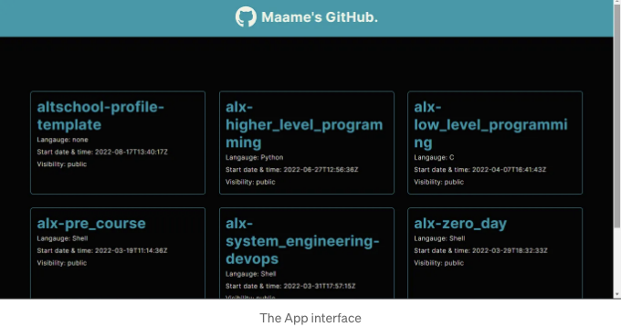

알트스쿨 프론트엔드 엔지니어링 학교에서 두 번째 학기 시험 프로젝트로 GitHub 포트폴리오 앱을 만들었습니다. 이 이야기는 제 과정과 필요한 기능들을 구현하는 방법에 관한 것입니다. 제 과정을 따라가면 비슷한 프로젝트를 만들어 포트폴리오에 추가할 수 있을 거에요.



# 프로젝트 질문

GitHub 포트폴리오의 API를 가져와서 GitHub의 모든 레포지토리 목록이 있는 페이지를 표시하고(페이지는 레포지토리 목록에 대한 페이지네이션을 구현해야 함), 레포 목록에서 클릭한 단일 레포지토리에 대한 데이터를 보여주는 다른 페이지를 만들어야 합니다. 중첩된 루트를 사용하면서 모든 필수 도구를 리액트에서 사용하세요. 적절한 SEO, 에러 바운더리(에러 바운더리를 테스트하기 위한 페이지 보여주기) 및 404 페이지를 구현하세요. 좋은 UI와 디자인이 중요합니다.

<!-- ui-log 수평형 -->
<ins class="adsbygoogle"
  style="display:block"
  data-ad-client="ca-pub-4877378276818686"
  data-ad-slot="9743150776"
  data-ad-format="auto"
  data-full-width-responsive="true"></ins>
<component is="script">
(adsbygoogle = window.adsbygoogle || []).push({});
</component>

# 사용된 기술/패키지

- Vite + React
- React icons
- React router

# 설정

저는 Vite와 React를 사용하여 프로젝트를 설정했습니다. 필요없는 파일을 삭제하고 앱을 구축하기 위해 필요한 새 파일과 폴더를 만들었습니다. 사이트의 네비게이션 바를 포함하는 컴포넌트 폴더를 만들고, 다양한 페이지를 포함하는 Pages 폴더를 생성했습니다.

<!-- ui-log 수평형 -->
<ins class="adsbygoogle"
  style="display:block"
  data-ad-client="ca-pub-4877378276818686"
  data-ad-slot="9743150776"
  data-ad-format="auto"
  data-full-width-responsive="true"></ins>
<component is="script">
(adsbygoogle = window.adsbygoogle || []).push({});
</component>

먼저 Navbar 컴포넌트를 만들고 App 컴포넌트에서 렌더링했어요. 코드 작성이 쉽고 모든 페이지에서 공통으로 사용될 컴포넌트여서 App 컴포넌트에 추가했어요.

Navbar 컴포넌트:

```js
import { FaGithub } from "react-icons/fa"

function Navbar() {
    return (
        <div className="navbar">
            <FaGithub className="github-icon"/>
            <h1>Maame의 GitHub.</h1>
        </div>
    )
}

export default Navbar
```

App 컴포넌트:

```js
import "./css/index.css"
import Navbar from "./components/Navbar"

function App() {   
  return (
    <>
      <Navbar />
    </>
  )
}

export default App
```

<!-- ui-log 수평형 -->
<ins class="adsbygoogle"
  style="display:block"
  data-ad-client="ca-pub-4877378276818686"
  data-ad-slot="9743150776"
  data-ad-format="auto"
  data-full-width-responsive="true"></ins>
<component is="script">
(adsbygoogle = window.adsbygoogle || []).push({});
</component>

CSS를 적용하고 생각한 디자인을 구현하기 위해 Home 컴포넌트에 각 레포지토리에 대한 placeholder 데이터를 넣었습니다.

```js
import "../css/index.css"

function Home() {   
  return (
    <div className="repo-card">
      <h2 className="repo-name">리포지토리 이름</h2>
      <p className="language">언어: JavaScript</p>
      <p className="date">시작 날짜 및 시간: 2022년 5월 4일 09:34</p>
      <p className="visibility">공개 여부: 공개</p>
    </div>
  )
}

export default Home
```

# API 호출

React에서 API를 호출하려면 fetchData라는 함수와 의존성 배열을 가지는 useEffect 훅을 사용할 수 있습니다. 이와 함께 API에서 가져온 데이터를 담을 컨테이너로 useState 훅을 사용할 수 있는데, 이를 위해 fetchRepos라는 함수를 작성하여 GitHub 레포지토리 API에서 데이터를 가져와 초기값이 빈 배열인 user라는 상태에 저장했습니다. 본인의 GitHub 레포지토리 데이터를 찾으려면 다음 URL을 사용하고 "yourusername"을 본인의 GitHub 사용자 이름으로 바꿔주세요: https://api.github.com/users/yourusername/repos

<!-- ui-log 수평형 -->
<ins class="adsbygoogle"
  style="display:block"
  data-ad-client="ca-pub-4877378276818686"
  data-ad-slot="9743150776"
  data-ad-format="auto"
  data-full-width-responsive="true"></ins>
<component is="script">
(adsbygoogle = window.adsbygoogle || []).push({});
</component>

의존성 배열은 페이지네이션을 구현할 때까지 처음에는 비어 있었습니다. useEffect를 React에서 사용할 때 항상 필요한 의존성 배열은 효과(이 경우 API 호출)가 언제 실행되어야 하는지를 제어하고 컴포넌트 렌더링의 무한 루프를 방지하는 역할을 합니다.

그런 다음 검색한 데이터를 매핑하여 사용자에 저장하여 개별 저장소를 렌더링할 수 있게 했습니다.

지금 Home 컴포넌트의 코드는 다음과 같습니다:

```js
import "../css/index.css"
import { useEffect, useState } from "react"

function Home() { 
  
  const [user, setUser] = useState([])

  const fetchRepos = () => {
    fetch(`https://api.github.com/users/mbonamensa/repos`)
    .then((response) => (response.json()))
    .then((data) => {
        setUser(data)  
    })
  }

  useEffect(() => {
    fetchRepos()
  }, []) 

  const userElements = user.map((userElement) => {
        return (
            <div className="repo-card" key={userElement.id}>
                <h2 className="repo-name">{userElement.name}</h2>
                <p className="language">Langauge: {userElement.language === null ? "none" : userElement.language}</p>
                <p className="date">Start date & time: {userElement.created_at}</p>
                <p className="visibility">Visibility: {userElement.visibility}</p>
            </div>
        )
  })

  return (
      <>
        <section className="repo-container">
            {userElements}
        </section>
      </>
  )
}

export default Home
```  

<!-- ui-log 수평형 -->
<ins class="adsbygoogle"
  style="display:block"
  data-ad-client="ca-pub-4877378276818686"
  data-ad-slot="9743150776"
  data-ad-format="auto"
  data-full-width-responsive="true"></ins>
<component is="script">
(adsbygoogle = window.adsbygoogle || []).push({});
</component>

# 페이지네이션

페이지네이션을 구현하려면 fetchRepos 함수와 useEffect를 업데이트해야 합니다. fetchRepos 함수에서는 GitHub에서 데이터를 가져오는 URL에 렌더링 당 페이지 수를 가져오는 매개변수가 포함되어야 합니다. 렌더링할 페이지 수를 추적하기 위해 새로운 상태를 만들어야 합니다. 저는 이 새로운 상태를 currentPage로 지정했습니다. 또한 클릭 시 후속 페이지를 렌더링하는 showViewMore라는 다른 상태를 생성했습니다. API에서 가져온 데이터에 따라 "View More"와 "End of Repos"라는 단어가 포함된 문자열로 초기화했습니다. showViewMore 값을 가진 `p` 요소에서 호출할 viewMore라는 함수를 만들었습니다. 이 함수는 currentPage 상태를 1 증가시키는 역할을 합니다. 이제 useEffect도 변경되어 currentPage가 종속성 배열에 포함되어 있어야 하므로 currentPage 상태가 변경될 때마다 애플리케이션이 다시 렌더링됩니다.

홈 컴포넌트는 이제 다음과 같이 보일 것입니다:

```js
import "../css/index.css"
import { useEffect, useState } from "react"

function Home() {

  const [user, setUser] = useState([])
  const [currentPage, setCurrentPage] = useState(1)
  const [showViewMore, setShowViewMore] = useState("")

  const fetchRepos = () => {
    fetch(`https://api.github.com/users/mbonamensa/repos?per_page=6&page=${currentPage}`)
    .then((response) => (response.json()))
    .then((data) => {
      if (data.length === 0) {
        setShowViewMore("End of Repos")
      } else {
        setUser([...user, ...data])
        setShowViewMore("View More")
      }
    })
  }

  useEffect(() => {
    fetchRepos()
  }, [currentPage]) 

  const viewMore = () => {
    setCurrentPage(currentPage + 1)
  }

  const userElements = user.map((userElement) => {
    return (
      <div className="repo-card" key={userElement.id}>
        <h2 className="repo-name">{userElement.name}</h2>
        <p className="language">언어: {userElement.language === null ? "없음" : userElement.language}</p>
        <p className="date">시작 날짜 및 시간: {userElement.created_at}</p>
        <p className="visibility">가시성: {userElement.visibility}</p>
      </div>
    )
  })

  return (
    <>
      <section className="repo-container">
        {userElements}
      </section>
      <p className="view-more" onClick={viewMore}>{showViewMore}</p>
    </>
  )
}

export default Home
```

<!-- ui-log 수평형 -->
<ins class="adsbygoogle"
  style="display:block"
  data-ad-client="ca-pub-4877378276818686"
  data-ad-slot="9743150776"
  data-ad-format="auto"
  data-full-width-responsive="true"></ins>
<component is="script">
(adsbygoogle = window.adsbygoogle || []).push({});
</component>

# 라우팅 및 에러 페이지

더 많은 세부 정보가 포함된 단일 레포지토리를 표시하는 다른 페이지를 만들려면 react-router-dom을 사용해야 합니다. React 라우터 웹 프로젝트에는 공식 문서에서 해당 프로젝트에 대해 권장하는 createBrowserRouter를 사용했습니다. 앱을 렌더링하는 코드를 포함하는 main.jsx 파일에서 라우트 및 다양한 페이지 및 에러 페이지의 경로를 포함할 router 변수를 만들었습니다.

react-router-dom의 useRouteError를 사용하여 에러 페이지를 구현했습니다. errorPage라는 컴포넌트를 만들었습니다. 프로젝트 문제에서 요구된대로 중첩된 라우트를 구현하려면, Outlet 컴포넌트를 reac-router-dom에서 렌더링하도록 하여 id에 따라 개별 레포지토리 페이지에 세부 정보를 렌더링할 수 있도록했습니다(나중에 설명하겠습니다).

한 컴포넌트에서 다른 페이지로 이동하려면, 일반 HTML의 앵커 태그 `a href=""`처럼 작동하는 `Link to=""` 요소를 사용했습니다.

<!-- ui-log 수평형 -->
<ins class="adsbygoogle"
  style="display:block"
  data-ad-client="ca-pub-4877378276818686"
  data-ad-slot="9743150776"
  data-ad-format="auto"
  data-full-width-responsive="true"></ins>
<component is="script">
(adsbygoogle = window.adsbygoogle || []).push({});
</component>

메인.jsx 파일이었습니다:

```js
import React from 'react'
import ReactDOM from 'react-dom/client'
import { RouterProvider, createBrowserRouter, createRoutesFromElements, Route } from 'react-router-dom'
import App from './App'
import Home from './pages/Home'
import RepoDetails from './pages/Repodetails'
import ErrorPage from './pages/ErrorPage'
import AppOutlet from './pages/AppOutlet'

const router = createBrowserRouter(
  createRoutesFromElements(
    <>
      <Route path="/" element={<Home />} errorElement={<ErrorPage />} />
      <Route path="/repodetails" element={<AppOutlet />}>
        <Route path=":id" element={<RepoDetails />} />
      </Route>
    </>
  )
);

ReactDOM.createRoot(document.getElementById('root')).render(
  <React.StrictMode>
    <App />
    <RouterProvider router={router} />
  </React.StrictMode>
)
```

다음은 ErrorPage 컴포넌트에 작성한 오류 페이지를 구현하는 코드입니다.

```js
import { Link, useRouteError } from "react-router-dom"

function ErrorPage() {

    const error = useRouteError()
    console.error(error)

    return (
        <div className="error-page">
            <h1>Oops!</h1>
            <p>죄송합니다, 예기치 못한 오류가 발생했습니다.</p>
            <p className="error-status">{error.status}</p>
            <p className="error-status-text"><i>{error.statusText}</i></p>
            <p><Link to="/"><b>홈페이지</b></Link>로 이동해보세요</p>
        </div>
    )
}

export default ErrorPage
```

<!-- ui-log 수평형 -->
<ins class="adsbygoogle"
  style="display:block"
  data-ad-client="ca-pub-4877378276818686"
  data-ad-slot="9743150776"
  data-ad-format="auto"
  data-full-width-responsive="true"></ins>
<component is="script">
(adsbygoogle = window.adsbygoogle || []).push({});
</component>

The AppOutlet component:

```js
import { Outlet } from "react-router-dom"

function AppOutlet() {
    return (
        <div>
            <Outlet />
        </div>
    )
}

export default AppOutlet
```

# 하나의 저장소 보기

저장소 목록에서 한 것과 같이, 렌더링할 때 하나의 저장소가 어떻게 보일지 스타일을 도와주기 위해 가짜 데이터를 만들었습니다. 그리고 react-router-dom에서 useParams를 사용하여 id를 구조분해하여 API 호출 URL에서 사용했습니다. useParams 훅은 부모 URL의 각 자식의 id를 포함한 객체를 반환합니다.

<!-- ui-log 수평형 -->
<ins class="adsbygoogle"
  style="display:block"
  data-ad-client="ca-pub-4877378276818686"
  data-ad-slot="9743150776"
  data-ad-format="auto"
  data-full-width-responsive="true"></ins>
<component is="script">
(adsbygoogle = window.adsbygoogle || []).push({});
</component>

main.jsx 파일에서 기억해요, :id가 Repodetails 컴포넌트로의 경로로 전달되었어요. 이는 각 id가 고유한 값(이 경우 repo 이름)을 가지고 있음을 뜻하죠. 이 값은 단일 레포지토리의 API를 호출하는 URL에 추가될 거예요. 저는 단일 레포지토리에서의 데이터를 state에 저장했고, details라고 이름을 지었어요.

디자인에서, 가능한 경우 각 레포의 라이브 사이트를 보여주고 레포가 갖고 있는 브랜치 수도 보여주고 싶어서, 배포 및 브랜치 정보를 반환하는 다른 API 호출을 만들었어요. 해당 정보들을 각각 deployment 및 branch로 state에 저장했죠. 이들 API 호출은 모두 개별의 useEffect 훅에서 이루어졌어요.

또한, 저는 디자인에서 React 아이콘을 사용했어요. react-icons에서 Font Awesome, Bootstrap 등의 아이콘들을 포함하고 있어요.

다음은 단일 레포지토리를 보는 코드에요:

<!-- ui-log 수평형 -->
<ins class="adsbygoogle"
  style="display:block"
  data-ad-client="ca-pub-4877378276818686"
  data-ad-slot="9743150776"
  data-ad-format="auto"
  data-full-width-responsive="true"></ins>
<component is="script">
(adsbygoogle = window.adsbygoogle || []).push({});
</component>

```js
import { FaRegStar, FaRegEye, FaCodeBranch } from 'react-icons/fa';
import { TbGitFork } from 'react-icons/tb';
import { useParams } from 'react-router-dom';
import { useState, useEffect } from 'react';

function RepoDetails() {

  const { id } = useParams()
  const [details, setDetails] = useState({})
  const [branch, setBranch] = useState({})
  const [deployment, setDeployment] = useState({})
 
  useEffect(() => {
    fetch(`https://api.github.com/repos/mbonamensa/${id}`)
    .then((response) => (response.json()))
    .then((data) => {
      setDetails(data)
    })
  }, []) 

  useEffect(() => {
    fetch(`https://api.github.com/repos/mbonamensa/${id}/branches`)
    .then((response) => (response.json()))
    .then((data) => {
      setBranch(data)
    })
  }, []) 

  useEffect(() => {
    fetch(`https://api.github.com/repos/mbonamensa/${id}/deployments`)
    .then((response) => (response.json()))
    .then((data) => {
      setDeployment(data)
    })
  }, []) 

  return (
    <div id="repodetail">
        <div className="repodetail-card">
            <h2 className="repo-name">{details.name}</h2>
            <div className="repo-mini-details">
              <p><FaRegStar className="icons" /> Stars: {details.stargazers_count}</p>
              <p><FaRegEye className="icons" /> Watch: {details.watchers}</p>
              <p><TbGitFork className="icons" /> Forks: {details.forks}</p>
              <p><FaCodeBranch className="icons" /> Branches: {branch.length}</p>
            </div>
            <p>Main Language: {details.language === null ? "none": details.language}</p>
            <p>Live site: {deployment.length === 0 ? `none` : <a href={`https://mbonamensa.github.io/${details.name}`}>mbonamensa.github.io/{details.name}</a>}</p>
            <p><a href={`https://github.com/${details.full_name}`}>View on Github</a></p>
        </div>
    </div>
  )
}

export default RepoDetails
```

Home 컴포넌트 내에서 렌더링된 각 저장소 이름을 Repodetails 컴포넌트에 링크하는 부분만 남았습니다. 이를 수행하기 위해 `Link` 요소가 사용됩니다.

최종적으로 Home 컴포넌트는 다음과 같이 보일 것입니다:

```js
import "../css/index.css"
import { useEffect, useState } from "react"
import { Link } from "react-router-dom"

function Home() {   
  const [user, setUser] = useState([])
  const [currentPage, setCurrentPage] = useState(1)
  const [showViewMore, setShowViewMore] = useState("")

  const fetchRepos = () => {
    fetch(`https://api.github.com/users/mbonamensa/repos?per_page=6&page=${currentPage}`)
    .then((response) => (response.json()))
    .then((data) => {
      if (data.length === 0) {
        setShowViewMore("End of Repos")
      }else {
        setUser([...user, ...data])
        setShowViewMore("View More")
      }
    })
  }

  useEffect(() => {
    fetchRepos()
  }, [currentPage]) 

  const viewMore = () => {
    setCurrentPage(currentPage + 1)
  }

  const userElements = user.map((userElement) => {
      return (
          <div className="repo-card" key={userElement.id}>
              <Link to={`/repodetails/${userElement.name}`}><h2 className="repo-name">{userElement.name}</h2></Link>
              <p className="language">Langauge: {userElement.language === null ? "none" : userElement.language}</p>
              <p className="date">Start date & time: {userElement.created_at}</p>
              <p className="visibility">Visibility: {userElement.visibility}</p>
          </div>
      )
  })

  return (
    <>
      <section className="repo-container">
          {userElements}
      </section>
      <p className="view-more" onClick={viewMore}>{showViewMore}</p>
    </>
  )
}

export default Home
```

<!-- ui-log 수평형 -->
<ins class="adsbygoogle"
  style="display:block"
  data-ad-client="ca-pub-4877378276818686"
  data-ad-slot="9743150776"
  data-ad-format="auto"
  data-full-width-responsive="true"></ins>
<component is="script">
(adsbygoogle = window.adsbygoogle || []).push({});
</component>

SEO를 구현하는 과정에서 index.html 파일의 meta 태그의 이름과 content 속성을 사용하여 앱에 대한 간단한 설명을 작성했습니다:

```js
<meta name="description" content="GitHub 포트폴리오의 API를 가져와 하나의 저장소에 대한 데이터를 표시하는 리액트 앱입니다. 주니어 프런트엔드 엔지니어가 만든 저장소 목록에서 클릭하면 해당 저장소의 데이터를 볼 수 있습니다.">
```

이 프로젝트는 API, useEffect 및 React Router를 활용한 첫 번째 작업이었어요. 이를 통해 경험을 쌓고 기술을 향상시킬 수 있는 기회를 가졌다는 것에 기쁩니다.

질문이나 제안이 있으시면 자유롭게 댓글을 달아주세요.

<!-- ui-log 수평형 -->
<ins class="adsbygoogle"
  style="display:block"
  data-ad-client="ca-pub-4877378276818686"
  data-ad-slot="9743150776"
  data-ad-format="auto"
  data-full-width-responsive="true"></ins>
<component is="script">
(adsbygoogle = window.adsbygoogle || []).push({});
</component>

감사합니다!