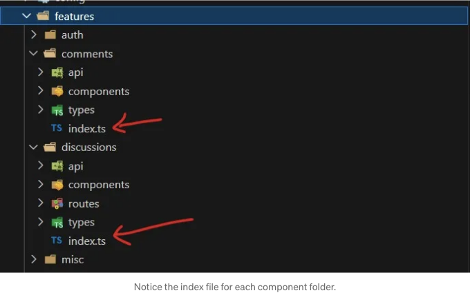

버그에 대해 윙윙 웃거나 코드가 뒤얽힘에 비웃는 React 앱을 꿈꿨던 적이 있나요? 이제 우리 함께 React 앱을 만들어보면, 나쁜 코딩 습관의 아포칼립스에도 버텨낼 수 있는 견고한 React 앱을 만들게 될 겁니다.

초보 시절에는 제 코드가 야생 동물과 같았어요 — 기능적이지만 아주 혼돈스러웠죠. 프로젝트 구조는 널리 알려진 것이라 할 수 없을 정도로 무질서했어요. 저의 초보 시절에는 적당했지만, 프로젝트가 커짐에 따라 복잡성도 높아지고 혼돈이 더 커졌어요.

프로젝트가 확장될수록 특정 코드를 찾는 것이 마치 바늘을 건초더미에서 찾는 것과 같은 모험이 되어, '바늘이라는 이름의 변수'가 코드 깊은 곳 어딘가에 묻혀있었다는 것을 깨닫게 되었죠.

<!-- ui-log 수평형 -->
<ins class="adsbygoogle"
  style="display:block"
  data-ad-client="ca-pub-4877378276818686"
  data-ad-slot="9743150776"
  data-ad-format="auto"
  data-full-width-responsive="true"></ins>
<component is="script">
(adsbygoogle = window.adsbygoogle || []).push({});
</component>

React 프로젝트 구조를 배우는 데 시간을 투자하세요. 그 전에 코드베이스가 풀 수 없는 미스터리 소설로 변하지 않도록 해보세요!

프로젝트 구조 예시:

```js
src
|
+-- assets
|
+-- components
|
+-- config
|
+-- features
|
+-- hooks
|
+-- lib
|
+-- providers
|
+-- routes
|
+-- stores
|
+-- test
|
+-- types
|
+-- utils
```

- components: 전체 킹국을 빛내는 공유 컴포넌트
- config: 전역 구성, 환경 변수 및 비밀의 금고
- features: 특징별 모듈
- hooks: 전체 영역을 통틀어 공유되는 신비한 훅
- libs: 애플리케이션에 대해 미리 구성된 다양한 라이브러리 재내보
- providers: 애플리케이션의 생명력을 지키는 공급자들
- routes: 라우트 구성
- stores: 전역 상태 저장소
- test: 유틸리티 및 목 서버가 자신을 증명하는 시험의 투기장
- types: 애플리케이션 전반에 사용되는 기본 타입
- utils: 공유 유틸리티 함수

<!-- ui-log 수평형 -->
<ins class="adsbygoogle"
  style="display:block"
  data-ad-client="ca-pub-4877378276818686"
  data-ad-slot="9743150776"
  data-ad-format="auto"
  data-full-width-responsive="true"></ins>
<component is="script">
(adsbygoogle = window.adsbygoogle || []).push({});
</component>

--- --- --- --- --- --- --- --- --- --- --- --- --- --- --- --- --- --- --- --- --- --- ---

이제 기능의 핵심으로 내려가 봅시다.

```js
src/features/my-new-feature
|
+-- api         # 선언과 API 훅, 이 기능을 위한 요청의 심포니
|
+-- assets      # 멋진 기능에 특화된 보물들
|
+-- components  # 시각적 아이디티를 조각하는 장인들의 컴포넌트
|
+-- hooks       # 이 기능의 패브릭에 엮인 마법 주문들
|
+-- routes      # 기능 페이지로 이끄는 경로들, 경이의 지도
|
+-- stores      # 상태를 보호하는 지킴이들, 기능의 신성한 진실들
|
+-- types       # TypeScript 타입, 기능 도메인의 어휘
|
+-- utils       # 이 기능에만 특화된 유틸리티 함수를 만드는 장인들
|
+-- index.ts    # 큰 입구, 이 기능의 공개 API, 본질을 드러내는 곳
```

# 인덱스 파일

<!-- ui-log 수평형 -->
<ins class="adsbygoogle"
  style="display:block"
  data-ad-client="ca-pub-4877378276818686"
  data-ad-slot="9743150776"
  data-ad-format="auto"
  data-full-width-responsive="true"></ins>
<component is="script">
(adsbygoogle = window.adsbygoogle || []).push({});
</component>

기능에서 모든 것은 기능의 공개 API로 작동하는 index.ts 파일에서 내보내야 합니다.



다른 기능에서 물건을 가져올 때는 다음을 사용하여만 가져와야 합니다:
```typescript
import {AwesomeComponent} from "@/features/awesome-feature"
```

<!-- ui-log 수평형 -->
<ins class="adsbygoogle"
  style="display:block"
  data-ad-client="ca-pub-4877378276818686"
  data-ad-slot="9743150776"
  data-ad-format="auto"
  data-full-width-responsive="true"></ins>
<component is="script">
(adsbygoogle = window.adsbygoogle || []).push({});
</component>

```diff
- 그리고 아닙니다.

import { AwesomeComponent } from "@/features/awesome-feature/components/AwesomeComponent"

# 절대 경로 가져오기 설정!

절대 경로 가져오기를 설정하면 import 문이 더 깨끗하고 가독성이 좋아집니다. 또한 긴 상대적인 import 경로를 피하는 데 도움이 됩니다.
```

<!-- ui-log 수평형 -->
<ins class="adsbygoogle"
  style="display:block"
  data-ad-client="ca-pub-4877378276818686"
  data-ad-slot="9743150776"
  data-ad-format="auto"
  data-full-width-responsive="true"></ins>
<component is="script">
(adsbygoogle = window.adsbygoogle || []).push({});
</component>

```json
//  jsconfig.json/tsconfig.json
"compilerOptions": {
    "baseUrl": ".",
    "paths": {
      "@/*": ["./src/*"]
    }
  }
```

기억해요. 모든 개발자들, 노련한 이든 초보든, 스파게티 코드와 미친듯한 탱고를 춤췄던 적이 있어요. 그러나 구조가 있다면 명확함이 따르고, 명확함이 있다면 React를 미루기 위한 힘을 가질 수 있어요.

그러니, 프론트엔드 개발 영역에서 나만의 길을 걷는 동안, 이 청사진이 여러분을 이끄는 빛이 되어줄 것입니다. 어느 정도 정리된 탁월한 지도가 될 거예요. 여러분의 React 프로젝트가 버그를 비웃고, 혼돈을 비웃고, 코딩 재앙에도 굳건했으면 좋겠어요.

개인 링크.:
웹
GitHub

<!-- ui-log 수평형 -->
<ins class="adsbygoogle"
  style="display:block"
  data-ad-client="ca-pub-4877378276818686"
  data-ad-slot="9743150776"
  data-ad-format="auto"
  data-full-width-responsive="true"></ins>
<component is="script">
(adsbygoogle = window.adsbygoogle || []).push({});
</component>

주석:
[https://github.com/alan2207/bulletproof-react](https://github.com/alan2207/bulletproof-react)