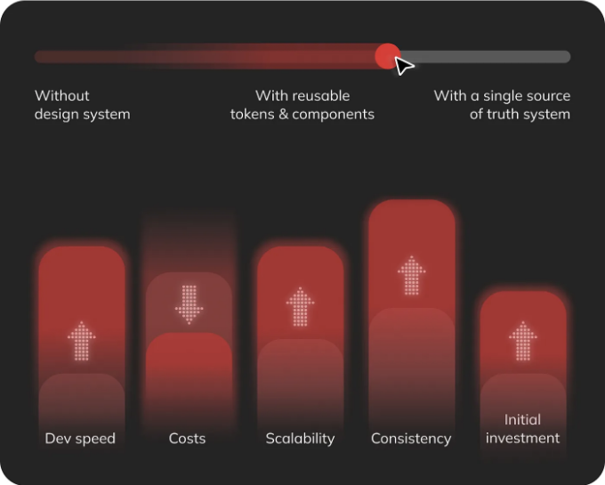
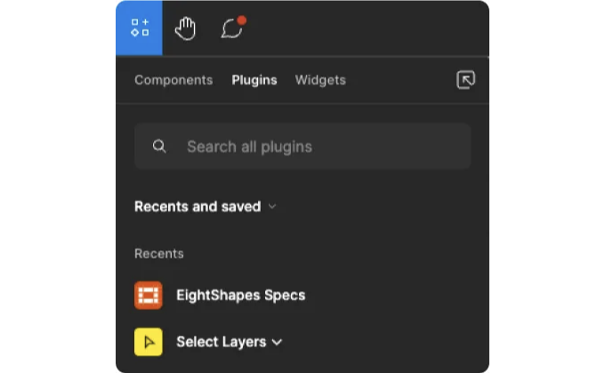
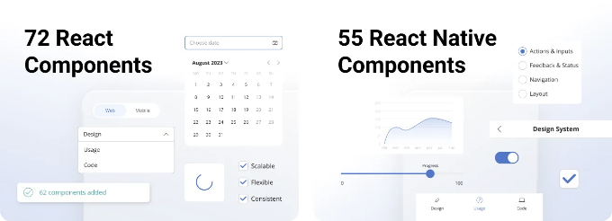

디자인 시스템은 기업들이 일관성과 효율성을 유지하고 확장하며 연구 및 개발 팀 및 서비스를 확장하는 데 필수적인 자산이 되었습니다. 특히 제품 라인을 확장하는 제품 회사들에게 필수적인 이러한 문서는 다양한 플랫폼 간의 일관성 및 변화에 대한 적응성을 보장합니다. IBM의 연구에 따르면, Carbon의 채택은 전환율을 5% 증가시키고 고객의 50% 이상이 구매를 완료하도록 했습니다. Apple, Microsoft, Salesforce와 같은 주요 기업들은 자체적인 단일 진실의 소스를 구축했습니다. 그러나 훨씬 작은 시장에서 활동하는 경우, 갖고 있는 리소스도 크기에 따라 다릅니다.

우리 고객인 Econt는 불가리아의 선도적인 물류 회사로, 인구가 600만 명 정도인 국가입니다. 6개월 동안 우리는 React로 개발된 72개의 웹 컴포넌트와 React Native로 개발된 55개의 모바일 앱 컴포넌트가 포함된 Compass라는 디자인 시스템을 개발했습니다. 프로젝트를 진행하며 우리는 알 수 없는 부분이 많은 여정에 도전적이고 독창적이어야 했습니다. 이제 동일한 여정을 시작하는 사람들과 직관과 팁을 공유할 수 있습니다.

<!-- ui-log 수평형 -->
<ins class="adsbygoogle"
  style="display:block"
  data-ad-client="ca-pub-4877378276818686"
  data-ad-slot="9743150776"
  data-ad-format="auto"
  data-full-width-responsive="true"></ins>
<component is="script">
(adsbygoogle = window.adsbygoogle || []).push({});
</component>

우리는 일부 신화를 해체하는 것을 우리의 책임으로 여깁니다! 🥊

우리는 다음을 강조합니다: Storybook, Figma 및 Zeroheight와 같은 도구를 활용하고 전략적 접근을 결합함으로써 기업이 예산 내에서 견고한 디자인 시스템을 개발하고 디지털 생태계에서 확장 가능성을 촉진하는 데 도움이 된다는 것입니다.

👇👀 아래에서 이러한 제품들의 장단점 및 비용 절감을 유지하는 몇 가지 실용적인 팁에 대해 읽어보세요.

# 디자이너를 위해: Figma

<!-- ui-log 수평형 -->
<ins class="adsbygoogle"
  style="display:block"
  data-ad-client="ca-pub-4877378276818686"
  data-ad-slot="9743150776"
  data-ad-format="auto"
  data-full-width-responsive="true"></ins>
<component is="script">
(adsbygoogle = window.adsbygoogle || []).push({});
</component>

💰: 어떤 팀에도 맞는 유연한 요금제
요금안내 보기

클라우드 기반의 이 제품은 지리적 위치에 상관없이 팀원끼리 원활하게 협업할 수 있습니다. 디자이너, UX 작가 및 프로젝트 매니저들은 동일한 파일에서 실시간으로 함께 작업할 수 있어 아이디어를 공유하고 피드백을 제공하기 쉽습니다. 게다가 복잡한 도구에 익숙하지 않은 검증자들도 프로젝트를 쉽게 탐색하고 필요한 곳에 언급을 남길 수 있습니다.

💡 전문가 팁: 언제나 개발 모드를 포함시키세요. 이것이 변화의 원동력이 됩니다.

<!-- ui-log 수평형 -->
<ins class="adsbygoogle"
  style="display:block"
  data-ad-client="ca-pub-4877378276818686"
  data-ad-slot="9743150776"
  data-ad-format="auto"
  data-full-width-responsive="true"></ins>
<component is="script">
(adsbygoogle = window.adsbygoogle || []).push({});
</component>

개발 모드 기능은 디자인과 개발 간의 간극을 줄여줍니다. Figma 인터페이스 내에서 개발자에게 측정, 사양 및 스타일과 같은 중요한 세부 정보를 제공함으로써 프로세스를 간소화합니다. 이것은 디자인 컨셉에서 실제 구현으로의 원활한 전환이 가능하게 하며, 개발자가 빠르게 개발할 준비가 된 섹션을 식별하고 디자인 환경을 떠나지 않고 필요한 리소스에 액세스할 수 있도록 합니다. 또한, 자세한 정보를 검사하고 프레임의 다른 버전 간의 변경 사항을 비교하여 개발자가 일관성과 정확성을 확보할 수 있도록 하는 디자인 검사와 변경 사항 검토와 같은 기능도 제공합니다.

💡 추가 팁: Figma의 플러그인 및 통합 생태계를 활용해 보세요.

<!-- ui-log 수평형 -->
<ins class="adsbygoogle"
  style="display:block"
  data-ad-client="ca-pub-4877378276818686"
  data-ad-slot="9743150776"
  data-ad-format="auto"
  data-full-width-responsive="true"></ins>
<component is="script">
(adsbygoogle = window.adsbygoogle || []).push({});
</component>

팔모양 스펙
페이지 및 구성 요소 디자인 명세서의 제작을 자동화하는 데 사용했어요. 디자인과 개발자 간 협업 및 진행 상황 감시를 용이하게 했죠.
💰: 무료

레이어 선택
상당히 간단해요 — 같은 이름 또는 기능을 갖는 모든 레이어를 선택해요.
💰: 무료

😑 여기 몇 가지 약점이 있어요:

- 자세한 디자인 명세서를 작성하는 데 제한적인 문서화 도구가 있어요. 해결책을 찾으려면 계속 읽어보세요. 😌
- 특정 디자인 시스템 작업을 위한 플러그인이 제한적일 수 있어요. 그러나 경험상 제품은 계속해서 이 방향으로 발전하고 있어요.
- 클라우드 기반 협업 기능으로 보안 및 프라이버시 우려가 생길 수 있어요. 권한을 부여할 때는 항상 주의깊게 확인하세요 ❗

<!-- ui-log 수평형 -->
<ins class="adsbygoogle"
  style="display:block"
  data-ad-client="ca-pub-4877378276818686"
  data-ad-slot="9743150776"
  data-ad-format="auto"
  data-full-width-responsive="true"></ins>
<component is="script">
(adsbygoogle = window.adsbygoogle || []).push({});
</component>

# 개발자를 위해: Storybook

💰: 무료입니다

이 도구는 UI 구성 요소를 격리시켜 개발자가 각 구성 요소를 개별적으로 볼 수 있고 테스트할 수 있으며 상호 작용할 수 있는 포괄적인 카탈로그를 만들어 효율성을 촉진합니다. 오픈 소스 도구인 Storybook은 제품 소프트웨어에 따른 높은 가격표와 연관된 부담스러운 요금 없이도 강력한 기능을 제공합니다.

😑 고려해야 할 일부 약점이 있습니다:

<!-- ui-log 수평형 -->
<ins class="adsbygoogle"
  style="display:block"
  data-ad-client="ca-pub-4877378276818686"
  data-ad-slot="9743150776"
  data-ad-format="auto"
  data-full-width-responsive="true"></ins>
<component is="script">
(adsbygoogle = window.adsbygoogle || []).push({});
</component>

- 대규모 프로젝트의 Storybook 인스턴스 유지보수는 시간이 많이 소요될 수 있어요. 하지만 디자인 시스템의 목표는 불필요한 정보 없이 간결하고 효율적이어야 해요. 🎯
- 비기술적인 새로운 사용자들에 대한 학습 곡선은 초기 도입 속도를 늦출 수 있어요.

# 팀 전체를 위한: Zeroheight

✅ 72개의 웹 및 55개의 모바일 앱 컴포넌트
✅ 각각을 위한 디자인, 사용 및 코드 섹션
✅ 58개의 기본 및 별칭 토큰
✅ UX 리서치, 디자인 프로세스, 프로토타이핑 및 모바일 앱 디자인을 위한 가이드라인

<!-- ui-log 수평형 -->
<ins class="adsbygoogle"
  style="display:block"
  data-ad-client="ca-pub-4877378276818686"
  data-ad-slot="9743150776"
  data-ad-format="auto"
  data-full-width-responsive="true"></ins>
<component is="script">
(adsbygoogle = window.adsbygoogle || []).push({});
</component>

💰: 무료 또는 유연한 요금제
가격 확인하기

강력한 디자인 시스템을 개발하는 데 필요한 투자를 고려할 때 종종 간과되는 측면 중 하나는 전체 브랜드 지식을 육성하는 데 필요한 환경입니다. 맞춤형 플랫폼은 매력적으로 보일 수 있지만, 구축하는 데 많은 비용과 시간이 소요됩니다. 바로 이때 Zeroheight와 같은 플랫폼이 빛을 발합니다. 기존 정보를 손수 편집하고 조직하는 데 들어가는 수많은 시간을 아끼기 위해 팀은 Zeroheight의 사전 구축된 환경을 활용하여 디자인 시스템 작업을 가속화할 수 있습니다. 이는 개발 프로세스를 가속화하는 데 그치지 않고, 결과적으로 디자인 시스템이 조직의 특정 요구 사항과 욕구에 맞게 맞춤화되도록 보장합니다.

💡 전문가 팁: 1개의 편집자 프로필 = 끝없는 협업 가능성

전통적인 문서화 방법과 달리, Zeroheight는 팀이 디자인 시스템 구성 요소와 지침을 손쉽게 저장, 조직화, 액세스할 수 있는 중앙 플랫폼을 제공합니다. 직관적인 인터페이스를 통해 어떤 팀의 전문가도 관련 정보에 쉽게 기여할 수 있어 협업과 지식 공유가 조직 전체에 걸쳐 향상됩니다.

😑 고려해야 할 약점은 다음과 같습니다:

<!-- ui-log 수평형 -->
<ins class="adsbygoogle"
  style="display:block"
  data-ad-client="ca-pub-4877378276818686"
  data-ad-slot="9743150776"
  data-ad-format="auto"
  data-full-width-responsive="true"></ins>
<component is="script">
(adsbygoogle = window.adsbygoogle || []).push({});
</component>

- 맞춤 설정 옵션이 다소 제한적이어서 특정 필요에 맞는 해결책을 제공하는 데 제약이 있을 수 있어요.
- 사용자 친화적인 인터페이스에도 새로운 사용자들에게는 여전히 학습 곡선이 있어 초기 효율에 영향을 줄 수 있어요.
- 일부 기기에서 사용성에 영향을 줄 수 있는 작은 화면 해상도에 최적화되어 있지 않아요.

# 요약하면

디자인 시스템이 계속 발전하는 환경에서 효율성과 비용 효율성을 위한 탐구는 지속적인 도전이에요. 하지만, 전략적 계획과 혁신적인 도구의 적절한 조화로 기업은 장애물을 극복하고 디자인 시스템 목표를 달성할 수 있어요. Figma, Storybook, Zeroheight와 같은 도구를 채택하여 기관은 협업 수준을 높이고 작업 흐름을 간소화하며 시간이 지남에 따라 확장 가능한 디자인 시스템을 구축할 수 있어요. 예산 친화적인 디자인 시스템 구축 여정을 이끌어 가면서 유연하게 대처하고 자주 반복하며 기술의 힘을 이용하여 조직 내에서 의미 있는 변화를 이끌어내세요. 창의력, 결의력, 그리고 필요한 적절한 도구를 갖추면 가능성은 무한해져요.