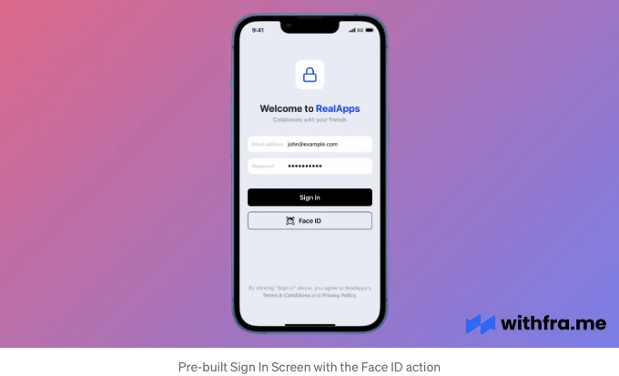

이 게시물에서는 React Native 앱에서 Face ID 통합, RSA 2048 키페어 생성, RSA-SHA256 서명 생성, 그리고 Face ID 서명 및 공개 키를 확인하는 NodeJS 서버를 구축하는 내용을 다룰 것입니다.

Face ID는 iOS 및 Android 애플리케이션에서 널리 사용되는 보안 기능이 되었습니다. 이 기능을 통해 사용자들은 앱을 사용할 때 매끄럽고 안전한 인증 프로세스를 경험할 수 있습니다.

우리는 react-native-biometrics 패키지를 사용하여 React Native 애플리케이션에 Face ID 인증을 통합할 것입니다.

## Prerequisites

<!-- ui-log 수평형 -->
<ins class="adsbygoogle"
  style="display:block"
  data-ad-client="ca-pub-4877378276818686"
  data-ad-slot="9743150776"
  data-ad-format="auto"
  data-full-width-responsive="true"></ins>
<component is="script">
(adsbygoogle = window.adsbygoogle || []).push({});
</component>

글을 따라가려면 다음 명령을 사용하여 손쉽게 만들 수있는 React Native 애플리케이션이 필요합니다:

```js
npx react-native init RealApp
```



이 예제에서는 WithFrame의 미리 제작 된 로그인 화면 중 하나를 사용하여 Face ID 액션을 실행할 것입니다.

<!-- ui-log 수평형 -->
<ins class="adsbygoogle"
  style="display:block"
  data-ad-client="ca-pub-4877378276818686"
  data-ad-slot="9743150776"
  data-ad-format="auto"
  data-full-width-responsive="true"></ins>
<component is="script">
(adsbygoogle = window.adsbygoogle || []).push({});
</component>

## 설치

만약 yarn을 사용하고 있다면, 아래 명령어를 실행해주세요:

```js
yarn add react-native-biometrics
```

만약 NPM을 사용하고 있다면, 아래 명령어를 실행해주세요:

<!-- ui-log 수평형 -->
<ins class="adsbygoogle"
  style="display:block"
  data-ad-client="ca-pub-4877378276818686"
  data-ad-slot="9743150776"
  data-ad-format="auto"
  data-full-width-responsive="true"></ins>
<component is="script">
(adsbygoogle = window.adsbygoogle || []).push({});
</component>

```js
npm install react-native-biometrics --save
```

그리고 반드시 네이티브 패키지를 링크해야 합니다:

```js
npx pod-install
```

React Native 0.60 이상에서는 CLI 자동 링크 기능이 앱을 빌드하는 동안 모듈을 자동으로 링크합니다.```

<!-- ui-log 수평형 -->
<ins class="adsbygoogle"
  style="display:block"
  data-ad-client="ca-pub-4877378276818686"
  data-ad-slot="9743150776"
  data-ad-format="auto"
  data-full-width-responsive="true"></ins>
<component is="script">
(adsbygoogle = window.adsbygoogle || []).push({});
</component>

## 권한

설치가 완료된 후, iOS와 안드로이드 모두에 대한 권한 문자열을 추가해야 합니다.

안드로이드의 경우, 아래 내용을 AndroidManifest.xml 파일에 추가해야 합니다:

```js
<uses-permission android:name="android.permission.USE_BIOMETRIC" />
```

<!-- ui-log 수평형 -->
<ins class="adsbygoogle"
  style="display:block"
  data-ad-client="ca-pub-4877378276818686"
  data-ad-slot="9743150776"
  data-ad-format="auto"
  data-full-width-responsive="true"></ins>
<component is="script">
(adsbygoogle = window.adsbygoogle || []).push({});
</component>

iOS용으로는, Info.plist 파일에 다음을 추가해야 합니다:

```js
<key>NSFaceIDUsageDescription</key>
<string>Face ID를 활성화하면 RealApp에 빠른 액세스가 가능합니다</string>
```

## 단계 1: 생체 인증 키 쌍 만들기

저희의 로그인 화면에는 "로그인"과 "Face ID" 두 개의 버튼이 있습니다. 사용자의 자격 증명이 확인된 후, 다음에 어떤 Face ID 기능을 사용할지 물어보겠습니다.

<!-- ui-log 수평형 -->
<ins class="adsbygoogle"
  style="display:block"
  data-ad-client="ca-pub-4877378276818686"
  data-ad-slot="9743150776"
  data-ad-format="auto"
  data-full-width-responsive="true"></ins>
<component is="script">
(adsbygoogle = window.adsbygoogle || []).push({});
</component>

물론, 먼저 `isSensorAvailable()` 메서드를 사용하여 기기에서 Face ID를 사용할 수 있는지 확인해야 합니다.

`createKeys()` 메서드를 사용하여 publicKey를 획득하자마자, 서버에 전송하여 사용자 엔터티에 저장해야 합니다. 나중에 서명을 확인하는 데 사용할 것입니다.

```js
import ReactNativeBiometrics, { BiometryTypes } from 'react-native-biometrics';
```

```js
<TouchableOpacity
  onPress={async () => {
    // 사용자 자격 증명을 확인한 후에 사용자에게 Face ID를 활성화할 것을 요청하기 전에 유저 아이디를 확인합니다.
    const {userId} = await verifyUserCredentials();

    const rnBiometrics = new ReactNativeBiometrics();

    const { available, biometryType } =
      await rnBiometrics.isSensorAvailable();
    
    if (available && biometryType === BiometryTypes.FaceID) {
      Alert.alert(
        'Face ID',
        '다음에 인증할 때 Face ID를 활성화하시겠습니까?',
        [
          {
            text: '네',
            onPress: async () => {
              const { publicKey } = await rnBiometrics.createKeys();

              // `publicKey`를 데이터베이스에서 사용자 엔터티에 저장해야 합니다.
              await sendPublicKeyToServer({ userId, publicKey });

              // 로컬 스토리지에 `userId`를 저장하여 Face ID 인증 중에 사용합니다.
              await AsyncStorage.setItem('userId', userId);
            },
          },
          { text: '취소', style: 'cancel' },
        ],
      );
    }
  }>
  <View style={styles.btn}>
    <Text style={styles.btnText}>로그인</Text>
  </View>
</TouchableOpacity>
```

<!-- ui-log 수평형 -->
<ins class="adsbygoogle"
  style="display:block"
  data-ad-client="ca-pub-4877378276818686"
  data-ad-slot="9743150776"
  data-ad-format="auto"
  data-full-width-responsive="true"></ins>
<component is="script">
(adsbygoogle = window.adsbygoogle || []).push({});
</component>

## 단계 2: 생체 인식 서명 확인

이제 사용자 엔티티에 저장된 공개 키를 사용하여 사용자 인증을 확인할 수 있습니다.

```js
<TouchableOpacity
  onPress={async () => {
    const rnBiometrics = new ReactNativeBiometrics();

    const { available, biometryType } =
      await rnBiometrics.isSensorAvailable();
  
    if (!available || biometryType !== BiometryTypes.FaceID) {
      Alert.alert(
        '이런!',
        '이 기기에서 Face ID를 사용할 수 없습니다.',
      );
      return;
    }
  
    const userId = await AsyncStorage.getItem('userId');
  
    if (!userId) {
      Alert.alert(
        '이런!',
        'Face ID를 활성화하려면 먼저 자격 증명을 사용하여 로그인해야 합니다.',
      );
      return;
    }
  
    const timestamp = Math.round(
      new Date().getTime() / 1000,
    ).toString();
    const payload = `${userId}__${timestamp}`;
  
    const { success, signature } = await rnBiometrics.createSignature(
      {
        promptMessage: '로그인',
        payload,
      },
    );
  
    if (!success) {
      Alert.alert(
        '이런!',
        'Face ID로 인증 중에 문제가 발생했습니다. 다시 시도해주세요.',
      );
      return;
    }
  
    const { status, message } = await verifySignatureWithServer({
      signature,
      payload,
    });
  
    if (status !== 'success') {
      Alert.alert('이런!', message);
      return;
    }
  
    Alert.alert('성공!', '성공적으로 인증되었습니다!');
  }>
    <View style={styles.btnSecondary}>
      <MaterialCommunityIcons
        color="#000"
        name="face-recognition"
        size={22}
        style={{ marginRight: 12 }}
      />
    
      <Text style={styles.btnSecondaryText}>Face ID</Text>
    
      <View style={{ width: 34 }} />
    </View>
  </TouchableOpacity>
```

## 단계 3: NodeJS에서 공개 키로 서명 확인하기

<!-- ui-log 수평형 -->
<ins class="adsbygoogle"
  style="display:block"
  data-ad-client="ca-pub-4877378276818686"
  data-ad-slot="9743150776"
  data-ad-format="auto"
  data-full-width-responsive="true"></ins>
<component is="script">
(adsbygoogle = window.adsbygoogle || []).push({});
</component>

사용자가 자신의 Face ID 인증을 받게 되면, Apple은 키 저장소에서 개인 키를 검색한 후, RSA PKCS#1v1.5 SHA 256 서명을 생성하는 데 사용합니다.

이전에 사용자 엔티티에 공개 키를 저장해 두었기 때문에, 이제 해당 서명이 동일한 공개/개인 키 쌍에서 생성된 개인 키를 사용하여 서명되었는지 확인할 수 있습니다. NodeJS에서는 이를 암호 모듈을 사용하여 수행할 수 있습니다.

```js
const express = require('express');
const bodyParser = require('body-parser');
const crypto = require('crypto');
const app = express();

app.use(bodyParser.json({ type: 'application/json' }));

app.post('/', async (req, res) => {
  const { signature, payload } = req.body;

  const userId = payload.split('__')[0];

  const user = await getUserFromDatabaseByUserId(userId);

  if (!user) {
    throw new Error('Face ID 인증 중에 문제가 발생했습니다.');
  }

  // 이전에 저장되었던 공개 키입니다.
  const { publicKey } = user;

  const verifier = crypto.createVerify('RSA-SHA256');
  verifier.update(payload);

  const isVerified = verifier.verify(
    `-----BEGIN PUBLIC KEY-----\n${publicKey}\n-----END PUBLIC KEY-----`,
    signature,
    'base64',
  );

  if (!isVerified) {
    return res.status(400).json({
      status: 'failed',
      message: '안타깝지만, Face ID 인증을 확인할 수 없습니다.',
    });
  }

  return res.status(200).json({
    status: 'success',
  });
});
```

이 게시물을 즐겁게 읽으셨기를 바라며, 이제 React Native 애플리케이션에 Face ID를 통합하는 방법에 대한 이해가 더 깊어졌으면 좋겠습니다.

<!-- ui-log 수평형 -->
<ins class="adsbygoogle"
  style="display:block"
  data-ad-client="ca-pub-4877378276818686"
  data-ad-slot="9743150776"
  data-ad-format="auto"
  data-full-width-responsive="true"></ins>
<component is="script">
(adsbygoogle = window.adsbygoogle || []).push({});
</component>

Final React Native 애플리케이션 코드는 저희의 GitHub 저장소에서 확인하실 수 있어요.

이 로그인 화면과 다른 많은 화면들은 저희 웹사이트에 있어요: WithFrame React Native Components