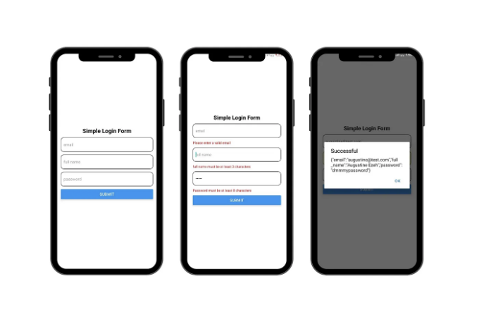
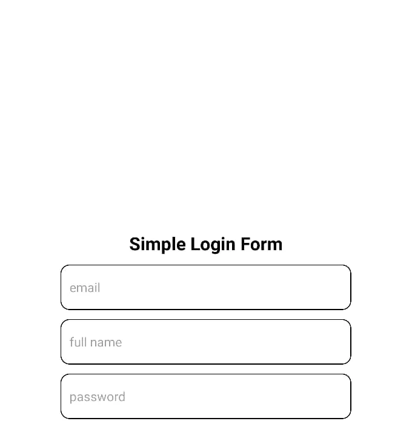
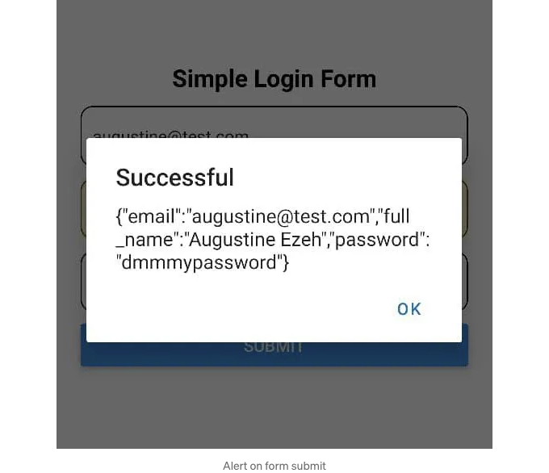
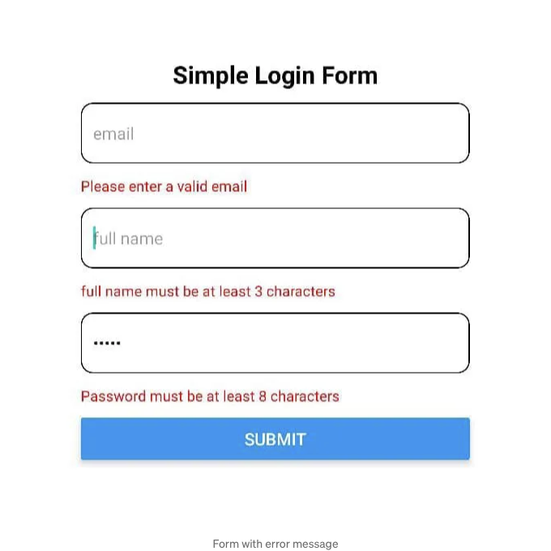

사용자 세부 정보, 로그인 자격 증명 또는 검색 질의 등을 캡처하는 경우, 양식은 많은 응용 프로그램에서 사용자 입력을 위한 게이트웨이로 작용합니다. 그러나 React Native에서 성능 최적화된 양식을 작성하는 것은 때로는 어려울 수 있습니다.

또한, 프론트 엔드에서 데이터 무결성을 보장하기 위해 양식을 유효성 검사하는 것이 더 어려울 수 있습니다.

현재, 많은 개발자가 양식을 처리하는 두 가지 주요 방법을 관찰했습니다:

<!-- ui-log 수평형 -->
<ins class="adsbygoogle"
  style="display:block"
  data-ad-client="ca-pub-4877378276818686"
  data-ad-slot="9743150776"
  data-ad-format="auto"
  data-full-width-responsive="true"></ins>
<component is="script">
(adsbygoogle = window.adsbygoogle || []).push({});
</component>

- 각 폼 입력에 개별 상태를 만듭니다.
- Formik을 사용합니다.

옵션 1은 폼이 크면 useState 훅을 많이 정의해야 하고 코드가 지저분해지며(다시 렌더링될 뿐 아니라) 그렇게 좋은 옵션이 아닙니다.

# Formik 사용

Formik은 폼 유효성 검사를 쉽게 다룰 수 있는 훌륭한 방법이지만, 모든 입력값이 변경될 때마다 전체 폼이 다시 렌더링되기 때문에 많은 불필요한 다시 렌더링이 발생합니다.

<!-- ui-log 수평형 -->
<ins class="adsbygoogle"
  style="display:block"
  data-ad-client="ca-pub-4877378276818686"
  data-ad-slot="9743150776"
  data-ad-format="auto"
  data-full-width-responsive="true"></ins>
<component is="script">
(adsbygoogle = window.adsbygoogle || []).push({});
</component>

더 유연하고 성능이 좋은 방법으로 폼을 처리하는 방법 중 하나는 React Hook Form (RHF)입니다.

# React Hook Form을 사용하는 이유

React Hook Form은 가벼우면서 성능이 우수한 폼 관리 라이브러리입니다.

React Hook Form을 사용하면 쉬운 유효성 검사를 통해 유연하고 확장 가능한 폼을 만들 수 있습니다.

<!-- ui-log 수평형 -->
<ins class="adsbygoogle"
  style="display:block"
  data-ad-client="ca-pub-4877378276818686"
  data-ad-slot="9743150776"
  data-ad-format="auto"
  data-full-width-responsive="true"></ins>
<component is="script">
(adsbygoogle = window.adsbygoogle || []).push({});
</component>

Formik와 비교했을 때 React Hook Form은 리렌더링 횟수를 줄여 앱의 성능을 유지합니다.

React Hook Form을 React 네이티브 앱에 통합하는 방법을 알아봅시다. 예제에서는 Expo를 사용하여 React 네이티브 앱을 빠르게 설정할 것입니다.

# 새 Expo 앱을 초기화합니다.

로컬에서 Expo 프로젝트를 설정하는 방법에 대한 자세한 내용은 Expo 문서에서 모두 다루고 있습니다.

<!-- ui-log 수평형 -->
<ins class="adsbygoogle"
  style="display:block"
  data-ad-client="ca-pub-4877378276818686"
  data-ad-slot="9743150776"
  data-ad-format="auto"
  data-full-width-responsive="true"></ins>
<component is="script">
(adsbygoogle = window.adsbygoogle || []).push({});
</component>

그런데 간단한 안내를 드리겠습니다:

- 새로운 React Native 프로젝트 생성: create-expo-app은 expo 패키지가 설치된 새로운 React Native 프로젝트를 빠르게 생성하는 명령 줄 도구입니다. 터미널에서 다음 명령을 실행하세요:

```js
// npm 사용
npx create-expo-app

// 또는

// yarn 사용
yarn create expo-app
```

프로젝트 이름을 입력하라는 입력란이 표시됩니다. 선택한 이름을 입력하고 Enter 키를 누르세요.

<!-- ui-log 수평형 -->
<ins class="adsbygoogle"
  style="display:block"
  data-ad-client="ca-pub-4877378276818686"
  data-ad-slot="9743150776"
  data-ad-format="auto"
  data-full-width-responsive="true"></ins>
<component is="script">
(adsbygoogle = window.adsbygoogle || []).push({});
</component>

프로젝트 이름을 선택하여 프로젝트용 새 디렉토리를 만듭니다.

2. 프로젝트 폴더로 이동합니다.

다음 명령어를 사용하여 이동할 수 있어요:

```js
cd <프로젝트 이름>
```

<!-- ui-log 수평형 -->
<ins class="adsbygoogle"
  style="display:block"
  data-ad-client="ca-pub-4877378276818686"
  data-ad-slot="9743150776"
  data-ad-format="auto"
  data-full-width-responsive="true"></ins>
<component is="script">
(adsbygoogle = window.adsbygoogle || []).push({});
</component>

3. 개발 서버 시작하기

다음 명령어를 사용하세요:

```js
npx expo start
```

이 명령어를 실행하면 개발 서버가 시작됩니다.

<!-- ui-log 수평형 -->
<ins class="adsbygoogle"
  style="display:block"
  data-ad-client="ca-pub-4877378276818686"
  data-ad-slot="9743150776"
  data-ad-format="auto"
  data-full-width-responsive="true"></ins>
<component is="script">
(adsbygoogle = window.adsbygoogle || []).push({});
</component>

여기서 빠르게 Expo를 사용하여 기본 React Native 애플리케이션을 설정했습니다. 안드로이드 에뮬레이터, iOS 시뮬레이터 또는 실제 기기에서 프로젝트를 열어 앱이 동작하는 것을 볼 수 있습니다.

Expo로 개발을 시작하기 위해 개발 장치를 설정하는 데 도움이 되는 가이드는 다음과 같습니다:

- Expo Go 앱 사용: 이 앱은 iOS 및 Android 기기 모두에서 사용 가능합니다.
- 에뮬레이터/시뮬레이터를 위한 빌드 생성: 이 가이드는 특정 에뮬레이터 또는 시뮬레이터용 빌드를 생성하는 데 도움이 됩니다.

작업이 완료되면 프로젝트 종속성을 설치할 수 있습니다.

<!-- ui-log 수평형 -->
<ins class="adsbygoogle"
  style="display:block"
  data-ad-client="ca-pub-4877378276818686"
  data-ad-slot="9743150776"
  data-ad-format="auto"
  data-full-width-responsive="true"></ins>
<component is="script">
(adsbygoogle = window.adsbygoogle || []).push({});
</component>

# 의존성 설치

아래 명령어를 실행하여 필요한 종속성을 설치하세요:

```js
yarn add react-hook-form zod @hookform/resolvers
```

- React-hook-form: 폼 관리 라이브러리
- Zod: 스키마 유효성 검사 라이브러리; 이 라이브러리는 우리의 폼을 유효성 검사하기 위해 사용될 것입니다.
- @hookform/resolvers: React Hook Form 플러그인으로, React Hook Form과 Zod를 연결해줍니다.

<!-- ui-log 수평형 -->
<ins class="adsbygoogle"
  style="display:block"
  data-ad-client="ca-pub-4877378276818686"
  data-ad-slot="9743150776"
  data-ad-format="auto"
  data-full-width-responsive="true"></ins>
<component is="script">
(adsbygoogle = window.adsbygoogle || []).push({});
</component>

# 간단한 로그인 폼 만들기

의존성이 설치되었으면 React Hook Form에서 제공하는 useForm 훅을 사용하여 간단한 로그인 폼을 만들 수 있습니다.

이를 위해 루트 디렉토리의 App.jsx 파일을 열고 create-expo-app에 의해 제공된 기본 코드를 지우고 다음 코드를 입력하세요:

```js
import { Button, StyleSheet, Text, TextInput, View } from 'react-native';

export default function App() {
  return (
    <View style={styles.container}>
      <Text style={styles.heading}>간단한 로그인 폼</Text>
      <TextInput
        placeholder='이메일'
        style={styles.input}
      />
      <TextInput
        placeholder='성함'
        style={styles.input}
      />
      <TextInput
        placeholder='비밀번호'
        style={styles.input}
        secureTextEntry
      />
      <Button
        title='제출'
      />
    </View>
  );
}
// … 스타일
```

<!-- ui-log 수평형 -->
<ins class="adsbygoogle"
  style="display:block"
  data-ad-client="ca-pub-4877378276818686"
  data-ad-slot="9743150776"
  data-ad-format="auto"
  data-full-width-responsive="true"></ins>
<component is="script">
(adsbygoogle = window.adsbygoogle || []).push({});
</component>

위 코드는 이메일, 전체 이름 및 비밀번호 세 개의 필드가 있는 간단한 양식을 생성합니다.

위의 코드에 대한 스타일은 강제로 생략되었으며, 완전히 작동하는 코드 및 스타일은 이 GitHub 저장소에서 확인하실 수 있습니다.



# React Hook Form으로 양식 관리하기

<!-- ui-log 수평형 -->
<ins class="adsbygoogle"
  style="display:block"
  data-ad-client="ca-pub-4877378276818686"
  data-ad-slot="9743150776"
  data-ad-format="auto"
  data-full-width-responsive="true"></ins>
<component is="script">
(adsbygoogle = window.adsbygoogle || []).push({});
</component>

React Hook Form을 사용하여 양식을 관리하려면 React Hook Form에서 제공하는 useForm 훅과 Controller 컴포넌트를 사용합니다.

다음과 같이 React Hook Form으로 양식을 관리하세요:

```js
import { Controller, useForm } from 'react-hook-form';
import { Alert, Button, StyleSheet, Text, TextInput, View } from 'react-native';

export default function App() {
  const { control, handleSubmit } = useForm({
    defaultValues: {
      email: '',
      full_name: '',
      password: '',
    }
  });

  const onSubmit = (data)=>{
    Alert.alert("성공", JSON.stringify(data))
  }

  return (
    <View style={styles.container}>
      <Text style={styles.heading}>간단한 로그인 양식</Text>
      <Controller
        control={control}
        name={'email'}
        render={({ field: { value, onChange, onBlur } })=>(
          <TextInput
            placeholder='이메일'
            style={styles.input}
            value={value}
            onChangeText={onChange}
            onBlur={onBlur}
          />
        )}
      />
      <Controller
        control={control}
        name={'full_name'}
        render={({ field: { value, onChange, onBlur } })=>(
          <TextInput
            placeholder='성함'
            style={styles.input}
            value={value}
            onChangeText={onChange}
            onBlur={onBlur}
          />
        )}
      />
      <Controller
        control={control}
        name={'password'}
        render={({ field: { value, onChange, onBlur } })=>(
          <TextInput
            placeholder='비밀번호'
            style={styles.input}
            secureTextEntry
            value={value}
            onChangeText={onChange}
            onBlur={onBlur}
          />
        )}
      />
      <Button
        title='제출'
        onPress={handleSubmit(onSubmit)}
      />
    </View>
  );
}
// …아래에 스타일이 있음
```

위 코드에서는 useForm 훅의 control 객체와 handleSubmit 함수를 가져오기 위해 JavaScript의 비구조화 할당을 사용했으며, defaultValues 키를 사용하여 양식의 기본값을 지정하는 객체를 전달했습니다.

<!-- ui-log 수평형 -->
<ins class="adsbygoogle"
  style="display:block"
  data-ad-client="ca-pub-4877378276818686"
  data-ad-slot="9743150776"
  data-ad-format="auto"
  data-full-width-responsive="true"></ins>
<component is="script">
(adsbygoogle = window.adsbygoogle || []).push({});
</component>

컨트롤 객체에는 React Hook Form으로 컴포넌트를 등록하는 메서드가 포함되어 있어요. 그런 다음 각 입력란에 대해 Controller 컴포넌트의 control prop에 컨트롤 객체를 전달합니다.

Controller 컴포넌트는 제어 입력을 React Hook Form에 추가하는 기술적 측면을 간소화하기 위해 사용되는 래퍼 컴포넌트입니다. 렌더 prop을 사용해 prop을 분해하여 TextInput 컴포넌트에 전달할 수 있는 onChange 및 onBlur 콜백 함수와 값 인수를 가져옵니다. 이렇게 하면 React Hook Form이 폼을 관리할 수 있습니다.

또한 useForm 훅에 전달된 defaultValue 객체의 키로 name prop을 전달했습니다.

성공적으로 유효성이 검사된 경우에는 폼 데이터를 처리하기 위한 onSubmit 함수를 정의했어요. 호출될 때 폼 값이 포함된 데이터 인수를 허용합니다.

<!-- ui-log 수평형 -->
<ins class="adsbygoogle"
  style="display:block"
  data-ad-client="ca-pub-4877378276818686"
  data-ad-slot="9743150776"
  data-ad-format="auto"
  data-full-width-responsive="true"></ins>
<component is="script">
(adsbygoogle = window.adsbygoogle || []).push({});
</component>

```
양식을 제출하려면 onPress props이 양식을 제출하도록 유도하며 React Hook Form에서 handleSubmit 함수를 호출하여 onSubmit 함수를 콜백 함수로 전달합니다. 이 함수는 양식 유효성 검사가 성공한 경우 호출됩니다.

위 코드를 사용하면 값을 입력하고 제출할 때 양식 세부 정보가 포함된 알림이 표시됩니다.



양식의 유효성을 검사해보겠습니다.
```

<!-- ui-log 수평형 -->
<ins class="adsbygoogle"
  style="display:block"
  data-ad-client="ca-pub-4877378276818686"
  data-ad-slot="9743150776"
  data-ad-format="auto"
  data-full-width-responsive="true"></ins>
<component is="script">
(adsbygoogle = window.adsbygoogle || []).push({});
</component>

# 폼 유효성 검사

React Hook Form에는 기본 유효성 검사기가 있지만 간편하고 고급 유효성을 위해 Zod가 추천하는 유효성 검사 라이브러리입니다.

'React Hook Forms'로 관리되는 폼을 Zod로 연결하고 유효성을 검사하기 위해 '@hookform/resolvers' 라이브러리를 사용합니다.

유효성을 추가하려면 먼저 폼의 스키마를 정의해야 합니다 (스키마는 폼의 필드가 어떤 값을 포함해야 하는지 설명합니다).

<!-- ui-log 수평형 -->
<ins class="adsbygoogle"
  style="display:block"
  data-ad-client="ca-pub-4877378276818686"
  data-ad-slot="9743150776"
  data-ad-format="auto"
  data-full-width-responsive="true"></ins>
<component is="script">
(adsbygoogle = window.adsbygoogle || []).push({});
</component>

```js
import {z} from 'zod'
// …
const formSchema = z.object({
  email: z.string().email('유효한 이메일을 입력해 주세요'),
  full_name: z.string().min(3, '이름은 최소 3자 이상이어야 합니다'),
  password: z.string().min(8, '비밀번호는 최소 8자 이상이어야 합니다'),
});
```

좌측의 테이블 태그를 Markdown 형식으로 변경해보세요.

useForm 훅에 defaultValue로 전달된 객체와 각 controller에 대한 name 속성이 동일함을 주목하세요.

폼 내 값들을 추적하기 위해서 React Hook Form이 값을 추적하는 방식인 각 값에 할당된 이름을 사용해야 합니다.

formSchema 내에서 세 가지 항목을 정의했습니다.```

<!-- ui-log 수평형 -->
<ins class="adsbygoogle"
  style="display:block"
  data-ad-client="ca-pub-4877378276818686"
  data-ad-slot="9743150776"
  data-ad-format="auto"
  data-full-width-responsive="true"></ins>
<component is="script">
(adsbygoogle = window.adsbygoogle || []).push({});
</component>

- 이메일: 이메일 필드의 값이 이메일 형식인지 확인합니다.
- 풀네임: 풀네임 필드의 값이 최소 3자 이상의 문자열인지 확인합니다.
- 비밀번호: 비밀번호 필드의 값이 최소 8자 이상의 문자열인지 확인합니다.

그런 다음, 다음과 같이 React Hook Form에 스키마를 전달해야 합니다:

```js
import { Controller, useForm } from 'react-hook-form';
import { Alert, Button, StyleSheet, Text, TextInput, View } from 'react-native';
import { zodResolver } from '@hookform/resolvers/zod';
import { z } from 'Zod';

const formSchema = z.object({
  email: z.string().email('유효한 이메일을 입력해주세요'),
  full_name: z.string().min(3, '이름은 최소 3자 이상이어야 합니다'),
  password: z.string().min(8, '비밀번호는 최소 8자 이상이어야 합니다'),
});

export default function App() {
  const { control, handleSubmit } = useForm({
    defaultValues: {
      email: '',
      full_name: '',
      password: '',
     },
     resolver: zodResolver(formSchema),
  });

  const onSubmit = (data) => {
    Alert.alert("성공", JSON.stringify(data));
  }

  return (
    <View style={styles.container}>
      <Text style={styles.heading}>간단한 로그인 양식</Text>
      <Controller
        control={control}
        name={'email'}
        render={({ field: { value, onChange, onBlur } }) => (
          <TextInput
            placeholder='이메일'
            style={styles.input}
            value={value}
            onChangeText={onChange}
            onBlur={onBlur}
          />
        )}
      />
      <Controller
        control={control}
        name={'full_name'}
        render={({ field: { value, onChange, onBlur } }) => (
          <TextInput
            placeholder='이름'
            style={styles.input}
            value={value}
            onChangeText={onChange}
            onBlur={onBlur}
          />
        )}
      />
      <Controller
        control={control}
        name={'password'}
        render={({ field: { value, onChange, onBlur } }) => (
          <TextInput
            placeholder='비밀번호'
            style={styles.input}
            secureTextEntry
            value={value}
            onChangeText={onChange}
            onBlur={onBlur}
          />
        )}
      />
      <Button
        title='제출'
        onPress={handleSubmit(onSubmit)}
      />
    </View>
  );

}
// ...하단에 스타일이 있습니다
```

위 코드에서는 zodResolver 함수를 useForm 훅 객체에 formSchema를 인자로 전달했습니다.

<!-- ui-log 수평형 -->
<ins class="adsbygoogle"
  style="display:block"
  data-ad-client="ca-pub-4877378276818686"
  data-ad-slot="9743150776"
  data-ad-format="auto"
  data-full-width-responsive="true"></ins>
<component is="script">
(adsbygoogle = window.adsbygoogle || []).push({});
</component>

zodResolver와 함께 React Hook Form을 사용하면 입력 값이 유효한지 여부를 알 수 있고 유효하지 않을 때 어떤 오류 메시지를 표시해야 하는지 알 수 있습니다.

필드가 비어있고 버튼을 누르면 아무 일도 일어나지 않습니다.

이는 폼이 유효하지 않기 때문에 폼이 유효한 경우에만 onSubmit이 실행됩니다.

그러나 사용자에게 입력 값이 잘못되었을 때 언제 또는 왜 잘못되었는지 알려주는 피드백을 제공해야 합니다. 이를 위해 오류 메시지를 표시해야 합니다.

<!-- ui-log 수평형 -->
<ins class="adsbygoogle"
  style="display:block"
  data-ad-client="ca-pub-4877378276818686"
  data-ad-slot="9743150776"
  data-ad-format="auto"
  data-full-width-responsive="true"></ins>
<component is="script">
(adsbygoogle = window.adsbygoogle || []).push({});
</component>

# 에러 메시지 표시

에러 메시지를 표시하기 위해, 먼저 TextInput 컴포넌트를 추상화하여 입력 컴포넌트 아래에 텍스트로 오류 메시지를 표시하는 컴포넌트를 만들어야 합니다.

먼저 프로젝트 루트 디렉토리에 컴포넌트 폴더를 생성하고 formInput.jsx 파일을 생성하세요.

그런 다음 다음 코드를 추가하세요:

<!-- ui-log 수평형 -->
<ins class="adsbygoogle"
  style="display:block"
  data-ad-client="ca-pub-4877378276818686"
  data-ad-slot="9743150776"
  data-ad-format="auto"
  data-full-width-responsive="true"></ins>
<component is="script">
(adsbygoogle = window.adsbygoogle || []).push({});
</component>

```js
// components/formInput.jsx
import React from 'react'
import { StyleSheet, Text, TextInput } from 'react-native'
import { Controller } from 'react-hook-form';

const FormInput = ({control, name, …otherProps}) => {
  return (
    <Controller
      control={control}
      name={name}
      render={({ field: { value, onChange, onBlur }, fieldState: { error })=>(
      <>
        <TextInput
        style={styles.input}
        value={value}
        onChangeText={onChange}
        onBlur={onBlur}
        {…otherProps}
        />
        {error && <Text style={styles.errorMessage}>
                  {error.message}
                  </Text>
        }
      </>
      )}
    />
  )
}
export default FormInput;
// …Styles below
```

<!-- ui-log 수평형 -->
<ins class="adsbygoogle"
  style="display:block"
  data-ad-client="ca-pub-4877378276818686"
  data-ad-slot="9743150776"
  data-ad-format="auto"
  data-full-width-responsive="true"></ins>
<component is="script">
(adsbygoogle = window.adsbygoogle || []).push({});
</component>

우리는 그런 다음 Text 구성요소를 사용하여 오류 메시지를 조건부로 표시합니다. 에러가 발생했을 때에만요.

이제 App.jsx 구성요소를 FormInput 구성요소를 사용하도록 리팩토링합니다.

```js
import { Controller, useForm } from 'react-hook-form';
import { Alert, Button, StyleSheet, Text, TextInput, View } from 'react-native';
import { zodResolver } from '@hookform/resolvers/zod';
import {z} from 'zod'
import FormInput from './components/formInput';

const formSchema = z.object({
email: z.string().email('Please enter a valid email'),
full_name: z.string().min(3, 'full name must be at least 3 characters'),
password: z.string().min(8, 'Password must be at least 8 characters'),
});

export default function App() {
const { control, handleSubmit } = useForm({
  defaultValues: {
  email: '',
  full_name: '',
  password: '',
  },
  resolver: zodResolver(formSchema),
});

const onSubmit = (data)=>{
Alert.alert("Successful", JSON.stringify(data))
}

return (
<View style={styles.container}>
  <Text style={styles.heading}>간단한 로그인 양식</Text>
  <FormInput
    control={control}
    name={'email'}
    placeholder="이메일"
  />
  <FormInput
    control={control}
    name={'full_name'}
    placeholder='성함'
  />
  <FormInput
    control={control}
    name={'password'}
    placeholder='비밀번호'
    secureTextEntry
  />
  <Button
    title='제출'
    onPress={handleSubmit(onSubmit)}
  />
</View>
);
}

// ... 아래 스타일들
```

FormInput 구성요소를 사용하면 password 필드로 한 것처럼 값들을 control과 name 속성에만 전달하면 된다. 추가적으로 TextInput이 포함해야 할 다른 값도 포함할 수 있다.

<!-- ui-log 수평형 -->
<ins class="adsbygoogle"
  style="display:block"
  data-ad-client="ca-pub-4877378276818686"
  data-ad-slot="9743150776"
  data-ad-format="auto"
  data-full-width-responsive="true"></ins>
<component is="script">
(adsbygoogle = window.adsbygoogle || []).push({});
</component>



이제 제출 버튼을 누르면서 폼에 유효하지 않은 필드가 있는 경우, 해당 필드와 관련된 오류가 표시되며 필드가 유효한 상태가 될 때까지만 사라집니다.

# React Hook Form의 단점

지금까지 React Hook Form의 유일한 단점은 React 훅에 의존한다는 것입니다. 결과적으로 클래스 컴포넌트에서 직접 사용할 수 없습니다.

<!-- ui-log 수평형 -->
<ins class="adsbygoogle"
  style="display:block"
  data-ad-client="ca-pub-4877378276818686"
  data-ad-slot="9743150776"
  data-ad-format="auto"
  data-full-width-responsive="true"></ins>
<component is="script">
(adsbygoogle = window.adsbygoogle || []).push({});
</component>

# 결론

Zod와 React Hook Form의 조합은 마치 React Native 양식을 위해 두 슈퍼히어로가 협업하는 것과 같습니다. Zod의 강력한 유효성 검사와 React Hook Form의 간편하고 유연한 양식 처리는 React Native 애플리케이션에 양식을 통합하는 과정을 보다 원활하게 만들어줍니다. 함께 사용하면 사용자가 올바른 정보를 입력하도록 보장하는 것을 단순화하고 훌륭하게 작동하며 사용하기 쉬운 앱을 구축하는 데 도움이 됩니다.

# 참고 자료

API 문서 (react-hook-form.com)

<!-- ui-log 수평형 -->
<ins class="adsbygoogle"
  style="display:block"
  data-ad-client="ca-pub-4877378276818686"
  data-ad-slot="9743150776"
  data-ad-format="auto"
  data-full-width-responsive="true"></ins>
<component is="script">
(adsbygoogle = window.adsbygoogle || []).push({});
</component>

Zod | 문서

React Hook Form 대 Formik

# PlainEnglish.io 🚀

In Plain English 커뮤니티에 참여해주셔서 감사합니다! 떠나시기 전에:

<!-- ui-log 수평형 -->
<ins class="adsbygoogle"
  style="display:block"
  data-ad-client="ca-pub-4877378276818686"
  data-ad-slot="9743150776"
  data-ad-format="auto"
  data-full-width-responsive="true"></ins>
<component is="script">
(adsbygoogle = window.adsbygoogle || []).push({});
</component>

- 작가님께 박수를 치고 팔로우해주세요️
- In Plain English에 글을 쓸 수 있는 방법을 배워보세요️
- 팔로우하기: X | LinkedIn | YouTube | Discord | 뉴스레터
- 다른 플랫폼 방문하기: Stackademic | CoFeed | Venture