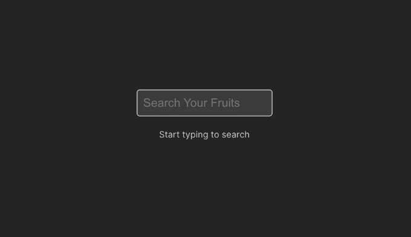
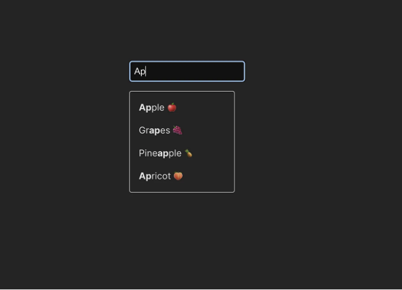
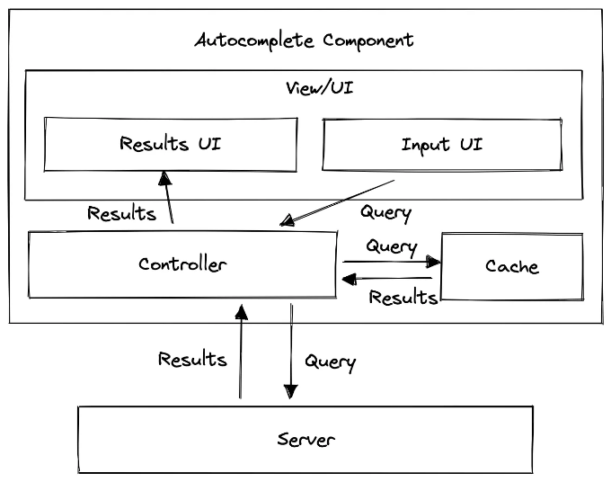

자동완성은 사용자가 입력하는 동안 빠르게 미리 입력된 값 목록에서 찾아 선택할 수 있는 기능을 제공하는 것을 말합니다. 검색 및 필터링을 활용합니다.

# 역사

사용자가 다양한 데이터를 찾으려고 할 때 유용한 기능입니다. 사용자가 입력란에 입력하면 자동완성이 그들의 생각을 완성시켜 전체 용어나 결과를 제공합니다. 이것이 자동완성 경험의 기본입니다.

가장 널리 활용되는 곳은 검색 엔진입니다. 2004년 구글에서 소개되었지만 이 개념을 개선하고 제품에 통합하는 방법에 대한 산업 표준을 설정했습니다.

<!-- ui-log 수평형 -->
<ins class="adsbygoogle"
  style="display:block"
  data-ad-client="ca-pub-4877378276818686"
  data-ad-slot="9743150776"
  data-ad-format="auto"
  data-full-width-responsive="true"></ins>
<component is="script">
(adsbygoogle = window.adsbygoogle || []).push({});
</component>

# 뷰

우리는 이 간단한 자동완성 UI를 구축할 것입니다. 이 입력란에 입력하는 용어에 따라 API에서 과일 목록을 가져옵니다.



이 입력란에 문자열을 입력하면 API를 호출하여 쿼리를 전달하여 목록을 받습니다.

<!-- ui-log 수평형 -->
<ins class="adsbygoogle"
  style="display:block"
  data-ad-client="ca-pub-4877378276818686"
  data-ad-slot="9743150776"
  data-ad-format="auto"
  data-full-width-responsive="true"></ins>
<component is="script">
(adsbygoogle = window.adsbygoogle || []).push({});
</component>



# 아키텍처



- 2개의 UI를 가지고 있는 뷰가 있습니다:

<!-- ui-log 수평형 -->
<ins class="adsbygoogle"
  style="display:block"
  data-ad-client="ca-pub-4877378276818686"
  data-ad-slot="9743150776"
  data-ad-format="auto"
  data-full-width-responsive="true"></ins>
<component is="script">
(adsbygoogle = window.adsbygoogle || []).push({});
</component>

- 입력 UI
- 결과 목록 UI

2. 캐시 및 서버에서 쿼리를 수행하는 컨트롤러가 있습니다.

3. 마지막으로, 서버가 쿼리에 기반하여 결과를 계산하고 반환합니다.

## 코드

<!-- ui-log 수평형 -->
<ins class="adsbygoogle"
  style="display:block"
  data-ad-client="ca-pub-4877378276818686"
  data-ad-slot="9743150776"
  data-ad-format="auto"
  data-full-width-responsive="true"></ins>
<component is="script">
(adsbygoogle = window.adsbygoogle || []).push({});
</component>

## 서버

- ExpressJs를 사용하여 백엔드 서버를 만듭니다.
- CORS를 허용하여 앱을 사용할 수 있도록 합니다.
- 목록을 제공하는 get API를 추가합니다.
- 과일 목록을 준비합니다.
- UI에서 제공할 req.query에 기반하여 목록을 필터링합니다.

```js
const itemList = [
  { id: 1, name: "사과", emoji: "🍎" },
  { id: 2, name: "바나나", emoji: "🍌" },
  { id: 3, name: "오렌지", emoji: "🍊" },
  { id: 4, name: "포도", emoji: "🍇" },
  { id: 5, name: "딸기", emoji: "🍓" },
  { id: 6, name: "수박", emoji: "🍉" },
  { id: 7, name: "파인애플", emoji: "🍍" },
  { id: 8, name: "망고", emoji: "🥭" },
  { id: 9, name: "복숭아", emoji: "🍑" },
  { id: 10, name: "키위", emoji: "🥝" },
  { id: 11, name: "블루베리", emoji: "🫐" },
  { id: 12, name: "라즈베리", emoji: "🍇" },
  { id: 13, name: "블랙베리", emoji: "🫐" },
  { id: 14, name: "체리", emoji: "🍒" },
  { id: 15, name: "자두", emoji: "🍑" },
  { id: 16, name: "아프리콧", emoji: "🍑" },
  { id: 17, name: "배", emoji: "🍐" },
  { id: 18, name: "레몬", emoji: "🍋" },
  { id: 19, name: "라임", emoji: "🍈" },
  { id: 20, name: "코코넛", emoji: "🥥" },
];

// 목록을 제공하는 Route
app.get("/api/items", (req, res) => {
  if (req.query?.searchTerm) {
    const searchTerm = req.query?.searchTerm.toLowerCase();
    const filteredItems = itemList.filter((item) =>
      item.name.toLowerCase().includes(searchTerm)
    );
    res.json(filteredItems);
  }
});
```

## 클라이언트

<!-- ui-log 수평형 -->
<ins class="adsbygoogle"
  style="display:block"
  data-ad-client="ca-pub-4877378276818686"
  data-ad-slot="9743150776"
  data-ad-format="auto"
  data-full-width-responsive="true"></ins>
<component is="script">
(adsbygoogle = window.adsbygoogle || []).push({});
</component>

- 간단한 React 앱을 만듭니다. 설정에는 Vite를 사용하는 것을 추천합니다.
- 프레젠테이션용으로 AutoComplete 컴포넌트를 만듭니다.
- 결과를 표시하는 List 컴포넌트를 만듭니다.
- 쿼리를 생성하는 컨트롤러인 useFruits라는 이름의 훅을 생성할 것입니다.

`AutoComplete/`

```js
const Input = styled.input`
  padding: 0.5rem;
  font-size: 1rem;
  border-radius: 0.25rem;
  border: 1px solid #ccc;
  margin-bottom: 1rem;
`;

const ResultContainer = styled.div`
  border: 1px solid #ccc;
  border-radius: 0.25rem;
  padding: 0.5rem;
  max-height: 200px;
  overflow-y: auto;
`;

const AutoCompleteContainer = styled.div`
  padding: 1rem;
  margin-top: 2rem;
  height: 20vh;
`;

const HelperText = styled.div`
  font-size: 0.75rem;
  color: #ccc;
`;

export default function AutoComplete() {
  const [searchTerm, setSearchTerm] = React.useState("");
  const [activeIndex, setActiveIndex] = React.useState(-1);

  const { fruits, loading } = useFruits(
    "http://localhost:3000/api/items",
    searchTerm
  );

  const handleChange = (event: React.ChangeEvent<HTMLInputElement>) => {
    setSearchTerm(event.target.value);
  };

  const handleSelect = (fruit: IFruit) => {
    setSearchTerm(fruit.name);
  };

  const onKeyDown = (event: React.KeyboardEvent<HTMLInputElement>) => {
    if (event.key === "ArrowDown") {
      setActiveIndex((prev) => (prev + 1) % fruits.length);
    }
    if (event.key === "ArrowUp") {
      setActiveIndex((prev) => (prev - 1 + fruits.length) % fruits.length);
    }
    if (event.key === "Enter") {
      setSearchTerm(fruits[activeIndex].name);
    }
  };

  return (
    <AutoCompleteContainer>
      <Input
        onChange={handleChange}
        onKeyDown={onKeyDown}
        value={searchTerm}
        placeholder="Search Your Fruits"
      />

      {searchTerm ? (
        <ResultContainer>
          <ResultList
            results={fruits}
            searchTerm={searchTerm}
            loading={loading}
            handleSelect={handleSelect}
            activeIndex={activeIndex}
          />
        </ResultContainer>
      ) : (
        <HelperText>Start typing to search</HelperText>
      )}
    </AutoCompleteContainer>
  );
}
```

- 프레젠테이션 컴포넌트로, useFruits 훅에서 데이터를 받습니다.
- 사용자가 입력하고 값이 searchTerm 상태에 의해 단일 진실의 원본에서 값을 얻을 수 있는 제어 Input이 있습니다.

<!-- ui-log 수평형 -->
<ins class="adsbygoogle"
  style="display:block"
  data-ad-client="ca-pub-4877378276818686"
  data-ad-slot="9743150776"
  data-ad-format="auto"
  data-full-width-responsive="true"></ins>
<component is="script">
(adsbygoogle = window.adsbygoogle || []).push({});
</component>

`ResultList/`

```js
인터페이스 ResultListProps {
  결과: IFruit[];
  검색어: 문자열;
  로딩: 부울;
  핸들선택: (과일: IFruit) => void;
  활성인덱스: 숫자;
}

상수 List = styled.div`
  목록스타일: 없음;
  텍스트정렬: 왼쪽;
`;

상수 ListItem = styled.li`
  패딩: 0.5렘;
  커서: 포인터;
  &:hover {
    배경색: #f9f9f9;
    색상: #333;
  }
  &.active {
    배경색: #f9f9f9;
    색상: #333;
  }
`;

export default function ResultList({
  결과,
  검색어,
  로딩,
  핸들선택,
  활성인덱스,
}: ResultListProps): JSX.Element {
  const 일치하는단어 = (이름: 문자열, 검색어: 문자열) => {
    const 인덱스 = 이름.toLowerCase().indexOf(검색어.toLowerCase());
    if (인덱스 === -1) {
      return 이름;
    }
    return (
      <>
        {이름.substring(0, 인덱스)}
        <b>{이름.substring(인덱스, 인덱스 + 검색어.length)}</b>
        {이름.substring(인덱스 + 검색어.length)}
      </>
    );
  };
  if (로딩) {
    return <List>로딩 중...</List>;
  }

  if (결과.length === 0) {
    return <List>결과 없음</List>;
  }
  return (
    <>
      <List>
        {결과.map((결과, 인덱스) => (
          <ListItem
            key={결과.id}
            onClick={() => 핸들선택(결과)}
            className={활성인덱스 === 인덱스 ? "active" : ""}
          >
            <>
              {일치하는단어(결과.name, 검색어)} <span>{결과.emoji}</span>
            </>
          </ListItem>
        ))}
      </List>
    </>
  );
}
```

- 이 컴포넌트는 목록으로 결과를 표시하는 역할을 합니다.
- 결과, 검색어, 로딩 정보 및 handleSelect 콜백을 props로 받습니다.
- 검색어를 활용하여 정확한 일치 사항을 강조하는 matchedTerm 함수가 있습니다 (멋진 사용자 경험!)
- 로딩 및 비어있는 결과 상태에 대해도 처리합니다.

`useFruits/`

<!-- ui-log 수평형 -->
<ins class="adsbygoogle"
  style="display:block"
  data-ad-client="ca-pub-4877378276818686"
  data-ad-slot="9743150776"
  data-ad-format="auto"
  data-full-width-responsive="true"></ins>
<component is="script">
(adsbygoogle = window.adsbygoogle || []).push({});
</component>

```js
export default function useFruits(url: string, searchTerm?: string) {
  const [fruits, setFruits] = React.useState<IFruit[]>([]);
  const [loading, setLoading] = React.useState(false);

  useEffect(() => {
    setLoading(true);
    if (!searchTerm) {
      setLoading(false);
      return setFruits([]);
    }

    const cachedData = sessionStorage.getItem(`fruits_${searchTerm}`);
    if (cachedData) {
      setFruits(JSON.parse(cachedData));
      setLoading(false);
      return;
    }
    const getFruits = setTimeout(async () => {
      try {
        const response = await fetch(url + `?searchTerm=${searchTerm}`);
        const data = await response.json();
        setFruits(data);
        setLoading(false);

        sessionStorage.setItem(`fruits_${searchTerm}`, JSON.stringify(data));
      } catch (error) {
        console.error(error);
      }
    }, 300);
    return () => clearTimeout(getFruits);
  }, [url, searchTerm]);

  return { fruits, loading };
}
```

- 이 코드는 리액트 훅으로서 데이터를 가져오고 결과를 캐시하며 로딩 정보를 제공하는 역할을 합니다.
- 먼저 캐시된 데이터를 확인하고 이미 데이터를 가지고 있다면 해당 데이터를 제공하고 fetch 작업을 건너뜁니다!
- 그렇지 않으면 검색어를 쿼리 매개변수로 사용하여 fetch 작업을 수행합니다.
- 반드시 디바운싱을 지켜야 합니다! fetch 작업을 작은 시간 단위로 지연시킵니다. 이렇게 하면 사용자의 입력을 기다릴 수 있으며 앱 성능을 향상시킬 수 있습니다.

이것은 표준 자동 완성 UI의 몇 가지 기본 기능을 다룹니다. 이 코드는 잘 유지보수되며 구조화되었으며 잘 알려진 소프트웨어 패턴을 사용하며 무엇보다도 성능에 신경을 쓰고 있습니다!

읽어 주셔서 감사합니다. 항상 배우는 것을 멈추지 마세요 :)```