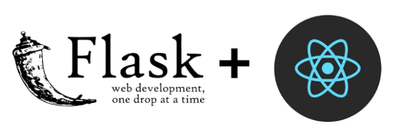

# TL;DR 🧐

이 튜토리얼에서는 React + Flask 애플리케이션을 설정하고 socket.io를 사용하여 클라이언트와 서버 간에 웹소켓을 통해 상호작용하는 방법을 보여드리겠습니다.

## 배경 🧩

<!-- ui-log 수평형 -->
<ins class="adsbygoogle"
  style="display:block"
  data-ad-client="ca-pub-4877378276818686"
  data-ad-slot="9743150776"
  data-ad-format="auto"
  data-full-width-responsive="true"></ins>
<component is="script">
(adsbygoogle = window.adsbygoogle || []).push({});
</component>

실시간으로 사용자의 친구 피드를 업데이트하는 웹 애플리케이션을 만들고 싶었어요. 페이지를 다시 렌더링할 필요 없이 실시간 데이터 전송을 가능하게 하기 위해 웹소켓 통신 프로토콜을 통한 연결 설정이 필요하다는 것을 깨달았죠.

이 기술에 처음 두 발을 들어놓았기 때문에, 먼저 이 웹소켓 연결 방법을 익히기 위해 큰 프로젝트에 적용하기 전에 작은 앱을 먼저 만들어 보기로 결심했어요. 그리고 이번 튜토리얼에서 사용할 간단한 앱이에요.

이 일을 시작하면서, Flask와 React 간의 특정 연결 설정을 만드는 것이 혼란스럽고 어려웠어요. 주로 이유는 각각 다른 원본에서 실행되기 때문이었죠 (Flask는 포트 5000에서, React는 포트 3000에서). React + Flask를 웹소켓과 함께 설정하는 좋은 온라인 자습서들을 찾았지만, 그 중 하나도 완전히 동작하지 않았어요.

많은 시행착오 끝에, 이 프레임워크를 사용해 웹소켓 연결을 작동시킬 수 있었답니다. 이제 나는 다른 사람들이 Flask+React 앱을 웹소켓으로 구축하려는 분들을 도와주기 위해 내 단계들을 공유하려고 해요. 구체적으로, socket.io 라이브러리를 사용하여 서버와 클라이언트 간 서로 듣고 말할 수 있는 방법을 보여드릴 거예요. 이를 통해 다른 사용자들이 실시간으로 채팅할 수 있는 간단한 메시징 앱을 만들어 볼 거예요.

<!-- ui-log 수평형 -->
<ins class="adsbygoogle"
  style="display:block"
  data-ad-client="ca-pub-4877378276818686"
  data-ad-slot="9743150776"
  data-ad-format="auto"
  data-full-width-responsive="true"></ins>
<component is="script">
(adsbygoogle = window.adsbygoogle || []).push({});
</component>

모든 코드를 다운로드하려면 GitHub 저장소를 방문해주세요.

## 기술 스택 📚

## 앱 데모 📟

아래 그림 1을 보면, Google Chrome 브라우저(왼쪽)와 Firefox 브라우저(오른쪽)가 앱을 실행 중입니다. HTTP 통신으로 표시된 상자에는 서버로의 HTTP 요청으로부터 가져온 빨간 텍스트가 페이지 로드시 렌더링됩니다. WebSocket 통신으로 표시된 상자에는 웹소켓을 이용해 두 사용자 간에 이루어지는 실시간 채팅 통신이 표시됩니다.

<!-- ui-log 수평형 -->
<ins class="adsbygoogle"
  style="display:block"
  data-ad-client="ca-pub-4877378276818686"
  data-ad-slot="9743150776"
  data-ad-format="auto"
  data-full-width-responsive="true"></ins>
<component is="script">
(adsbygoogle = window.adsbygoogle || []).push({});
</component>

사용자가 메시지를 보내면 앱을 실행 중인 모든 사용자가 서버에서 수동으로 요청하지 않아도 즉시 메시지를 볼 수 있습니다. 아래 GIF에서 확인할 수 있습니다.

## Flask → 서버 설정 📡

플라스크 서버.py 파일을 설정하고, 이 파일의 각 섹션을 자세히 살펴보겠습니다.

<!-- ui-log 수평형 -->
<ins class="adsbygoogle"
  style="display:block"
  data-ad-client="ca-pub-4877378276818686"
  data-ad-slot="9743150776"
  data-ad-format="auto"
  data-full-width-responsive="true"></ins>
<component is="script">
(adsbygoogle = window.adsbygoogle || []).push({});
</component>

주요 라이브러리인 flask, flask_socketio 및 flask_cors를 설치하고 가져와야 합니다. 이는 아래 그림 2에서 확인할 수 있습니다(GitHub 저장소의 requirements.txt에서 모든 라이브러리 버전을 확인하세요). 또한 eventlet을 설치했지만 앱을 실행할 때 flask-socketio가 자동으로 감지하기 때문에 가져올 필요가 없습니다.

그림 3에서 볼 수 있듯이, flask 앱의 인스턴스를 생성하고 비밀 키를 할당합니다. 그런 다음 CORS를 초기화하고 앱을 전달하여 Cross-Origin Resource Sharing을 허용합니다. 또한 모든 출처와의 앱 공유를 허용하도록 리소스 매개변수를 설정했습니다. 마지막으로, 앱을 전달하고 모든 출처 '*'에 대해 CORS를 허용할 매개변수를 전달하는 SocketIO의 인스턴스를 생성합니다.

그림 4에서는 일반 flask route와 클라이언트와 통신하기 위한 몇 가지 서버 측 이벤트 핸들러를 볼 수 있습니다.

내가 설정한 루트 @app.route("/http-call") 하나만 설정하여, 앱이 클라이언트에서 시작된 정규 HTTP 호출 및 서버로부터의 응답을 처리할 수 있음을 보여줍니다. 또한 WebSocket을 통한 지속적인 통신도 처리할 수 있습니다.

<!-- ui-log 수평형 -->
<ins class="adsbygoogle"
  style="display:block"
  data-ad-client="ca-pub-4877378276818686"
  data-ad-slot="9743150776"
  data-ad-format="auto"
  data-full-width-responsive="true"></ins>
<component is="script">
(adsbygoogle = window.adsbygoogle || []).push({});
</component>

socket.io를 사용하면 메시지가 이벤트로 클라이언트와 서버 양쪽에서 받아지므로 서버는 이러한 이벤트에 대한 핸들러를 등록해야 합니다. 즉, @socketio.on()을 사용해야 합니다. 이벤트 핸들러 내에서는 클라이언트가 해당 특정 이름 아래의 메시지를 수신할 수 있도록 대기할 이벤트의 이름이 포함되어 있습니다.

이 예시에서는 "connect"라는 이벤트 이름이 사용자가 연결될 때 대기하게 됩니다. 그런 다음 새 사용자가 연결되었다는 메시지를 현재 연결된 모든 클라이언트에 다시 보냅니다.

"data"라는 이벤트 이름은 사용자가 제출하는 메시지를 대기합니다. 서버가 메시지를 받으면 해당 메시지를 서버에 있는 모든 사용자에게 다시 전송합니다.

마지막으로 "disconnect"라는 이벤트 이름은 사용자가 서버와 연결을 해제할 때 대기하게 되며 사용자가 연결을 해제했다는 메시지를 모든 사용자에 다시 보냅니다.

<!-- ui-log 수평형 -->
<ins class="adsbygoogle"
  style="display:block"
  data-ad-client="ca-pub-4877378276818686"
  data-ad-slot="9743150776"
  data-ad-format="auto"
  data-full-width-responsive="true"></ins>
<component is="script">
(adsbygoogle = window.adsbygoogle || []).push({});
</component>

참고: 이벤트명은 사용자 정의 이름일 수 있으며 JSON과 같은 다양한 데이터 유형을 처리할 수도 있습니다.

서버의 최종 설정은 어플리케이션을 실행하는 방식입니다. 아래 그림 5를 참조하세요. 소켓.io 라이브러리를 사용하여 플라스크 앱을 실행하려면 일반적인 app.run() 대신에 socketio.run()을 사용하여 소켓인스턴스를 실행해야 합니다.

## React → 클라이언트 설정 💻

클라이언트 측에서는 package.json 파일에서 "proxy": "http://localhost:5001/"로 프록시를 설정했습니다. 아래 그림 6와 같이 설정하세요.

<!-- ui-log 수평형 -->
<ins class="adsbygoogle"
  style="display:block"
  data-ad-client="ca-pub-4877378276818686"
  data-ad-slot="9743150776"
  data-ad-format="auto"
  data-full-width-responsive="true"></ins>
<component is="script">
(adsbygoogle = window.adsbygoogle || []).push({});
</component>

아래 그림 7에 표시된 App.js 파일에서는 socket.io-client 라이브러리에서 {io}를 가져와서 사용합니다. 그런 다음 useEffect 내부에서 io를 사용하여 채팅 기능을 켜는 버튼을 클릭할 때 서버와의 웹소켓 연결을 초기화합니다.

useEffect 내부에서 io 연결의 인스턴스를 만들고 변수 socket에 설정합니다. io는 로컬호스트 서버를 매개변수 "localhost:5001/"로 사용하고, 전송 방법(이 경우 WebSocket) 및 React의 포트 3000을 시작점으로 하는 cors 매개변수 설정을 취합니다. 그런 다음이 소켓 인스턴스를 앱 전체에서 사용할 수 있도록 로컬 상태에 설정하기 위해 setSocketInstance를 사용합니다.

또한, useEffect 내부에는 이벤트 이밋터 방법인 socket.on이 있습니다. 이 이밋터에는 첫 번째 매개변수로 이벤트 "connect"를 전달하여 새로운 사용자가 연결되었음을 서버에 알립니다. 또한 서버에서 받은 데이터를 처리하는 콜백 함수가 두 번째 매개변수로 전달됩니다.

useEffect 내부에는 "disconnected"인 사용자들을 듣기 위한 다른 이벤트 이밋터도 추가합니다. 이는 사용자가 연결을 해제할 때 서버와 다른 모든 클라이언트에 알리게 됩니다.

<!-- ui-log 수평형 -->
<ins class="adsbygoogle"
  style="display:block"
  data-ad-client="ca-pub-4877378276818686"
  data-ad-slot="9743150776"
  data-ad-format="auto"
  data-full-width-responsive="true"></ins>
<component is="script">
(adsbygoogle = window.adsbygoogle || []).push({});
</component>

useEffect의 끝에, 채팅이 닫히고 컴포넌트가 언마운트될 때 WebSocket 연결을 완전히 닫기 위해 cleanup() 함수를 포함하는 return을 추가합니다.

우리는 socket 연결 인스턴스를 상태 socketInstance에 저장했기 때문에 이를 앱에서 가지고 있는 모든 컴포넌트에 props으로 전달할 수 있습니다. 우리의 경우에는 소켓 인스턴스를 채팅을 구축할 `WebSocketCall/`컴포넌트로 전달하고 싶습니다.

`WebSocketCall/`컴포넌트는 아래의 Figure 8에 표시되어 있습니다. 이 컴포넌트는 우리 앱의 채팅 기능을 갖고 있습니다.

내부에서 ahandleText() 함수는 사용자가 텍스트 상자에 타이핑할 때 메시지 상태를 업데이이트 합니다. 사용자가 제출 버튼을 클릭하면 handleSubmit() 함수가 호출되어 소켓.emit을 사용하여 메시지를 event "data"로 서버에 보내고 두 번째 매개변수로 메시지 상태를 전달합니다. 서버는 그 메시지를 연결된 모든 사용자에게 다시 보냅니다.

<!-- ui-log 수평형 -->
<ins class="adsbygoogle"
  style="display:block"
  data-ad-client="ca-pub-4877378276818686"
  data-ad-slot="9743150776"
  data-ad-format="auto"
  data-full-width-responsive="true"></ins>
<component is="script">
(adsbygoogle = window.adsbygoogle || []).push({});
</component>

사용자가 새로운 메시지를 보낼 때마다 메시지 구성 요소를 렌더링하고 업데이트하는 데 useEffect를 사용합니다. useEffect는 소켓과 메시지를 종속성 배열에 사용하므로 해당 종속성 중 하나가 업데이트될 때 메시징 구성 요소가 다시 렌더링됩니다. 그러면 사용자가 메시지를 받을 수 있는 "data" 이벤트 리스너가 활성화됩니다.

## 결론 🔚

본 튜토리얼은 Flask와 React를 사용하여 서버와 클라이언트가 서로 다른 출처에서 작동할 때도 상호 청취하도록하여 웹소켓 통신을 활용하는 앱을 구축할 수 있습니다.

웹소켓 통신을 통해 실시간 피드, 실시간 데이터 시각화, 주식 가격 지표, 메시징 앱, 위치 기반 앱 등과 같은 흥미로운 앱 기능을 구축할 수 있습니다.

<!-- ui-log 수평형 -->
<ins class="adsbygoogle"
  style="display:block"
  data-ad-client="ca-pub-4877378276818686"
  data-ad-slot="9743150776"
  data-ad-format="auto"
  data-full-width-responsive="true"></ins>
<component is="script">
(adsbygoogle = window.adsbygoogle || []).push({});
</component>

이 튜토리얼이 유용했기를 바랍니다. 궁금한 점이 있거나 LinkedIn을 통해 저에게 연락하려면 댓글을 남겨주세요. 소프트웨어 엔지니어링의 신세인데요, 피드백이나 건설적인 코멘트가 있으시면 알려주시면 감사하겠습니다 😊. 읽어주셔서 감사합니다.

## Repo 🗄️

어플리케이션의 전체 코드를 다운로드하고 보고 실행하기 위해 아래 GitHub 저장소를 방문해주세요:

## Connect with me 🌎

<!-- ui-log 수평형 -->
<ins class="adsbygoogle"
  style="display:block"
  data-ad-client="ca-pub-4877378276818686"
  data-ad-slot="9743150776"
  data-ad-format="auto"
  data-full-width-responsive="true"></ins>
<component is="script">
(adsbygoogle = window.adsbygoogle || []).push({});
</component>

## 도움이 되는 자료