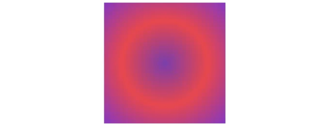
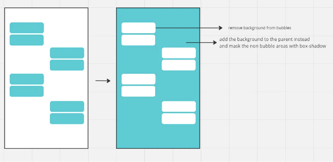

요즘 인스타그램에서 메시지 배경뿐만 아니라 메시지의 배경에 그라데이션 배경을 선택할 수 있다는 사실을 알게 되었어요. 그래서 이것에 대해 생각을 해 보았는데, 웹에서는 어떻게 이를 적용할 수 있을까요?

보통 이것을 하려면, 간단히 방사형 또는 선형 그라데이션을 사용하여 배경 속성을 추가하기만 하면 됩니다.



메시징 애플리케이션에서 각 메시지 말풍선에도 이를 적용할 수 있지만 약간 이상할 수 있어요.

<!-- ui-log 수평형 -->
<ins class="adsbygoogle"
  style="display:block"
  data-ad-client="ca-pub-4877378276818686"
  data-ad-slot="9743150776"
  data-ad-format="auto"
  data-full-width-responsive="true"></ins>
<component is="script">
(adsbygoogle = window.adsbygoogle || []).push({});
</component>

위의 표를 Markdown 형식으로 변경하고 싶습니다.

<!-- ui-log 수평형 -->
<ins class="adsbygoogle"
  style="display:block"
  data-ad-client="ca-pub-4877378276818686"
  data-ad-slot="9743150776"
  data-ad-format="auto"
  data-full-width-responsive="true"></ins>
<component is="script">
(adsbygoogle = window.adsbygoogle || []).push({});
</component>

그걸 위해서는 말풍선과 액션 버블의 부모에 배경 그라데이션을 적용하고 마스크로 사용해야 해요.



이를 달성하기 위해, 먼저 JSX 구조를 만들고 스타일을 적용해요.

버블로부터 나머지 배경을 가리기 위해 박스 그림자를 적용해야 해요. 아래 비디오에서는, 텍스트 요소에 적용했을 때 박스 그림자의 마법을 보여줘요.

<!-- ui-log 수평형 -->
<ins class="adsbygoogle"
  style="display:block"
  data-ad-client="ca-pub-4877378276818686"
  data-ad-slot="9743150776"
  data-ad-format="auto"
  data-full-width-responsive="true"></ins>
<component is="script">
(adsbygoogle = window.adsbygoogle || []).push({});
</component>

```js
box-shadow: <x-offset> <y-offset> <blur> <spread radius> <color>
```

여기에서 해야 할 더 많은 작업이 하나 더 있어요. 텍스트가 항상 100% 너비가 아니기 때문에 별도의 요소나 가상 클래스를 만들어 별도의 흰색 배경을 추가해야 해요. 만약 배경이 다른 색이라면 해당 색에 맞게 조정해야 할거에요.

div 안에 실제 텍스트를 위한 하나와 다시 흰색 배경 마스킹을 위한 다른 하나의 span 요소 2개를 추가할 거에요.

여기까지 하면 백그라운드는 거품이 서로 분리되어 있고 그 뒤에 있는 색과 일치하는 그라데이션 배경으로 제공될 거에요.

<!-- ui-log 수평형 -->
<ins class="adsbygoogle"
  style="display:block"
  data-ad-client="ca-pub-4877378276818686"
  data-ad-slot="9743150776"
  data-ad-format="auto"
  data-full-width-responsive="true"></ins>
<component is="script">
(adsbygoogle = window.adsbygoogle || []).push({});
</component>

우리는 더 많은 메시지를 추가할 수 있고, 객체에서 메시지를 가져와 맵핑할 수 있습니다. 이 글을 위해서, 메시지를 왼쪽 또는 오른쪽으로 정렬하는 옵션을 추가했습니다. 실제 상황에서는 보낸 사람 또는 받는 사람을 정의해야 합니다.

최종 결과물은 다음과 같아야합니다:


맵 내부에 {item.text}를 추가하고 실제 메시지를 표시하며, border-radius를 추가하여 레이아웃을 보강하고, 더 많은 메시지를 추가할 수 있는 기능을 갖춘 입력란을 추가할 수 있습니다.

<!-- ui-log 수평형 -->
<ins class="adsbygoogle"
  style="display:block"
  data-ad-client="ca-pub-4877378276818686"
  data-ad-slot="9743150776"
  data-ad-format="auto"
  data-full-width-responsive="true"></ins>
<component is="script">
(adsbygoogle = window.adsbygoogle || []).push({});
</component>

제 다음 글에서는 자이로스코프, 나침반, 가속도계와 같은 센서에 액세스할 수 있는 기기에서 배경을 애니메이션화하는 방법을 보여드릴 거예요.