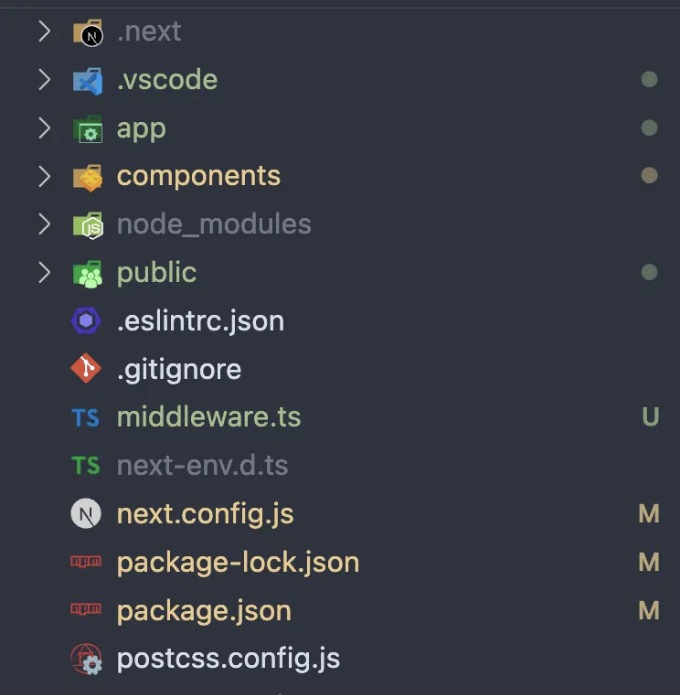
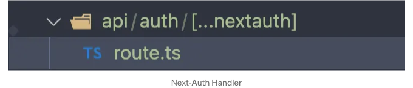
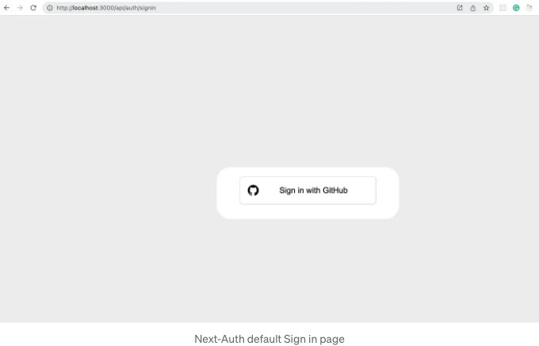
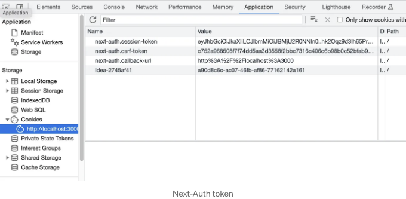
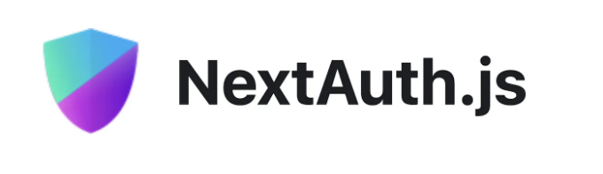

Next.js가 최근 안정 버전의 App Router를 출시했습니다. 이 버전에는 레이아웃, 템플릿, 라우팅, 로딩 및 에러 처리를 내장 지원합니다.

현재 Next-Auth 문서의 버전은 Next.js의 페이지 라우터 예제와 함께 게시되었습니다. 이 문서는 Next-Auth App Router를 설정하는 방법을 공유합니다.

# 이 문서에서 다루는 내용은 무엇인가요?

- 앱 라우터를 사용한 Next.js 앱 설정.
- Next-Auth 설치.
- Github 제공 업체 구성.
- Next-Auth를 위한 핸들러 추가.
- Next-Auth를 사용한 로그인 및 로그아웃.
- 서버 컴포넌트에서 세션 사용.
- 클라이언트 컴포넌트에서 세션 사용.

<!-- ui-log 수평형 -->
<ins class="adsbygoogle"
  style="display:block"
  data-ad-client="ca-pub-4877378276818686"
  data-ad-slot="9743150776"
  data-ad-format="auto"
  data-full-width-responsive="true"></ins>
<component is="script">
(adsbygoogle = window.adsbygoogle || []).push({});
</component>

# 앱 라우터와 함께 Next.js 앱 설정하기

기본 Next.js 앱을 앱 라우터와 함께 생성하려면 이 문서를 따르세요.


  
# Next-Auth 설치

<!-- ui-log 수평형 -->
<ins class="adsbygoogle"
  style="display:block"
  data-ad-client="ca-pub-4877378276818686"
  data-ad-slot="9743150776"
  data-ad-format="auto"
  data-full-width-responsive="true"></ins>
<component is="script">
(adsbygoogle = window.adsbygoogle || []).push({});
</component>

```js
npm install next-auth
```

# Github 공급자 구성

우선 GitHub 앱을 만들어서 클라이언트 ID 및 비밀을 제공받으세요. lib 폴더에 auth.js 파일을 추가하세요.

참고: NEXTAUTH_SECRET로 추가할 비밀을 생성해야 합니다. auth 옵션에 반드시 추가해야 합니다.

<!-- ui-log 수평형 -->
<ins class="adsbygoogle"
  style="display:block"
  data-ad-client="ca-pub-4877378276818686"
  data-ad-slot="9743150776"
  data-ad-format="auto"
  data-full-width-responsive="true"></ins>
<component is="script">
(adsbygoogle = window.adsbygoogle || []).push({});
</component>

```js
openssl rand -base64 32

// 결과
// mQ46qpFwfE1BHuqMC+qlm19qBAD9fVPgh28werwe3ASFlAfnKjM=
```

다음은 config.js 파일입니다.

```js
/** @type {import('next').NextConfig} */
const nextConfig = {
  images: {
    remotePatterns: [
      {
        protocol: 'https',
        hostname: 'i.imgur.com',
      },
    ],
  },
  env: {
    GITHUB_APP_CLIENT_ID: '919b87qa4sdfs1qdc44f53baf9',
    GITHUB_APP_CLIENT_SECRET: '2aeq98df3f8cwqerc2d03a8360e993c115ba8d5f71de9',
    NEXTAUTH_SECRET: 'mQ46qpFwfE1BHuqMC+qlm19qBAD9fVPgh28werwe3ASFlAfnKjM=',
  },
};

module.exports = nextConfig;
```

```js
import { NextAuthOptions } from 'next-auth';
import GithubProvider from 'next-auth/providers/github';
export const authOptions: NextAuthOptions = {
  // Next-auth를 위한 비밀키, 이 값이 없으면 JWT 암호화/해독이 작동하지 않습니다
  secret: process.env.NEXTAUTH_SECRET,
  
  // 하나 이상의 인증 공급자 구성
  providers: [
    GithubProvider({
      clientId: process.env.GITHUB_APP_CLIENT_ID as string,
      clientSecret: process.env.GITHUB_APP_CLIENT_SECRET as string,
    }),
  ],
};
```

<!-- ui-log 수평형 -->
<ins class="adsbygoogle"
  style="display:block"
  data-ad-client="ca-pub-4877378276818686"
  data-ad-slot="9743150776"
  data-ad-format="auto"
  data-full-width-responsive="true"></ins>
<component is="script">
(adsbygoogle = window.adsbygoogle || []).push({});
</component>

# Next-Auth 핸들러 추가하기

`/app/auth/[...nextauth]` 폴더 안에 `route.js` 파일을 생성하세요.



```js
import NextAuth from 'next-auth';
import { authOptions } from '@/app/lib/auth';

const handler = NextAuth(authOptions);
export { handler as GET, handler as POST };
```

<!-- ui-log 수평형 -->
<ins class="adsbygoogle"
  style="display:block"
  data-ad-client="ca-pub-4877378276818686"
  data-ad-slot="9743150776"
  data-ad-format="auto"
  data-full-width-responsive="true"></ins>
<component is="script">
(adsbygoogle = window.adsbygoogle || []).push({});
</component>

# Next-auth를 사용한 로그인 및 로그아웃

위의 경로/api/auth/* (signIn, callback, signOut 등)로의 모든 요청은 NextAuth.js에서 처리됩니다.

버튼을 클릭하여 로그인하고 앱을 승인하면 세션에 쿠키가 저장됩니다.



<!-- ui-log 수평형 -->
<ins class="adsbygoogle"
  style="display:block"
  data-ad-client="ca-pub-4877378276818686"
  data-ad-slot="9743150776"
  data-ad-format="auto"
  data-full-width-responsive="true"></ins>
<component is="script">
(adsbygoogle = window.adsbygoogle || []).push({});
</component>

로그인에 성공한 후에



# 로그아웃

로그아웃하려면 ` /api/auth/signout ` 링크를 사용하세요.

<!-- ui-log 수평형 -->
<ins class="adsbygoogle"
  style="display:block"
  data-ad-client="ca-pub-4877378276818686"
  data-ad-slot="9743150776"
  data-ad-format="auto"
  data-full-width-responsive="true"></ins>
<component is="script">
(adsbygoogle = window.adsbygoogle || []).push({});
</component>

# API 라우트에서 세션.

API 라우트 핸들러는 서버 구성 요소로 간주됩니다. 정적 또는 동적 핸들러가 될 수 있지만 항상 서버 측에 있습니다.

```js
import { authOptions } from '@/app/lib/auth';
import { getServerSession } from 'next-auth';
import { NextResponse } from 'next/server';

export async function GET(request: Request) {
  const session = await getServerSession(authOptions);
  console.log(session);
  return NextResponse.json({
    id: 1,
  });
}
```

<!-- ui-log 수평형 -->
<ins class="adsbygoogle"
  style="display:block"
  data-ad-client="ca-pub-4877378276818686"
  data-ad-slot="9743150776"
  data-ad-format="auto"
  data-full-width-responsive="true"></ins>
<component is="script">
(adsbygoogle = window.adsbygoogle || []).push({});
</component>

```json
{
  user: {
    name: 'Rohit Kumar Khatri',
    email: 'er.rohitkumar@outlook.com',
    image: 'https://avatars.githubusercontent.com/u/34018015?v=4'
  }
}
```

# 서버 구성요소에서의 세션

서버 구성요소 모두에서도 비슷합니다. 위에서 언급한 함수를 사용하십시오.

```js
await getServerSession(authOptions);
```

<!-- ui-log 수평형 -->
<ins class="adsbygoogle"
  style="display:block"
  data-ad-client="ca-pub-4877378276818686"
  data-ad-slot="9743150776"
  data-ad-format="auto"
  data-full-width-responsive="true"></ins>
<component is="script">
(adsbygoogle = window.adsbygoogle || []).push({});
</component>

# 클라이언트 컴포넌트에서 세션

먼저, 루트 레이아웃에 세션 제공자를 추가해주세요.

```js
'use client';

import { SessionProvider } from 'next-auth/react';
import { ReactNode } from 'react';

export default function NextAuthProvider({
  children,
}: {
  children: ReactNode;
}) {
  return <SessionProvider>{children}</SessionProvider>;
}
```

```js
import { useSelectedLayoutSegments } from 'next/navigation';
import './globals.css';
import { Inter } from 'next/font/google';
import Footer from '@/app/components/Footer';
import Navbar from '@/app/components/Navbar';
import NextAuthProvider from '@/app/context/NextAuthProvider';
import { ReactNode } from 'react';
const inter = Inter({ subsets: ['latin'] });

export default function RootLayout({ children }: { children: ReactNode }) {
  return (
    <html lang="en">
      <body className={`inter.className`}>
        <NextAuthProvider>
          <div className="w-10/12 m-auto text-center bg-white flex flex-col min-h-screen">
            <div>
              <Navbar />
            </div>
            <div className="grow">{children}</div>
            <Footer />
          </div>
        </NextAuthProvider>
      </body>
    </html>
  );
}
```

<!-- ui-log 수평형 -->
<ins class="adsbygoogle"
  style="display:block"
  data-ad-client="ca-pub-4877378276818686"
  data-ad-slot="9743150776"
  data-ad-format="auto"
  data-full-width-responsive="true"></ins>
<component is="script">
(adsbygoogle = window.adsbygoogle || []).push({});
</component>

이제 클라이언트 구성 요소에서 세션을 사용해 보세요.

```js
'use client';

import { useSession } from 'next-auth/react';

export default function ClientComponent() {
  const { data: session, status } = useSession();
  return (
    <div>
      클라이언트 구성 요소 {status}{' '}
      {status === 'authenticated' && session.user?.name}
    </div>
  );
}
```

