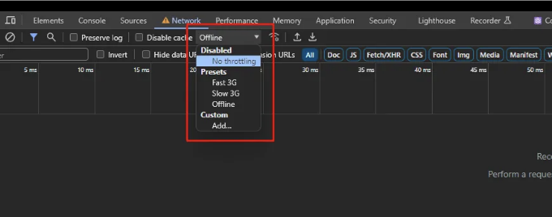

흥미진진한 업데이트 시간이에요! 이번 세션에서는 인터넷에 연결되지 않은 상태에서 앱을 사용하는 사용자들이 보는 '오프라인' 페이지를 사용자 정의하는 방법을 살펴볼 거예요. 브라우저가 제공하는 기본 오프라인 페이지에 의존하는 대신, next-pwa라는 패키지의 기능을 활용할 거예요. 이 튜토리얼의 독특한 점은 해당 패키지를 구현하는 것뿐만 아니라 이 패키지의 하부 작동 메커니즘을 자세하게 살펴보면서 보다 심층적인 이해를 얻을 거라는 거에요. 그러니 더 이상 말이 필요 없죠, 이 프로세스의 복잡성에 뛰어들어 봅시다!


# PWA란

PWA는 "Progressive Web App"의 약자에요. PWA는 HTML, CSS, JavaScript 등의 일반적인 웹 기술을 사용하여 만들어진 소프트웨어 응용 프로그램 유형이에요. PWA의 주요 기능은 오프라인 작업, 푸시 알림 및 네이티브 앱처럼 사용자의 장치에 설치될 수 있는 능력을 포함하고 있어요. PWA는 다양한 장치와 네트워크 환경에서 원활하고 매력적인 사용자 경험을 제공하기 위한 목표를 가지고 있어요. 자세한 정보를 보시려면 여기를 확인해 주세요: Progressive Web Apps

<!-- ui-log 수평형 -->
<ins class="adsbygoogle"
  style="display:block"
  data-ad-client="ca-pub-4877378276818686"
  data-ad-slot="9743150776"
  data-ad-format="auto"
  data-full-width-responsive="true"></ins>
<component is="script">
(adsbygoogle = window.adsbygoogle || []).push({});
</component>

# 다음 PWA

저수준에서 "next-pwa" 패키지는 Service Workers를 활용합니다. 이 글에서는 Service Workers에 대해 다루지 않겠습니다 (제가 잘 몰라서요 ㅋㅋ). 이 기본 기술을 통해 Progressive Web App (PWA) 기능을 Next.js 애플리케이션에 매끄럽게 통합할 수 있습니다. 이 패키지의 다양성은 앱을 위한 다양한 설정 옵션으로 나타납니다. 그러나 이 글에서는 "오프라인" 페이지 기능의 상세 구현에 중점을 둘 것입니다.

# 앱 설정하기

먼저, 패키지를 설치해보겠습니다!

<!-- ui-log 수평형 -->
<ins class="adsbygoogle"
  style="display:block"
  data-ad-client="ca-pub-4877378276818686"
  data-ad-slot="9743150776"
  data-ad-format="auto"
  data-full-width-responsive="true"></ins>
<component is="script">
(adsbygoogle = window.adsbygoogle || []).push({});
</component>

```js
npm i @ducanh2912/next-pwa
또는
pnpm i @ducanh2912/next-pwa
또는
bun add @ducanh2912/next-pwa
```

public 폴더 아래에 manifest.json 파일을 생성해야 해요. 이 manifest.json은 여기서 생성할 수 있어요. (또는 단순히 manifest.json 생성기를 검색하셔도 돼요, 다 똑같아요, 아마.)

```js
{
  "name": "",
  "short_name": "",
  "theme_color": "#00ff00",
  "background_color": "#ffffff",
  "display": "browser",
  "orientation": "any",
  "scope": "/",
  "start_url": "/",
  "icons": [
    {
      "src": "/icons-192.png",
      "type": "image/png",
      "sizes": "192x192"
    },
    {
      "src": "/icons-256.png",
      "type": "image/png",
      "sizes": "256x256"
    }
  ]
}
```

이것이 manifest.json 파일이어야 하는 예시에요.

<!-- ui-log 수평형 -->
<ins class="adsbygoogle"
  style="display:block"
  data-ad-client="ca-pub-4877378276818686"
  data-ad-slot="9743150776"
  data-ad-format="auto"
  data-full-width-responsive="true"></ins>
<component is="script">
(adsbygoogle = window.adsbygoogle || []).push({});
</component>

그 후에 오프라인 페이지 설정을 위해 먼저 라우트를 생성해야 해요.
앱 라우터에 "offline" 폴더를 만들었어요. 이렇게 생겼어요:

```js
└── app/ 
   ├── offline/ 
   │     └── page.tsx 
   ├── page.tsx 
   ├── layout.tsx 
   └── favicon.ico
```

마지막으로, next.config 파일에서 폴백 라우트를 지정해 줘야 해요:

```js
const withPWA = require("@ducanh2912/next-pwa").default({
  cacheOnFrontEndNav: true,
  aggressiveFrontEndNavCaching: true,
  reloadOnOnline: true,
  swcMinify: true,
  dest: "public",
  fallbacks: {
    //image: "/static/images/fallback.png",
    document: "/offline", // 만약 /_offline 대신 사용자 정의 페이지로 폴백하려면
    // font: '/static/font/fallback.woff2',
    // audio: ...,
    // video: ...,
  },
  workboxOptions: {
    disableDevLogs: true,
  },
  // ... 여러분이 좋아하는 다른 옵션들
});
/** @type {import('next').NextConfig} */
const nextConfig = {
  // ... 여러분이 좋아하는 다른 옵션들
};

module.exports = withPWA(nextConfig);
```

<!-- ui-log 수평형 -->
<ins class="adsbygoogle"
  style="display:block"
  data-ad-client="ca-pub-4877378276818686"
  data-ad-slot="9743150776"
  data-ad-format="auto"
  data-full-width-responsive="true"></ins>
<component is="script">
(adsbygoogle = window.adsbygoogle || []).push({});
</component>

그게 전부에요. 개발 서버 상태에서는 동작하지 않을 수 있으니, npm run build를 실행한 뒤에 npm run start를 시도해보세요.

이 구성을 통해 사용자가 연결 문제를 만났을 때 다른 경로를 클릭하면 브라우저의 기본 "연결 없음" 페이지가 아니라 사용자 정의 오프라인 페이지가 표시됩니다. 이 개선으로 네트워크 장애 발생 시 더욱 순조로운 사용자 경험을 보장할 수 있습니다.

# 어떻게 테스트하나요?

<!-- ui-log 수평형 -->
<ins class="adsbygoogle"
  style="display:block"
  data-ad-client="ca-pub-4877378276818686"
  data-ad-slot="9743150776"
  data-ad-format="auto"
  data-full-width-responsive="true"></ins>
<component is="script">
(adsbygoogle = window.adsbygoogle || []).push({});
</component>



개발자 콘솔에서 "네트워크" 탭으로 이동하여 드롭다운 메뉴를 찾을 수 있습니다. 테스트 목적으로이 메뉴를 "오프라인"으로 설정하면 사용자 정의 오프라인 페이지가 표시되는 조건을 모방할 수 있습니다. 이 단계를 통해 오프라인 페이지의 작동을 확인하고 세부 조정할 수 있습니다. 이는 제어된 테스트 환경에서 오프라인 페이지의 동작을 확인하는 데 도움이 됩니다.


이 글에서 다룬 예제 NextJS 앱이 여기 있습니다:

<!-- ui-log 수평형 -->
<ins class="adsbygoogle"
  style="display:block"
  data-ad-client="ca-pub-4877378276818686"
  data-ad-slot="9743150776"
  data-ad-format="auto"
  data-full-width-responsive="true"></ins>
<component is="script">
(adsbygoogle = window.adsbygoogle || []).push({});
</component>

라이브 링크: 🔗 https://next-pwa-offline-gamma.vercel.app/
저장소 링크: 🔗 https://github.com/mertthesamael/next-pwa-offline/tree/master

내 웹사이트: https://merto.dev

다음 시간까지, 안녕!

하루에 최소 2리터의 물을 마시는 걸 잊지 마세요!