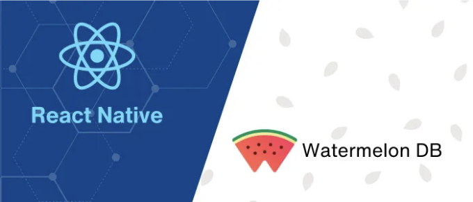

이전에 일했던 회사에서 흥미로운 것을 발견했어요. React Native와 WatermelonDB를 함께 사용하여 오프라인 데이터 저장을 할 수 있어요.

## WatermelonDB란?

WatermelonDB는 SQLite 기술을 사용하는 React Native와 React 웹 앱을 위한 데이터베이스 프레임워크입니다.

<!-- ui-log 수평형 -->
<ins class="adsbygoogle"
  style="display:block"
  data-ad-client="ca-pub-4877378276818686"
  data-ad-slot="9743150776"
  data-ad-format="auto"
  data-full-width-responsive="true"></ins>
<component is="script">
(adsbygoogle = window.adsbygoogle || []).push({});
</component>

## 왜 WatermelonDB?

WatermelonDB는 React Native 및 React 웹 앱에서 사용자 데이터를 다루는 새로운 방법입니다.

React Native에서 복잡한 애플리케이션을 구축하는 데 최적화되어 있으며, 핵심 목표는 실제 성능입니다. 간단히 말하면, 앱이 빠르게 시작되어야 합니다.

# 설치

<!-- ui-log 수평형 -->
<ins class="adsbygoogle"
  style="display:block"
  data-ad-client="ca-pub-4877378276818686"
  data-ad-slot="9743150776"
  data-ad-format="auto"
  data-full-width-responsive="true"></ins>
<component is="script">
(adsbygoogle = window.adsbygoogle || []).push({});
</component>

```js
yarn add @nozbe/watermelondb

# 또는 npm을 사용할 경우
npm install @nozbe/watermelondb
```

# React Native 설정

- 아직 설치하지 않은 경우 데코레이터를 위한 Babel 플러그인을 설치하십시오:

```js
yarn add --dev @babel/plugin-proposal-decorators

# 또는 npm을 사용할 경우
npm install -D @babel/plugin-proposal-decorators
```

<!-- ui-log 수평형 -->
<ins class="adsbygoogle"
  style="display:block"
  data-ad-client="ca-pub-4877378276818686"
  data-ad-slot="9743150776"
  data-ad-format="auto"
  data-full-width-responsive="true"></ins>
<component is="script">
(adsbygoogle = window.adsbygoogle || []).push({});
</component>

- babel.config.js 파일에 ES6 데코레이터 지원 추가하기:

```js
{
  "presets": ["module:metro-react-native-babel-preset"],
  "plugins": [["@babel/plugin-proposal-decorators", { "legacy": true }]]
}
```

# WatermelonDB를 위한 앱 설정하기

루트 폴더에 model/schema.ts, model/migrations.ts 및 model/index.ts를 만드세요.

<!-- ui-log 수평형 -->
<ins class="adsbygoogle"
  style="display:block"
  data-ad-client="ca-pub-4877378276818686"
  data-ad-slot="9743150776"
  data-ad-format="auto"
  data-full-width-responsive="true"></ins>
<component is="script">
(adsbygoogle = window.adsbygoogle || []).push({});
</component>

- 당신의 schema.ts 파일은 다음과 같아야 합니다.

- 당신의 migration.ts 파일은 다음과 같아야 합니다. 한 가지 버전만 사용하는 경우 migrations를 빈 배열로 유지해야 합니다.

- 당신의 index.ts 파일은 다음과 같아야 합니다. 새로운 modelClass를 만든 후에 modelClass를 등록하는 것을 잊지 마세요.

# 모델

<!-- ui-log 수평형 -->
<ins class="adsbygoogle"
  style="display:block"
  data-ad-client="ca-pub-4877378276818686"
  data-ad-slot="9743150776"
  data-ad-format="auto"
  data-full-width-responsive="true"></ins>
<component is="script">
(adsbygoogle = window.adsbygoogle || []).push({});
</component>

모델 클래스는 앱에서 특정 유형의 항목을 나타냅니다. 예를 들어, 제품(Product), 카테고리(Categories) 등이 있습니다.

# 모델 생성

model/product.ts와 model/categories.ts 파일을 생성해주세요.

- 여기 제가 예시로 드리는 product.ts 모델 클래스는 category.ts 모델 클래스와 일대다 관계를 가지고 있습니다.

<!-- ui-log 수평형 -->
<ins class="adsbygoogle"
  style="display:block"
  data-ad-client="ca-pub-4877378276818686"
  data-ad-slot="9743150776"
  data-ad-format="auto"
  data-full-width-responsive="true"></ins>
<component is="script">
(adsbygoogle = window.adsbygoogle || []).push({});
</component>

- 카테고리.ts 모델 클래스

# 사용법

이름이 queries인 폴더를 생성하여 이전에 생성된 스키마와 모델을 수정하는 데 사용할 모든 함수를 담아 봅시다.

시작하기 전에 쿼리 캐싱을 처리하기 위해 다음 패키지를 추가해 봅시다.

<!-- ui-log 수평형 -->
<ins class="adsbygoogle"
  style="display:block"
  data-ad-client="ca-pub-4877378276818686"
  data-ad-slot="9743150776"
  data-ad-format="auto"
  data-full-width-responsive="true"></ins>
<component is="script">
(adsbygoogle = window.adsbygoogle || []).push({});
</component>

```js
$ yarn add @tanstack/react-query
# 또는 npm을 사용하여
$ npm i @tanstack/react-query
```

- queries 폴더에 fileproduct.ts 파일을 추가하여 제품 모델 클래스를 수정하는 모든 로직을 수용합니다.

- queries 폴더에 file categories.ts 파일을 추가하여 카테고리 모델 클래스를 수정하는 모든 로직을 수용합니다.

# 컴포넌트에서 사용됨

<!-- ui-log 수평형 -->
<ins class="adsbygoogle"
  style="display:block"
  data-ad-client="ca-pub-4877378276818686"
  data-ad-slot="9743150776"
  data-ad-format="auto"
  data-full-width-responsive="true"></ins>
<component is="script">
(adsbygoogle = window.adsbygoogle || []).push({});
</component>

제품 CRUD 작업에 사용해 보세요.

카테고리 CRUD 작업에서도 동일하게 적용해 보세요.

## 결론

API 없이 복잡한 데이터를 저장할 수 있습니다. 온라인 서버에 데이터를 저장해야 하는 경우 Sync 기능을 사용할 수 있습니다. 더 많은 정보는 공식 WatermelonDB를 확인해보세요.