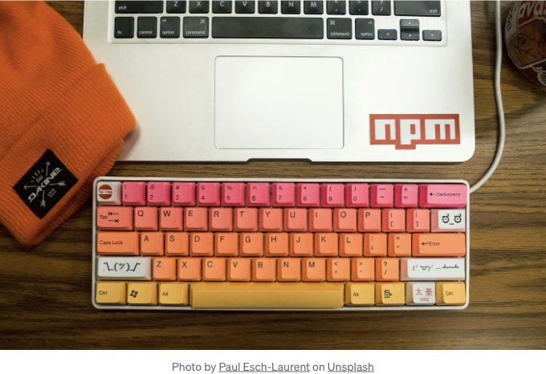

안녕하세요, 독자 여러분,

이 글에서는 reactjs-toggleswitch에 대해 이야기하려고 합니다. React 프로젝트를 진행하면 웹사이트를 구축할 때 컴포넌트를 재사용할 수 있는지 알고 계십니다. 다양한 컴포넌트들이 많이 있지만, 이 중 하나에 대해 이야기해 보겠습니다. 그래서 저는 여러분과 reactjs-toggleswitch를 공유할 수 있어서 기쁩니다! 이것은 간단하고 사용자 정의 가능한 토글 스위치입니다.

# reactjs-toggleswitch 개요

<!-- ui-log 수평형 -->
<ins class="adsbygoogle"
  style="display:block"
  data-ad-client="ca-pub-4877378276818686"
  data-ad-slot="9743150776"
  data-ad-format="auto"
  data-full-width-responsive="true"></ins>
<component is="script">
(adsbygoogle = window.adsbygoogle || []).push({});
</component>

reactjs-toggleswitch는 React 및 TypeScript를 사용하여 만든 사용자 정의 토글 스위치 컴포넌트입니다. React 프로젝트에서 이 토글 스위치를 어디에 사용할 수 있을지 궁금할 수 있습니다. 주로, 라이트 모드와 다크 모드 간에 토글하고 싶을 때 두 상태 (켜기/끄기) 간에 토글 스위치가 사용됩니다.

## Reactjs-toggleswitch를 설치하는 방법 🤔

NPM이나 YARN과 같은 즐겨 사용하는 패키지 매니저를 사용하여 간단히 reactjs-toggleswitch를 React 프로젝트에 설치할 수 있습니다.

NPM을 사용하는 경우, 터미널에 아래 명령어를 입력하세요:

<!-- ui-log 수평형 -->
<ins class="adsbygoogle"
  style="display:block"
  data-ad-client="ca-pub-4877378276818686"
  data-ad-slot="9743150776"
  data-ad-format="auto"
  data-full-width-responsive="true"></ins>
<component is="script">
(adsbygoogle = window.adsbygoogle || []).push({});
</component>

```js
npm install reactjs-toggleswitch
```

YARN을 사용하는 경우 터미널에 아래 명령어를 입력하세요:

```js
yarn add reactjs-toggleswitch
```

설치가 완료되면 reactjs-toggleswitch 기능을 탐험할 준비가 끝났습니다.

<!-- ui-log 수평형 -->
<ins class="adsbygoogle"
  style="display:block"
  data-ad-client="ca-pub-4877378276818686"
  data-ad-slot="9743150776"
  data-ad-format="auto"
  data-full-width-responsive="true"></ins>
<component is="script">
(adsbygoogle = window.adsbygoogle || []).push({});
</component>

## reactjs-toggleswitch 사용 방법

패키지를 설치한 후, react 프로젝트에서 이 패키지를 어떻게 사용해야 할지 궁금할 수 있습니다. 그에 대한 간단한 예제를 사용하여 이야기해 보겠습니다.

```js
import React, { useState } from 'react';
import {ToggleSwitch} from 'reactjs-toggleswitch';

const MyComponent: React.FC = () => {
  const [isChecked, setIsChecked] = useState<boolean>(false);

  const handleChange = (checked: boolean) => {
    setIsChecked(checked);
  };

  return (
    <div>
      <h2>토글 기본 스위치 예제</h2>
      <ToggleSwitch checked={isChecked} onToggle={handleChange} />
    </div>
  );
};
```

위의 간단한 예제에서는 reactjs-toggleswitch에서 ToggleSwitch 컴포넌트를 import 했습니다. ToggleSwitch 컴포넌트에는 checked와 onToggle이라는 2가지 필수 props가 있습니다. checked는 스위치가 선택되었는지 여부를 나타내며, onToggle은 스위치 상태가 변경되거나 토글될 때 호출되는 콜백 함수입니다.

<!-- ui-log 수평형 -->
<ins class="adsbygoogle"
  style="display:block"
  data-ad-client="ca-pub-4877378276818686"
  data-ad-slot="9743150776"
  data-ad-format="auto"
  data-full-width-responsive="true"></ins>
<component is="script">
(adsbygoogle = window.adsbygoogle || []).push({});
</component>

## 커스터마이징은 어떤가요?

우리가 이야기한대로 reactjs-toggleswitch는 커스터마이징이 가능하며, 우리의 요구에 맞게 컴포넌트를 커스터마이징할 수도 있습니다. 이에 대해 논의해보겠습니다.

1. 색상.

우리는 toggle switch의 색상을 변경할 수 있습니다. onColor 및 offColor props를 사용하여 toggle switch의 색상을 변경할 수 있습니다. 아래는 해당 예시입니다.

<!-- ui-log 수평형 -->
<ins class="adsbygoogle"
  style="display:block"
  data-ad-client="ca-pub-4877378276818686"
  data-ad-slot="9743150776"
  data-ad-format="auto"
  data-full-width-responsive="true"></ins>
<component is="script">
(adsbygoogle = window.adsbygoogle || []).push({});
</component>

```js
<ToggleSwitch 
 checked={isChecked}
 onColor={"#0f0"}
 offColor={"#0ff"}
 onToggle={handleChange}
 />
```

2. 너비

toggle switch의 너비를 `width` prop을 사용하여 변경할 수 있습니다. 아래에 예시를 보여드리겠습니다.

```js
<ToggleSwitch
   checked={checked}
   onToggle={handleChange}
   offColor="red"
   onColor="green"
   width={"200px"}
 />
```

<!-- ui-log 수평형 -->
<ins class="adsbygoogle"
  style="display:block"
  data-ad-client="ca-pub-4877378276818686"
  data-ad-slot="9743150776"
  data-ad-format="auto"
  data-full-width-responsive="true"></ins>
<component is="script">
(adsbygoogle = window.adsbygoogle || []).push({});
</component>

3. 엄지 색상

토글 스위치의 색상을 변경할 수 있습니다. thumbOnColor 및 thumbOffColor props를 사용해보세요. 아래는 예시입니다.

```js
 <ToggleSwitch 
    checked={isChecked}
    thumbOffColor='#0f0' 
    thumbOnColor='#f00' 
    onColor={"#0f0"} 
    offColor={"#0ff"} 
    onToggle={handleChange} 
 />
```

이 외에도 더 많은 기능이 있습니다. 더 많은 예시를 참고해보세요.

<!-- ui-log 수평형 -->
<ins class="adsbygoogle"
  style="display:block"
  data-ad-client="ca-pub-4877378276818686"
  data-ad-slot="9743150776"
  data-ad-format="auto"
  data-full-width-responsive="true"></ins>
<component is="script">
(adsbygoogle = window.adsbygoogle || []).push({});
</component>

# 결론

마침내, 더 나은 토글 스위치가 React에서 사용 가능하더라도, React 프로젝트에서 이 토글 스위치를 사용하면 여러분이 더 쉽게 일을 처리할 수 있습니다. 켜고 끄는 것이든, 이 편리한 작은 구성 요소는 여러분의 웹 개발 여정에 편의성을 더해줍니다. 한번 시도해보세요!

이 패키지의 소스 코드는 제 [github 링크](여기에 github 링크)를 확인하시면 됩니다. 이 패키지가 도움이 되었다고 생각하시면 저장소에 ⭐을 눌러주세요.

좋은 하루 되세요, 즐거운 코딩하세요!✨

<!-- ui-log 수평형 -->
<ins class="adsbygoogle"
  style="display:block"
  data-ad-client="ca-pub-4877378276818686"
  data-ad-slot="9743150776"
  data-ad-format="auto"
  data-full-width-responsive="true"></ins>
<component is="script">
(adsbygoogle = window.adsbygoogle || []).push({});
</component>

만약 reactjs-toggleswitch를 사용하는 동안 문제가 발생하면 여기에서 문제를 제기해주세요. 패키지의 README를 참조할 수 있습니다.

이 기사를 읽어 주셔서 감사합니다. 시간 내어 읽어 주셔서 감사합니다.