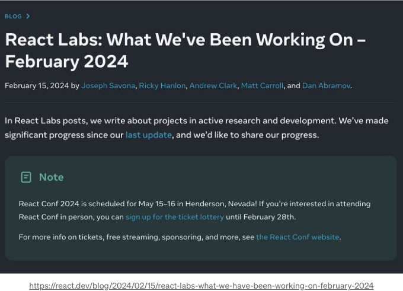
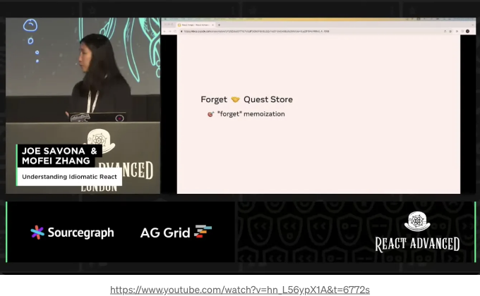
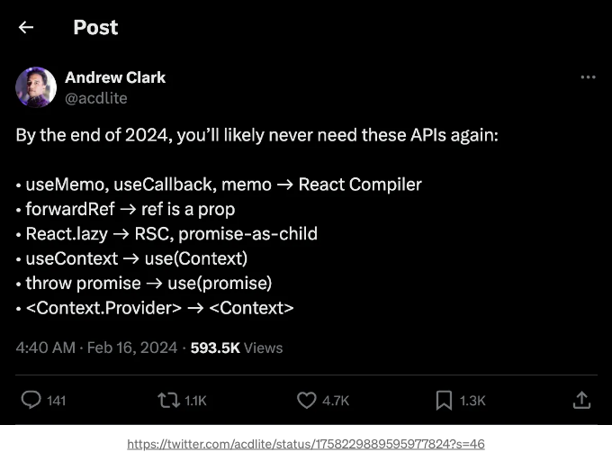

얼마 전에 React 팀이 공식 블로그에서 포스트를 공유했어요. 그들은 지난 주요 릴리스부터 2024년 2월까지의 작업에 대해 이야기했어요.



가장 놀란 건 React 컴파일러였어요.

<!-- ui-log 수평형 -->
<ins class="adsbygoogle"
  style="display:block"
  data-ad-client="ca-pub-4877378276818686"
  data-ad-slot="9743150776"
  data-ad-format="auto"
  data-full-width-responsive="true"></ins>
<component is="script">
(adsbygoogle = window.adsbygoogle || []).push({});
</component>

React는 종종 런타임이 무거운 프레임워크라고 불립니다. 이는 컴파일 중 렌더링에 대한 많은 최적화를 수행하지 않기 때문입니다.

이는 개발자가 코딩하는 동안 많은 유연성을 제공합니다. React는 useMemo/useCallback과 같은 API를 제공하여 최적화를 개발자에게 맡깁니다. 그러나 이는 개발자에게 많은 사고 부담을 주기도 합니다.

React를 잘 활용하면 앱의 성능을 탁월하게 개선할 수 있습니다. 그러나 실제로 React를 숙달하는 것은 우리가 생각하는 것보다 훨씬 어렵습니다.

반면에 Vue.js와 같은 프레임워크는 다릅니다. 사람들은 Vue가 초보자에게 더 쉽다고 말합니다. 주로 더 직관적이기 때문입니다. 많은 최적화가 컴파일 시간에 수행됩니다.

<!-- ui-log 수평형 -->
<ins class="adsbygoogle"
  style="display:block"
  data-ad-client="ca-pub-4877378276818686"
  data-ad-slot="9743150776"
  data-ad-format="auto"
  data-full-width-responsive="true"></ins>
<component is="script">
(adsbygoogle = window.adsbygoogle || []).push({});
</component>

리액트 컴파일러가 새롭게 선보여지면 이 흔히 알려진 믿음이 바뀌게 될지도 몰라요.

공식 리액트 블로그에 따르면:

리액트 컴파일러는 초기 아이디어뿐만 아니라 이미 instagram.com의 프로덕션 환경을 지원하고 있어요. 



<!-- ui-log 수평형 -->
<ins class="adsbygoogle"
  style="display:block"
  data-ad-client="ca-pub-4877378276818686"
  data-ad-slot="9743150776"
  data-ad-format="auto"
  data-full-width-responsive="true"></ins>
<component is="script">
(adsbygoogle = window.adsbygoogle || []).push({});
</component>

작년에 React 팀이 이를 발표했어요. 그 때는 React Forget이라고 불렀는데, 지금은 React Compiler로 이름이 바뀌었어요.

React Compiler은 Babel 플러그인을 기반으로 합니다. 이게 무슨 일을 하는지 간단하게 이해하는 방법은 다음과 같아요:

React Compiler는 일반적인 React 코드를 각 hook, 컴포넌트 속성 및 컴포넌트 자체가 캐시된 코드로 변환해줍니다. 예를 들어, 아래의 코드:

```js
const Component = () => {
  const onSubmit = () => {};
  const onMount = () => {};

  useEffect(() => {
    onMount();
  }, [onMount]);

  return <Form onSubmit={onSubmit} />;
};
```


<!-- ui-log 수평형 -->
<ins class="adsbygoogle"
  style="display:block"
  data-ad-client="ca-pub-4877378276818686"
  data-ad-slot="9743150776"
  data-ad-format="auto"
  data-full-width-responsive="true"></ins>
<component is="script">
(adsbygoogle = window.adsbygoogle || []).push({});
</component>

지금 여기서, 실제로 onSubmit 및 onMount가 useCallback으로 래핑된 것처럼 작동합니다. 그리고 Form은 React.memo로 래핑되어 있습니다:

```js
const FormMemo = React.memo(Form);

const Component = () => {
  const onSubmit = useCallback(() => {}, []);
  const onMount = useCallback(() => {}, []);

  useEffect(() => {
    onMount();
  }, [onMount]);

  return <FormMemo onSubmit={onSubmit} />;
};
```

물론, 컴파일러는 이 데모에서 보여주는 것보다 훨씬 더 많은 일을 합니다.

자세한 설명은 이 비디오를 시청해보세요: React 컴파일러 비디오

<!-- ui-log 수평형 -->
<ins class="adsbygoogle"
  style="display:block"
  data-ad-client="ca-pub-4877378276818686"
  data-ad-slot="9743150776"
  data-ad-format="auto"
  data-full-width-responsive="true"></ins>
<component is="script">
(adsbygoogle = window.adsbygoogle || []).push({});
</component>

현재 버전에서는 부모 컴포넌트가 다시 렌더링되면 그 안에 있는 모든 컴포넌트가 다시 렌더링됩니다.

```js
// 부모가 다시 렌더링되면
const Parent = () => {
  // 자식 컴포넌트도 다시 렌더링됩니다
  return <Child />;
};
```

이상적으로는 자식 컴포넌트는 해당 프롭이 변경될 때에만 다시 렌더링되어야 합니다.

React 컴파일러로 인해 모든 것이 낮은 수준의 캐싱되므로 이 이상적인 상태가 실현되었습니다.

<!-- ui-log 수평형 -->
<ins class="adsbygoogle"
  style="display:block"
  data-ad-client="ca-pub-4877378276818686"
  data-ad-slot="9743150776"
  data-ad-format="auto"
  data-full-width-responsive="true"></ins>
<component is="script">
(adsbygoogle = window.adsbygoogle || []).push({});
</component>

개발할 때 성능 최적화 기교를 자주 사용해요. "상태를 아래로 이동"하거나 "컴포넌트를 props로 전달"하는 방법을 사용하여 다시 렌더링을 줄일 수 있어요. useCallback과 memo를 사용하기 전에 이런 기교들을 시도하는 것이 좋아요. 왜냐하면 React에서 캐싱을 올바르게 하는 것은 매우 까다로운 일이기 때문이에요.

예를 들어, 이 코드에서:

```js
const Component = () => {
  const [isOpen, setIsOpen] = useState(false);

  return (
    <>
      <Button onClick={() => setIsOpen(true)}>
        open dialog
      </Button>
      {isOpen && <ModalDialog />}
      <VerySlowComponent />
    </>
  );
};
```

다이얼로그를 열 때마다 VerySlowComponent가 다시 렌더링되요. 이 때문에 다이얼로그를 열 때 지연이 발생해요. 다이얼로그 열기 상태를 컴포넌트로 캡슐화하면 다음과 같아요:

<!-- ui-log 수평형 -->
<ins class="adsbygoogle"
  style="display:block"
  data-ad-client="ca-pub-4877378276818686"
  data-ad-slot="9743150776"
  data-ad-format="auto"
  data-full-width-responsive="true"></ins>
<component is="script">
(adsbygoogle = window.adsbygoogle || []).push({});
</component>

```js
const ButtonWithDialog = () => {
  const [isOpen, setIsOpen] = useState(false);

  return (
    <>
      <Button onClick={() => setIsOpen(true)}>
        open dialog
      </Button>
      {isOpen && <ModalDialog />}
    </>
  );
};

const Component = () => {
  return (
    <>
      <ButtonWithDialog />
      <VerySlowComponent />
    </>
  );
};
```

우리는 기본적으로 VerySlowComponent의 불필요한 다시 렌더링을 피하고 무언가를 캐싱하지 않습니다.

React 컴파일러를 사용하면 이러한 시나리오로 인한 성능 저하는 더 이상 발생하지 않습니다. 다시 렌더링도 발생하지 않을 것입니다.

당연하게도, 번거로운 useMemo와 useCallback은 과거의 것이 될 것입니다...```

<!-- ui-log 수평형 -->
<ins class="adsbygoogle"
  style="display:block"
  data-ad-client="ca-pub-4877378276818686"
  data-ad-slot="9743150776"
  data-ad-format="auto"
  data-full-width-responsive="true"></ins>
<component is="script">
(adsbygoogle = window.adsbygoogle || []).push({});
</component>

앤드류 클락이 트위터에서 말한 바에 따르면, React 컴파일러가 올해 말까지 출시될 예정이라고 합니다. 게다가 React는 몇 가지 새로운 변경 사항을 가져올 예정입니다:



- useMemo, useCallback, memo → React 컴파일러가 컴포넌트의 다시 렌더링과 콜백 함수의 생성을 자동으로 처리하고 최적화할 것으로 예상되어, 이러한 함수들은 더 이상 필요하지 않을 것입니다.
- forwardRef → Refs는 일반 prop으로 취급될 것입니다. 따라서 extra forwardRef 함수 없이도 다른 prop처럼 처리할 수 있습니다.
- React.lazy → 코드 분할 React.lazy가 새로운 RSC(React Server Component)와 promise-as-child로 대체될 예정이며, 비동기 컴포넌트 로딩에 더 나은 지원을 제공할 것입니다.
- useContext → (Context)를 사용하여 Context의 값에 직접 액세스할 수 있어, 사용법이 크게 간소화될 것입니다.
- throw promise → 직접 (promise)를 사용하여, 명시적으로 Promise를 throw하고 catch할 필요 없이 비동기 작업을 훨씬 간단하게 처리할 수 있습니다.
- `Context.Provider` → `Context`만 사용하면 될 뿐 `Context.Provider`가 필요하지 않아 Context 프로바이더의 사용 방법이 더욱 간편해질 것입니다.

React가 곧 출시할 새로운 기능에 대해 어떻게 생각하시나요? 아래에 의견을 자유롭게 남겨주세요.

<!-- ui-log 수평형 -->
<ins class="adsbygoogle"
  style="display:block"
  data-ad-client="ca-pub-4877378276818686"
  data-ad-slot="9743150776"
  data-ad-format="auto"
  data-full-width-responsive="true"></ins>
<component is="script">
(adsbygoogle = window.adsbygoogle || []).push({});
</component>

# 친근한 말투로 번역하여 드립니다 🚀

In Plain English 커뮤니티에 함께해 주셔서 감사합니다! 다 가시기 전에:

- 작가를 clapping하고 팔로우해주세요 👏
- 팔로우하기: X | LinkedIn | YouTube | Discord | Newsletter
- 다른 플랫폼에서도 만나보세요: Stackademic | CoFeed | Venture | Cubed
- 다양한 콘텐츠는 PlainEnglish.io 에서 확인하세요