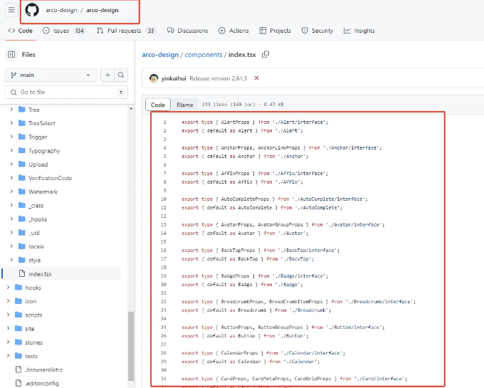

밀도가 높은 import 문은 시각적 영향을 줍니다. 코드 구조를 테스트하는 것도 중요합니다.

import 문에 의해 "전체 화면 점령"을 어떻게 달성할까요? 그리고 이러한 import 문을 어떻게 우아하게 관리할 수 있을까요?

이 기사에서는 import 문이 많이 생성되는 이유, 그들이 야기할 수 있는 잠재적인 문제, 그리고 여러 관점에서 import 문을 최적화하고 관리하는 방법에 대해 살펴볼 것입니다.

<!-- ui-log 수평형 -->
<ins class="adsbygoogle"
  style="display:block"
  data-ad-client="ca-pub-4877378276818686"
  data-ad-slot="9743150776"
  data-ad-format="auto"
  data-full-width-responsive="true"></ins>
<component is="script">
(adsbygoogle = window.adsbygoogle || []).push({});
</component>

# "모듈 재 내보내기" 사용을 거절하세요

모듈 재 내보내기는 일반적인 기술입니다. 트위터, 바이트댄스, 구글과 같은 주요 회사들의 컴포넌트 라이브러리에서 널리 사용됩니다.

예를 들어, 바이트댄스의 arco-design 컴포넌트 라이브러리에서는: github.com/arco-design...

components/index.tsx 파일에서 모든 컴포넌트를 재 내보내기함으로써, 한 줄의 import 문으로 N개의 컴포넌트를 사용할 수 있습니다.

<!-- ui-log 수평형 -->
<ins class="adsbygoogle"
  style="display:block"
  data-ad-client="ca-pub-4877378276818686"
  data-ad-slot="9743150776"
  data-ad-format="auto"
  data-full-width-responsive="true"></ins>
<component is="script">
(adsbygoogle = window.adsbygoogle || []).push({});
</component>

```js
// 명명된 import는 사용하지 않습니다
import Modal from '@arco-design/web-react/es/Modal'
import Checkbox from '@arco-design/web-react/es/Checkbox'
import Message from '@arco-design/web-react/es/Message'
...

// 명명된 import 사용
import { Modal, Checkbox, Message} from '@arco-design/web-react'
```



재내보내기는 일반적으로 동일한 유형의 모듈을 통합하는 데 사용되며, 일반적으로 컴포넌트, 라우트, 유틸리티, 훅, 스토리 등과 같은 폴더로 구성되어 있습니다. 이들은 각각의 index.tsx를 통해 노출되며, 이를 통해 import 경로가 크게 단순화되고 코드의 가독성과 유지보수성이 향상됩니다.

재내보내기의 여러 형태: 

<!-- ui-log 수평형 -->
<ins class="adsbygoogle"
  style="display:block"
  data-ad-client="ca-pub-4877378276818686"
  data-ad-slot="9743150776"
  data-ad-format="auto"
  data-full-width-responsive="true"></ins>
<component is="script">
(adsbygoogle = window.adsbygoogle || []).push({});
</component>

- 직접 재내보내기
다른 모듈에서 특정 멤버들을 직접 재내보냅니다.

```js
export { foo, bar } from './moduleA';
``` 

2. 이름 바꾸고 재내보내기(기본 내보내기 포함)

다른 모듈에서 멤버들을 가져와서 필요에 따라 이름을 바꾸고 내보냅니다.

<!-- ui-log 수평형 -->
<ins class="adsbygoogle"
  style="display:block"
  data-ad-client="ca-pub-4877378276818686"
  data-ad-slot="9743150776"
  data-ad-format="auto"
  data-full-width-responsive="true"></ins>
<component is="script">
(adsbygoogle = window.adsbygoogle || []).push({});
</component>

기본 내보내기도 이름을 바꿀 수 있고 다시 내보낼 수도 있어요.

```js
// export 키워드를 사용해 내보냅니다
export { foo as newFoo, bar as newBar } from './moduleA';
// export default를 사용해 내보냅니다
export { default as ModuleDDefault } from './moduleD';
```

3. 전체 모듈을 다시 내보냅니다 (기본 내보내기 제외)
다른 모듈의 모든 내보낸 멤버를 하나의 객체로 다시 내보냅니다. (참고: 다시 내보낼 때 export default는 포함되지 않을 거에요)

```js
export * from './moduleA';
```

<!-- ui-log 수평형 -->
<ins class="adsbygoogle"
  style="display:block"
  data-ad-client="ca-pub-4877378276818686"
  data-ad-slot="9743150776"
  data-ad-format="auto"
  data-full-width-responsive="true"></ins>
<component is="script">
(adsbygoogle = window.adsbygoogle || []).push({});
</component>

4. 합병하여 가져오고 다시 내보내기
먼저 모듈에서 멤버를 가져와서 사용한 후에 해당 멤버를 다시 내보냅니다.

```js
import { foo, bar } from './moduleA';
export { foo, bar };
```

이러한 형태를 통해 코드 모듈을 유연하게 구성하고 관리할 수 있습니다. 각 형태는 적용 가능한 시나리오가 있으며 적절한 방법을 선택하면 보다 명확하고 효율적인 코드 구조를 구축하는 데 도움이 될 수 있습니다.

# require.context는 절대 사용하지 마세요.

<!-- ui-log 수평형 -->
<ins class="adsbygoogle"
  style="display:block"
  data-ad-client="ca-pub-4877378276818686"
  data-ad-slot="9743150776"
  data-ad-format="auto"
  data-full-width-responsive="true"></ins>
<component is="script">
(adsbygoogle = window.adsbygoogle || []).push({});
</component>

require.context은 하나하나 명시적으로 import하지 않고도 모듈 집합을 동적으로 import할 수 있게 해주는 매우 유용한 기능입니다.

코드 한 줄만으로 파일이나 컴포넌트를 추가할 때 자동으로 수집하고 재import합니다.

프로젝트 라우팅 및 상태 관리와 같이 고정된 시나리오에서 특히 잘 작동합니다 (효율성을 향상시키고 한 구성을 추가할 때 여러 파일을 수정해야 하는 상황을 피할 수 있게 도와줍니다).

특히 라우트를 구성하고 대량의 import를 생성할 때 유용합니다(페이지 수만큼 import를 해야 할 때가 있어요 😅)

<!-- ui-log 수평형 -->
<ins class="adsbygoogle"
  style="display:block"
  data-ad-client="ca-pub-4877378276818686"
  data-ad-slot="9743150776"
  data-ad-format="auto"
  data-full-width-responsive="true"></ins>
<component is="script">
(adsbygoogle = window.adsbygoogle || []).push({});
</component>

```js
// require.context를 사용하지 않습니다
import A from '@/pages/A'
import B from '@/pages/B'
...

// routes/index.ts 파일을 통일적으로 처리합니다
// routes 디렉토리 하위의 모든 .ts 파일을 가져오기 위한 컨텍스트 생성
const routesContext = require.context('./routes', false, /.ts$/);
const routes = [];
// 각 모듈을 순회합니다
routesContext.keys().forEach(modulePath => {
// 모듈의 내보내기값을 가져옵니다
  const route = routesContext(modulePath);
// 필요에 따라 컴포넌트 이름을 가져옵니다, 예: "./Header.ts"에서 "Header" 추출
  // const routeName = modulePath.replace(/^./(.*).\w+$/, '$1');
  // 컴포넌트를 컴포넌트 객체에 저장합니다
  routes.push(route.default || route)
});

export default routes;
```

다수의 경로를 보유한 대형 프로젝트의 경우, require.context를 사용하여 경로 가져오기를 처리하는 데 매우 유용합니다.

# 동적 가져오기를 사용하지 않습니다

동적 가져오기는 require.context와 유사한 기능을 달성할 수 있으며, 모듈을 동적으로 번들링할 수 있습니다.

<!-- ui-log 수평형 -->
<ins class="adsbygoogle"
  style="display:block"
  data-ad-client="ca-pub-4877378276818686"
  data-ad-slot="9743150776"
  data-ad-format="auto"
  data-full-width-responsive="true"></ins>
<component is="script">
(adsbygoogle = window.adsbygoogle || []).push({});
</component>

# "ProvidePlugin"에서 "Not interested"

webpack.ProvidePlugin은 좋은 것이지만 과용해서는 안 됩니다.

프로젝트에서 사용하는 변수/함수/라이브러리나 도구는 한 번 설정하면 어디에서든 사용할 수 있습니다.

이 예제를 읽은 후에는 한 번 사용하지 않았다면 사용해 보고 싶어질 거예요 🤗

<!-- ui-log 수평형 -->
<ins class="adsbygoogle"
  style="display:block"
  data-ad-client="ca-pub-4877378276818686"
  data-ad-slot="9743150776"
  data-ad-format="auto"
  data-full-width-responsive="true"></ins>
<component is="script">
(adsbygoogle = window.adsbygoogle || []).push({});
</component>

```js
const webpack = require('webpack');

module.exports = {
  // 다른 설정들...
  plugins: [
    new webpack.ProvidePlugin({
      React: 'react',
      _: 'lodash',
      dayjs: 'dayjs',
      // 프로젝트의 src 디렉토리에 자체 정의된 utils.js를 가정합니다.
      Utils: path.resolve(__dirname, 'src/utils.js')
    })
  ]
  // 다른 설정들...
};
```

이제 dayjs, lodash, Utils 등을 어디서든 import하지 않고 사용할 수 있습니다.

요약:

- webpack.ProvidePlugin은 반복적인 import 문을 줄이고 코드를 더 깔끔하게 만들어 주는 강력한 도구입니다. 그러나 이 플러그인을 사용하더라도 이러한 라이브러리들은 여전히 최종 번들 파일에 포함되므로 빌드 크기를 줄이지는 않습니다. 이 플러그인을 제대로 활용하면 개발 효율성을 향상시킬 수 있지만, 의존성을 숨기는 일을 방지하여 이해하고 유지 관리하기 어려운 코드로 이어지지 않도록 주의해야 합니다.
- 필요한 모듈이나 컴포넌트를 동적으로 로드해야 하는 경우, bundle 크기를 줄이기 위해 코드가 로드되는 시점을 보다 효과적으로 제어하기 위해 동적 import() 구문을 고려해보세요.
- 불필요한 코드 번들링을 피하기 위해 ProvidePlugin을 적절히 사용하되, 실제로 여러 곳에서 전역 변수 구성이 필요한 모듈에 대해서만 사용하는 것이 좋습니다.```

<!-- ui-log 수평형 -->
<ins class="adsbygoogle"
  style="display:block"
  data-ad-client="ca-pub-4877378276818686"
  data-ad-slot="9743150776"
  data-ad-format="auto"
  data-full-width-responsive="true"></ins>
<component is="script">
(adsbygoogle = window.adsbygoogle || []).push({});
</component>

또한, 만약 Vite 프로젝트를 사용 중이라면, ProvidePlugin 기능 대신 vite-plugin-inject를 사용할 수 있습니다.

```js
// 설정
import inject from 'vite-plugin-inject'; // 테스트용으로 사용 불가능하니, 나중에 대체할 수 있는 솔루션으로 업데이트
...
plugins: [
inject({
  // 키는 제공하려는 전역 변수이고, 값은 제공하려는 모듈입니다
  dayjs: 'dayjs', // 예를 들어, 이렇게 하면 'dayjs'를 전역으로 제공하여 dayjs를 통해 접근할 수 있습니다
  // 전역으로 제공해야 하는 다른 모듈도 계속 추가할 수 있습니다
}),
]
...
```

TS를 사용하는 경우, 타입을 구성하는 것을 기억해주세요.

```js
// globals.d.ts 파일은 전역 유형을 처리합니다
import dayjs from 'dayjs';
declare global {
  const dayjs: typeof dayjs;
}

// 또한 tsconfig.json 파일을 구성하세요
{
"compilerOptions": {
// 컴파일 옵션...
},
"include": [ "src/**/*", "globals.d.ts" // TypeScript가 이 파일을 포함하도록 합니다 ]
}
```

<!-- ui-log 수평형 -->
<ins class="adsbygoogle"
  style="display:block"
  data-ad-client="ca-pub-4877378276818686"
  data-ad-slot="9743150776"
  data-ad-format="auto"
  data-full-width-responsive="true"></ins>
<component is="script">
(adsbygoogle = window.adsbygoogle || []).push({});
</component>

# "대량"의 Typescript 유형 가져오기

TS 프로젝트에서 화면에는 많은 TypeScript 가져오기가 있을 것입니다. 그러나 적절한 구성을 통해 가져오기의 수를 크게 줄일 수 있습니다.

여기에서 제가 프로젝트에서 가장 많이 사용하는 방법을 소개합니다: TS 네임스페이스. 이를 통해 유형을 모듈화할 수뿐만 아니라, 더 중요한 것은 유형을 가져오지 않고 직접 사용할 수 있습니다 😅.

비슷하게, ProvidePlugin처럼 폭발하고 가져오기 문을 직접 제거할 수 있습니다.

<!-- ui-log 수평형 -->
<ins class="adsbygoogle"
  style="display:block"
  data-ad-client="ca-pub-4877378276818686"
  data-ad-slot="9743150776"
  data-ad-format="auto"
  data-full-width-responsive="true"></ins>
<component is="script">
(adsbygoogle = window.adsbygoogle || []).push({});
</component>

사용 예시:

```js
// accout.ts
declare namespace IAccount {
  type IList<T = IItem> = {
    count: number
    list: T[]
  }
  interface IUser {
    id: number;
    name: string;
    avatar: string;
  }
}

// Use any file directly without importing.
const [list, setList] = useState<IAccount.IList|undefined>();
const [user, setUser] = useState<IAccount.IUser|undefined>();
```

참고 ⚠️ eslint를 사용하기 위해 네임스페이스의 사용을 가능하도록 구성해야 할 수도 있습니다 🔛.

# “Not” making full use of Babel features

<!-- ui-log 수평형 -->
<ins class="adsbygoogle"
  style="display:block"
  data-ad-client="ca-pub-4877378276818686"
  data-ad-slot="9743150776"
  data-ad-format="auto"
  data-full-width-responsive="true"></ins>
<component is="script">
(adsbygoogle = window.adsbygoogle || []).push({});
</component>

리액트는 문제를 깨달았습니다. 버전 17 이전에는 JSX의 특성 때문에 각 구성 요소마다 'react'를 명시적으로 가져와야 했습니다. 그러나 그 이후에는 컴파일러에 의해 자동으로 변환되어 'react'를 가져오지 않아도 됩니다. React 17 이전 버전을 사용하고 있다면, Babel을 수정하여 이를 구현할 수 있습니다. 자세한 내용은 공식 React 웹사이트를 참조하십시오. 거기에는 매우 상세한 설명이 제공되며 자동으로 가져오기를 제거하는 스크립트도 제공됩니다.

## 다른 놀라운 기술들

- 웹팩 및 TypeScript 별칭 설정.
가져오기 경로를 줄이고 더 의미론적으로 만들 수 있습니다.

```js
resolve: {
  alias: {
    "@src": path.resolve(__dirname, 'src/'),
    "@components": path.resolve(__dirname, 'src/components/'),
    "@utils": path.resolve(__dirname, 'src/utils/')
  }
}

// 별칭을 사용하기 전
import MyComponent from '../../../../components/MyComponent';

// 별칭을 사용한 후
import MyComponent from '@components/MyComponent';
```

<!-- ui-log 수평형 -->
<ins class="adsbygoogle"
  style="display:block"
  data-ad-client="ca-pub-4877378276818686"
  data-ad-slot="9743150776"
  data-ad-format="auto"
  data-full-width-responsive="true"></ins>
<component is="script">
(adsbygoogle = window.adsbygoogle || []).push({});
</component>

2. 포맷팅을 설정하실 때 prettier.printWidth를 조정해주세요
값을 너무 작게 설정하면 줄 바꿈이 자주 일어나서 읽기 어려워질 수 있습니다. 팀 내에서 실제 사용량을 기반으로 120 정도의 값이 적합해 보입니다.

```js
{
  "printWidth": 120,
  ...
}
```

3. 조건에 기반하여 전역적으로 컴포넌트를 동적으로 로드하기
진입 파일에서 전역 컴포넌트를 가져와 조건에 기반하여 동적으로 컴포넌트를 로드하는 require.ensure 또는 import를 사용해보세요. 이는 유지보수에 용이하고 참조를 줄이며 성능 오버헤드도 줄일 수 있습니다.

```js
// 성능 오버헤드를 줄이기 위해 전역 팝업을 비동기적으로 로드합니다.
Vue.component('IMessage', function (resolve) {
  // 특정 조건을 기반으로 전역으로 로드하며, 특정 페이지에서 참조할 필요가 없습니다.
  if (/^\/pagea|pageb/.test(location.pathname)) {
    require.ensure(['./components/message/index.vue'], function() {
      resolve(require('./components/message/index.vue'));
    });
  }
});
```

<!-- ui-log 수평형 -->
<ins class="adsbygoogle"
  style="display:block"
  data-ad-client="ca-pub-4877378276818686"
  data-ad-slot="9743150776"
  data-ad-format="auto"
  data-full-width-responsive="true"></ins>
<component is="script">
(adsbygoogle = window.adsbygoogle || []).push({});
</component>

4. babel-plugin-import 사용
babel-plugin-import은 직접적으로 import의 수를 줄이지는 않지만, import 문을 최적화하여 패키지 크기를 줄이고 프로젝트 로딩 성능을 향상시킴으로써 매우 가치 있는 최적화 기술입니다. 큰 제3자 라이브러리를 사용하는 프로젝트에 매우 유용합니다.

arco-design을 예로 들어보겠습니다:

```js
// .babelrc 설정
{
  "plugins": [
    ["import", {
      "libraryName": "@arco-design/web-react",
      "libraryDirectory": "es", // 또는 "lib", 사용 중인 특정 모듈 시스템에 따라 다름
      "style": true // CSS 로드
    }, "@arco-design/web-react"]
  ]
}
// 이 설정은 babel-plugin-import에게 import { Button } from '@arco-design/web-react';와 같은 import 문을 필요 시 가져오도록 변환하고 해당 CSS 파일을 로드하도록 지시함.
```

```js
// 비즈니스에서 사용하는 코드
import { Button } from '@arco-design/web-react';
// Babel에서 컴파일 되면 다음과 같이 됨
import Button from '@arco-design/web-react/es/button';
import '@arco-design/web-react/es/button/style/css.js'; // style 설정이 true일 경우
```

<!-- ui-log 수평형 -->
<ins class="adsbygoogle"
  style="display:block"
  data-ad-client="ca-pub-4877378276818686"
  data-ad-slot="9743150776"
  data-ad-format="auto"
  data-full-width-responsive="true"></ins>
<component is="script">
(adsbygoogle = window.adsbygoogle || []).push({});
</component>

# 끝에서

화면이 import 문으로 가득 차 있는 이유는 여러 가지가 있어요. 하지만 모듈을 다시 가져오는 방법이나 require.context, import에서의 동적 import, webpack.ProvidePlugin 등을 사용하지 않으면 import 문으로 화면을 가득 채워야 할 거에요 😂🤣😅😇.

할 수 없는 일은 없어요. 원한다고 믿는다면, 원하는 것을 얻을 수 있어요.
만약 import 문을 제거하는 방법을 배웠다면, 저를 따르세요~