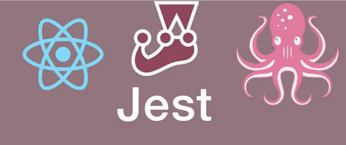

1. 리액트 테스팅 라이브러리 종속성 설치

- 다음 명령어를 실행하여 리액트 테스팅 라이브러리 종속성을 설치하세요 (개발용 종속성으로)

```js
npm install --save-dev @testing-library/react @testing-library/jest-dom @testing-library/dom @testing-library/user-event
```

<!-- ui-log 수평형 -->
<ins class="adsbygoogle"
  style="display:block"
  data-ad-client="ca-pub-4877378276818686"
  data-ad-slot="9743150776"
  data-ad-format="auto"
  data-full-width-responsive="true"></ins>
<component is="script">
(adsbygoogle = window.adsbygoogle || []).push({});
</component>

만약 yarn을 선호한다면

```js
yarn add --dev @testing-library/react @testing-library/jest-dom @testing-library/dom @testing-library/user-event
```

2. Jest 의존성 설치

- jest 의존성을 설치하려면 다음 명령어를 실행하세요 (개발용 종속성으로)

<!-- ui-log 수평형 -->
<ins class="adsbygoogle"
  style="display:block"
  data-ad-client="ca-pub-4877378276818686"
  data-ad-slot="9743150776"
  data-ad-format="auto"
  data-full-width-responsive="true"></ins>
<component is="script">
(adsbygoogle = window.adsbygoogle || []).push({});
</component>

```js
npm install --save-dev jest jest-environment-jsdom ts-jest @types/jest
```

만약 yarn을 선호하신다면

```js
yarn add --dev jest jest-environment-jsdom ts-jest ts-node @types/jest
```

- jest: Jest는 간편함에 중점을 둔 매력적인 JavaScript 테스팅 프레임워크입니다. Jest는 프로젝트의 테스팅 프레임워크로 사용될 것입니다. 코드가 예상대로 작동하는지 확인하기 위해 테스트를 작성하고 실행할 수 있습니다.
- jest-environment-jsdom: JSDOM을 위한 Jest 환경입니다. JSDOM은 DOM(Document Object Model)의 JavaScript 구현으로, Node.js 환경에서 HTML 요소와 상호 작용할 수 있게 합니다. Jest는 테스트를 실행할 때 브라우저와 유사한 환경을 시뮬레이션하기 위해 JSDOM을 사용합니다.
- ts-jest: Jest를 위한 소스 맵 지원과 함께 동작하는 TypeScript 전처리기입니다. ts-jest는 Jest가 TypeScript 파일을 이해하고 테스트를 실행하기 전에 컴파일할 수 있도록 합니다. Jest 환경 내에서 TypeScript 코드를 적절하게 테스트할 수 있도록 보장합니다.
- ts-node: 소스 맵 지원을 통한 Node.js용 TypeScript 실행 및 REPL입니다. ts-node를 사용하면 사전 컴파일이 필요 없이 TypeScript 파일을 직접 Node.js에서 실행할 수 있습니다. 개발 중에 TypeScript 코드를 무리 없이 실행하는 데 일반적으로 사용됩니다.
- @types/jest: Jest를 위한 TypeScript 타입 정의입니다. 이러한 타입 정의는 TypeScript에 Jest API에 대한 정보를 제공하여 TypeScript로 Jest 테스트를 작성할 때 더 나은 유형 확인과 에디터 지원을 가능하게 합니다.

<!-- ui-log 수평형 -->
<ins class="adsbygoogle"
  style="display:block"
  data-ad-client="ca-pub-4877378276818686"
  data-ad-slot="9743150776"
  data-ad-format="auto"
  data-full-width-responsive="true"></ins>
<component is="script">
(adsbygoogle = window.adsbygoogle || []).push({});
</component>

3. Jest 구성

- 루트 폴더에 jest.config.ts 파일을 만들고 다음과 같은 코드 구성을 추가해 주세요.

```js
export { };
module.exports = {
  collectCoverage: true,
  collectCoverageFrom: ['src/**/*.{ts,tsx}', '!src/**/*.d.ts',
    '!**/vendor/**'],
  coverageDirectory: 'coverage',
  testEnvironment: 'jsdom',
  transform: {
    ".(ts|tsx)": "ts-jest"
  },

  coveragePathIgnorePatterns: [
    "/node_modules/",
    "/coverage",
    "package.json",
    "package-lock.json",
    "reportWebVitals.ts",
    "setupTests.ts",
    "index.tsx"
  ],
}
```

4.React Testing Library와 Jest 통합하기

<!-- ui-log 수평형 -->
<ins class="adsbygoogle"
  style="display:block"
  data-ad-client="ca-pub-4877378276818686"
  data-ad-slot="9743150776"
  data-ad-format="auto"
  data-full-width-responsive="true"></ins>
<component is="script">
(adsbygoogle = window.adsbygoogle || []).push({});
</component>

- 루트 폴더에 jest.setup.ts라는 파일을 만들고 다음 코드를 입력해주세요

```js
import '@testing-library/jest-dom'
```

위 코드는 @testing-library/jest-dom 패키지로부터 모든 것을 불러오겠다는 뜻입니다.

- 이전에 생성한 jest.config.ts 파일에 setupFilesAfterEnv 필드를 추가해주세요

<!-- ui-log 수평형 -->
<ins class="adsbygoogle"
  style="display:block"
  data-ad-client="ca-pub-4877378276818686"
  data-ad-slot="9743150776"
  data-ad-format="auto"
  data-full-width-responsive="true"></ins>
<component is="script">
(adsbygoogle = window.adsbygoogle || []).push({});
</component>

```js
수입 { };
module.exports = {
  collectCoverage: true,
  collectCoverageFrom: ['src/**/*.{ts,tsx}', '!src/**/*.d.ts',
    '!**/vendor/**'],
  coverageDirectory: 'coverage',
  testEnvironment: 'jsdom',
  transform: {
    ".(ts|tsx)": "ts-jest"
  },

  coveragePathIgnorePatterns: [
    "/node_modules/",
    "/coverage",
    "package.json",
    "package-lock.json",
    "reportWebVitals.ts",
    "setupTests.ts",
    "index.tsx"
  ],
setupFilesAfterEnv: ['<rootDir>/setupTests.ts'],
};
```

이렇게 Jest를 TypeScript React 애플리케이션에서 설정합니다!!

좋은 테스팅 되세요!!

-Abhishek