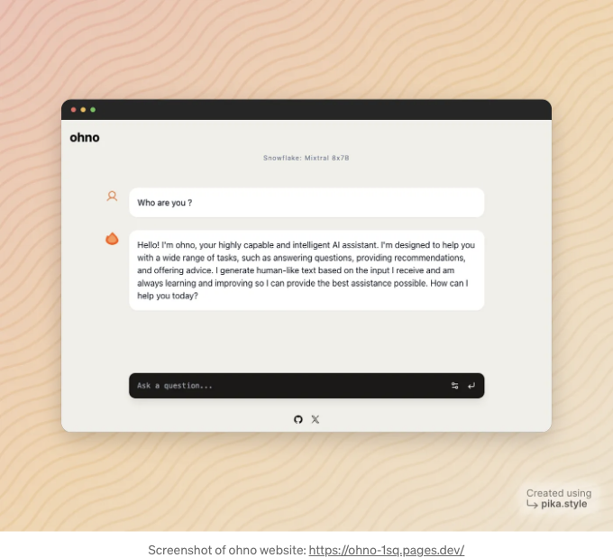

Snowflake Cortex는 Snowflake의 AI에 대한 큰 기반으로, 응용 프로그램에 통합할 수 있는 다양한 LLM 모델 및 기능을 제공하여 새로운 가능성을 탐험할 수 있습니다.



이 튜토리얼에서는 Snowflake Cortex 기능과 모델을 React 프론트엔드에서 Hono와 함께 사용하는 방법을 살펴보겠습니다.

웹 사이트로 바로 이동하려면 — [https://ohno-1sq.pages.dev](https://ohno-1sq.pages.dev)

<!-- ui-log 수평형 -->
<ins class="adsbygoogle"
  style="display:block"
  data-ad-client="ca-pub-4877378276818686"
  data-ad-slot="9743150776"
  data-ad-format="auto"
  data-full-width-responsive="true"></ins>
<component is="script">
(adsbygoogle = window.adsbygoogle || []).push({});
</component>

그리고 코드는 https://github.com/kaarthik108/ohno

## hono란 무엇인가요?

HonoX는 전체 스택 웹 사이트 또는 웹 API를 만드는 데 사용할 수 있는 간단하고 빠른 메타 프레임워크입니다. 이를 통해 백엔드 API를 만들고 프런트엔드 응용 프로그램과 연결하는 과정을 간소화할 수 있습니다.

## 왜 snowflake Cortex를 선택해야 하나요?

<!-- ui-log 수평형 -->
<ins class="adsbygoogle"
  style="display:block"
  data-ad-client="ca-pub-4877378276818686"
  data-ad-slot="9743150776"
  data-ad-format="auto"
  data-full-width-responsive="true"></ins>
<component is="script">
(adsbygoogle = window.adsbygoogle || []).push({});
</component>

Snowflake Cortex는 기존 데이터 웨어하우스 내에서 언어 모델을 활용할 수 있는 안전하고 원활한 방법을 제공합니다. Snowflake Cortex 기능은 Snowflake 환경 내에서 직접 실행되므로 추가 인프라를 관리할 필요가 없으며, 서버리스 및 개인 정보 보호에 초점을 맞춘 솔루션을 제공합니다.

## 오늘은 무엇을 만들까요 ?

우리는 chatgpt와 비슷한 간단한 AI 챗봇을 구축할 것이며, 이를 위해 snowflake의 Cortex에서 AI 모델을 사용할 예정입니다.

백엔드 API를 설정하고 이를 localhost에 배포하는 방법을 살펴볼 것입니다 😜 (맞아, 제대로 읽으셨어요).

<!-- ui-log 수평형 -->
<ins class="adsbygoogle"
  style="display:block"
  data-ad-client="ca-pub-4877378276818686"
  data-ad-slot="9743150776"
  data-ad-format="auto"
  data-full-width-responsive="true"></ins>
<component is="script">
(adsbygoogle = window.adsbygoogle || []).push({});
</component>

그리고 이제 우리는 백엔드에서 결과를 가져와 표시하기 위한 프론트엔드 채팅 인터페이스를 만들 것입니다.

기술 스택:

- React를 사용한 Honox
- Shadcn-ui와 Tailwind CSS
- Mixtral 8x7B Snowflake Cortex
- 호스팅은 Cloudflare Pages
- 선택 사항으로 Cloudflare Tunnel 또는 AWS Lambda

## 백엔드 API 설정하기

<!-- ui-log 수평형 -->
<ins class="adsbygoogle"
  style="display:block"
  data-ad-client="ca-pub-4877378276818686"
  data-ad-slot="9743150776"
  data-ad-format="auto"
  data-full-width-responsive="true"></ins>
<component is="script">
(adsbygoogle = window.adsbygoogle || []).push({});
</component>

우리 API는 인증을 처리하고 Snowflake 연결을 설정하며 쿼리를 실행할 것입니다. Cortex 플랫폼과 상호 작용하기 위해 Snowflake Node.js SDK를 사용할 것입니다.

- hono를 사용하여 라우트를 만들고 요청 본문을 구문 분석하십시오

```js
-- api/snow.ts
export const POST = createRoute(async (c) => {
  const requestBody = await c.req.json();
```

2. npm을 통해 snowflake-sdk를 설치한 다음 아래 코드를 사용하여 연결을 만드십시오. wrangler.toml 또는 .env.local에 env를 추가해야 합니다 (다른 위치에 배포하는 경우)

<!-- ui-log 수평형 -->
<ins class="adsbygoogle"
  style="display:block"
  data-ad-client="ca-pub-4877378276818686"
  data-ad-slot="9743150776"
  data-ad-format="auto"
  data-full-width-responsive="true"></ins>
<component is="script">
(adsbygoogle = window.adsbygoogle || []).push({});
</component>

```js
-- snowflake 연결 생성
import snowflake from "snowflake-sdk";

export const POST = createRoute(async (c) => {
  const requestBody = await c.req.json();

  const config = env<{
    ACCOUNT: string;
    USER_NAME: string;
    PASSWORD: string;
    ROLE: string;
    WAREHOUSE: string;
    DATABASE: string;
    SCHEMA: string;
  }>(c);

 const snowConnect = snowflake.createConnection({
    account: config.ACCOUNT,
    username: config.USER_NAME,
    password: config.PASSWORD,
    role: config.ROLE,
    warehouse: config.WAREHOUSE,
    database: config.DATABASE,
    schema: config.SCHEMA,
  });

  snowflake.configure({ ocspFailOpen: false });
```

3. SQL 쿼리(쿼리)를 실행하고 결과를 Promise를 사용하여 기다립니다. 쿼리 실행에 성공하면 반환된 행과 함께 Promise를 해결하고, 그렇지 않으면 오류와 함께 Promise를 거부합니다.

```js
    const result = await new Promise<any[]>((resolve, reject) => {
      snowConnect.connect((err, conn) => {
        if (err) {
          console.error("연결할 수 없음: " + err.message);
          reject(err);
        } else {
          snowConnect.execute({
            sqlText: query,
            complete: (err, stmt, rows) => {
              if (err) {
                console.error(
                  "다음 오류로 인해 명령문 실행에 실패했습니다: " +
                    err.message
                );
                reject(err);
              } else {
                resolve(rows || []);
              }
            },
          });
        }
      });
    });

    return new Response(JSON.stringify(result), {
      status: 200,
      headers: { "Content-Type": "application/json" },
    });
```

이제 AWS Lambda 또는 Vercel과 같은 nodejs 런타임에서 배포할 수 있습니다.

<!-- ui-log 수평형 -->
<ins class="adsbygoogle"
  style="display:block"
  data-ad-client="ca-pub-4877378276818686"
  data-ad-slot="9743150776"
  data-ad-format="auto"
  data-full-width-responsive="true"></ins>
<component is="script">
(adsbygoogle = window.adsbygoogle || []).push({});
</component>

하지만 여기서는 간단함을 위해 로컬호스트에 배포하고 클라우드플레어 터널을 사용하여 인터넷에 노출시킬 것입니다 (일부 차가운 시작을 줄이기 위해서)

두 가지 간단한 단계:

- 클라우드플레어에 도메인이 있는지 확인하세요 — 제로 트러스트 섹션으로 이동하여 터널을 클릭하고 도메인을 사용하여 터널을 생성하고 화면에 나타나는 단계를 따라 로컬 머신에 터널을 설치하세요.
- 도메인을 로컬 서비스로 지정하세요 — "http://localhost:5100"

이제 여러분이 API를 호스팅했고(네, 호스팅했지만 호스팅하지 않았습니다) 준비가 끝났습니다 🚀

<!-- ui-log 수평형 -->
<ins class="adsbygoogle"
  style="display:block"
  data-ad-client="ca-pub-4877378276818686"
  data-ad-slot="9743150776"
  data-ad-format="auto"
  data-full-width-responsive="true"></ins>
<component is="script">
(adsbygoogle = window.adsbygoogle || []).push({});
</component>

거의 다 왔어요. 백엔드는 준비됐어요.

## 이제 프론트엔드를 만들어요

프론트엔드에서는 React와 Hono를 사용해서 Snowflake Cortex 모델과 상호작용하는 채팅 인터페이스를 만들 거에요. 클라이언트 측 설정을 만들어 백엔드 API로 쿼리를 보내고 응답을 처리할 거에요.

다음은 백엔드 API로 쿼리를 보내는 방법을 보여주는 코드 조각이에요:

<!-- ui-log 수평형 -->
<ins class="adsbygoogle"
  style="display:block"
  data-ad-client="ca-pub-4877378276818686"
  data-ad-slot="9743150776"
  data-ad-format="auto"
  data-full-width-responsive="true"></ins>
<component is="script">
(adsbygoogle = window.adsbygoogle || []).push({});
</component>

- API에서 결과를 가져 오는 도우미 함수를 만들어 보세요.

```js
export async function executeSnowflakeQuery(
  sqlText: string
): Promise<SnowflakeResponse[]> {
  const baseUrl = "http://localhost:5173";

  const res = await fetch(`${baseUrl}/api/snow`, {
    method: "POST",
    headers: {
      "Content-Type": "application/json",
    },
    body: JSON.stringify({ query: sqlText }),
  });

  if (!res.ok) {
    throw new Error("쿼리 실행에 실패했습니다");
  }

  const data: unknown = await res.json();

  return data as SnowflakeResponse[];
}
```

- 클라이언트에서 결과를 사용해 봅시다: sumbit 함수는 기본적으로 cortex 함수가 예상하는 메시지 배열을 형식화하고 메시지 상태를 설정하여 표시할 수 있도록합니다.

```js
async function handleSnowflakeSubmit(inputMessage: string) {
  if (!inputMessage) return;

  const newMessages = [
    ...messages,
    {
      id: String(messages.length + 1),
      role: "user",
      content: inputMessage,
    },
  ];

  setMessages(newMessages);
  setInput("");
  setIsLoading(true);

  const formattedMessages = newMessages
    .map(
      (m) =>
        `{'role': '${m.role}', 'content': '${m.content.replace(/'/g, "''")}'}`
    )
    .join(", ");

  const query = `SELECT SNOWFLAKE.CORTEX.COMPLETE('mixtral-8x7b', [${formattedMessages}], {'temperature': 1.7, 'max_tokens': 90});`;

  try {
    const data = (await executeSnowflakeQuery(query)) as any;

    const responseKey = Object.keys(data[0])[0];
    const response = data[0][responseKey];

    const assistantMessage = response.choices[0].messages.trim();

    setMessages([
      ...newMessages,
      {
        id: String(newMessages.length + 1),
        role: "assistant",
        content: assistantMessage,
      },
    ]);
  } catch (error) {
    console.error("쿼리 실행 중 오류 발생:", error);
    if (
      error instanceof Error &&
      error.message.includes("You are rate limited")
    ) {
      setIsRateLimited(true);
      setMessages([
        ...newMessages,
        {
          id: String(newMessages.length + 1),
          role: "assistant",
          content: error.message,
        },
      ]);
    }
  }

  setIsLoading(false);
}
```

<!-- ui-log 수평형 -->
<ins class="adsbygoogle"
  style="display:block"
  data-ad-client="ca-pub-4877378276818686"
  data-ad-slot="9743150776"
  data-ad-format="auto"
  data-full-width-responsive="true"></ins>
<component is="script">
(adsbygoogle = window.adsbygoogle || []).push({});
</component>

- 폼 요소: 버튼을 클릭했을 때 위에서 생성한 submit 함수를 호출하는 곳입니다.

```js
<div className="fixed bottom-10 md:bottom-12 left-0 right-0 flex flex-col justify-center items-center mx-auto bg-transparent w-full z-10 border-none">
          <form
            onSubmit={(e) => {
              e.preventDefault();

             if (selectedModel === "snowflake") {
                if (input.trim() !== "") {
                  handleSnowflakeSubmit(input);
                }
              }
              
            }}
            className="bg-stone-900 dark:bg-gray-100 rounded-xl shadow-lg h-12 flex flex-row px-2 items-center w-full max-w-2xl"
          >
            <div className="relative flex items-center w-full">
              <input
                name="message"
                value={input}
                onChange={
                  handleInputChange
                }
                maxLength={150}
                autoFocus
                autoComplete="off"
                disabled={isRateLimited}
                placeholder="질문을 입력하세요..."
                className={cn(
                  "bg-transparent text-white dark:text-black placeholder:text-gray-400 ring-0 outline-none resize-none py-2.5 px-2 font-mono text-sm h-10 w-full transition-all duration-300",
                  {
                    "cursor-not-allowed": isRateLimited,
                  }
                )}
              />
              <div className="flex items-center">
                <button
                  type="submit"
                  disabled={isLoading || isRateLimited}
                  className={cn(
                    `text-white dark:text-black dark:bg-gray-100 rounded-lg hover:bg-white/25 focus:bg-white/25 w-8 h-8 aspect-square flex items-center justify-center ring-0 outline-0`,
                    {
                      "cursor-not-allowed": isRateLimited,
                    }
                  )}
                  aria-label="메시지 전송"
                >
                  {isLoading ? (
                    <Loader2 className="animate-spin" />
                  ) : (
                    <CornerDownLeft size={16} className="-ml-px" />
                  )}{" "}
                </button>
              </div>
            </div>
          </form>
        </div>
```

- 메시지 표시: 메시지 배열을 매핑하고 사용자 또는 도우미 메시지에 따라 스타일을 지정합니다.

```js
 messages.map((m) => (
              <div key={m.id} className="">
                {m.role === "user" && <UserMessage content={m.content} />}
                {m.role === "assistant" && (
                  <BotMessage content={m.content} className="antialiased" />
                )}
                <div ref={messagesEndRef} />
              </div>
``` 

<!-- ui-log 수평형 -->
<ins class="adsbygoogle"
  style="display:block"
  data-ad-client="ca-pub-4877378276818686"
  data-ad-slot="9743150776"
  data-ad-format="auto"
  data-full-width-responsive="true"></ins>
<component is="script">
(adsbygoogle = window.adsbygoogle || []).push({});
</component>

우리는 Snowflake의 Cortex 위에 구축된 ChatGPT와 비슷한 웹사이트를 갖고 있어요.

## 전체 배포된 코드를 확인하세요

- Github: [https://github.com/kaarthik108/ohno](https://github.com/kaarthik108/ohno)
- 웹사이트: [https://ohno-1sq.pages.dev/](https://ohno-1sq.pages.dev/)

더 많은 통찰력 있는 콘텐츠를 위해 팔로우하고 저와 함께 오픈소스 세계를 탐험해보세요!

<!-- ui-log 수평형 -->
<ins class="adsbygoogle"
  style="display:block"
  data-ad-client="ca-pub-4877378276818686"
  data-ad-slot="9743150776"
  data-ad-format="auto"
  data-full-width-responsive="true"></ins>
<component is="script">
(adsbygoogle = window.adsbygoogle || []).push({});
</component>

- k01.dev
- Medium: Kaarthikandavar
- X: Kaarthikcodes
- LinkedIn: Kaarthik