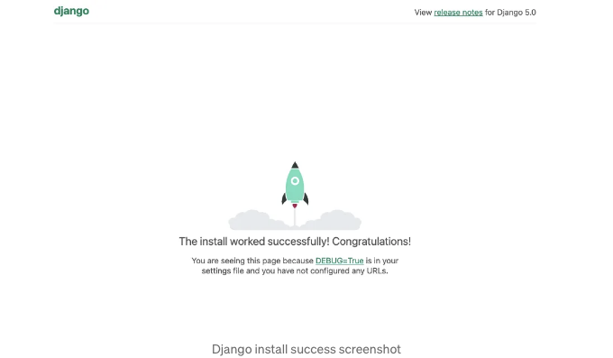
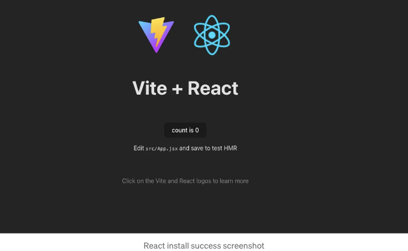
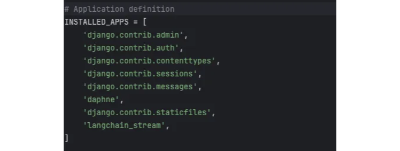

# 소개:

이 튜토리얼은 Django, React, Langchain 및 OpenAI의 강력한 언어 모델을 활용하는 애플리케이션을 만드는 가이드를 제공합니다. 제 주요 관심사는 대규모 언어 모델 (LLM)의 출력을 스트리밍하는 솔루션을 만드는 것입니다.

먼저 프로젝트 환경을 설정하고 Django 및 React, 각각 간결성과 견고함으로 유명한 고수준 Python 웹 프레임워크 및 반응성 및 사용자 경험을 향상시키는 뛰어난 성능으로 사용자 인터페이스를 구축하는 JavaScript 라이브러리 등 핵심 기술을 살펴보겠습니다. 또한, 언어 모델을 애플리케이션에 통합하는 것을 간소화하는 도구인 Langchain 및 인공지능 기반 텍스트 생성의 선두에 서 있는 OpenAI의 GPT 모델도 살펴보겠습니다.

<!-- ui-log 수평형 -->
<ins class="adsbygoogle"
  style="display:block"
  data-ad-client="ca-pub-4877378276818686"
  data-ad-slot="9743150776"
  data-ad-format="auto"
  data-full-width-responsive="true"></ins>
<component is="script">
(adsbygoogle = window.adsbygoogle || []).push({});
</component>

이 튜토리얼을 통해 우리의 애플리케이션 아키텍처에 대해 자세히 살펴볼 것이며, 실시간 메시징을 위한 WebSocket 연결을 수립하고 LLM의 출력을 실시간으로 스트리밍하여 사용자들에게 반응성을 느끼게 하는 방법을 보여줄 것입니다. 이 안내서를 마치면 완전히 작동하는 채팅 애플리케이션이 준비될 것입니다.

## 🚀 Django를 사용한 백엔드 설정

# Django 설치

터미널이나 명령 프롬프트를 열고 다음을 실행하세요:

<!-- ui-log 수평형 -->
<ins class="adsbygoogle"
  style="display:block"
  data-ad-client="ca-pub-4877378276818686"
  data-ad-slot="9743150776"
  data-ad-format="auto"
  data-full-width-responsive="true"></ins>
<component is="script">
(adsbygoogle = window.adsbygoogle || []).push({});
</component>

```js
pip install django
```

## Django 프로젝트 생성하기

원하는 프로젝트 디렉토리로 이동하고 다음을 실행하세요:

```js
django-admin startproject Django_React_Langchain_Stream
```

<!-- ui-log 수평형 -->
<ins class="adsbygoogle"
  style="display:block"
  data-ad-client="ca-pub-4877378276818686"
  data-ad-slot="9743150776"
  data-ad-format="auto"
  data-full-width-responsive="true"></ins>
<component is="script">
(adsbygoogle = window.adsbygoogle || []).push({});
</component>

프로젝트 디렉토리로 이동하세요:

```js
cd Django_React_Langchain_Stream
```

# 가상 환경 설정

virtualenv를 설치하세요 (이미 설치하지 않았다면):

<!-- ui-log 수평형 -->
<ins class="adsbygoogle"
  style="display:block"
  data-ad-client="ca-pub-4877378276818686"
  data-ad-slot="9743150776"
  data-ad-format="auto"
  data-full-width-responsive="true"></ins>
<component is="script">
(adsbygoogle = window.adsbygoogle || []).push({});
</component>

```js
pip install virtualenv
```

프로젝트 디렉토리에서 가상 환경을 만들고 활성화하세요.

생성:

```js
virtualenv venv
```

<!-- ui-log 수평형 -->
<ins class="adsbygoogle"
  style="display:block"
  data-ad-client="ca-pub-4877378276818686"
  data-ad-slot="9743150776"
  data-ad-format="auto"
  data-full-width-responsive="true"></ins>
<component is="script">
(adsbygoogle = window.adsbygoogle || []).push({});
</component>

활성화하려면:

Mac/Linux에서:

```js
source venv/bin/activate
```

Windows에서:

<!-- ui-log 수평형 -->
<ins class="adsbygoogle"
  style="display:block"
  data-ad-client="ca-pub-4877378276818686"
  data-ad-slot="9743150776"
  data-ad-format="auto"
  data-full-width-responsive="true"></ins>
<component is="script">
(adsbygoogle = window.adsbygoogle || []).push({});
</component>

```js
venv\Scripts\activate
```

당신의 장고 앱 만들기

가상환경에 Django 설치하기:

```js
pip install Django==5.0.3
```

<!-- ui-log 수평형 -->
<ins class="adsbygoogle"
  style="display:block"
  data-ad-client="ca-pub-4877378276818686"
  data-ad-slot="9743150776"
  data-ad-format="auto"
  data-full-width-responsive="true"></ins>
<component is="script">
(adsbygoogle = window.adsbygoogle || []).push({});
</component>

Django 앱을 langchain_stream으로 만들어주세요.

```js
python manage.py startapp langchain_stream
```

설정이 잘 되었는지 테스트해보세요.

Django 개발 서버를 시작하세요:

<!-- ui-log 수평형 -->
<ins class="adsbygoogle"
  style="display:block"
  data-ad-client="ca-pub-4877378276818686"
  data-ad-slot="9743150776"
  data-ad-format="auto"
  data-full-width-responsive="true"></ins>
<component is="script">
(adsbygoogle = window.adsbygoogle || []).push({});
</component>

```js
python manage.py runserver
```

웹 브라우저에서 http://127.0.0.1:8000/ 를 방문하여 Django 환영 페이지를 확인하세요.



서버를 중지하려면 CONTROL-C를 누르세요.

<!-- ui-log 수평형 -->
<ins class="adsbygoogle"
  style="display:block"
  data-ad-client="ca-pub-4877378276818686"
  data-ad-slot="9743150776"
  data-ad-format="auto"
  data-full-width-responsive="true"></ins>
<component is="script">
(adsbygoogle = window.adsbygoogle || []).push({});
</component>

# 🔧 리액트를 이용한 프론트엔드 설정

Node.js와 npm이 설치되었는지 확인해주세요

다음과 같은 명령어를 실행해보세요:

```js
node -v
npm -v
```

<!-- ui-log 수평형 -->
<ins class="adsbygoogle"
  style="display:block"
  data-ad-client="ca-pub-4877378276818686"
  data-ad-slot="9743150776"
  data-ad-format="auto"
  data-full-width-responsive="true"></ins>
<component is="script">
(adsbygoogle = window.adsbygoogle || []).push({});
</component>

설치된 경우에는 버전 번호를 볼 수 있습니다. 예를 들면:

```js
v20.8.0
10.1.0
```

설치되지 않았다면, 공식 Node.js 웹사이트에서 다운로드하세요.

## 리액트 애플리케이션 만들기

<!-- ui-log 수평형 -->
<ins class="adsbygoogle"
  style="display:block"
  data-ad-client="ca-pub-4877378276818686"
  data-ad-slot="9743150776"
  data-ad-format="auto"
  data-full-width-responsive="true"></ins>
<component is="script">
(adsbygoogle = window.adsbygoogle || []).push({});
</component>

React 프로젝트를 생성해보세요:

```js
npm create vite@latest
```

프로젝트의 이름을 frontend으로 지정하고, 프레임워크로 `React`를 선택하고, 변형으로 `JavaScript`를 선택해주세요. 그 후, 새 frontend 디렉토리로 이동해주세요:

```js
cd frontend
```

<!-- ui-log 수평형 -->
<ins class="adsbygoogle"
  style="display:block"
  data-ad-client="ca-pub-4877378276818686"
  data-ad-slot="9743150776"
  data-ad-format="auto"
  data-full-width-responsive="true"></ins>
<component is="script">
(adsbygoogle = window.adsbygoogle || []).push({});
</component>

필요한 React 패키지를 설치해주세요:

```js
npm install
```

## 프론트엔드 테스트

React 개발 서버를 시작하세요:

<!-- ui-log 수평형 -->
<ins class="adsbygoogle"
  style="display:block"
  data-ad-client="ca-pub-4877378276818686"
  data-ad-slot="9743150776"
  data-ad-format="auto"
  data-full-width-responsive="true"></ins>
<component is="script">
(adsbygoogle = window.adsbygoogle || []).push({});
</component>

```js
npm run dev
```

터미널에 표시된 URL(보통 http://localhost:5173/)을 방문하여 React 앱의 환영 페이지를 확인할 수 있습니다.



서버를 중지하려면 CONTROL-C를 사용하세요.

<!-- ui-log 수평형 -->
<ins class="adsbygoogle"
  style="display:block"
  data-ad-client="ca-pub-4877378276818686"
  data-ad-slot="9743150776"
  data-ad-format="auto"
  data-full-width-responsive="true"></ins>
<component is="script">
(adsbygoogle = window.adsbygoogle || []).push({});
</component>

설치 및 설정을 완료한 후에는 프로젝트 디렉토리가 다음과 같이 보여야 합니다:

```js
Django_React_Langchain_Stream/
├── Django_React_Langchain_Stream/
├── frontend/
├── langchain_stream/
├── venv/
├── db.sqlite3
└── manage.py
```

# 웹소켓을 이용하여 Django와 React 연결하기

이제 IDE에서 프로젝트 Django_React_Langchain_Stream을 열 수 있습니다.

<!-- ui-log 수평형 -->
<ins class="adsbygoogle"
  style="display:block"
  data-ad-client="ca-pub-4877378276818686"
  data-ad-slot="9743150776"
  data-ad-format="auto"
  data-full-width-responsive="true"></ins>
<component is="script">
(adsbygoogle = window.adsbygoogle || []).push({});
</component>

## API 키 설정

먼저 Django 프로젝트의 루트에 .env 파일을 만들어 Openai API 키를 안전하게 저장하세요.

다음과 같은 줄을 .env 파일에 추가하세요:

```js
OPENAI_API_KEY=this-is-a-fake-api-key-replace-it
```

<!-- ui-log 수평형 -->
<ins class="adsbygoogle"
  style="display:block"
  data-ad-client="ca-pub-4877378276818686"
  data-ad-slot="9743150776"
  data-ad-format="auto"
  data-full-width-responsive="true"></ins>
<component is="script">
(adsbygoogle = window.adsbygoogle || []).push({});
</component>

# 🔧 웹소켓을 위한 Django settings.py 구성

settings.py 파일에서 langchain_stream 및 daphne를 INSTALLED_APPS에 추가하세요:

```js
'daphne',
# ...,
'langchain_stream',
```

<!-- ui-log 수평형 -->
<ins class="adsbygoogle"
  style="display:block"
  data-ad-client="ca-pub-4877378276818686"
  data-ad-slot="9743150776"
  data-ad-format="auto"
  data-full-width-responsive="true"></ins>
<component is="script">
(adsbygoogle = window.adsbygoogle || []).push({});
</component>

경고: `daphne`는 INSTALLED_APPS에서 django.contrib.staticfiles보다 먼저 나열되어야 합니다.



WSGI 애플리케이션 라인을 ASGI 구성으로 교체하여 비동기 통신을 활성화하세요.

해당 라인을 제거하거나 주석 처리하세요.

<!-- ui-log 수평형 -->
<ins class="adsbygoogle"
  style="display:block"
  data-ad-client="ca-pub-4877378276818686"
  data-ad-slot="9743150776"
  data-ad-format="auto"
  data-full-width-responsive="true"></ins>
<component is="script">
(adsbygoogle = window.adsbygoogle || []).push({});
</component>

```js
# WSGI_APPLICATION = ' Django_React_Langchain_Stream.wsgi.application'
```

다음 ASGI 구성 라인을 추가해주세요:

```js
ASGI_APPLICATION = "Django_React_Langchain_Stream.asgi.application"
```

# views.py 파일을 생성해주세요
```

<!-- ui-log 수평형 -->
<ins class="adsbygoogle"
  style="display:block"
  data-ad-client="ca-pub-4877378276818686"
  data-ad-slot="9743150776"
  data-ad-format="auto"
  data-full-width-responsive="true"></ins>
<component is="script">
(adsbygoogle = window.adsbygoogle || []).push({});
</component>

LangChain 및 관련 패키지를 LLM 통합과 웹소켓 지원을 위해 설치해보세요:

터미널에서 다음을 실행해주세요:

```js
pip install langchain==0.1.11 langchain-community==0.0.26 langchain-openai==0.0.8 channels==4.0.0 daphne==4.1.0 python-dotenv==1.0.1
```

langchain_stream/views.py 파일에서 다음 코드로 대체해주세요:

<!-- ui-log 수평형 -->
<ins class="adsbygoogle"
  style="display:block"
  data-ad-client="ca-pub-4877378276818686"
  data-ad-slot="9743150776"
  data-ad-format="auto"
  data-full-width-responsive="true"></ins>
<component is="script">
(adsbygoogle = window.adsbygoogle || []).push({});
</component>

```json
from langchain_openai import ChatOpenAI
from langchain_core.prompts import ChatPromptTemplate
from langchain_core.output_parsers import StrOutputParser
from channels.generic.websocket import AsyncWebsocketConsumer
import json
from dotenv import load_dotenv

load_dotenv('.env')

prompt = ChatPromptTemplate.from_messages([
    ("system", "You are a helpful assistant."),
    ("user", "{input}")
])

llm = ChatOpenAI(model="gpt-3.5-turbo-0125")

output_parser = StrOutputParser()
# Chain
chain = prompt | llm.with_config({"run_name": "model"}) | output_parser.with_config({"run_name": "Assistant"})


class ChatConsumer(AsyncWebsocketConsumer):

    async def connect(self):
        await self.accept()

    async def disconnect(self, close_code):
        pass

    async def receive(self, text_data):
        text_data_json = json.loads(text_data)
        message = text_data_json["message"]

        try:
            # Stream the response
            async for chunk in chain.astream_events({'input': message}, version="v1", include_names=["Assistant"]):
                if chunk["event"] in ["on_parser_start", "on_parser_stream"]:
                    await self.send(text_data=json.dumps(chunk))

        except Exception as e:
            print(e)
```

이 자습서는 LangChain을 사용하여 LLM 출력을 스트리밍하는 방법을 포함하고 있지만, 제 주요 초점은 프론트엔드와 백엔드를 웹소켓을 통해 통합하여 응용 프로그램에서 실시간 통신을 활성화하는 방법을 보여주는 데 있습니다. LangChain의 복잡성과 포괄적인 능력은이 안내서의 범위를 벗어납니다. 그러나 LangChain은 응용 프로그램에 언어 모델을 통합하는 강력한 도구이며, 더 심층적으로 파고들고 싶은 분들은 LangChain 문서의 'LangChain과 함께 스트리밍'을 방문할 것을 권장합니다.

# 웹소켓 라우팅 설정

WebSocket 연결을 처리하는 방법을 정의하려면 langchain_stream 앱에서 routing.py와 urls.py를 생성하십시오.
```

<!-- ui-log 수평형 -->
<ins class="adsbygoogle"
  style="display:block"
  data-ad-client="ca-pub-4877378276818686"
  data-ad-slot="9743150776"
  data-ad-format="auto"
  data-full-width-responsive="true"></ins>
<component is="script">
(adsbygoogle = window.adsbygoogle || []).push({});
</component>

위의 텍스트를 친근한 어조로 한국어로 번역해 드리겠습니다.

langchain_stream/routing.py 파일을 만들어서 다음 코드를 추가해주세요.

```js
from django.urls import re_path  
from . import views  
  
websocket_urlpatterns = [  
    re_path(r'ws/chat/$', views.ChatConsumer.as_asgi()),  
]
```

langchain_stream/urls.py 파일을 만들어서 다음 코드를 추가해주세요.

```js
from django.urls import path  
from . import views  
  
urlpatterns = [  
    path('ws/chat/', views.ChatConsumer.as_asgi()),  
]
```

<!-- ui-log 수평형 -->
<ins class="adsbygoogle"
  style="display:block"
  data-ad-client="ca-pub-4877378276818686"
  data-ad-slot="9743150776"
  data-ad-format="auto"
  data-full-width-responsive="true"></ins>
<component is="script">
(adsbygoogle = window.adsbygoogle || []).push({});
</component>

다음 코드로 Django_React_Langchain_Stream/asgi.py 파일의 코드를 교체해주세요.

```python
import os
from django.core.asgi import get_asgi_application
from channels.routing import ProtocolTypeRouter, URLRouter
from channels.auth import AuthMiddlewareStack
import langchain_stream.routing

os.environ.setdefault('DJANGO_SETTINGS_MODULE', 'Django_React_Langchain_Stream.settings')

application = ProtocolTypeRouter({
  "http": get_asgi_application(),
  "websocket": AuthMiddlewareStack(
        URLRouter(
            langchain_stream.routing.websocket_urlpatterns
        )
    ),
})
```

# React 통합

다음 코드로 frontend/src/App.js 파일의 코드를 교체해주세요.

<!-- ui-log 수평형 -->
<ins class="adsbygoogle"
  style="display:block"
  data-ad-client="ca-pub-4877378276818686"
  data-ad-slot="9743150776"
  data-ad-format="auto"
  data-full-width-responsive="true"></ins>
<component is="script">
(adsbygoogle = window.adsbygoogle || []).push({});
</component>

```js
import React, { useState, useEffect, useRef } from 'react';
import './App.css';

const StreamLangchain = () => {
    // 사용자로부터 입력을 저장하는 상태
    const [input, setInput] = useState('');
    // 응답/메시지를 저장하는 상태
    const [responses, setResponses] = useState([]);
    // WebSocket 연결 관리를 위한 참조
    const ws = useRef(null);
    // 최신 메시지로 스크롤하기 위한 참조
    const messagesEndRef = useRef(null);
    // 재연결 시도 횟수와 최대 재연결 시도 횟수 설정
    const [reconnectAttempts, setReconnectAttempts] = useState(0);
    const maxReconnectAttempts = 5;

    // WebSocket 연결 설정 및 이벤트 핸들러 정의하는 함수
    const setupWebSocket = () => {
        ws.current = new WebSocket('ws://127.0.0.1:8000/ws/chat/');
        let ongoingStream = null; // 현재 스트림 ID 추적

        ws.current.onopen = () => {
            console.log("WebSocket 연결됨!");
            setReconnectAttempts(0); // 연결 성공 시 재연결 시도 횟수 초기화
        };

        ws.current.onmessage = (event) => {
            const data = JSON.parse(event.data);
            let sender = data.name;

            // WebSocket에서 다른 종류의 이벤트 처리
            if (data.event === 'on_parser_start') {
                // 새로운 스트림이 시작되었을 때
                ongoingStream = { id: data.run_id, content: '' };
                setResponses(prevResponses => [...prevResponses, { sender, message: '', id: data.run_id }]);
            } else if (data.event === 'on_parser_stream' && ongoingStream && data.run_id === ongoingStream.id) {
                // 스트림 중에 새로운 데이터 청크를 추가하는 경우
                setResponses(prevResponses => prevResponses.map(msg =>
                    msg.id === data.run_id ? { ...msg, message: msg.message + data.data.chunk } : msg));
            }
        };

        ws.current.onerror = (event) => {
            console.error("WebSocket 오류 발생:", event);
        };

        ws.current.onclose = (event) => {
            console.log(`WebSocket이 닫혔습니다. 코드: ${event.code}, 이유: ${event.reason}`);
            handleReconnect();
        };
    };

    // 지수 백오프를 이용한 재연결 시도 관리하는 함수
    const handleReconnect = () => {
        if (reconnectAttempts < maxReconnectAttempts) {
            let timeout = Math.pow(2, reconnectAttempts) * 1000; // 지수 백오프
            setTimeout(() => {
                setupWebSocket(); // 재연결 시도
            }, timeout);
        } else {
            console.log("최대 재연결 시도 횟수에 도달하여 더 이상 재연결 시도하지 않음.");
        }
    };

    // WebSocket 연결 설정 및 정리하는 효과 훅
    useEffect(() => {
        setupWebSocket(); // 컴포넌트 마운트 시 WebSocket 설정

        return () => {
            if (ws.current.readyState === WebSocket.OPEN) {
                ws.current.close(); // 컴포넌트 언마운트 시 WebSocket 닫기
            }
        };
    }, []);

    // 최신 메시지로 자동 스크롤하는 효과 훅
    useEffect(() => {
        messagesEndRef.current?.scrollIntoView({ behavior: 'smooth' });
    }, [responses]);

    // 각 메시지를 렌더링하는 함수
    const renderMessage = (response, index) => (
        <div key={index} className={`message ${response.sender}`}>
            <strong>{response.sender}</strong> <p>{response.message}</p>
        </div>
    );

    // 입력 변경 핸들러
    const handleInputChange = (e) => {
        setInput(e.target.value);
    };

    // 폼 제출 핸들러
    const handleSubmit = (e) => {
        e.preventDefault();
        const userMessage = { sender: "You", message: input };
        setResponses(prevResponses => [...prevResponses, userMessage]);
        ws.current.send(JSON.stringify({ message: input })); // WebSocket을 통해 메시지 전송
        setInput(''); // 입력 필드 지우기
    };

    return (
        <div className="chat-container">
            <div className="messages-container">
                {responses.map((response, index) => renderMessage(response, index))}
                <div ref={messagesEndRef} /> {/* 화면에 보이지 않는 요소로 최신 메시지로 스크롤하기 도와줌 */}
            </div>
            <form onSubmit={handleSubmit} className="input-form">
                <input
                    type="text"
                    value={input}
                    onChange={handleInputChange}
                    placeholder="여기에 메시지를 입력하세요..."
                />
                <button type="submit">보내기</button>
            </form>
        </div>
    );
};

export default StreamLangchain;
```

# CSS 스타일 추가

frontend/src/App.css에 다음 코드를 복사하여 붙여넣기하세요:

```js
:root {
    --text-color: rgb(236, 236, 236);
    --background-color: rgb(33, 33, 33);
    --input-padding: 10px;
    --button-padding: 10px 20px;
}

body {
    margin: 0;
    font-family: "Source Sans Pro", sans-serif;
    font-weight: 400;
    line-height: 1.6;
    color: var(--text-color);
    background-color: var(--background-color);
    text-size-adjust: 100%;
    -webkit-tap-highlight-color: rgba(0, 0, 0, 0);
    -webkit-font-smoothing: auto;
}

.input-form {
    position: fixed;
    bottom: 0;
    left: 0;
    width: 100%;
    padding: 10px 0;
    display: flex;
    justify-content: center;
    align-items: center;
    box-shadow: 0 -2px 5px rgba(0,0,0,0.1);
}

input[type="text"] {
    width: 70%;
    padding: var(--input-padding);
}

button {
    padding: var(--button-padding);
}

.chat-container {
    display: flex;
    flex-direction: column;
    height: 100vh;
    padding: 6rem 5rem 10rem;
    box-sizing: border-box;
}

.messages-container {
    overflow-y: auto;
    max-height: calc(100vh - 3% - 100px);
    display: flex;
    flex-direction: column;
    align-items: center;
    position: absolute;
    top: 0;
    bottom: 100px;
    width: 100%;
    padding: 0 5rem;
    box-sizing: border-box;
}

.message {
    width: 60%;
    display: flex;
    flex-direction: column;
    gap: 0.5rem;
    padding: 1rem;
    border-radius: 0.5rem;
}

.message strong {
    margin-bottom: 4px;
    color: var(--text-color);
}

.message p {
    margin: 0;
}
```

<!-- ui-log 수평형 -->
<ins class="adsbygoogle"
  style="display:block"
  data-ad-client="ca-pub-4877378276818686"
  data-ad-slot="9743150776"
  data-ad-format="auto"
  data-full-width-responsive="true"></ins>
<component is="script">
(adsbygoogle = window.adsbygoogle || []).push({});
</component>

## 모두 완료되었습니다! 애플리케이션을 실행하려면 Django 서버와 React 개발 서버를 시작하세요:

2개의 별도 터미널에서 루트 디렉토리에 들어가서 Django 프로젝트를 실행하세요:

```js
python manage.py runserver
```

그리고


<!-- ui-log 수평형 -->
<ins class="adsbygoogle"
  style="display:block"
  data-ad-client="ca-pub-4877378276818686"
  data-ad-slot="9743150776"
  data-ad-format="auto"
  data-full-width-responsive="true"></ins>
<component is="script">
(adsbygoogle = window.adsbygoogle || []).push({});
</component>

```js
cd frontend
npm run dev
```

터미널에 표시된 URL(보통 http://localhost:5173/)을 방문하여 앱을 확인해보세요.