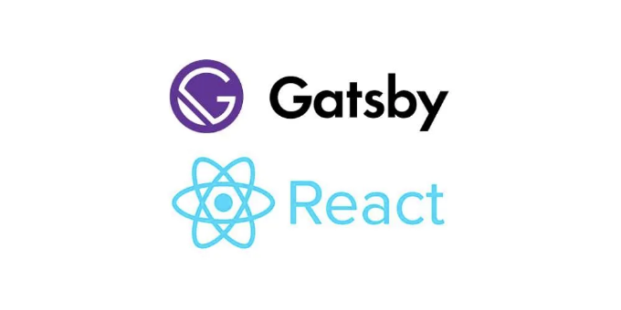

이 문서는 이미 구현한 Gatsby-image-plugin을 전제로 합니다. 이 플러그인에 의해 발생하는 모든 기술적 및 사용자 경험 문제를 나열하려고 합니다.



# `` 대 `<picture>`

먼저 작은 화면 크기에서 모든 이미지를 확인해야 합니다. 때로는 이미지의 전체 범위에 의존하는 경우가 있을 수 있습니다.

<!-- ui-log 수평형 -->
<ins class="adsbygoogle"
  style="display:block"
  data-ad-client="ca-pub-4877378276818686"
  data-ad-slot="9743150776"
  data-ad-format="auto"
  data-full-width-responsive="true"></ins>
<component is="script">
(adsbygoogle = window.adsbygoogle || []).push({});
</component>

이게 요구하는 내용이에요:

```

```

그리고 이게 얻게 되는 결과에요:

```

```

<!-- ui-log 수평형 -->
<ins class="adsbygoogle"
  style="display:block"
  data-ad-client="ca-pub-4877378276818686"
  data-ad-slot="9743150776"
  data-ad-format="auto"
  data-full-width-responsive="true"></ins>
<component is="script">
(adsbygoogle = window.adsbygoogle || []).push({});
</component>

화면 너비가 작을 때 `picture`가 작은 해상도를 선택하는 것이 문제가 될 수 있습니다. 이 부분은 일반적으로 좋은 동작이지만 위에서 언급한 것과 같이 일부 예외가 발생할 수 있습니다.


상황에 따라 스타일을 다시 정의할 수 있지만, 급하게 작은 화면에서 전체 너비 이미지가 필요한 경우 컴포넌트에 플래그를 추가하여 이전 렌더링 로직을 `img`로 전환할 수도 있습니다.

또한 `picture`가 이미지를 감싸는 것이기 때문에 `CSS`에서 `img` 선택기에 의존하는 경우 스타일링 문제를 인식해야 합니다 (이에 대해 조금 더 살펴보겠습니다).

<!-- ui-log 수평형 -->
<ins class="adsbygoogle"
  style="display:block"
  data-ad-client="ca-pub-4877378276818686"
  data-ad-slot="9743150776"
  data-ad-format="auto"
  data-full-width-responsive="true"></ins>
<component is="script">
(adsbygoogle = window.adsbygoogle || []).push({});
</component>

# SVG 지원 없음

한 번 더, 이 플러그인은 이미지 전달을 최적화하고 다양한 해상도로 준비하기 위해 오래된 `img` 로직이 필요합니다. .svg 파일이 어디에 있는지 추측하며 전체 프로젝트를 찾지 않아도 되도록 위에서 논의한 플래그를 추가하세요. 이를 구현하는 방법은 파일 경로의 확장자를 확인하고 필요한 로직을 적용하는 것입니다:
   
``

렌더링 문제를 해결할 수 있지만, 개발 경험을 더 향상시키고 싶다면 무엇을 해야 합니다.

<!-- ui-log 수평형 -->
<ins class="adsbygoogle"
  style="display:block"
  data-ad-client="ca-pub-4877378276818686"
  data-ad-slot="9743150776"
  data-ad-format="auto"
  data-full-width-responsive="true"></ins>
<component is="script">
(adsbygoogle = window.adsbygoogle || []).push({});
</component>


만약 .svg를 사용하지 않더라도, 여전히 gatsby-node.js에서 모두 쿼리합니다. GraphQL 쿼리에서 기대하지 않는 모든 것을 제외해 봅시다.


# 검은 정사각형이 나타날 수 있음

<!-- ui-log 수평형 -->
<ins class="adsbygoogle"
  style="display:block"
  data-ad-client="ca-pub-4877378276818686"
  data-ad-slot="9743150776"
  data-ad-format="auto"
  data-full-width-responsive="true"></ins>
<component is="script">
(adsbygoogle = window.adsbygoogle || []).push({});
</component>

우리가 마주한 다른 문제 중 하나는 페이지를 다시로드할 때 이미지에 검은 사각형이 번쩍거리는 현상이 있습니다. 우리는이를 두었는데, 페이지를 계속 다시로드하는 것이 우리의 가장 일반적인 사용 사례가 아니기 때문에 이상하게도 문제가 계속되는 것을 볼 수 있었습니다. 커뮤니티에서 제안된 해결책은 모두 유용하지 않았습니다:

- 수정해야 할 콘솔 오류가 없음
- 이전 버전으로 변경해도 도움이 되지 않았음
- loading={"eager"}로 설정해도 도움이 되지 않았음

아래에서 우리 경우에 어떻게 보이는지 살펴보세요:

우리는 더 나은 최적화와 초당 아티팩트 사이의 타협안을 찾았으나, 여러분의 경우에는 그렇지 않을 수도 있습니다. 실제로, 이에 대한 빠른 해결책이 심지어 있고, 다음 기사에서 공유할 예정입니다.

<!-- ui-log 수평형 -->
<ins class="adsbygoogle"
  style="display:block"
  data-ad-client="ca-pub-4877378276818686"
  data-ad-slot="9743150776"
  data-ad-format="auto"
  data-full-width-responsive="true"></ins>
<component is="script">
(adsbygoogle = window.adsbygoogle || []).push({});
</component>

# 예측할 수 없는 스타일링

이 부분은 가장 어렵게 발견할 수 있으며, QA를 통해 발견할 수 있었습니다. 배포된 스타일이 로컬호스트의 것과 크게 다르게 나타나는 신비한 상황이 몇 가지 있습니다.

gatsby-image-plugin은 CSS를 덮어쓰게 하는데, 이 글을 작성하는 순간에는 이를 어디에서 찾을 수 있는 방법에 대한 정보가 없습니다. 다만 다음과 같은 링크가 있습니다:

- gatsby-plugin-image 클래스 스타일이 사용자가 만든 스타일 및 Tailwind CSS와 같은 CSS 프레임워크를 파괴합니다 · 문제 #34457 · gatsbyjs/gatsby
- Gatsby, MaterialUI의 프로덕션에서 CSS가 깨지는 현상

<!-- ui-log 수평형 -->
<ins class="adsbygoogle"
  style="display:block"
  data-ad-client="ca-pub-4877378276818686"
  data-ad-slot="9743150776"
  data-ad-format="auto"
  data-full-width-responsive="true"></ins>
<component is="script">
(adsbygoogle = window.adsbygoogle || []).push({});
</component>

기존 기술이 망가질 가능성은 100%가 아니지만, 그것을 더 어렵게 만들 수 있다는걸 명심하세요.

# 품질 하락

그리 크지 않지만, 여전히 보입니다. 적절히 설명하기가 더 어렵지만, 아래 두 그림을 보세요 (200% 확대).


<!-- ui-log 수평형 -->
<ins class="adsbygoogle"
  style="display:block"
  data-ad-client="ca-pub-4877378276818686"
  data-ad-slot="9743150776"
  data-ad-format="auto"
  data-full-width-responsive="true"></ins>
<component is="script">
(adsbygoogle = window.adsbygoogle || []).push({});
</component>


예제가 완벽하지는 않지만, 위쪽의 흰색 화살표와 우측 상단의 "off"의 세부 사항이 약간 감소된 것을 볼 수 있습니다. 그러나 이는 200% 규모입니다. 일반적으로 전체 화면 이미지가 아니기 때문에 우리는 이를 받아 들였습니다. 문맥과 100% 규모로 볼 때, 이 이미지는 다음과 같습니다:


# 결론

<!-- ui-log 수평형 -->
<ins class="adsbygoogle"
  style="display:block"
  data-ad-client="ca-pub-4877378276818686"
  data-ad-slot="9743150776"
  data-ad-format="auto"
  data-full-width-responsive="true"></ins>
<component is="script">
(adsbygoogle = window.adsbygoogle || []).push({});
</component>

첫 번째 기사에서는 'gatsby-image-plugin'을 사용하여 프로젝트를 리팩토링할 결정이 '최적화'의 필요성으로 이루어졌고 안타깝게도 Lighthouse로 측정되었습니다. 여기서 귀중한 교훈을 얻을 수 있었어요:

- 어떤 최적화를 하기 전에 신뢰할 수 있는 측정 도구를 먼저 찾아보세요.
- 플랫폼 저자의 공식 플러그인조차 가치보다 더 많은 문제를 일으킬 수 있다는 사실을 명심하세요.
- 문제에 대해 비즈니스에 알려야 하지만, 문제 해결 여부는 회사가 어떤 희생을 감수할 의향이 있는지에 달려 있습니다.
- 비즈니스는 자사의 고객을 알아야 합니다. 데스크톱에서만 이용 가능하고 안정된 인터넷 연결을 요구하는 하이테크 솔루션을 판매하는 경우 이미지 전달을 최적화할 필요가 없을 수도 있습니다.