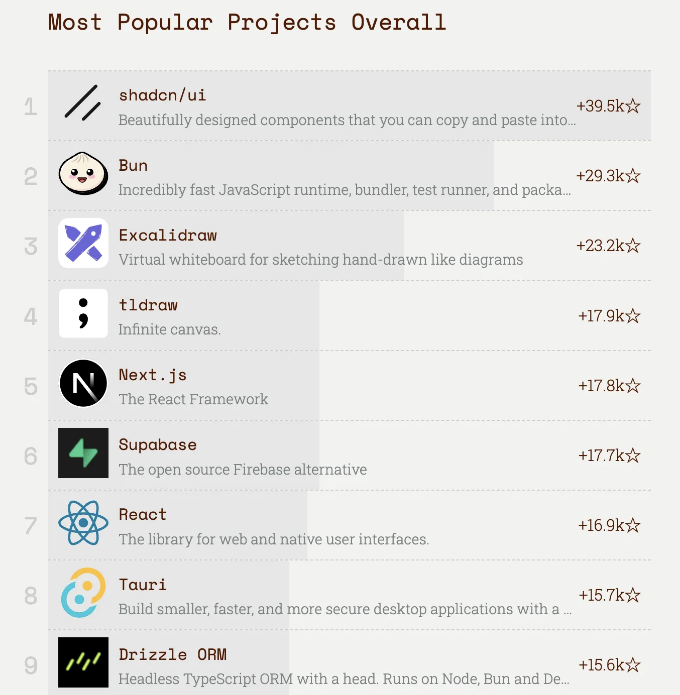
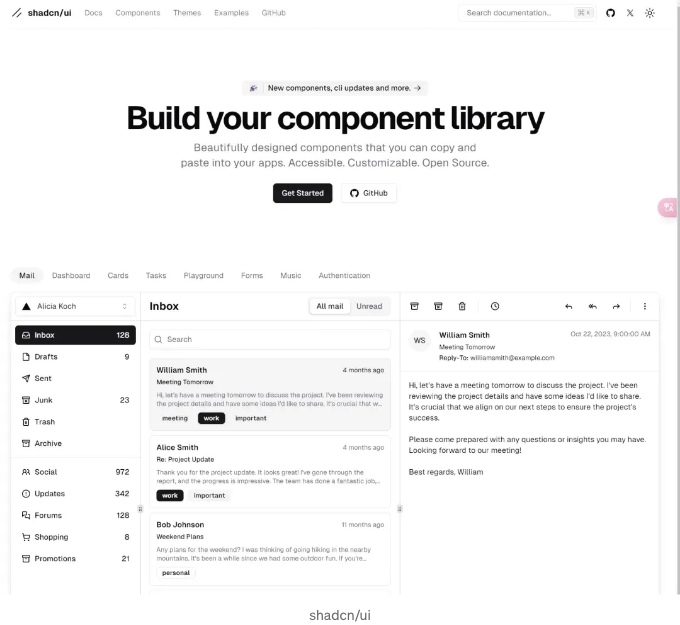
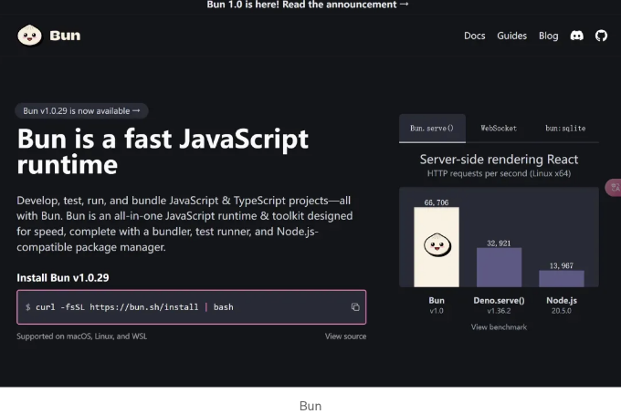
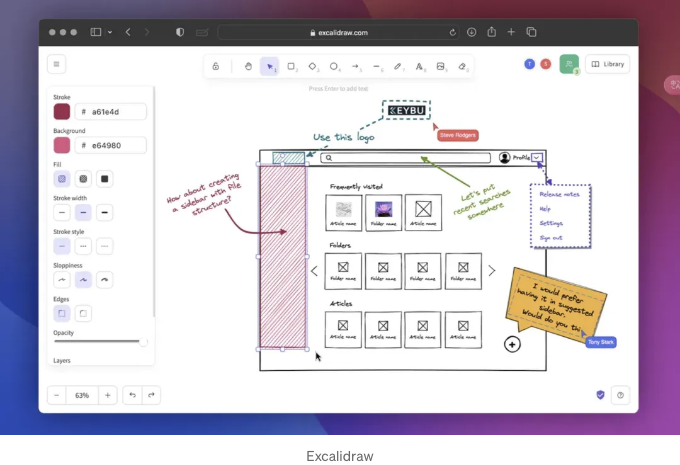
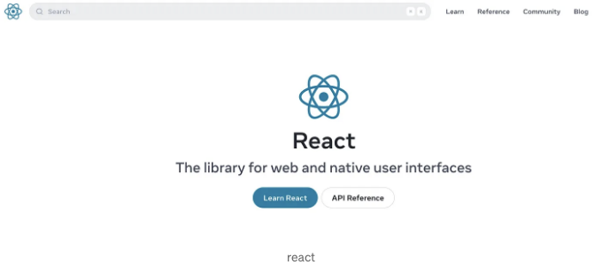
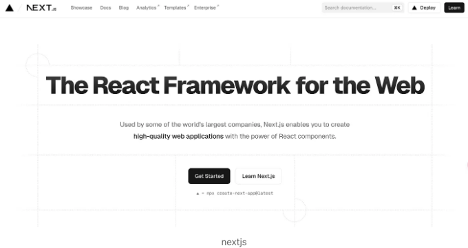
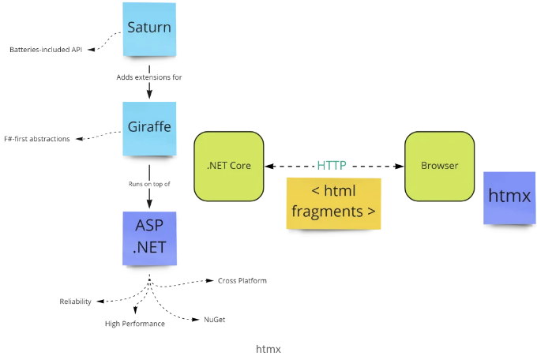

# 프론트엔드 트렌드

보고서 링크: [https://risingstars.js.org/2023/en#section-all](https://risingstars.js.org/2023/en#section-all)

최근에 발표된 보고서에는 2023년에 Github에 추가된 새로운 스타 수가 나와있습니다. 새로운 스타 수가 많을수록 이 라이브러리를 사용하는 사람들이 더 많아지고 있는 것을 의미하며, 트렌드가 점점 나아지고 있다는 것을 보여줍니다.

<!-- ui-log 수평형 -->
<ins class="adsbygoogle"
  style="display:block"
  data-ad-client="ca-pub-4877378276818686"
  data-ad-slot="9743150776"
  data-ad-format="auto"
  data-full-width-responsive="true"></ins>
<component is="script">
(adsbygoogle = window.adsbygoogle || []).push({});
</component>

그래서 이 라이브러리들은 누구인가요? 배워야 할까요? 다음으로 재고를 내보겠습니다~

# 챔피언: shadcn/ui

2023년 자바스크립트 생태계에서 가장 밝은 스타 프로젝트는 의심할 여지 없이 shadcn/ui입니다.

<!-- ui-log 수평형 -->
<ins class="adsbygoogle"
  style="display:block"
  data-ad-client="ca-pub-4877378276818686"
  data-ad-slot="9743150776"
  data-ad-format="auto"
  data-full-width-responsive="true"></ins>
<component is="script">
(adsbygoogle = window.adsbygoogle || []).push({});
</component>

리액트로 구축된 이 UI 구성 요소 모음은 Tailwind CSS의 강력한 사용자 정의 기능으로 많은 프로젝트 중에서 두드러집니다.

리액트 기술 스택의 친구이고 프로젝트에서 사용할 수 있다면, 이 UI 프레임워크를 시도해보거나 소스 코드를 살펴보세요.

## 두 번째: 번

<!-- ui-log 수평형 -->
<ins class="adsbygoogle"
  style="display:block"
  data-ad-client="ca-pub-4877378276818686"
  data-ad-slot="9743150776"
  data-ad-format="auto"
  data-full-width-responsive="true"></ins>
<component is="script">
(adsbygoogle = window.adsbygoogle || []).push({});
</component>

Bun은 Node.js와 Deno의 경쟁자입니다. 이것은 새로운 JavaScript 런타임입니다. Bun은 성능과 개발자 경험에 중점을 둔 새로운 JavaScript 런타임뿐만 아니라 번역기, 빌드 도구, 패키지 관리자 및 테스팅 라이브러리입니다.

이 복합 툴킷은 개발자에게 빠른 개발 속도를 제공한다고 주장합니다. 현재 Windows를 지원하며 앞으로 점점 더 인기가 높아질 것입니다. 배우고 싶어도 배울 수 없을 거예요. 😉

# 세 번째: Excalidraw

<!-- ui-log 수평형 -->
<ins class="adsbygoogle"
  style="display:block"
  data-ad-client="ca-pub-4877378276818686"
  data-ad-slot="9743150776"
  data-ad-format="auto"
  data-full-width-responsive="true"></ins>
<component is="script">
(adsbygoogle = window.adsbygoogle || []).push({});
</component>

Excalidraw은 React로 작성된 그림 그리기 도구입니다. 매우 간단하게 사용할 수 있으며 다양한 라이브러리가 함께 제공됩니다.

소스 코드도 매우 가치 있으며 배울 점이 많습니다. 관심이 있다면 확인해보세요.

# 프레임: React 및 Next.js

<!-- ui-log 수평형 -->
<ins class="adsbygoogle"
  style="display:block"
  data-ad-client="ca-pub-4877378276818686"
  data-ad-slot="9743150776"
  data-ad-format="auto"
  data-full-width-responsive="true"></ins>
<component is="script">
(adsbygoogle = window.adsbygoogle || []).push({});
</component>

당연히 React는 전 세계적인 프론트엔드 프레임워크 순위에서 연중 1위를 유지하고 있으며 매년 인기가 급증하여 아무도 멈출 수 없습니다.

Next.js는 React의 서버 측 렌더링 프레임워크입니다. React의 인기로 인해 당연히 인기를 끌고 있습니다.

Next.js를 배워야 하나요? 아직 묻는다고도 할까요? 꼭 배워야 합니다!!! 

<!-- ui-log 수평형 -->
<ins class="adsbygoogle"
  style="display:block"
  data-ad-client="ca-pub-4877378276818686"
  data-ad-slot="9743150776"
  data-ad-format="auto"
  data-full-width-responsive="true"></ins>
<component is="script">
(adsbygoogle = window.adsbygoogle || []).push({});
</component>

# 새로운 스타: HTMX

HTMX는 새로운 간단한 대화형 솔루션입니다.

Vue 또는 React는 오늘날 인기 있는 프레임워크입니다. 이러한 프레임워크를 사용하여 프로젝트를 개발할 때 실제로 HTML 부분을 완전히 전달해 프론트엔드에서 처리하고, 백엔드는 데이터만 전달하면 된다는 것입니다. 즉, 인기 있는 프론트엔드와 백엔드 분리 모델인 HTMX가이 모델을 변경할 것입니다.

<!-- ui-log 수평형 -->
<ins class="adsbygoogle"
  style="display:block"
  data-ad-client="ca-pub-4877378276818686"
  data-ad-slot="9743150776"
  data-ad-format="auto"
  data-full-width-responsive="true"></ins>
<component is="script">
(adsbygoogle = window.adsbygoogle || []).push({});
</component>

HTMX는 HTML이든 데이터든, 백엔드에서 가져와야 한다고 주장합니다.

이 원칙은 간단합니다:

- 어떤 사용자 이벤트에서도 AJAX 요청을 보냅니다.
- 서버가 이 요청을 위한 신규 애플리케이션 상태를 나타내는 HTML을 생성합니다.
- 이 HTML을 응답으로 전송합니다.
- 이 요소를 DOM으로 푸시하여 이 위치에 배치합니다.

다시 말해서, 다시 서버로 돌아가 Html을 렌더링합니다. 역사는 부활이라고 말해야 합니다.

<!-- ui-log 수평형 -->
<ins class="adsbygoogle"
  style="display:block"
  data-ad-client="ca-pub-4877378276818686"
  data-ad-slot="9743150776"
  data-ad-format="auto"
  data-full-width-responsive="true"></ins>
<component is="script">
(adsbygoogle = window.adsbygoogle || []).push({});
</component>

Htmx 트렌드가 시작되었고 사람들은 "풀 클라이언트" 접근 방식을 강조하기 시작했습니다. 서버에서 html 온톨로지를 생성하고 클라이언트로 보내는 방식인데, 이는 UI 이벤트가 서버로 전송되어 처리될 것을 의미합니다.

이에 대한 약간의 이해가 충분하므로 굳이 배울 필요가 없습니다. . . 당신은 이것이 곧 인기를 끌 것으로 생각하십니까?

그 외에 더 말씀하고 싶은 내용이 있으면 알려주시기 바랍니다. 🌹

<!-- ui-log 수평형 -->
<ins class="adsbygoogle"
  style="display:block"
  data-ad-client="ca-pub-4877378276818686"
  data-ad-slot="9743150776"
  data-ad-format="auto"
  data-full-width-responsive="true"></ins>
<component is="script">
(adsbygoogle = window.adsbygoogle || []).push({});
</component>

저를 팔로우하고 격려와 박수를 보내주세요. 글쓰기를 시작했는데 앞으로 여러분을 위해 더 좋은 글을 쓸 수 있기를 희망합니다.

여기서 구독해주세요!