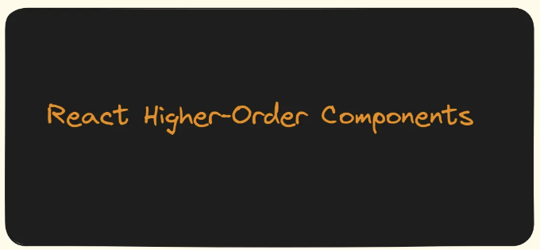

안녕하세요, 여러분, 저는 자바스크립트 프론트엔드 개발자인 Biao입니다.

오늘은 React에서 HOC에 대해 공유하고 싶습니다. 즐겁게 보시길 바라며, Javascript를 배우면서 얻은 경험을 나누고자 합니다.

React 고차 컴포넌트는 많은 React 개발자들에게 친숙한 개념입니다. 이는 React 컴포넌트를 유연하게 사용하는 똑똑한 기술입니다. HOC 자체는 컴포넌트가 아니라, 컴포넌트를 입력으로 받아 다른 컴포넌트를 반환하는 함수입니다. HOC는 컴포넌트를 향상시키고, 로직을 재사용하며, 렌더링 성능을 향상시키는 데 사용됩니다. 🚀

<!-- ui-log 수평형 -->
<ins class="adsbygoogle"
  style="display:block"
  data-ad-client="ca-pub-4877378276818686"
  data-ad-slot="9743150776"
  data-ad-format="auto"
  data-full-width-responsive="true"></ins>
<component is="script">
(adsbygoogle = window.adsbygoogle || []).push({});
</component>

이해하기 어렵지 않아요. 실제로, 익숙해지면 꽤 간단하게 느껴질 거예요. 다음 섹션에서 HOC가 무엇인지, 어떻게 사용하는지, 그리고 적용 시나리오에 대해 설명하고, 실제 소스 코드 수준에서 실용적인 예제로 들어가면서 더욱 철저히 '고차 컴포넌트' 개념을 숙지하는 데 도움을 줄 거예요.🌟

- HOC가 무엇이고 어떤 문제를 해결하나요?
- 훌륭한 HOC를 작성하는 방법은?
- HOC의 종류와 각각의 장단점은 무엇인가요?
- HOC는 정적 프로퍼티, 교차 참조와 같은 다른 문제들을 어떻게 다루나요?

이러한 주제들을 다루면서 React에서 HOC에 대한 포괄적인 이해를 제공하고, 개발자들이 프로젝트에서 효과적으로 활용할 수 있는 지식과 기술을 갖출 수 있을 거예요.

HOC는 React에서 컴포넌트 로직을 재사용하는 고급 기술이에요. HOC 자체는 React API의 일부가 아니라, React의 구성 기능에 기반한 디자인 패턴이에요.

<!-- ui-log 수평형 -->
<ins class="adsbygoogle"
  style="display:block"
  data-ad-client="ca-pub-4877378276818686"
  data-ad-slot="9743150776"
  data-ad-format="auto"
  data-full-width-responsive="true"></ins>
<component is="script">
(adsbygoogle = window.adsbygoogle || []).push({});
</component>

## 컴포넌트 래핑 방식🎯

React의 이전 버전은 코드 재사용 및 컴포넌트 구성을 위해 믹스인을 사용했습니다.

```js
const customMixin = {
  componentDidMount(){
    console.log( '------componentDidMount------' )
  },
  say(){
    console.log(this.state.name)
  }
}

const APP = React.createClass({
  mixins: [ customMixin ],
  getInitialState(){
    return {
      name:'alien'
    }
  },
  render(){
    const { name  } = this.state
    return <div> hello, world, 내 이름은 { name } 입니다. </div>
  }
})
```

React에서의 이전 믹스인 패턴은 createClass 내에서만 사용 가능했으나, 나중에 React.createClass과 믹스인은 사용 중지되었습니다. 믹스인은 일부 부정적인 영향을 미쳤습니다.

<!-- ui-log 수평형 -->
<ins class="adsbygoogle"
  style="display:block"
  data-ad-client="ca-pub-4877378276818686"
  data-ad-slot="9743150776"
  data-ad-format="auto"
  data-full-width-responsive="true"></ins>
<component is="script">
(adsbygoogle = window.adsbygoogle || []).push({});
</component>

- 암시적 종속성: 믹스인은 암시적 종속성을 도입하여 특정 기능이 어디서 왔는지 더 어렵게 추적하게 만들었습니다.
- 순서 및 충돌 문제: 서로 다른 믹스인은 특정 순서로 적용해야 할 수 있으며, 믹스인 코드 간의 충돌이나 재정의가 발생할 수 있습니다.
- 복잡성 누적: 시간이 지남에 따라 믹스인 코드가 축적되면서, 코드 유지보수가 어려워지고 복잡성이 누적되는 경향이 있었습니다.

## 파생된 접근 방식 📖

createClass가 더 이상 사용되지 않지만, React 생태계에서 믹스인이 완전히 종말된 것은 아닙니다. 클래스 기반 상태 유지(components)에서도 프로토타입 체인 상속을 사용하여 믹스인을 구현할 수 있습니다.

예시 🌟:

<!-- ui-log 수평형 -->
<ins class="adsbygoogle"
  style="display:block"
  data-ad-client="ca-pub-4877378276818686"
  data-ad-slot="9743150776"
  data-ad-format="auto"
  data-full-width-responsive="true"></ins>
<component is="script">
(adsbygoogle = window.adsbygoogle || []).push({});
</component>

```js
const customMixin = {
  componentDidMount(){
    console.log( '------componentDidMount------' )
  },
  say(){
    console.log(this.state.name)
  }
}

function componentClassMixins(Component, mixin){
  for(let key in mixin){
    Component.prototype[key] = mixin[key]
  }
}

class Index extends React.Component{
  constructor(){
    super()
    this.state={ name:'alien' }
  }
  render(){
    return <div> 안녕하세요, 세계
             <button onClick={ this.say.bind(this) } > 말하기 </button>
           </div>
  }
}
componentClassMixins(Index, customMixin)
```

## 확장 상속 패턴🌟

클래스 컴포넌트의 등장 이후, 상속을 통해 컴포넌트를 더욱 강화할 수 있습니다. 이 패턴의 장점은 기본 기능을 기본 컴포넌트에 캡슐화한 후 필요에 따라 확장할 수 있다는 것입니다. 그러나 예기치 않은 상황을 피하기 위해 기본 컴포넌트에 대해 다소 깊은 이해를 가져야 합니다.

```js
class Base extends React.Component{
  constructor(){
    super()
    this.state={ name:'alien' }
  }
  say(){
    console.log('기본 컴포넌트')
  }
  render(){
    return <div> 
               안녕하세요, 세계
               <button onClick={ this.say.bind(this) } >
                 클릭
               </button>  
           </div>
  }
}
class Index extends Base{
  componentDidMount(){
    console.log( this.state.name )
  }
  say(){
    console.log('확장된 컴포넌트')
  }
}
export default Index
```

<!-- ui-log 수평형 -->
<ins class="adsbygoogle"
  style="display:block"
  data-ad-client="ca-pub-4877378276818686"
  data-ad-slot="9743150776"
  data-ad-format="auto"
  data-full-width-responsive="true"></ins>
<component is="script">
(adsbygoogle = window.adsbygoogle || []).push({});
</component>

## HOC 패턴🗝️

이 장에서는 HOC가 중점이 됩니다. 특정 사용법에 대해 점차 알아보겠습니다. 먼저 HOC를 생성하는 간단한 시도부터 시작해봅시다.

```js
function HOC(Component) {
  return class wrapComponent extends React.Component {
     constructor(){
       super()
       this.state = {
         name: 'alien'
       }
     }
     render = () => <Component { ...this.props } { ...this.state } />
  }
}

@HOC
class Index extends React.Component {
  say() {
    const { name } = this.props
    console.log(name)
  }
  render() {
    return <div> hello,world <button onClick={ this.say.bind(this) } >click</button>  </div>
  }
}
```

## Custom Hooks 패턴📖

<!-- ui-log 수평형 -->
<ins class="adsbygoogle"
  style="display:block"
  data-ad-client="ca-pub-4877378276818686"
  data-ad-slot="9743150776"
  data-ad-format="auto"
  data-full-width-responsive="true"></ins>
<component is="script">
(adsbygoogle = window.adsbygoogle || []).push({});
</component>

클래스 없이 상태와 로직 재사용성이 부족한 컴포넌트를 다루는 문제를 대부분 해결하는 것이 훅의 등장입니다. 훅을 사용하면 로직을 캡슐화하여 쉽게 사용할 수 있습니다. 이에 대해 더 자세히 알아보려고 합니다. 

## 고차 컴포넌트 시작🌱

HOC(고차 컴포넌트)의 원래 의도는 컴포넌트의 재사용성과 로직 추상화 문제를 해결하는 데 있습니다. 컴포넌트는 주로 UI에 props를 렌더링하는 반면 HOC는 한 컴포넌트를 다른 컴포넌트로 변환합니다. 래핑된 컴포넌트에 의해 구현된 향상, 로직 저장 또는 결함 해결이 더 중요한 점입니다. 이것이 HOC의 중요성을 요약한 것입니다. 먼저 HOC가 실제로 다뤄야 하는 문제에 대해 곰곰이 생각해 봅시다.🤔🤔🤔？

- 로직 재사용성: 고차 컴포넌트(HOC)는 React 컴포넌트를 처리하는 공장처럼 작동하여 일괄 처리 및 원본 컴포넌트의 패키징을 가능하게 합니다. 사용자 정의 HOC는 특정 비즈니스 요구 사항에 맞게 맞춤화되어 로직 재사용 문제를 효과적으로 해결합니다.
- 향상된 Props: 이것은 HOC의 가장 일반적인 용도 중 하나입니다. 고차 컴포넌트에 의해 반환된 컴포넌트는 부모 컴포넌트에서 전달된 props을 가로채어 새로운 props을 주입하여 컴포넌트의 기능을 향상시킬 수 있습니다. React-router의 withRouter가 대표적인 예시입니다.
- 강화된 컴포넌트: HOC는 래핑된 비즈니스 컴포넌트에 추가 기능을 제공하는 독특한 기능을 가지고 있습니다. 이는 추가 수명주기 메서드, 추가 이벤트 핸들러 등을 포함할 수 있습니다. 그러나 이러한 HOC는 비즈니스 컴포넌트와 밀접하게 통합되어야 할 수 있습니다. React-keepalive-router의 keepaliveLifeCycle이 비즈니스 컴포넌트에 추가 수명주기 메서드를 추가하기 위해 HOC를 사용하는 전형적인 예시입니다.
- 렌더링 제어: HOC의 주목할만한 기능 중 하나는 렌더링 가로채기입니다. 래핑된 컴포넌트에서 조건부 렌더링, 시간 제한된 렌더링, 게으른 로딩 등과 같은 기능을 구현할 수 있습니다. 이에 대해 나중에 자세히 다루겠습니다. 예를 들어, react-redux의 connect 및 dva의 동적 컴포넌트에서 게으른 로딩을 위해 HOC를 사용하는 것이 전형적인 예시입니다.

<!-- ui-log 수평형 -->
<ins class="adsbygoogle"
  style="display:block"
  data-ad-client="ca-pub-4877378276818686"
  data-ad-slot="9743150776"
  data-ad-format="auto"
  data-full-width-responsive="true"></ins>
<component is="script">
(adsbygoogle = window.adsbygoogle || []).push({});
</component>

저는 고차 컴포넌트의 원래 의도에 대해 설명하겠습니다. 이 원리와 사용 방법에 대해 설명할 겁니다. 제 생각을 따라가며, 먼저 비즈니스 컴포넌트에서 고차 컴포넌트가 어떻게 사용되는지 알아봅시다.

사용법: 데코레이터 패턴과 함수 래퍼 패턴. 상태를 가지는 클래스 기반 컴포넌트에 대해서, 데코레이터 패턴을 사용하여 클래스 컴포넌트를 감쌀 수 있습니다:

```js
@withStyles(styles)
@withRouter
@keepaliveLifeCycle
class Index extends React.Component {
    /* ... */
}
```

상태를 가지지 않는 컴포넌트에 대해서는 이렇게 쓸 수 있습니다:

<!-- ui-log 수평형 -->
<ins class="adsbygoogle"
  style="display:block"
  data-ad-client="ca-pub-4877378276818686"
  data-ad-slot="9743150776"
  data-ad-format="auto"
  data-full-width-responsive="true"></ins>
<component is="script">
(adsbygoogle = window.adsbygoogle || []).push({});
</component>

```js
함수 Index(){
    /* .... */
}
export default withStyles(styles)(withRouter( keepaliveLifeCycle(Index) )) 
```

매개변수를 전달하지 않아도 되는 HOC의 경우, withRouter와 같이 하나의 레이어만 중첩시킬 수 있습니다:

```js
함수 withRouter(){
    return class wrapComponent extends React.Component{
        ...
    }
}
```

매개변수를 필요로 하는 HOC의 경우에는 프록시에 추가적인 레이어를 추가해야 합니다:```

<!-- ui-log 수평형 -->
<ins class="adsbygoogle"
  style="display:block"
  data-ad-client="ca-pub-4877378276818686"
  data-ad-slot="9743150776"
  data-ad-format="auto"
  data-full-width-responsive="true"></ins>
<component is="script">
(adsbygoogle = window.adsbygoogle || []).push({});
</component>

```js
function connect (mapStateToProps){
    return function connectAdvance(wrapCompoent){
        return class WrapComponent extends React.Component{  }
    }
}
```

두 가지 HOC 모델이 매우 간단하다는 것을 알 수 있어요. 프록시 함수를 위해 한 층 또는 여러 층이 있을 수 있지만 걱정하지 마세요. 층의 수에 상관없이 본질은 같아요. 한 번에 한 층씩 벗겨내고 구조를 분석하면 전체 HOC 구조와 프레임워크가 명확해져요. 그러면 HOC를 습득하는 것이 쉽게 될 거예요.

High Order Components (HOCs)에는 두 가지 주요 접근 방식이 있어요. 자주 사용되는 HOC는 두 가지 범주로 나눌 수 있어요: 전방 속성 프록시와 후방 컴포넌트 상속. 이 두 가지 접근 방식은 몇 가지 유사점과 차이점이 있어요. 그 차이점에 대해 깊이 알아보겠어요. 세 번째 부분에서는 이들의 구현에 대해 자세히 설명할 거예요.

전방 속성 프록시는 컴포넌트를 프록시 컴포넌트로 래핑하는 것을 포함해요. 프록시 컴포넌트에서 원본 컴포넌트를 프록시하기 위한 다양한 작업을 수행할 수 있어요. 피버 트리에서 프록시 컴포넌트가 먼저 마운트된 다음 비즈니스 컴포넌트가 따라오죠. 이 관계를 부모-자식 관계로 이해할 수 있는데, 부모 컴포넌트가 자식 컴포넌트에 대해 일련의 개선작업을 수행하게 되는 것이에요.

<!-- ui-log 수평형 -->
<ins class="adsbygoogle"
  style="display:block"
  data-ad-client="ca-pub-4877378276818686"
  data-ad-slot="9743150776"
  data-ad-format="auto"
  data-full-width-responsive="true"></ins>
<component is="script">
(adsbygoogle = window.adsbygoogle || []).push({});
</component>

```js
```js
기능 HOC(WrapComponent){
    return class Advance extends React.Component{
       state={
           name:'유인'
       }
       render(){
           return <WrapComponent  { ...this.props } { ...this.state }  />
       }
    }
}
```

역방향 상속은 래핑된 구성 요소가 비즈니스 구성 요소 자체를 상속받는다는 점에서 속성 프록시와 다릅니다. 따라서 비즈니스 구성 요소를 별도로 인스턴스화할 필요가 없습니다. 현재의 고차 컴포넌트는 상속 후 비즈니스 컴포넌트의 향상된 버전입니다. 이 접근 방식은 구성 요소 향상과 유사한 점이 있으므로 현재 상황을 인식해야 합니다.

```js
class Index extends React.Component{
  render(){
    return <div> 안녕, 세상아 </div>
  }
}
function HOC(Component){
    return class wrapComponent extends Component{
      ...
    }
}
export default HOC(Index) 
```

```js
class Index extends React.Component{
  render(){
    return <div> 안녕, 세상아 </div>
  }
}
Index.say = function(){
  console.log('제 이름은 외계인입니다')
}
function HOC(Component) {
  return class wrapComponent extends Component{
  }
}
const newIndex =  HOC(Index) 
console.log(newIndex.say)
```

<!-- ui-log 수평형 -->
<ins class="adsbygoogle"
  style="display:block"
  data-ad-client="ca-pub-4877378276818686"
  data-ad-slot="9743150776"
  data-ad-format="auto"
  data-full-width-responsive="true"></ins>
<component is="script">
(adsbygoogle = window.adsbygoogle || []).push({});
</component>

이 기사에서는 하이어오더 컴포넌트(HOC)를 작성하는 두 가지 다른 방법과 그 응용 프로그램을 탐구했습니다. 모든 것은 하이어오더 컴포넌트의 기능에서 시작되었습니다. 이 기사는 대부분 잘 알려진 오픈 소스 하이어오더 컴포넌트와 그 사용 사례를 다룹니다.

# 쉽게 이해하기 🚀

In Plain English 커뮤니티의 일원이 되어 주셔서 감사합니다! 떠나시기 전에:

- 반드시 박수를 보내고 작성자를 팔로우하세요️ 👏️️
- 팔로우하기: X | LinkedIn | YouTube | Discord | Newsletter
- 다른 플랫폼 방문하기: Stackademic | CoFeed | Venture | Cubed
- PlainEnglish.io에서 더 많은 콘텐츠 확인하기