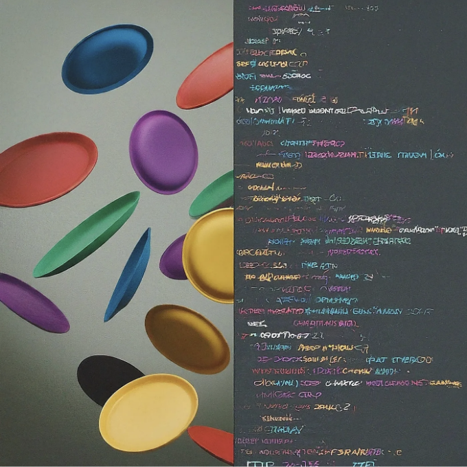

리액트에서 상태 관리를 유지하는 것은 특히 처음 시작하는 사람들에게는 접시를 던지는 것과 비슷할 수 있습니다. 하지만 걱정하지 마세요! 상태와 훅은 각 웹 애플리케이션 개발자가 동적이고 연결된 웹 플랫폼을 만들고 싶다면 배워야 하는 두 가지 중요한 개념입니다. 여기에서는 주요 상태 관리 원칙과 화면을 살펴보며 여러분을 상태 마스터로 만들어 드리겠습니다.

# 상태(State)와 훅(Hooks) 해석하기

- 상태(State)란 무엇인가요? 간단히 말하면, 상태는 특정 시점 이후 변경될 수 있는 정보로, 컴포넌트가 어떻게 보이는지를 결정합니다. 사용자 입력, API 응답 또는 사용자가 도달한 폼 페이지와 같은 이벤트 순서를 학습하는 컴포넌트의 메모리로 기억해 보세요.
- 왜 훅을 사용해야 하나요? 이전에는 상태 관리를 하기 위해 복잡하고 시간이 많이 소요되는 라이프사이클 메소드를 포함한 대형 클래스 컴포넌트를 작성해야 했기 때문에 상태 관리는 어려웠습니다. 반복문을 사용하면 함수형 컴포넌트 내에서 자바스크립트 변수를 더 짧고 조직적인 방식으로 조작할 수 있게 됩니다.
- 핵심 요소: useState — 가장 자주 사용되는 훅으로, 기본적인 상태를 추적하는 데 사용됩니다. 데이터 가져오기나 변경 사항에 구독하기와 같은 작업을 수행하려면 useEffect가 요긴하게 사용됩니다. 복잡한 상태 로직과 동작을 관리하기 위해서는 useReducer가 상태 전이와 동작을 효과적으로 관리하는 강력한 도구입니다.


<!-- ui-log 수평형 -->
<ins class="adsbygoogle"
  style="display:block"
  data-ad-client="ca-pub-4877378276818686"
  data-ad-slot="9743150776"
  data-ad-format="auto"
  data-full-width-responsive="true"></ins>
<component is="script">
(adsbygoogle = window.adsbygoogle || []).push({});
</component>

# 지원되는 주장: Hooks의 활용

## useState: 사물을 추적하기

최소한의 기능을 갖춘 카운팅 앱을 만들고 있다고 상상해보세요. 아직 추적되어야 하는 현재 수가 있습니다. useState를 사용해서 다음처럼 처리할 수 있습니다:

```js
import React, { useState } from 'react';

function Counter() {
  const [count, setCount] = useState(0);
  const increment = () => setCount(count + 1);
  const decrement = () => setCount(count - 1);
  return (
    <div>
      <h1>현재 수: {count}</h1>
      <button onClick={increment}>+</button>
      <button onClick={decrement}>-</button>
    </div>
  );
}
```

<!-- ui-log 수평형 -->
<ins class="adsbygoogle"
  style="display:block"
  data-ad-client="ca-pub-4877378276818686"
  data-ad-slot="9743150776"
  data-ad-format="auto"
  data-full-width-responsive="true"></ins>
<component is="script">
(adsbygoogle = window.adsbygoogle || []).push({});
</component>

이 예제에서 useState는 두 요소를 가진 배열을 반환합니다: 현재 상태(count)와 다음 상태로 업데이트할 수 있는 함수(setCount). 간편하게 해당 함수를 사용하여 값의 추가 또는 감소를 할 수 있고, React는 자동으로 업데이트된 count로 컴포넌트를 다시 렌더링합니다.

## useEffect: 부가 작용을 쉽게 처리하기

컴포넌트가 마운트될 때 API에서 데이터를 가져오고 싶다면 useEffect가 구원해줍니다!

```js
import React, { useState, useEffect } from 'react';

function DataFetcher() {
  const [data, setData] = useState(null);
  useEffect(() => {
    fetch('https://api.example.com/data')
      .then(response => response.json())
      .then(data => setData(data));
  }, []); // 빈 의존성 배열은 효과가 한 번만 실행됨을 보장합니다
  return (
    <div>
      {data ? <p>데이터는: {data}</p> : <p>로딩 중...</p>}
    </div>
  );
}
```

<!-- ui-log 수평형 -->
<ins class="adsbygoogle"
  style="display:block"
  data-ad-client="ca-pub-4877378276818686"
  data-ad-slot="9743150776"
  data-ad-format="auto"
  data-full-width-responsive="true"></ins>
<component is="script">
(adsbygoogle = window.adsbygoogle || []).push({});
</component>

useEffect 훅을 활용하려면, 첫 번째 인자에 함수를 작성하고 두 번째 인자에 의존성 배열을 작성하세요. 함수 선언 부분을 함수형 컴포넌트 내부에 배치하여 전반적인 함수 내에서 올바른 위치로 렌더링이 되도록 합니다. 이 경우에는 API URL을 인용하고, 요청 결과를 받은 후 상태 배열에 데이터를 저장합니다. 화살표 함수는 효과가 한 번 또는 컴포넌트가 등록될 때에 한 번 연결되어야 합니다.

# 상태와 훅의 힘을 느껴보세요

상태와 훅의 기본기는 매력적이고 상호작용적인 React 애플리케이션을 구성하는 데 필요한 핵심 기술입니다. 튼튼한 기본 지식이 필요하다는 것을 기억하고, 배우는 유일한 방법은 무언가를 만들어보는 것을 두려워하지 마세요. 지금은 학습하는 동안 인내심을 가지고, 그러면 쉽고 빠르게 배울 수 있을 겁니다.

# React 스킬을 레벨업하세요

<!-- ui-log 수평형 -->
<ins class="adsbygoogle"
  style="display:block"
  data-ad-client="ca-pub-4877378276818686"
  data-ad-slot="9743150776"
  data-ad-format="auto"
  data-full-width-responsive="true"></ins>
<component is="script">
(adsbygoogle = window.adsbygoogle || []).push({});
</component>

리액트 스킬을 더욱 향상시키고 싶나요? Redux나 Zustand 같은 고급 상태 관리 라이브러리를 탐험해보거나, 커스텀 훅에 더 깊이 파고들어 볼 수도 있고, 복잡하고 현실적인 프로젝트들을 구축할 수도 있어요. 리액트 세계는 여러분의 게살이에요, 그러니 탐험을 시작하고 계속해서 배워나가세요!