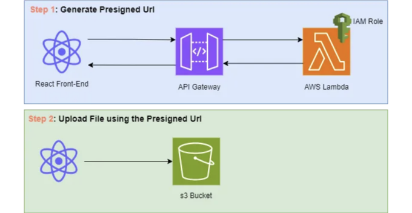

# 소개

AWS S3 버킷으로 파일을 업로드할 때는 항상 보안을 고려해야 합니다. AWS SDK를 사용하여 버킷에 직접 업로드하는 것이 일반적인 방법이지만 때로는 보안 위험을 가져올 수 있으며 코드에서 AWS 자격 증명을 노출시킬 수도 있습니다. 이 가이드에서는 React 애플리케이션에서 사전 서명된 URL을 사용하여 S3 버킷으로 파일을 업로드하는 더 안전한 방법을 살펴보겠습니다.

React 애플리케이션에서 AWS S3 버킷으로 파일을 업로드하기 위해 사전 서명된 URL을 사용하는 것은 보안, 확장성 및 성능을 향상시킵니다. 서버 부하와 비용을 줄이는 제한된 액세스 권한 및 특정 만료 시간으로 직접 업로드할 수 있게 해주며, 사용자 경험을 개선하고 애플리케이션 내에서 파일 업로드를 유연하게 처리할 수 있습니다.

<!-- ui-log 수평형 -->
<ins class="adsbygoogle"
  style="display:block"
  data-ad-client="ca-pub-4877378276818686"
  data-ad-slot="9743150776"
  data-ad-format="auto"
  data-full-width-responsive="true"></ins>
<component is="script">
(adsbygoogle = window.adsbygoogle || []).push({});
</component>

# 단계 1: S3 버킷 생성하기

먼저 AWS 계정에서 S3 버킷을 만들어 보세요. 버킷에 고유한 이름을 선택하도록 해주세요.

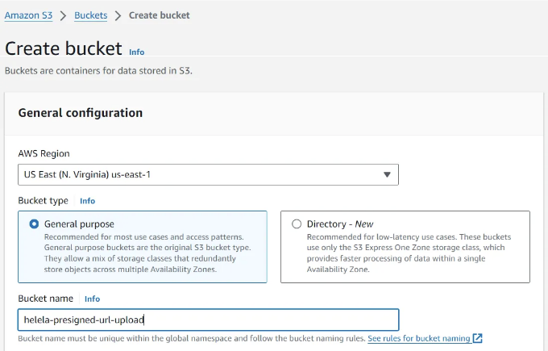

# 단계 2: S3 버킷에 CORS 정책 추가하기

<!-- ui-log 수평형 -->
<ins class="adsbygoogle"
  style="display:block"
  data-ad-client="ca-pub-4877378276818686"
  data-ad-slot="9743150776"
  data-ad-format="auto"
  data-full-width-responsive="true"></ins>
<component is="script">
(adsbygoogle = window.adsbygoogle || []).push({});
</component>

React 프런트엔드에서 S3 버킷으로 객체를 업로드하려면 버킷에 CORS(Cross-Origin Resource Sharing) 정책을 추가해야 합니다. 이 정책은 어떤 출처가 버킷에 액세스할 수 있는지와 허용된 HTTP 메서드를 정의합니다.

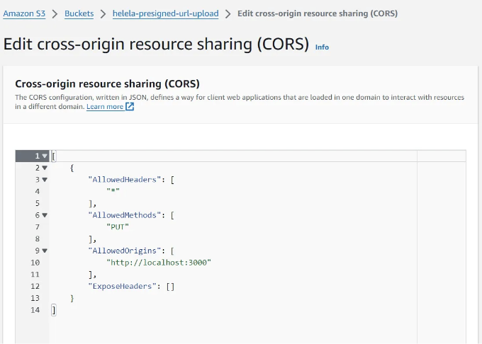

# 단계 3: 람다 함수 생성

이제 S3 버킷에 객체를 업로드하기 위한 사전 서명된 URL을 생성하는 람다 함수를 만들어야 합니다. 이 예에서는 .png 파일을 업로드하지만 원하는 파일 유형을 사용할 수 있습니다. 이 함수는 React 애플리케이션에 의해 호출되어 사전 서명된 URL을 제공받아 S3 버킷에 파일을 업로드할 수 있는 임시 액세스를 부여합니다.

<!-- ui-log 수평형 -->
<ins class="adsbygoogle"
  style="display:block"
  data-ad-client="ca-pub-4877378276818686"
  data-ad-slot="9743150776"
  data-ad-format="auto"
  data-full-width-responsive="true"></ins>
<component is="script">
(adsbygoogle = window.adsbygoogle || []).push({});
</component>


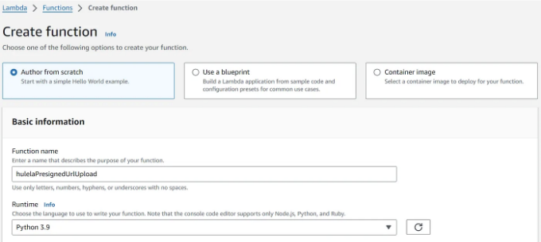

버킷을 업로드할 위치를 정의하고 객체에 대한 고유한 키를 생성하는 함수 코드를 추가하세요. 그런 다음 PUT 방법, 1시간의 만료 시간을 사용하여 s3.generate_presigned_url() 함수를 사용합니다. 원하는대로 설정을 구성할 수 있습니다. 여기에 제 함수 코드가 어떻게 보이는지 확인해보세요.

```python
import json
import boto3
import uuid

# S3 클라이언트 구성
s3 = boto3.client('s3')

def lambda_handler(event, context):
    # 환경 변수에서 버킷 이름 가져오기
    bucket_name = 'helela-presigned-url-upload'
    key = f'{uuid.uuid4()}.png'      # 객체에 대한 고유한 키 생성

    # 사전 서명된 URL 생성
    presigned_url = s3.generate_presigned_url(
        ClientMethod='put_object',
        Params={
            'Bucket': bucket_name, 
            'Key': key,
            'ContentType': 'application/png',  # .png용 Content-Type 설정
        },
        ExpiresIn=3600,    # URL의 만료 시간(초)을 지정합니다. 여기서는 1시간으로 설정됨
        HttpMethod='PUT'   # URL에서 PUT 요청만 허용
    )

    # 응답 작성
    response = {
        'statusCode': 200,
        'headers': {
            'Access-Control-Allow-Origin': 'http://localhost:3000'
        },
        'body': json.dumps({
            'presignedUrl': presigned_url,
            'key': key
        })
    }

    return response
```

## 단계 4: Lambda 함수의 IAM 역할에 PutObject 정책 추가

<!-- ui-log 수평형 -->
<ins class="adsbygoogle"
  style="display:block"
  data-ad-client="ca-pub-4877378276818686"
  data-ad-slot="9743150776"
  data-ad-format="auto"
  data-full-width-responsive="true"></ins>
<component is="script">
(adsbygoogle = window.adsbygoogle || []).push({});
</component>

Lambda 함수가 클라이언트를 대신하여 S3 버킷에 객체를 업로드할 수 있도록하려면 Lambda 함수의 IAM 역할에 PutObject 정책을 추가해야합니다. 이 정책은 사전 서명 된 URL이 S3 버킷에 객체를 쓸 수있는 필요한 권한을 부여합니다.

Lambda 함수의 Configuration/Permissions로 이동하고 실행 역할 이름을 클릭하면 IAM 역할 콘솔로 이동합니다.

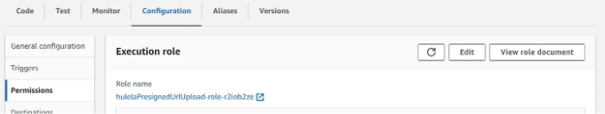

Add permissions을 클릭한 후 인라인 정책을 생성하세요.

<!-- ui-log 수평형 -->
<ins class="adsbygoogle"
  style="display:block"
  data-ad-client="ca-pub-4877378276818686"
  data-ad-slot="9743150776"
  data-ad-format="auto"
  data-full-width-responsive="true"></ins>
<component is="script">
(adsbygoogle = window.adsbygoogle || []).push({});
</component>

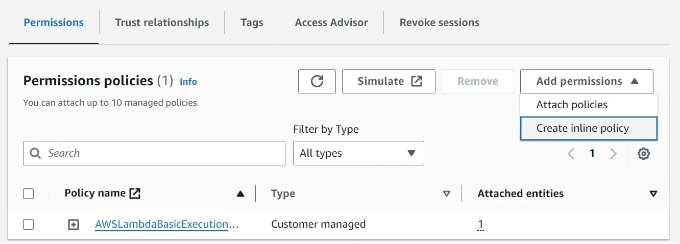

JSON을 선택하고, 당신만의 S3 버킷 ARN과 함께 정책을 붙여넣으세요.

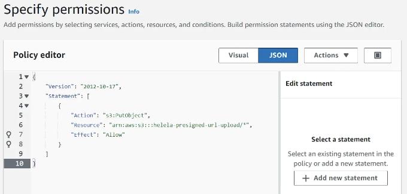

고유한 정책명을 추가하고 정책을 생성하세요.

<!-- ui-log 수평형 -->
<ins class="adsbygoogle"
  style="display:block"
  data-ad-client="ca-pub-4877378276818686"
  data-ad-slot="9743150776"
  data-ad-format="auto"
  data-full-width-responsive="true"></ins>
<component is="script">
(adsbygoogle = window.adsbygoogle || []).push({});
</component>

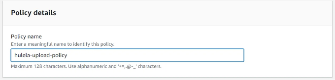

# 단계 5: API Gateway 트리거 추가

API Gateway를 사용하여 사전 서명된 URL을 생성하는 Lambda 함수를 호출하는 트리거로 사용하는 것은 보안 강화, 확장성, 맞춤화, 속도 제한 그리고 시효적인 Lambda 통합과 같은 이점을 제공합니다.

Lambda 함수에 트리거로 API Gateway를 구성하세요. 이를 통해 React 애플리케이션이 Lambda 함수를 HTTP를 통해 호출하고 파일 업로드를 위한 사전 서명된 URL을 얻을 수 있습니다.

<!-- ui-log 수평형 -->
<ins class="adsbygoogle"
  style="display:block"
  data-ad-client="ca-pub-4877378276818686"
  data-ad-slot="9743150776"
  data-ad-format="auto"
  data-full-width-responsive="true"></ins>
<component is="script">
(adsbygoogle = window.adsbygoogle || []).push({});
</component>

API Gateway로 이동해서 HTTP API를 만들어보세요.

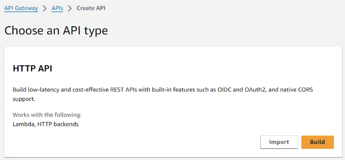

이 API를 람다 함수의 트리거로 설정하려면 람다 함수의 ARN을 붙여넣으세요.

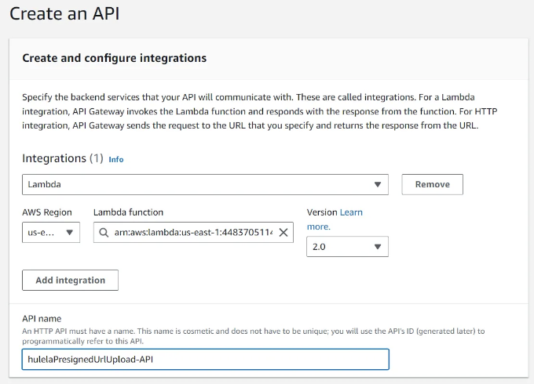

<!-- ui-log 수평형 -->
<ins class="adsbygoogle"
  style="display:block"
  data-ad-client="ca-pub-4877378276818686"
  data-ad-slot="9743150776"
  data-ad-format="auto"
  data-full-width-responsive="true"></ins>
<component is="script">
(adsbygoogle = window.adsbygoogle || []).push({});
</component>

테이블 태그를 Markdown 형식으로 변경해주세요.

<!-- ui-log 수평형 -->
<ins class="adsbygoogle"
  style="display:block"
  data-ad-client="ca-pub-4877378276818686"
  data-ad-slot="9743150776"
  data-ad-format="auto"
  data-full-width-responsive="true"></ins>
<component is="script">
(adsbygoogle = window.adsbygoogle || []).push({});
</component>

API가 생성된 후, CORS 정책을 설정하여 http://localhost:3000 (또는 애플리케이션 호스트)에서의 요청만 허용하도록 구성하세요.

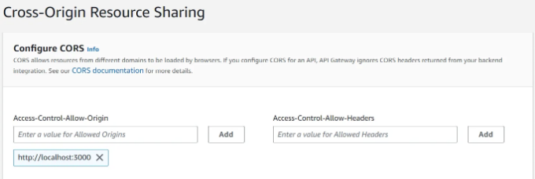

Lambda 기능 페이지에서 API Gateway Lambda 트리거의 생성을 확인하세요.

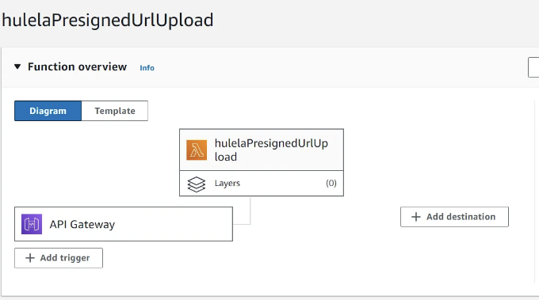

<!-- ui-log 수평형 -->
<ins class="adsbygoogle"
  style="display:block"
  data-ad-client="ca-pub-4877378276818686"
  data-ad-slot="9743150776"
  data-ad-format="auto"
  data-full-width-responsive="true"></ins>
<component is="script">
(adsbygoogle = window.adsbygoogle || []).push({});
</component>

# 단계 6: React 프론트엔드에서 업로드 테스트하기:

마지막으로 선택한 파일 업로드 기능을 React 애플리케이션에 통합하세요. HTTP 요청을 하기 위해 Axios 라이브러리를 사용하여 API Gateway 엔드포인트에 요청을 보내 Lambda 함수를 호출하고 사전 서명된 URL을 반환합니다. 그런 다음 이 URL을 사용하여 클라이언트 측에서 직접 S3 버킷에 선택한 파일을 업로드합니다.

우리는 axios 라이브러리를 사용하여 사전 서명된 URL을 받아오고 이를 사용하여 파일을 업로드할 것입니다.

```js
npm install axios    
```

<!-- ui-log 수평형 -->
<ins class="adsbygoogle"
  style="display:block"
  data-ad-client="ca-pub-4877378276818686"
  data-ad-slot="9743150776"
  data-ad-format="auto"
  data-full-width-responsive="true"></ins>
<component is="script">
(adsbygoogle = window.adsbygoogle || []).push({});
</component>

App.js를 편집하고 다음 코드를 붙여넣으세요. API_ENDPOINT를 본인의 API 엔드포인트로 바꿔주세요.

```js
import React, { useState } from "react";
import "./App.css";
import axios from "axios";

function App() {
  const [selectedFile, setSelectedFile] = useState(null);
  const [uploadProgress, setUploadProgress] = useState(0);

  const handleFileChange = (event) => {
    setSelectedFile(event.target.files[0]);
  };

  // API Gateway url to invoke function to generate presigned url
  const API_ENDPOINT = "https://your-api-endpoint-here/route";

  // Function to generate the presigned url
  const getPresignedUrl = async () => {
    // GET request: presigned URL
    const response = await axios({
      method: "GET",
      url: API_ENDPOINT,
    });
    const presignedUrl = response.data.presignedUrl;
    console.log(presignedUrl);
    return presignedUrl;
  };

  // Function to upload the selected file using the generated presigned url
  const uploadToPresignedUrl = async (presignedUrl) => {
    // Upload file to pre-signed URL
    const uploadResponse = await axios.put(presignedUrl, selectedFile, {
      headers: {
        "Content-Type": "application/png",
      },
      onUploadProgress: (progressEvent) => {
        const percentCompleted = Math.round(
          (progressEvent.loaded * 100) / progressEvent.total
        );
        setUploadProgress(percentCompleted);
        console.log(`Upload Progress: ${percentCompleted}%`);
      },
    });
    console.log(uploadResponse);
  };

  // Function to orchestrate the upload process
  const handleUpload = async () => {
    try {
      // Ensure a file is selected
      if (!selectedFile) {
        console.error("No file selected.");
        return;
      }

      const presignedUrl = await getPresignedUrl();
      uploadToPresignedUrl(presignedUrl);
    } catch (error) {
      // Handle error
      console.error("Error uploading file:", error);
    }
  };

  return (
    <div className="App">
      <h1>파일 선택 컴포넌트</h1>
      <input type="file" onChange={handleFileChange} />
      <button onClick={handleUpload}>업로드</button>
    </div>
  );
}

export default App;
```

애플리케이션을 실행하고 테스트하세요.

```js
npm start
```

<!-- ui-log 수평형 -->
<ins class="adsbygoogle"
  style="display:block"
  data-ad-client="ca-pub-4877378276818686"
  data-ad-slot="9743150776"
  data-ad-format="auto"
  data-full-width-responsive="true"></ins>
<component is="script">
(adsbygoogle = window.adsbygoogle || []).push({});
</component>

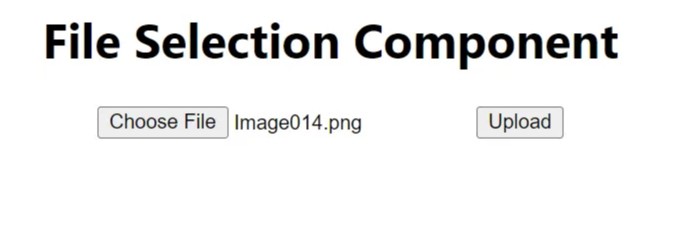

# 결론

위 단계를 따르면 사전 서명된 URL을 사용하여 React 애플리케이션에서 안전하게 파일을 AWS S3 버킷에 업로드할 수 있습니다. 이 접근 방식은 S3로의 직접 업로드와 관련된 보안 위험을 완화하며 애플리케이션에서 파일 업로드를 효율적으로 처리할 수 있는 확장 가능한 솔루션을 제공합니다.