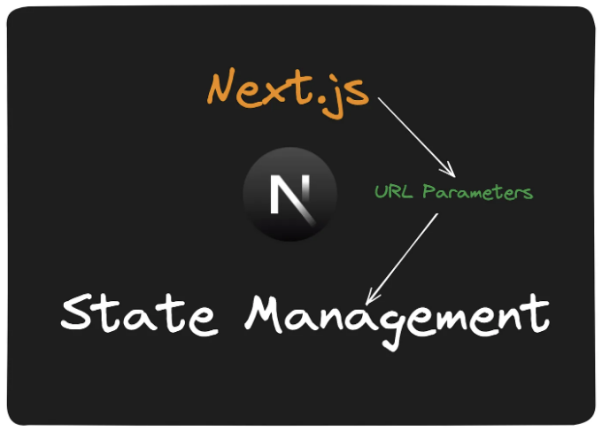
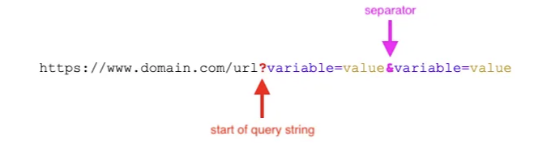

🌟 프론트엔드 프레임워크인 React.js와 Next.js와 같은 경우, 상태(State) 관리를 위한 기본 요소로 useState가 자리 잡고 있습니다. 그러나 앱이 확장되면서 개발자들은 향상된 사용자 경험, SEO 및 최적화를 위한 고급 상태 관리를 원합니다. 이때 URL 매개변수가 강력한 대안으로 등장합니다! 🚀

useState 훅은 함수형 컴포넌트에서 상태를 관리하는 데 React 개발자들에게 애정을 받고 있지만, 제약 사항이 있습니다. 특히 응용 프로그램이 확장되고 더 많은 컴포넌트가 데이터에 대한 필요를 느낄 때, 종종 데이터를 컴포넌트 간에 전달하거나 상태 관리 라이브러리를 쓰는 등의 방법을 택합니다. 이러한 몇 가지 한계를 고려해 보세요: 🧐

- 로컬 컴포넌트 범위: useState는 특정 컴포넌트의 범위 안에서 상태를 처리하는 데 제작되었습니다. 여러 컴포넌트 간에 상태를 공유하거나 전역 상태를 조율해야 할 때는 React의 useContext 훅을 통합하거나 Redux-toolkit과 같은 상태 관리 라이브러리의 능력을 대두해 보세요. 🚀
- SEO 최적화가 되지 않음: URL 매개변수가 useState에 의해 용이하게 조정된 상태에서 상태 조정을 반영하지 못하면 SEO에 영향을 줄 수 있습니다. 🚦
- 사용자 경험 고려: 전자상거래 앱에서 URL 매개변수를 활용하지 않을 경우 사용자 경험이 떨어질 수 있습니다. 사용자들이 쉽게 다른 사람과 선호 사항을 공유할 수 없기 때문입니다. 🛍️🔄
- Prop drilling: 전역 상태를 관리하기 위해 useState에 의존하는 경우 모든 필요한 컴포넌트에 상태와 해당 setter 함수를 프롭스(prop)로 전달해야 하는 번거로움이 있습니다. 🌳

<!-- ui-log 수평형 -->
<ins class="adsbygoogle"
  style="display:block"
  data-ad-client="ca-pub-4877378276818686"
  data-ad-slot="9743150776"
  data-ad-format="auto"
  data-full-width-responsive="true"></ins>
<component is="script">
(adsbygoogle = window.adsbygoogle || []).push({});
</component>

이러한 한계를 극복하기 위해 useReducer 훅, useContext 훅 또는 Redux와 MobX와 같은 서드 파티 도구와 같은 대안적인 상태 관리 방법을 채택하는 것을 고려해볼 수 있습니다.

# 왜 useState 대신 URL 파라미터를 사용하는가?

URL 파라미터는 URL 끝에 물음표(?)를 사용하여 추가된 쿼리 문자열로 나타나며, 검색 및 페이지네이션과 같은 웹페이지 기능을 향상시키거나 페이지 SEO를 강화하며 종종 마케팅 캠페인을 추적하는 기능을 제공하여 다양한 기능을 수행합니다. 📈 URL은 앰퍼샌드(&)로 구분된 여러 매개변수를 수용할 수 있습니다. 다음은 매개변수로 장식된 URL의 예시입니다.



<!-- ui-log 수평형 -->
<ins class="adsbygoogle"
  style="display:block"
  data-ad-client="ca-pub-4877378276818686"
  data-ad-slot="9743150776"
  data-ad-format="auto"
  data-full-width-responsive="true"></ins>
<component is="script">
(adsbygoogle = window.adsbygoogle || []).push({});
</component>

## 🧐 그렇다면 왜 URL 매개변수를 useState보다 사용해야 하나요?

특정 시나리오에서는 URL 매개변수가 useState를 능가할 수 있습니다. 특히 더 적응 가능하고 공유 가능한 방식으로 애플리케이션 상태를 관리하려는 경우에는요. 🌟 URL 매개변수를 선택할 이유는 몇 가지가 있습니다:

- 웹페이지 즐겨찾기: URL 매개변수를 사용하면 상태 정보를 URL에 직접 인코딩하여 사용자가 특정 페이지를 즐겨찾기에 추가하고 다른 사람과 공유하기 쉽게 만듭니다. 🔗
- 향상된 상태 관리: 검색 기능이 있는 웹페이지에서 URL 매개변수를 통해 검색어를 유지하면 사용자가 브라우저를 새로 고침해도 검색어를 유지할 수 있습니다. 🔄
- 간소화된 컴포넌트 로직: URL 매개변수는 개별 컴포넌트 내부 로직을 간소화하는 방법을 제공합니다. 🛤️ 복잡한 검색 기능에 useState를 사용하는 대신 URL 쿼리 매개변수에 처리를 맡길 수 있습니다.

useState는 로컬 컴포넌트 상태를 관리하는 데 힘이 있지만, URL 매개변수와 결합하면 상태 관리에 더 강력한 접근 방식이 제공됩니다.

<!-- ui-log 수평형 -->
<ins class="adsbygoogle"
  style="display:block"
  data-ad-client="ca-pub-4877378276818686"
  data-ad-slot="9743150776"
  data-ad-format="auto"
  data-full-width-responsive="true"></ins>
<component is="script">
(adsbygoogle = window.adsbygoogle || []).push({});
</component>

# URL 파라미터 쿼리 패턴 이해하기

URL 파라미터는 키-값 쌍으로 구성되어 다양한 데이터 전송을 가능케 합니다. 🗝️ 키는 식별자 역할을 하며, 값은 등호(=)로 구분된 키에 바인딩됩니다. 🧩 URL 내에는 여러 파라미터가 있으며, 각각을 앰퍼샌드(&)로 구분합니다.

예를 들어:

```js
https://www.example.com/search?q=mens+t-shirt&size=3xl&color=white&sort=asc.
```

<!-- ui-log 수평형 -->
<ins class="adsbygoogle"
  style="display:block"
  data-ad-client="ca-pub-4877378276818686"
  data-ad-slot="9743150776"
  data-ad-format="auto"
  data-full-width-responsive="true"></ins>
<component is="script">
(adsbygoogle = window.adsbygoogle || []).push({});
</component>

이 URL은 검색 경로를 나타내며, 검색어는 "q" 키로 지정됩니다. 🕵️‍♂️ 이후의 매개변수들은 "size", "color", "sort"와 같이 추가적인 검색 기준을 나타내며, 각각 사용자의 브라우징 경험을 높여줍니다.

# 일반적인 URL 매개변수 사용 사례

웹사이트들은 주로 URL 매개변수를 활용하여 고급 상태를 조율하며, 마케팅 캠페인과 페이지 SEO를 개선합니다. 🚀 URL 매개변수 사용에는 여러 가지 이점이 있습니다:

- 🔍 정렬과 필터링: URL 매개변수는 사용자가 웹페이지 콘텐츠를 정렬하고 필터링하도록 도와주어 브라우징 경험을 맞춤화합니다. 예를 들어: https://www.example.com/dresses?sort=a-z
- 🔎 검색 쿼리: 매개변수는 사용자 검색 쿼리를 포함하여 나중에 참고하기 위해 북마킹할 수 있도록 합니다. 예를 들어: https://www.example.com/search?q=t-shirt
- 🌐 언어 번역: URL 매개변수는 언어 번역 쿼리를 용이하게 하여 사용자가 선호하는 언어로 웹페이지에 접속할 수 있도록 돕습니다. 예를 들어: https://www.example.com/news?lang=fr
- 📊 마케팅 캠페인 추적: 매개변수는 캠페인 쿼리를 포함하여 클릭율 추적 및 캠페인 효과 측정에 도움을 줍니다. 예를 들어: https://www.example.com/home?utm_campaign=fbid_newyearpromo&referrer_id=25jh8s
- 📑 페이지 네비게이션: URL 매개변수는 웹페이지 검색 결과를 페이지별로 정리하여 부드러운 탐색이 이루어지도록 합니다. 예를 들어: https://www.example.com/blog/articles?page=3

<!-- ui-log 수평형 -->
<ins class="adsbygoogle"
  style="display:block"
  data-ad-client="ca-pub-4877378276818686"
  data-ad-slot="9743150776"
  data-ad-format="auto"
  data-full-width-responsive="true"></ins>
<component is="script">
(adsbygoogle = window.adsbygoogle || []).push({});
</component>

URL 매개변수는 다양한 온라인 플랫폼에서 웹페이지 기능을 강화하고 사용자 경험을 풍부하게하는 강력한 도구로 부각됩니다.

# URL을 활용한 글로벌 상태 - 장단점

웹 애플리케이션의 상태를 관리할 때 URL을 활용하면 다양한 이점을 누릴 수 있습니다. 🌐 사용자 경험을 향상시키고 마케팅 캠페인 추적을 용이하게 하며 페이지 SEO를 강화할 수 있습니다. 하지만 조심스럽게 다루지 않을 경우 웹페이지에 도전을 불러일으킬 수도 있습니다. 고려해야 할 일부 장단점은 다음과 같습니다:

## 장점 🌟

<!-- ui-log 수평형 -->
<ins class="adsbygoogle"
  style="display:block"
  data-ad-client="ca-pub-4877378276818686"
  data-ad-slot="9743150776"
  data-ad-format="auto"
  data-full-width-responsive="true"></ins>
<component is="script">
(adsbygoogle = window.adsbygoogle || []).push({});
</component>

- 책갈피 및 공유 가능한 URL: 사용자들은 애플리케이션의 특정 URL 상태를 책갈피에 추가하거나 다른 사람과 공유할 수 있어서 사용성과 협업이 향상됩니다. 📚
- 딥 링킹: 개발자들은 URL 매개변수를 사용하여 쿼리 문자열과 일치하는 동적 페이지를 생성할 수 있어서 애플리케이션 상태의 딥 링킹이 개선됩니다. 🔗
- 서버 측 렌더링 (SSR) 호환성: 서버 측 렌더링이 필요한 프로젝트에 Next.js를 사용하는 것이 이상적입니다. URL 매개변수를 통해 서버와 클라이언트 사이에 상태 데이터를 전송할 수 있습니다. 🌐

## 단점 🚫

- 보안 문제: URL 매개변수에 저장된 민감한 정보는 사용자에게 표시될 수 있고 수정될 수 있어서 중대한 보안 위험을 초래할 수 있습니다. 🔒
- 중복 내용: URL 매개변수의 오용은 혼란스러운 다중 URL로 이어지며, 이는 SEO 엔진에서의 페이지 순위가 떨어지고 페이지 로딩이 느려질 수 있습니다. 🔄
- 복잡한 URL 구조: 복잡한 쿼리 매개변수는 종종 긴, 읽기 어려운 URL로 이어지며, 사용자가 링크를 클릭하고 신뢰하기를 꺼려할 수 있어서 페이지 방문이 줄어들 수 있습니다. 🧩

# Next.js에서 URL 매개변수 구현 방법

<!-- ui-log 수평형 -->
<ins class="adsbygoogle"
  style="display:block"
  data-ad-client="ca-pub-4877378276818686"
  data-ad-slot="9743150776"
  data-ad-format="auto"
  data-full-width-responsive="true"></ins>
<component is="script">
(adsbygoogle = window.adsbygoogle || []).push({});
</component>

## 구성 요소 생성하기

두 가지 구성 요소를 만들어 보겠습니다. 먼저, 검색 입력 구성 요소를 만들어 URL에 검색 및 정렬 쿼리를 추가합니다.

```js
import { useRouter, useSearchParams } from "next/navigation";
```

우리는 먼저 next/navigation에서 쿼리 훅을 불러옵니다. useRouter 훅은 클라이언트 응용프로그램 내의 어떤 경로로든 이동할 수 있게 해줍니다. 반면 useSearchParams 훅은 URL에서 쿼리를 다루는 데 사용됩니다. 즉, get, set, delete 메서드와 같은 동작이 가능합니다.

<!-- ui-log 수평형 -->
<ins class="adsbygoogle"
  style="display:block"
  data-ad-client="ca-pub-4877378276818686"
  data-ad-slot="9743150776"
  data-ad-format="auto"
  data-full-width-responsive="true"></ins>
<component is="script">
(adsbygoogle = window.adsbygoogle || []).push({});
</component>

먼저, 표 태그를 Markdown 형식으로 바꿔 봅시다.

```js
const SearchSortInput = () => {
  const router = useRouter();
  const searchParams = useSearchParams();
  const query = searchParams?.get("q");
  const sort = searchParams?.get("sort");

  const newParams = URLSearchParams(searchParams.toString());
};
```

다음으로, 우리는 훅(hook)을 초기화하고 검색 매개변수를 사용하여 URL에서 기존 쿼리를 가져옵니다. 이는 입력 필드에 쿼리를 지속시키게 해줍니다.

```js
return (
  <div className="flex items-center space-x-4 mb-4">
    <button
      onClick={() => router.push("/")}
      className="border border-gray-300 p-2 rounded text-black border-black"
    >
      홈
    </button>

    <form
      className="
        flex items-center space-x-4 mb-4 mx-auto
      "
    >
      <input
        type="text"
        placeholder="검색..."
        name="search"
        key={query || ""}
        defaultValue={query || ""}
        className="border border-gray-300 p-2 rounded text-black border-black"
      />
      <button
        type="submit"
        className="border border-gray-300 p-2 rounded text-black border-black"
      >
        검색
      </button>
      <div className="flex gap-2 items-center">
        <p>정렬 기준:</p>

        <select
          defaultValue={sort || "default"}
          name="sort"
          onChange={(e) => {
            newParams.set("sort", e.target.value);
            router.push(`/search?${newParams.toString()}`);
          }
          className="border border-gray-300 p-2 rounded"
        >
          <option value="default">기본</option>
          <option value="title">이름</option>
          <option value="asc">오름차순</option>
          <option value="desc">내림차순</option>
          <option value="a-z">A부터Z까지</option>
        </select>
      </div>
    </form>
  </div>
);
```

이 섹션에서는 사용자가 검색 쿼리를 입력할 수 있는 입력 필드를 만듭니다. 입력값의 업데이트를 다루기 위해 useState 대신에 입력필드의 defaultValue를 기존 쿼리로 설정합니다. 이렇게 하면 사용자가 페이지를 이동하거나 새로 고침해도 쿼리가 유지됩니다. URL 쿼리 매개변수를 사용하는 장점 중 하나입니다.

<!-- ui-log 수평형 -->
<ins class="adsbygoogle"
  style="display:block"
  data-ad-client="ca-pub-4877378276818686"
  data-ad-slot="9743150776"
  data-ad-format="auto"
  data-full-width-responsive="true"></ins>
<component is="script">
(adsbygoogle = window.adsbygoogle || []).push({});
</component>

```js
 const handleSubmit = (event) => {
  event.preventDefault();
  const val = event.target;
  const search = val.search;
  const sortBy = val.sort;

  if (search.value) {
    newParams.set("q", search.value);
  } else {
    newParams.delete("q");
  }
  if (sortBy.value) {
    newParams.set("sort", sortBy.value);
  } else {
    newParams.delete("sort");
  }
  router.push(`/search?${newParams.toString()}`);
};
```

이 함수는 쿼리 로직을 처리하는 역할을 합니다. 우리는 입력값을 관리하기 위해 useState를 사용하고 있지 않기 때문에 form에서 값을 가져옵니다. 검색 입력값이 있을 경우, 사용자가 입력한 값으로 q 키와 함께 새로운 쿼리를 생성합니다. 검색 입력값이 비어있으면 쿼리를 제거합니다. 정렬에 대해서도 동일한 과정이 반복됩니다. 마지막으로, /search 경로로 이동하고 쿼리를 URL에 추가합니다.

```js
return (
  <div className="flex items-center space-x-4 mb-4">
    // 다른 코드들이 여기에 있음...
    <form onSubmit={handleSubmit}>
    // 입력 필드들이 여기에 있음...
    </form>
  </div>
);

export default SearchSortInput;
```

이 구성 요소의 로직을 완성하기 위해 handleSubmit 함수를 form에 연결하고 내보냅니다.

<!-- ui-log 수평형 -->
<ins class="adsbygoogle"
  style="display:block"
  data-ad-client="ca-pub-4877378276818686"
  data-ad-slot="9743150776"
  data-ad-format="auto"
  data-full-width-responsive="true"></ins>
<component is="script">
(adsbygoogle = window.adsbygoogle || []).push({});
</component>

## 데이터 표시 컴포넌트 생성하기

우선, 데이터, q 및 정렬 매개변수를 허용하는 함수를 생성합니다. 파일 맨 위에 use client를 포함하여 이것이 Next.js 클라이언트 컴포넌트임을 나타냅니다.

```js
const filteredData = () => {
  let newData = [...data];

  if (q) {
    newData = newData.filter(
      (item) =>
        item.name.toLowerCase().includes(q.toLowerCase()) ||
        item.username.toLowerCase().includes(q.toLowerCase())
    );
  }

  if (sort) {
    newData.sort((a, b) => {
      if (sort === "name") {
        return a.name.localeCompare(b.name);
      } else if (sort === "a-z") {
        return b.username.localeCompare(a.username);
      } else if (sort === "asc") {
        return a.id - b.id;
      } else if (sort === "desc") {
        return b.id - a.id;
      } else {
        return 0;
      }
    });
  }

  return newData;
};
```

그런 다음, JavaScript의 내장 필터 및 정렬 메서드를 활용하여 데이터를 검색하고 정렬하는 filteredData 함수를 생성합니다. 검색 또는 정렬 쿼리가 없는 경우, 전체 데이터를 간단히 반환합니다.

<!-- ui-log 수평형 -->
<ins class="adsbygoogle"
  style="display:block"
  data-ad-client="ca-pub-4877378276818686"
  data-ad-slot="9743150776"
  data-ad-format="auto"
  data-full-width-responsive="true"></ins>
<component is="script">
(adsbygoogle = window.adsbygoogle || []).push({});
</component>

```js
return (
  <div className="flex flex-col items-center">
    <h1
      className="
        text-4xl font-semibold text-center mb-4 mt-8 mx-auto 
      "
    >
      내 피드
    </h1>
    <ul className="grid grid-cols-4 mx-auto max-w-[1260px] gap-10"></ul>
    {filteredData().map((item) => (
      <ul
        key={item.id}
        className="flex border border-gray-300 p-4 rounded w-[600px] mb-4 gap-4"
      >
        <h3 className="text-lg font-semibold mb-2">{item.name}</h3>
        <p className="text-gray-500">사용자명: {item.username}</p>
        <p className="text-gray-500">이메일: {item.email}</p>
      </ul>
    ))}
  </div>
);
```

마지막으로 필터된 데이터를 매핑하고 렌더링합니다.

## 검색 페이지 생성

이는 사용자 쿼리에 기반한 검색 결과를 표시하는 페이지입니다. 이전에 만든 DisplayData 컴포넌트를 사용합니다. search 폴더 내의 page.js 파일을 열고 아래의 코드 스니펫을 붙여넣으세요.

<!-- ui-log 수평형 -->
<ins class="adsbygoogle"
  style="display:block"
  data-ad-client="ca-pub-4877378276818686"
  data-ad-slot="9743150776"
  data-ad-format="auto"
  data-full-width-responsive="true"></ins>
<component is="script">
(adsbygoogle = window.adsbygoogle || []).push({});
</component>

```js
"use client";
import { useSearchParams } from "next/navigation";
import { Suspense, useEffect, useState } from "react";
import DisplayData from "../_components/DisplayData";
import SearchSortInput from "../_components/SearchInput";

export default function Search() {
  const searchParams = useSearchParams();
  const q = searchParams.get("q");
  const sort = searchParams.get("sort");
  const [data, setData] = useState([]);

  useEffect(() => {
    const fetchData = async () => {
      const searchParams = new URLSearchParams();

      if (q) {
        searchParams.append("q", q);
      }

      if (sort) {
        searchParams.append("sort", sort);
      }
      const response = await fetch(`/api/users`);
      const data = await response.json();

      setData(data);
    };

    fetchData();
  }, [q, sort]);

  return (
    <div className="m-12">
      <SearchSortInput />
      {q && (
        <h3 className="text-2xl font-bold mb-4">Search results for: {q}</h3>
      )}
      {sort && <p className="text-[14px] mb-4">Sorted by: {sort}</p>}
      <Suspense fallback={<div>Loading...</div>} key={q}>
        <DisplayData data={data} sort={sort} q={q} />
      </Suspense>
    </div>
  );
}
```

마지막으로, Next.js에서 URL 쿼리 구현을 마무리 지어보겠습니다. App 폴더 안의 page.js 파일을 열어 아래 코드 스니펫을 붙여넣어주세요.

```js
"use client";
import { Suspense, useEffect, useState } from "react";
import DisplayData from "./_components/DisplayData";
import SearchSortInput from "./_components/SearchInput";

export default function Home() {
  const [data, setData] = useState([]);
  const fetchPosts = async () => {
    const res = await fetch("/api/users");
    const data = await res.json();
    setData(data);
  };

  useEffect(() => {
    fetchPosts();
  }, []);
  return (
    <div className="m-12">
      <SearchSortInput />
      <Suspense fallback={<div>Loading...</div>}>
        <DisplayData data={data} />
      </Suspense>
    </div>
  );
}
```

이 파일에서 주요 작업은 API route에서 데이터를 검색하는 것입니다. 홈페이지이기 때문에 검색 입력란과 DisplayData 컴포넌트를 표시합니다. 여기서는 컴포넌트만 렌더링하고, 검색 및 정렬 로직은 해당 기능에 전념한 /search 페이지에서 구현되어 있습니다.```

<!-- ui-log 수평형 -->
<ins class="adsbygoogle"
  style="display:block"
  data-ad-client="ca-pub-4877378276818686"
  data-ad-slot="9743150776"
  data-ad-format="auto"
  data-full-width-responsive="true"></ins>
<component is="script">
(adsbygoogle = window.adsbygoogle || []).push({});
</component>

# 결론 🌟

URL 쿼리 매개변수는 웹 사이트 성능을 현저히 향상시키고 사용자 경험을 풍부하게 만들 수 있는 강력한 도구로 부각됩니다. 실제 응용 프로그램을 구축하는 동안 점점 더 많은 개발자가 쿼리 매개변수를 코드베이스에 통합하고 있는 것을 보니 기쁩니다.

즐거운 코딩하세요! 🎉